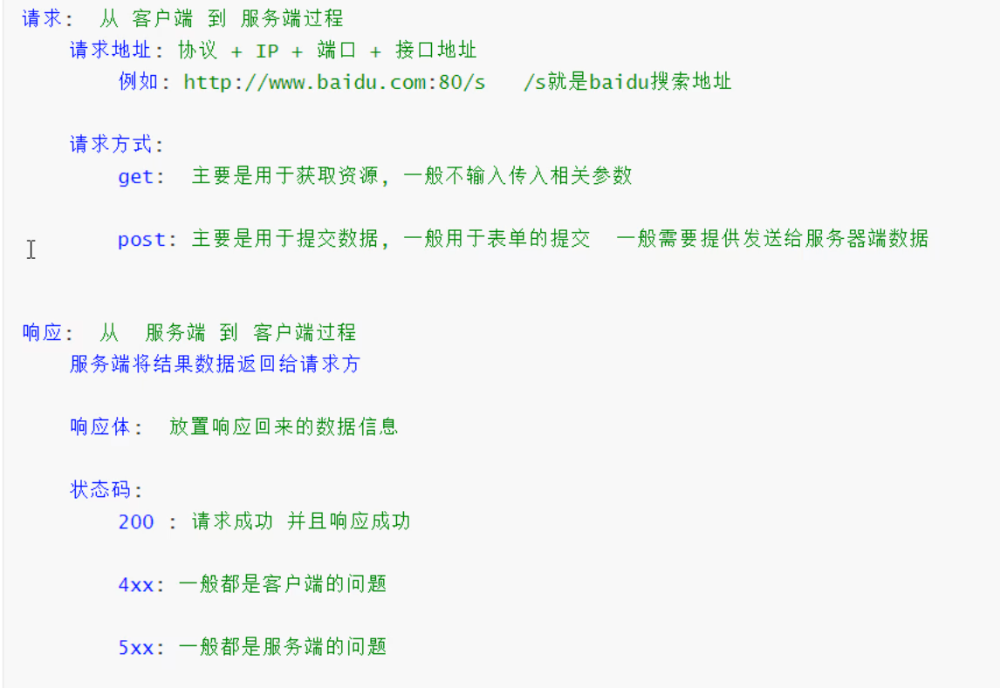

# HTTP基础知识

## 1.1、什么是HTTP？

HTTP，全称为超文本传输协议（HyperText Transfer Protocol），是互联网上应用最为广泛的一种网络协议。它是客户端和服务器之间进行通信的规则集合，允许将超文本标记语言（HTML）文档从Web服务器传输到Web浏览器。简单来说，HTTP是Web浏览器和Web服务器之间的“语言”，使用用户能够浏览网页，下载文件、提交表单等。

## 1.2、HTTP请求特征

HTTP请求是客户端（如浏览器）向服务器发送的请求消息，用于获取或操作资源。一下是HTTP请求的主要特征：

**请求方法**
请求方法定义了客户端希望之星的操作类型，常见的有：

- **GET**：请求获取指定资源
- **POST**：向服务器提交数据，通常用于表单提交。

**请求URL**
请求URL指定了资源的路径，通常包括协议（如HTTP或HTTPS）、服务器地址、端口号和资源路径。

**请求头（Headers）**
请求头包含关于请求的附加信息，常见字段包括：

- **Host**：指定服务器的主机名和端口号
- **User-Agent**：描述客户端的信息（如浏览器类型）
- **Accept**：指定客户端能够接收的媒体类型
- **Content-Type**：指示请求体的媒体类型（如 `application/json`）
- **Authorization**：包含认证信息（如 Bearer Token）

**请求体（Request Body）**
请求体用于携带客户端发送的数据，通常在POST、PUT等方法中使用。
**请求方式对比**

- **GET**:
  - 用于 **请求资源** ，通常用于从服务器获取数据（如加载网页、查询数据）
  - 适合幂等操作（多次请求可能会对资源产生影响）
- **POST**:
  - 用于 **提交数据** ，通常用于向服务器发送数据（如表单提交、文件上传）。
  - 适合非幂等操作（多次需求可能会对资源产生影响）。
**HTTP状态码分类**

`200 OK`:请求成功，响应中包含请求的数据。
`302 Found`:资源临时移动到新URL。
`404 Not Found`:请求的资源不存在。
`500 Internal Server Error`:服务器内部错误，无法完成请求。
`502 Bad Gateway`:服务器作为网关时收到无效响应。

