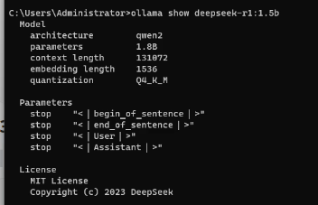
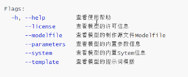
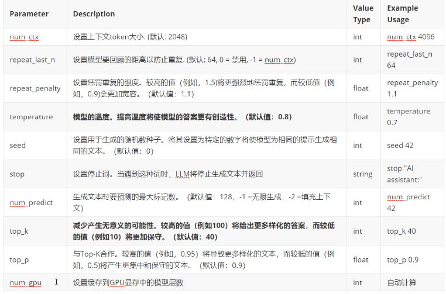
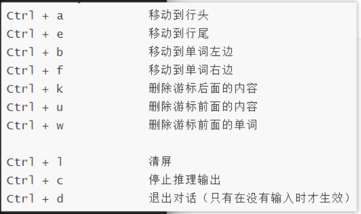

# Ollama 常用命令
## Ollama客户端命令
### ollama run 

ollama run MODEL[:Version] [PROMPT] [flags]
运行大模型
例：`ollama run qwen2:0.5b`

> [:Version]可以理解为版本，而版本信息常以大模型规模（模型参数数量）来命名，可以不写，不写默认是latest，必须标明模型参数量

> [PROMPT]参数是用户输入的提示词，如果带有此参数，则 `run` 命令会执行了输入提示此之后即退出终端，即只对话一次。

> [flags]指定运行时的参数
> Flags：
>
> - `--format string` : 指定运行的模型输出格式，比如 json
> - `--insecure` ：使用非安全模式，比如在下载模型时会忽略http的安全证书
> - `--keepalive string` : 指定模型在内存中的存活时间
> - `--nowordwrap` : 关闭单词自动换行功能
> - `--verbose` : 开启统计日志信息

2. ollama show

ollama show MODEL [flags]
查看模型的信息

### ollama pull

ollama pull MODEL[:Version] [flags]
远程下载一个大模型

> [flags] 参数目前只有一个 `--insecure` 参数，用来指定非安全模式下在模型。
>
> ollama pull qwen2 --insecure

### ollama list 或 ollama ls

查看本地下载的大模型列表

### ollama ps

查看当前运行的大模型列表，`ollama ps` 命令没有其他参数

### ollama rm

ollama rm MODEL[:Version]

删除本地的大模型

## Ollama对话指令

在对话框中执行的指令

### 1、`/bye` 指令

退出对话

### 2、`/show` 指令

用于查看当前模型详细信息

### 3、`/set` 指令

设置当前对话模型的系列参数

## `/clear` 指令

清除模型的上下文内容

## `/load` 指令

在对话中切换大模型

## `/save` 指令

可以把当前对话模型存储成一个新的模型。保存对话。
存储位置在ollama的model文件中。

## Ollama快捷键

## Ollama多行输入

使用 `"""多行输入"""`