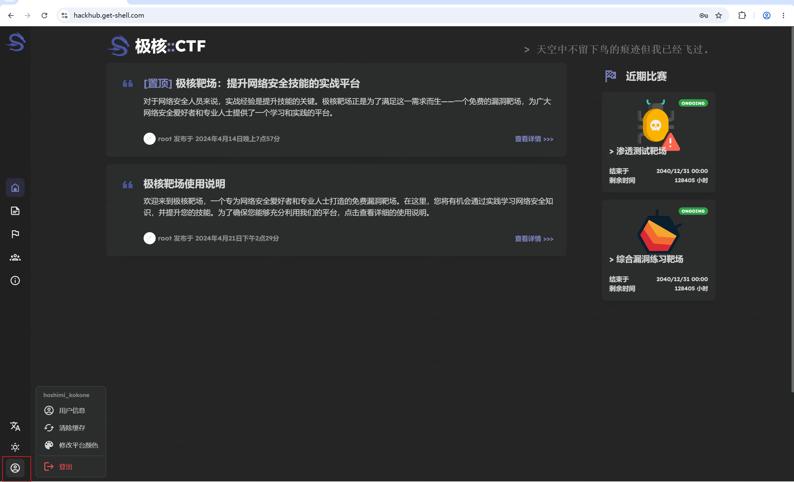
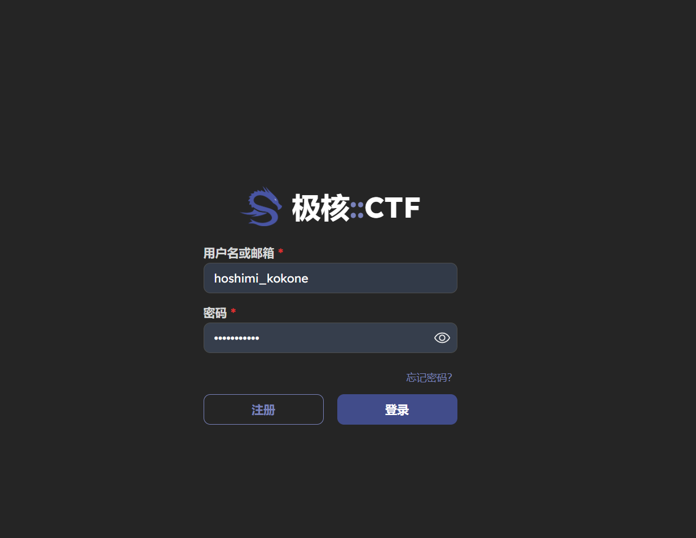
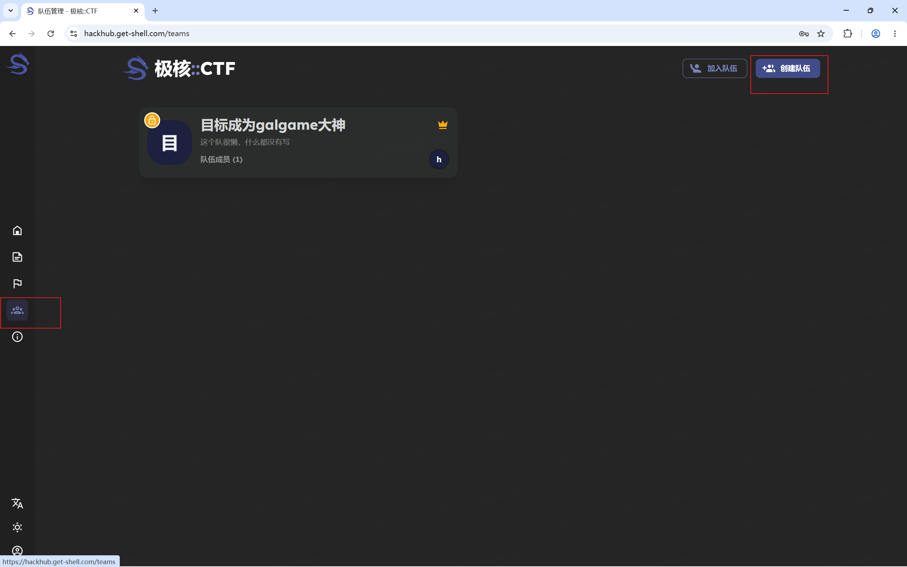
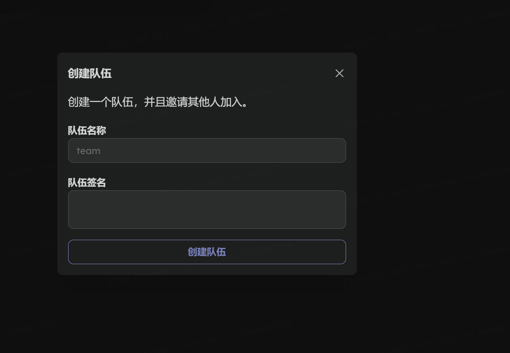
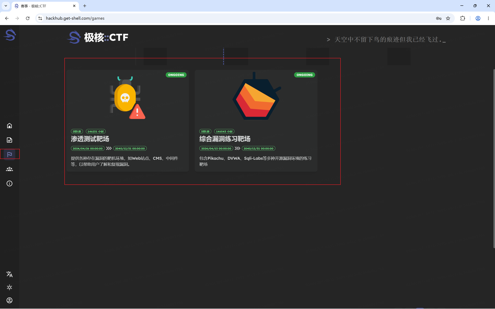
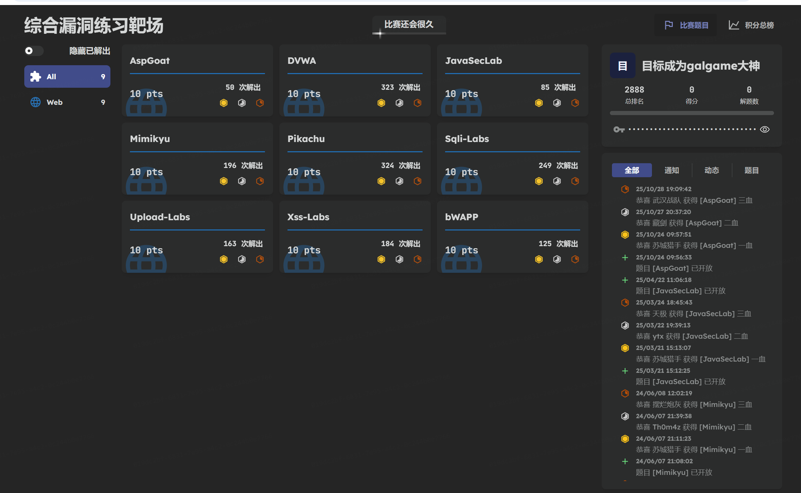
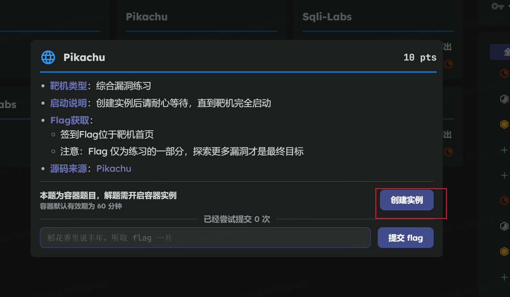
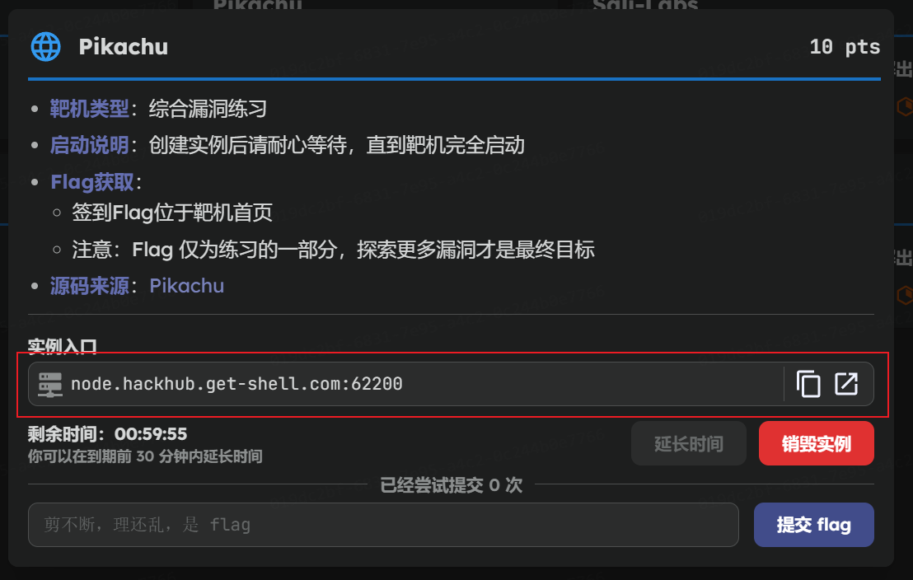
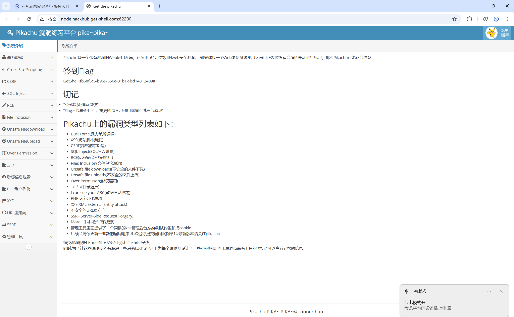

# 极核::CTF

[极核靶场](https://hackhub.get-shell.com/)是一个完全免费的在线漏洞靶场,由极核GetShell官方进行维护。极核靶场致力于为广大用户提供一个安全、可控的环境，用于进行网络安全实验和技能训练。在这里，用户可以接触到各种类型的靶机，从基础的CTF（Capture The Flag）挑战到高级的渗透测试场景，覆盖了网络安全的多个领域和技能点。省去了用户搭建靶场的功夫，能够更好的投入到网络安全实验的学习中。极核靶场主要解决了用户靶机搭建困难，没有合适的靶机环境进行工具实验/漏洞学习等痛点，免去了用户自己寻找、搭建漏洞环境的步骤。

## 极核的使用方法

1. 注册极核账号，并登录

2. 创建一个战队

填写相关信息

3. 选择参加感兴趣的赛事

以综合漏洞练习靶场的pikachu为例:

点击pikachu，然后创建实例

打开所创实例的网址

打开后的网站即为训练靶场

