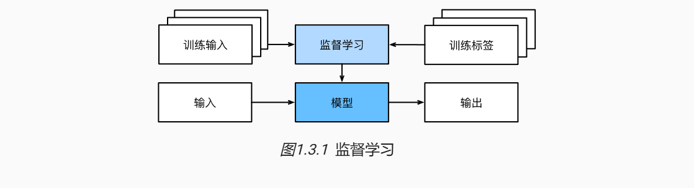
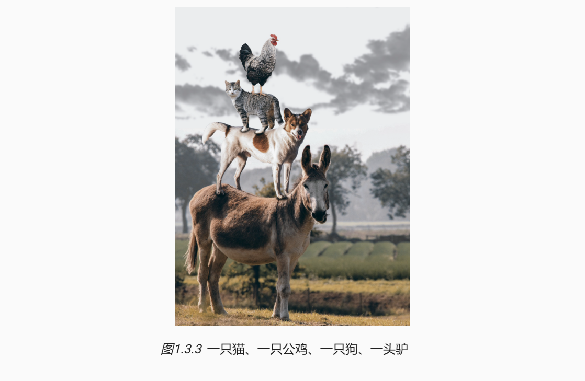
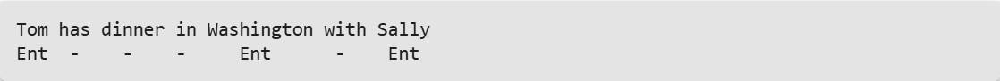
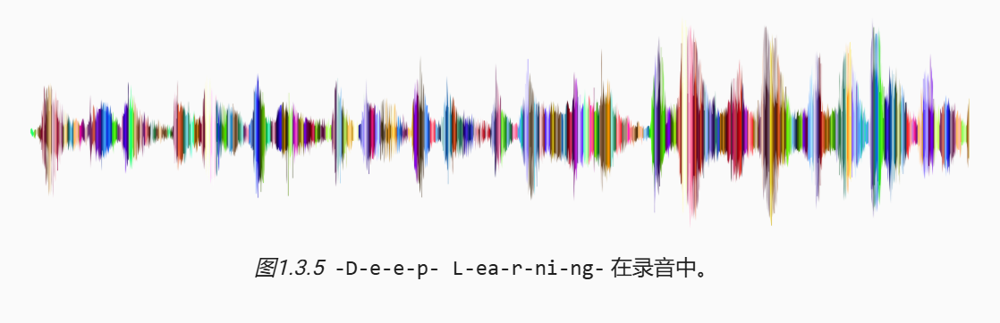
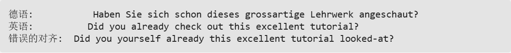
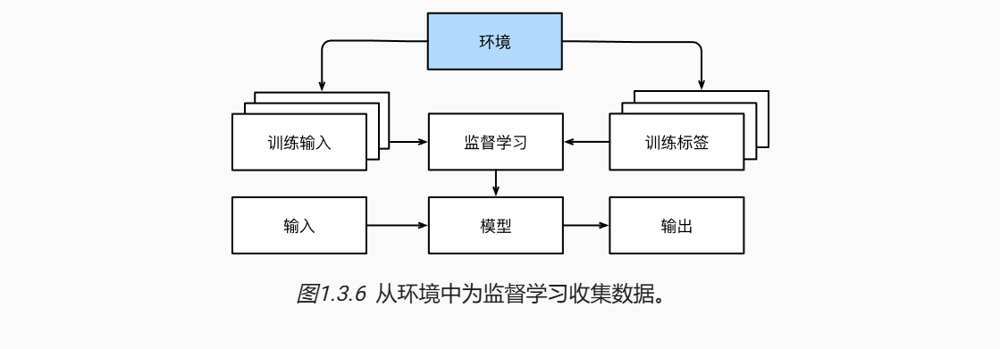
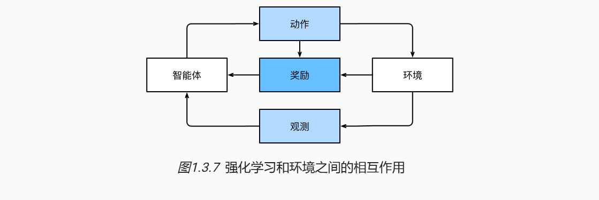

> 该内容为《动手学深度学习的笔记》

# 监督学习
**监督学习(supervised learning)** 擅长在“给定输入特征”的情况下预测标签。每个“特征-标签”对都称为一个 **样本(example)** 。有时，即使标签时未知的，样本也可以指代输入特征。我们的目标是生成一个模型，能够将任何特征映射到 **标签(即预测)**。
监督学习的学习过程一般可以分为三大步骤：
1. 从已知大量数据样本中随机选取一个子集，为每个样本获取真实标签。有时，这些样本已有标签（例如，患者是否在下一年内康复？）；有时，这些样本可能需要被人工标记（例如，图像分类）。这些输入和相应的标签一起构成了训练数据集。
2. 选择有监督的学习算法，它将训练数据集作为输入，并输出一个“已完成学习的模型”。
3. 将之前没有见过的样本特征放到这个“已完成学习的模型”中，使用模型的输出作为相应标签的预测。
整个监督学习过程如下图所示。

综上所述，即使使用简单的描述给定输入特征的预测标签，监督学习也可以采取多种形式的模型，并且需要大量不同的建模决策，这取决于输入和输出的类型、大小和数量。例如，我们使用不同的模型来处理“任意长度的序列”或“固定长度的序列”。

## 回归
**回归(regression)** 是最简单的监督学习任务之一。假设有一组房屋销售数据表格，其中每行对应一个房子，每列对应一个相关的属性，例如房屋的面积、卧室的数量、浴室的数量以及到镇中心的步行距离等等。每行的属性构成了一个房子样本的特征向量。如果一个人住在纽约或旧金山，而且他不是亚马逊、谷歌、微软或Facebook的首席执行官，那么他家的特征向量(房屋面积、卧室数量、浴室数量、步行距离)可能类似于:[600,1,1,60]。如果一个人住在匹兹堡，这个特征向量可能更接近[3000,4,3,10]......当人们在市场上寻找新房子时，可能需要估计一栋房子的公平市场价值。为什么这个任务可以归类为回归问题呢？本质上是输出决定的。销售价格（即标签）是一个数值。当标签取任意数值时，我们称之为回归问题，此时的目的时生成一个模型，使它的预测非常接近实际标签值。

## 分类
虽然回归模型可以很好地解决“有多少”的问题，但是很多问题并非如此。例如，一家银行希望在其移动应用程序中添加支票扫描功能。具体地说，这款应用程序能够自动理解从图像中看到的文本，并将手写字符映射到对应的已知字符之上。这种“哪一个”的问题叫做 **分类(classification)** 问题。分类问题希望模型能够预测样本属于哪个 **类别(category，正式称为类(class))** 。例如，手写数字可能有10类，标签被设置为数字0~9。最简单的分类问题是只有两类，这被称之为 **二项分类(binomial classification)** 。例如，数据集可能由动物图像组成，标签可能是{猫，狗}两类。回归是训练一个回归函数来输出一个数值；分类是训练一个分类器来输出预测的类别。

当有两个以上的类别时，我们把这个问题称为 **多项分类(multiclass classification)** 问题。常见的例子包括手写字符识别{0,1,2,...,9,a,b,c,...}。与解决回归问题不同，分类问题的常见损失函数被称为 **交叉熵** 。

分类可能变得比二项分类、多项分类复杂的多。例如，有一些分类任务的变体可以用于寻找层次结构，层次结构假定在许多类之间存在某种关系。因此，并不是所有的错误都是均等的。人们宁愿错误地分入一个相关地类别，也不愿错误地分入一个遥远的类别，这通常被称为 **层次分类(hierarchical classification)** 。早期的一个例子是卡尔·林奈，他对动物进行了层次分类。

在动物分类的应用中，把一只狮子狗误认为雪纳瑞可能不会太糟糕。但如果模型将狮子狗与恐龙混淆，就滑稽至极了。层次结构相关性可能取决于模型的使用者计划如何使用模型。例如，响尾蛇和乌梢蛇血缘上可能很接近，但如果把响尾蛇误认为是乌梢蛇可能会是致命的。因为响尾蛇是有毒的，而乌梢蛇是无毒的。

## 标记问题
有些分类问题很适合与二项分类或多项分类。例如，我们可以训练一个普通的二项分类器来区分猫和狗。运用最前沿的计算机视觉的算法，这个模型可以很轻松地被训练。尽管如此，无论模型有多精确，当分类器遇到新的动物时可能会束手无策。比如下图所示的这张“不来梅的城市音乐家”的图像(这是一个流行的德国童话故事)，图中有一只猫、一只公鸡、一只狗、一头驴，背景是一些树。取决于我们最终想用模型做什么，将其视为二项分类问题可能没有多大意义。取而代之，我们可能想让模型描绘输入图像的内容，一只猫、一只公鸡、一只狗，还有一头驴。

学习预测不相互排斥的类别的问题称为 **多标签分类(multi-label classification)** 。举个例子，人们在技术博客上贴的标签，比如“机器学习”“技术”“小工具”“编程语言”“Linux”“云计算”“AWS”。一篇典型的文章可能会用5~10个标签，因为这些概念是相互关联的。关于“云计算”的帖子可能会提到“AWS”，而关于“机器学习”的帖子也可能涉及“编程语言”。

## 搜索
有时，我们不仅希望输出一个类别或一个实值。在信息检索领域，我们希望对一组项目进行排序。以网络搜索为例，目标不是简单的“查询(query)-网页(page)”分类，而是在海量搜索结果中找到用户最需要的那部分。搜索结果的排序也十分重要，学习算法需要输出有序的元素子集。换句话说，如果要求我们输出字母表中的前5个字母，返回“A、B、C、D、E”和“C、A、B、E、D”是不同的。即使结果集是相同的，集内的顺序有时却很重要。

该问题的一种可能的解决方案：首先为集合中的每个元素分配相应的相关性分数，然后检索评级最高的元素。PageRank，谷歌搜索引擎背后最初的秘密武器就是这种评分系统的早期例子，但它的奇特之处在于它不依赖于实际的查询。在这里，他们依靠一个简单的相关性过滤来识别一组相关条目，然后根据PageRank对包含查询条件的结果进行排序。如今，搜索引擎使用机器学习和用户行为模型来获取网页相关性得分，很多学术会议也致力于这一主题。

## 推荐系统
另一类与搜索和排名相关的问题是 **推荐系统(recommender system)** ，它的目标是向特定用户进行“个性化”推荐。例如，对于电影推荐，科幻迷和喜剧爱好者的推荐结果页面可能会有很大不同。类似的应用也会出现在零售产品、音乐和新闻推荐等等。

在某些应用中，客户会提供明确反馈，表达它们对特定产品的喜爱程度。例如，亚马逊上的产品评级和评论。在其他一些情况下，客户会提供隐形反馈。例如，某用户跳过播放列表中的某些歌曲，这可能说明这些歌曲对此用户不大合适。总的来说，推荐系统会为“给定用户和物品”的匹配性打分，这个“分数”可能是估计的评级或购买的概率。由此，对于任何给定的用户，推荐系统都可以检索得分最高的对象集，然后将其推荐给用户。以上只是简单的算法，而工业生产的推荐系统要先进得多，它会将详细的用户活动和项目特征考虑在内。推荐系统算法经过调整，可以捕捉一个人的偏好。比如，下图是亚马逊基于个性化算法推荐的深度学习书籍，成功地捕捉了作者的喜好。

尽管推荐系统具有巨大的应用价值，但单纯用它作为预测模型仍存在一些缺陷。首先，我们的数据只包含“审查后的反馈”：用户更倾向于给他们感觉强烈的事物打分。例如，在五分制电影评分中，会有许多五星级和一星级评分，但三星级却明显很少。此外，推荐系统有可能形成反馈循环：推荐系统首先会优先推送一个购买量较大(可能被认为更好)的商品，然而目前用户的购买习惯往往是遵循推荐算法，但学习算法并不总是考虑到这一细节，进而更频繁地被推荐。综上所述，关于如何处理审查、激励和反馈循环的许多问题，都是重要的开放性研究问题。

## 序列学习
以上大多数问题都具有固定大小的输入和产生固定大小的输出。例如，在预测房价的问题中，我们考虑从一组固定的特征：房屋面积、卧室数量、浴室数量、步行到市中心的时间；图像分类问题中，输入为固定尺寸的图像，输出则为固定数量(有关每一个类别)的预测概率；在这些情况下，模型只会将输入作为生成输出的“原料”，而不会“记住”输入的具体内容。

如果输入的样本之间没有任何关系，以上模型可能完美无缺。但是如果输入是连续的，模型可能就需要拥有“记忆”功能。比如，我们该如何处理视频片段呢？在这种情况下，每个视频片段可能由不同数量的帧组成。通过前一帧的图像，我们可能对后一帧中发生的事情更有把握。语言也是如此，机器翻译的输入和输出都为文字序列。

这些问题是序列学习的实例，是机器学习最令人兴奋的应用之一。序列学习需要摄取输入序列或预测输出序列，或两者兼而有之。具体来说，输入和输出都是可变长度的序列，例如机器翻译和从语音中转录文本。虽然不可能考虑所有类型的序列转换，但以下特殊情况值得一提。

**标记和解析**：这涉及到用属性注释文本序列。换句话说，输入和输出的数量基本上是相同的。例如，我们可能想知道动词和主语在哪里，或者可能想知道那些单词是命名实体。通常，目标是基于结构和语法假设对文本进行分解和注释，以获得一些注释。这听起来比实际情况要复杂得多。下面是一个非常简单的实例，它使用“标记”来注释一个句子，该标记指示哪些单词引用命名实体。标记问 “ **Ent** ”，是 **实体(entity)** 的简写。

**自动语音识别**：在语音识别中，输入序列是说话人的录音(如下图所示)，输出序列是说话人所说内容的文本记录。它的挑战在于，与文本相比，音频帧多得多(声音通常以8kHz或16kHz采样)。也就是说，音频和文本之间没有 1:1 的对应关系，因为数千个样本可能对应于一个单独的单词。这也是“序列到序列”的学习问题，其中输出比输入短得多。

**文本到语音**：这与自动语音识别相反。换句话说，输入是文本，输出是音频文件。在这种情况下，输出比输入长得多。虽然人类很容易判断发音别扭的音频文件，但这对计算机来说并不是那么简单。

**机器翻译**：在语音识别中，输入和输出的出现顺序基本相同。而在机器翻译中，颠倒输入和输出的顺序非常重要。换句话说，虽然我们仍将一个序列转化成另一个序列，但是输入和输出的数量以及相应序列的顺序大都不会相同。比如下面这个例子，“错误的对其”反应了德国人喜欢把动词放在句尾的特殊倾向。

其他学习任务也有序列学习的应用。例如，确定“用户阅读网页的顺序”是二维布局分析问题。再比如，对话问题对序列的学习更为复杂：确定下一轮对话，需要考虑对话历史状态以及现实世界的知识......如上这些都是热门的序列学习研究领域。

# 无监督学习
到目前为止，所有的例子都与监督学习有关，即需要向模型提供巨大数据集：每个样本包含特征和相应标签值。打趣一下，“监督学习”模型像一个打工仔，有一份极其专业的工作和一位极其平庸的老板。老板站在身后，准确地告诉模型在每种情况下应该做什么，直到模型学会从情况到行动的映射。取悦这位老板很容易，只需尽快识别出模式并模仿他们的行为即可。

相反，如果工作没有十分具体的目标，就需要“自发”地去学习了。比如，老板可能会给我们一大堆数据，然后要求用它做一些数据科学研究，却没有对结果有要求。这类数据中不含有“目标”的机器学习问题通常被称为 **无监督学习(unsupervised learning)** ，本书后面的章节讨论无监督学习技术。那么无监督学习可以回答什么样的问题呢？来看看下面的例子。

- **聚类(clustering)**：没有标签的情况下，我们是否能给数据分类呢？比如，给定一组照片，我们能把它们分成风景照片、狗、婴儿、猫和山峰的照片吗？同样，给定一组用户的网页浏览记录，我们能否将具有相似行为的用户聚类呢？
- **主成分分析(principal component analysis)**：我们能否找到少量的参数来准确地捕捉数据的线性相关属性？比如，一个球的运动轨迹可以用球的速度、直径和质量来描述。再比如，裁缝们已经开发出了一小部分参数，这些参数相当准确地描述了人体地形状，以适应衣服的需要。另一个例子：在欧几里得空间中是否存在一种(任意结构的)对象的表示，使其符号属性能够很好地匹配？这可以用来描述实体及其关系，例如“罗马” - “意大利” + “法国” = “巴黎”。
- **因果关系(causality) 和 概率图模型(probabilistic graphical models)**：我们能否描述观察到的许多数据的根本原因？例如，如果我们有关于房价、污染、犯罪、地理位置、教育和工资的人口统计数据，我们能否简单地根据经验数据发现它们之间的关系？
- **生成对抗性网络(generative adversarial networks)**：为我们提供一种合成数据方法，甚至像图像和音频这样复杂的非结构化数据。潜在的统计机制是检查真实和虚假数据是否相同的测试，它是无监督学习的另一个重要而令人兴奋的领域。

# 与环境互动
有人一直心存疑虑：机器学习的输入(数据)来自哪里？机器学习的输出又将去往何方？到目前为止，不管是监督学习还是无监督学习，我们都会预先获取大量数据，然后启动模型，不再与环境交互。这里所有学习都是在算法与环境断开后进行的，被称为 **离线学习(offline learning)** 。对于监督学习，从环境中收集数据的过程类似于下图。

这种简单的离线学习有它的魅力。好的一面是，我们可以孤立地进行模式识别，而不必分心于其他问题。但缺点是，解决的问题相当有限。这时我们可能会期望人工智能不仅能够做出预测，而且能够与真实环境互动。与预测不同，“与真实环境互动”实际上会影响环境。这里的人工智能是“智能代理”，而不仅是“预测模型”。因此，我们必须考虑到它的行为可能会影响未来的观察结果。

考虑“与真实环境互动”将打开一整套新的建模问题。以下只是几个例子。

- 环境还记得我们以前做过什么吗？
- 环境是否有助于我们建模？例如，用户将文本读入语音识别器。
- 环境是否想要打败模型？例如，一个对抗性的设置，如垃圾邮件过滤或玩游戏？
- 环境是否重要？
- 环境是否变化？例如，未来的数据是否总是与过去相似，还是随着时间的推移会发生变化？是自然变化还是响应我们的自动化工具而发生变化？

当训练和测试数据不同时，最后一个问题提出了 **分布偏移(distribution shift)** 的问题。接下来的内容将简要描述强化学习问题，这是一类明确考虑与环境交互的问题。

# 强化学习
如果你对使用机器学习开发与环境交互并采取行动感兴趣，那么最终可能会专注于 **强化学习(reinforcement learning)** 。这可能包括应用到机器人、对话系统，甚至开发视频游戏的 **人工智能(AI)** 。 **深度强化学习(deep reinforcement learning)** 将深度学习应用于强化学习的问题，是非常热门的研究领域。突破性的 **深度Q网络(Q-network)** 在雅达利游戏中仅使用视觉输入就击败了人类，以及AlphaGo程序在棋盘游戏围棋中击败了世界冠军，是两个突出强化学习的例子。

在强化学习问题中， **智能体(agent)** 在一系列的时间步骤上与环境交互。在每个特定时间点，智能体从环境接受一些 **观察(observation)** ，并且必须选择一个 **动作(action)** ，然后通过某种机制(有时称为执行器)将其传输回环境，最后智能体从环境中获得 **奖励(reward)** 。此后新一轮循环开始，智能体接收后续观察，并选择后续操作，以此类推。强化学习的过程在下图中进行了说明。请注意，强化学习的目标时产生一个好的 **策略(policy)** 。强化学习智能体选择的“动作”受策略控制，即一个从环境观察映射到行动的功能。

强化学习框架的通用性十分强大。例如，我们可以将任何监督学习问题转化为强化学习问题。假设我们有一个分类问题，可以创建一个强化学习智能体，每个分类对应一个“动作”。然后，我们可以创建一个环境，该环境给予智能体的奖励。这个奖励与原始监督学习问题的损失函数是一致的。

当然，强化学习还可以解决许多监督学习无法解决的问题。例如，在监督学习中，我们总是希望输入与正确的标签相关联。但在强化学习中，我们并不假设环境告诉智能体每个观测的最优动作。一般来说，智能体只是得到一些奖励。此外，环境甚至可能不会告诉是哪些行为导致了奖励。

以强化学习在国际象棋的应用为例。唯一真正的奖励信号出现在游戏结束时：当智能体获胜时，智能体可以得到奖励 1；当智能体失败时，智能体将得到奖励 -1。因此，强化学习者必须处理 **学分分配(credit assignment)** 问题：决定哪些行为是值得奖励的，哪些行为是需要惩罚的。就像一个员工升职一样，这次升职很可能反映了前一年的大量的行动。要想在未来获得更多的晋升，就需要弄清楚这一过程哪些行为导致了晋升。

强化学习可能还必须处理部分可观测性问题。也就是说，当前的观察结果可能无法阐述有关当前状态的所有信息。比方说，一个清洁机器人发现自己被困在一个许多相同的壁橱的房子里。推断机器人的精确位置(从而推断其状态)，需要在进入壁橱之前考虑它之前的观察结果。

最后，在任何时间点上，强化学习智能体可能知道一个好的策略，但可能有许多更好的策略从未尝试过的。强化学习智能体必须不断地做出选择：是应该利用当前最好的策略，还是探索新的策略空间(放弃一些短期汇报来换取知识)。

一般的强化学习问题是一个非常普遍的问题。智能体的动作会影响后续的观察，而奖励只与所选的动作相对应。环境可以是完整观察到的，也可以是部分观察到的，解释所有这些复杂性可能会对研究人员要求太高。此外，并不是每个实际问题都表现出所有这些复杂性。因此，学者们研究了一些特殊情况下的强化学习问题。

当环境可被完全观察到时，强化学习问题被称为 **马尔科夫决策过程(markov decision process)** 。当状态不依赖于之前的操作时，我们称该问题为 **上下文赌博机(contextual bandit problem)** 。当没有状态，只有一组最初未知回报的可用动作时，这个问题就是经典的 **多臂赌博机(multi-armed bandit problem)**。