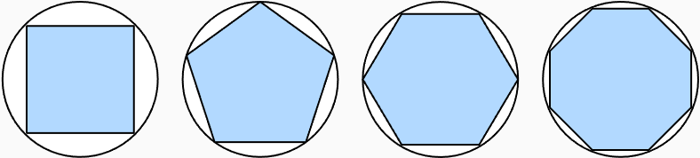

> 该内容为《动手学深度学习》的笔记

# 微积分

在2500年前，古希腊人把一个多边形分成三角形，并把它们的面积相加，才找到计算多边形面积的方法。为了求出曲线形状（比如圆）的面积，古希腊人在这样的形状上刻内接多边形面积。内接多边形的等场边越多，就越接近圆。这个过程也被称为 **逼近法(method of exhaustion)** 。



事实上，逼近法就是 **积分(integral calculus)** 的起源。2000多年后，微积分的另一支，**微分(differential calculus)** 被发明出来。在微分学最重要的应用是优化问题，即考虑如何把事情做到最好。这种问题在深度学习中是无处不在的。

在深度学习中，我们“训练”模型，不断更新它们，使它们在看到越来越多的数据时变得越来越好。通常情况下，变得更好意味着最小化一个 **损失函数(Loss function)** ，即一个衡量“模型有多糟糕”这个问题的分数。最终，我们真正关心的是生成一个模型，它能够在从未见过的数据上表现良好。但“训练”模型只能将模型与我们实际能看到的数据相拟合。因此，我们可以将你和模型的任务分解为两个关键问题：

- **优化(optimization)**: 用模型拟合观测数据的过程
- **泛化(generalization)**: 数学原理和实践者的智慧，能够指导我们生成出有效性超出用于训练的数据集本身的模型

## 导数和微分

我们首先讨论导数的计算，这是几乎所有深度学习优化算法的关键步骤。在深度学习中，我们通常选择对于模型参数可微的损失函数。简而言之，对于每个参数，如果我们把这个参数 **增加** 或 **减少** 一个无穷小的量，可以知道损失会以多块的速度增加或减少。

假设我们有一个函数 $f:\mathbb{R} \rightarrow \mathbb{R}$ ，其中输入和输出都是标量。如果 $f$ 的 **导数** 存在，这个极限被定义为

$$
\displaystyle f'(x) = \lim_{h \rightarrow 0} \frac{f(x + h) - f(x)}{h}
$$

如果 $f'(a)$ 存在，则称 $f$ 在 $a$ 处是 **可微(differentiable)** 的。如果 $f$ 在一个区间内的每个数上都是可微的，则此函数在此区间中是可微的。我们可以将上图的导数 $f'(x)$ 解释为 $f(x)$ 相对于 $x$ 的 **瞬时(instantaneous)** 变化率。所谓的瞬时变化率是基于 $x$ 中的变化 $h$ ，且 $h$ 接近 $0$ 。

为了更好地解释导数，让我们做一个实验。定义 $u = f(x) = 3x^2 - 4x $ 如下：

```python
import numpy as np
from d2l import torch as d2l

def f(x):
    return 3 * x ** 2 - 4 * x
```

通过令 $x = 1$ 并让 $h$ 接近 $0$ ，则 $\frac{f(x + h) - f(x)}{h}$ 的数值结果接近 $2$ 。虽然这个实验不是一个数学证明，但稍后会看到，当 $x = 1$ 时，导数 $u'$ 是 $2$ 。

