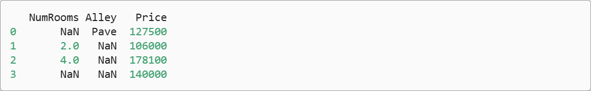

> 该内容为《动手学深度学习》的笔记

# 数据预处理

为了能用深度学习来解决现实世界的问题，我们经常从预处理原始数据开始，而不是从那些准备好的张量格式数据开始。在Python中常用的数据分析工具中，我们通常使用pandas软件包。像庞大的Python生态系统中的许多其他扩展包一样，pandas可以与张量兼容。本节我们将简要介绍使用pandas预处理原始数据，并将原始数据转换为张量格式的步骤。

## 读取数据集

首先创建一个人工数据集，并存储在 CSV（逗号分隔值） 文件中，路径为 `../data/house_tiny.csv`,以其他格式存储的数据也可以通过类似的方式进行处理。
下面我们将数据集按行写入csv文件中。

```python
import os
os.makedirs(os.path.join('..', 'data'), exist_ok=True)
data_file = os.path.join('..', 'data', 'house_tiny.csv')
with open(data_file, 'w') as f:
    f.write('NumRooms,Alley,Price\n') # 列明
    f.write('NA,Pave,127500\n') # 每一行标识一个数据样本
    f.write('2,NA,106000\n')
    f.write('4,NA,178100\n')
    f.write('NA,NA,140000\n')
```

要从创建的CSV文件中加载原始数据集，我们导入pandas包并调用read_csv函数。该数据集有四行三列。其中每行描述了房间的数量("NumRooms")、箱子类型("Alley")和房屋价格("Price")。

```python
# 如果没有安装pandas，只需取消对以下行的注释来安装pandas
# !pip install pandas
import pandas as pd

data = pd.read_csv(data_file)
print(data)
```

