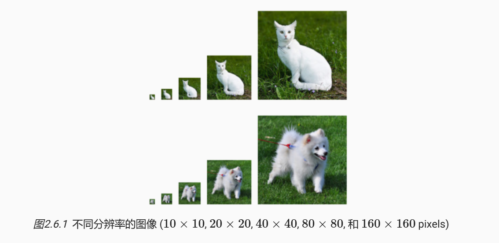
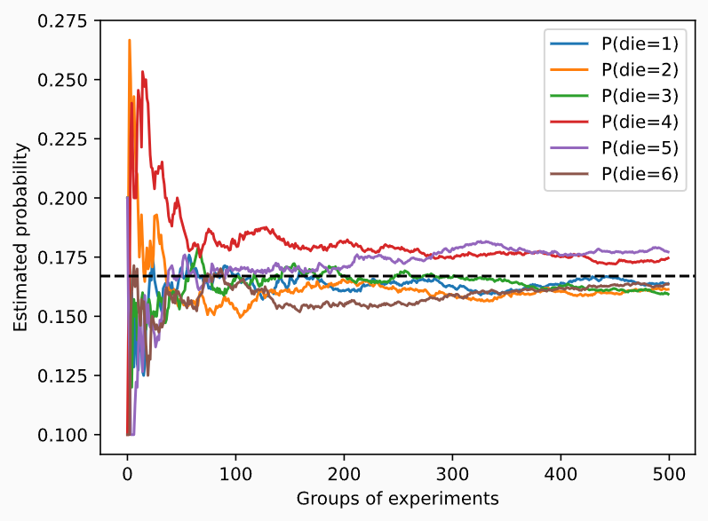

> 该内容为《动手学深度学习》的笔记

简单地说，机器学习就是做出预测。

根据病人的临床病史，我们可能想预测他们在下一年心脏病发作的 **概率** 。在飞机喷气发动机的异常检测中，我们想要评估一组发动机读数为正常运行情况的概率有多大。在强化学习中，我们希望智能体（agent）能在一个环境中智能地行动。这意味着我们需要考虑在每种可行的行为下获得高奖励的概率。当我们建立推荐系统时，我们也需要考虑概率。例如，假设我们为一家大型在线书店工作，我们可能希望估计某些用户购买特定图书的概率。为此，我们需要使用概率学。有完整的课程、专业、论文、职业、甚至院系，都致力于概率学的工作。所以很自然地，我们在这部分的目标不是教授整个科目。相反，我们希望交给读者基础的概率知识，使读者能够开始构建第一个深度学习模型，以便读者开始自己探索它。

现在让我们更认真地考虑第一个例子：根据照片区分猫和狗。这听起来可能很简单，但对于机器却可能是一个艰巨的挑战。首先，问题的难度可能却决于图像的分辨率。



虽然人类很容易以 $160 \times 160$ 像素的分辨率识别猫和狗，但它在 $40 \times 40$ 像素上变得具有挑战性，而且在 $10 \times 10$ 像素下几乎是不可能的。换句话说，我们在很远的距离(从而降低分辨率)区分猫和狗的能力可能会变为猜测。概率给了我们一种正式的途径来说明我们的确定性水平。如果我们完全肯定图象是一只猫，我们说标签 $y$ 是 “猫” 的概率，表示为 $P(y = “猫”)$ 等于 $1$ 。如果我们没有证据表明 $y = “猫” 或 y = “狗”$ ，那么我们可以说这两种可能性事相等的，即 $P(y = “猫”) = P(y = “狗”) = 0.5$ 。如果我们不十分确定图像描绘的是一只猫，我们可以将概率赋值为 $0.5 < P(y = “猫”) < 1$ 。

现在考虑第二个例子：给出一些天气监测数据，我们想预测明天北京下雨的概率。如果是夏天，下雨的概率是 $0.5$ 。

在这种两种情况下，我们都不确定结果，但这两种情况之间有一个关键区别。在第一种情况中，图像实际上是狗或猫二选一。在第二种情况下，结果实际上是一个随机的事件。因此，概率是一种灵活的语言，用于说明我们的确定程度，并且它可以有效地应用于广泛的领域中。

## 基本概率论

假设我们掷骰子，想知道看到 $1$ 的几率有多大，而不是看到另一个数字。如果骰子是公平的，那么所有六个结果 ${1, ..., 6}$ 都有相同的可能发生，因此我们可以说 $1$ 发生的概率为 $\frac{1}{6}$ 。

然而现实生活中，对于我们从工厂收到的真实骰子，我们需要检查它是否有瑕疵。检查投资的唯一方法是多次投掷并记录结果。对于每个骰子，我们将观察到 ${1, ..., 6}$ 中的一个值。对于每个值，一种自然的方法是将它出现的次数除以投掷的总次数，即此 **事件(event)** 概率的 **估计值** 。**大数定律(law of large numbers)** 告诉我们：随着投掷的次数的增加，这个估计值会越来越接近真实的潜在概率。让我们用代码试一试！

首先，我们导入必要的软件包。

```python
import torch
from torch.distributions import multinomial
from d2l import torch as d2l
```

在统计学中，我们把从概率分布中抽取样本的过程称为 **抽样(sampling)** 。笼统来说，可以把 **分布(distribution)** 看作对事件的概率分配，稍后我们将给出的更正式定义。将概率分配给一些离散选择的分布称为 **多项分布(multinomial distribution)** 。

为了抽取一个样本，即掷骰子，我们只需传入一个概率向量。输出是另一个相同长度的向量：它在索引 $i$ 处的值是采样结果中 $i$ 次出现的次数。

```python
fair_probs = torch.ones([6]) / 6
print(multinomial.Multinomial(1, fair_probs).sample())
```


在估计一个骰子的公平性时，我们希望从同一分布中生成多个样本。如果用 Python 的 for 循环来完成这个任务，速度会慢的惊人。因此我们使用深度学习框架的函数同时抽取多个样本，得到我们想要的任意形状的独立样本数组。

```python
print(multinomial.Multinomial(10, fair_probs).sample())
```


现在我们知道如何对骰子进行采样，我们可以模拟1000次投掷。然后，我们可以统计 1000次投掷后，每个数字被投中了多少次。具体来说，我们计算相对概率，以作为真是概率的估计。

```python
# 将结果存储为 32 为浮点数以进行除法
counts = multinomial.Multinomial(1000, fair_probs).sample()
print(counts / 1000) # 相对频率作为估计值
```


因为我们是从一个公平的骰子中生成的数据，我们知道每个结果都有真实的概率 $\frac{1}{6}$ ，大约是 $0.167$ ，所以上面输出的估计值看起来不错。

我们也可以看到这些概率如何随着时间的推移收敛到真是概率。让我们进行 500 组实验，每组抽取 10 个样本。

```python
counts = multinomial.Multinomial(10, fair_probs).sample((500,))
cum_counts = counts.cumsum(dim=0)
estimates = cum_counts / cum_counts.sum(dim=1, keepdim=True)

d2l.set_figsize((6,4.5))
for i in range(6):
    d2l.plt.plot(
        estimates[:, i].numpy(),
        label=("P(die=" + str(i + 1) + ")")
    )
d2l.plt.axhline(y=0.167, color='black', linestyle='dashed')
d2l.plt.gca().set_xlabel("Group of experiments")
d2l.plt.gca().set_ylabel("Estimated probability")
d2l.plt.legend()
d2l.plt.show()
```



每条实线对应于骰子的 6 个值中的一个，并给出骰子在每组实验后出现值的估计概率。当我们通过更多的实验获得更多的数据时，这 6 条实体曲线向真实概率收敛。

### 概率论公理

在处理骰子掷出时，我们将集合 $\mathcal{S} = {1, 2, 3, 4, 5, 6}$ 称为 **样本空间(sample space)** 或 **结果空间(outcome space)**
，其中每个元素都是 **结果(outcome)** 。**事件(event)** 是一组给定样本空间的随即结果。例如，“看到 $5$ ” ( ${5}$ ) 和 “看到奇数” ( ${1, 3, 5}$ ) 都是掷出骰子的有效事件。注意，如果一个随机实验的结果在 $\mathcal{A}$ 中，则事件 $\mathcal{A}$ 已经发生。也就是说，如果投掷出 $3$ 点，因为 $3 \in {1, 3, 5}$ ，我们可以说，“看到奇数” 的事件发生了。

**概率（probability）** 可以被认为是将集合映射到真实值的函数。在给定的样本空间 $\mathcal{S}$ 中，事件 $\mathcal{A}$ 的概率表示为 $P(\mathcal{A})$ ，满足以下属性：

- 对于任意事件 $\mathcal{A}$ ，其概率从不会是负数，即 $P(\mathcal{A}) \geq 0$
- 整个样本空间的概率为 $1$ ，即 $P(\mathcal{S}) = 1$
- 对于 **互斥(mutually exclusive)** 事件（对于所有 $i \neq j$ 都有 $\mathcal{A}_i \cap \mathcal{A}_j = \varnothing$）的任意一个可数序列 $\mathcal{A}_1, \mathcal{A}_2, ...$ ，序列中任意一个事件发生的概率等于它们各自发生的概率之和，即 $P \biggl( \bigcup_{i = 1}^\infty \mathcal{A}_i \biggr) = \sum_{i = 1}^\infty P(\mathcal{A}_i)$

以上也是概率论的公理，由柯尔莫哥洛夫于1933年提出。有了这个公理系统，我们可以避免任何关于随机性的哲学争论；相反，我们可以用数学语言严格地推理。例如，假设事件 $\mathcal{A}_1$ 为整个样本空间，且当所有 $i > 1$ 时的 $\mathcal{A}_i = \varnothing$ ，那么我们可以证明 $P(\varnothing) = 0$ ，即不可能发生事件的概率是 $0$ 。

### 随机变量

在我们掷骰子的随机实验中，我们引入了 **随机变量(random variable)** 的概念。随机变量几乎可以是任何数量，并且它可以在随机实验的一组可能性中取一个值。考虑一个随机变量 $\mathbf{X}$ ，其值在掷骰子的样本空间 $\mathcal{S} = \{ 1, 2, 3, 4, 5, 6 \} $ 中。我们可以将事件“看到一个 $5$ ”表示为 $\{ \mathbf{X} = 5 \}$ 或 $\mathbf{X} = 5$ ，其概率表示为 $P \biggl(\{ \mathbf{X} = 5 \} \biggr)$ 或 $P \biggl( \mathbf{X} = 5 \biggr)$ 。通过 $P(\mathbf{X} = a)$ ，我们区分了随机变量 $\mathbf{X}$ 和 $\mathbf{X}$ 可以采取的值 (例如 $a$)。然而，这可能会导致繁琐的表示。为了简化符号，一方面，我们可以将 $P(\mathbf{X})$ 表示为随机变量 $\mathbf{X}$ 上的 **分布(distribution)** ：分布告诉我们 $\mathbf{X}$ 获得某一值的概率。另一方面，我们可以简单用 $P(\mathbf{a})$ 表示为随机变量取值 $a$ 的概率。由于概率论中的事件是来自样本空间的一组结果，因此我们可以为随机变量指定值的可取范围。例如，$P(1 \leq \mathbf{X} \leq 3)$ 表示事件 $\{ 1 \leq \mathbf{X} \leq 3 \}$ ，即 $\{ \mathbf{X} = 1, 2, or, 3 \}$ 的概率。等价地，$P(1 \leq \mathbf{X} \leq 3)$ 表示随机变量 $\mathbf{X}$ 从 $\{ 1, 2, 3 \}$ 中取值的概率。

请注意，**离散(discrete)** 随机变量(如骰子的每一面) 和 **连续(continuous)** 随机变量(如人的体重和身高) 之间存在微妙的区别。现实生活中，测量两个人是否具有完全相同的身高没有太大意义。如果我们进行足够精确的测量，最终会发现这个星球上没有两个人具有完全相同的身高。在这种情况下，询问某人的身高是否落入给定的区间，比如是否在 1.79 米和 1.81 米之间更有意义。在这些情况下，我们将这个看到某个数值的可能性量化为 **密度(density)** 。高度恰好为 1.80 米的概率为 0，但密度不是 0。在任何两个不同高度之间的区间，我们都有非零的概率。在本节的其余部分中，我们将考虑离散空间中的概率。

### 处理多个随机变量

很多时候，我们会考虑多个随机变量。比如，我们可能需要对疾病和症状之间的关系进行建模。给定一个疾病和一个症状，比如 “流感” 和 “咳嗽”，以某个概率存在或不存在于某个患者身上。我们需要估计这些概率以及概率之间的关系，以便我们可以运用我们的推断来实现更好的医疗服务。

再举一个更复杂的例子：图像包含数百万像素，因此有数百万个随机变量。在许多情况下，图像会附带一个 **标签(label)** ，表示图像中的对象。我们也可以将标签视为一个随机变量。我们甚至可以将所有元数据视为随机变量，例如位置、时间、光圈、焦距、ISO、对焦距离和相机类型。所有这些都是联合发生的随机变量。当我们处理多个随机变量时，会有若干个变量是我们感兴趣的。

#### 联合概率

第一个被称为 **联合概率(joint probability)** $P(A = a, B = b)$ 。给定任意值 $a$ 和 $b$ ，联合概率可以回答：$A = a$ 和 $B = b$ 同时满足的概率是多少？请注意，对于任何 $a$ 和 $b$ 的取值，$P(A = a, B = b) \leq P(A = a)$ 。这点是确定的，因为要同时发生 $A = a$ 和 $B = b$ ，$A = a$ 就必须发生，$B = b$ 也必须发生(反之亦然)。因此，$A = a$ 和 $B = b$ 同时发生的可能性不大于 $A = a$ 或是 $B = b$ 单独发生的可能性。

#### 条件概率

联合概率的不等式带给我们一个有趣的比率：$0 \leq \frac{P(A = a, B = b)}{P(A = a)} \leq 1$ 。我们称这个比率为 **条件概率(conditional probability)** ，并用 $P(B = b | A = a)$ 表示它：它是 $B = b$ 的概率，前提是 $A = a$ 已发生。

#### 贝叶斯定理

使用条件概率的定义，我们可以得出统计学中最有用的方程之一： **Bayes定理(Bayes' theorem)** 。根据 **乘法法则(multiplication rule)** 可得到 $P(A, B) = P(B | A)P(A)$ 。根据对称性，可得到 $P(A, B) = P(A | B)P(B)$ 。假设 $P(B) > 0$ ，求解其中一个条件变量，我们得到：

$$
\displaystyle P(A | B) = \frac{P(B | A)P(A)}{P(B)}
$$

请注意，这里我们使用紧凑的表示法：其中 $P(A, B)$ 是一个 **联合分布(joint distribution)** ，$P(A | B)$ 是一个 **条件分布(conditional distribution)** 。这种分布可以在给定值 $A = a, B = b$ 上进行求值。

#### 边际化

为了能进行事件概率求和，我们需要 **求和法则(sum rule)** ，即 $B$ 的概率相当于计算 $A$ 的所有可能选择，

$$
\displaystyle P(B) = \sum_A P(A, B)
$$

这也称为 **边际化(marginalization)** 。边际化结果的概率或分布称为 **边际概率(marginal probability)** 或 **边际分布(marginal distribution)** 。

#### 独立性

另一个有用属性是 **依赖(dependence)** 与 **独立(independence)** 。如果两个随机变量 $A$ 和 $B$ 是独立的，意味着事件 $A$ 的发生跟 $B$ 事件的发生无关。在这种情况下，统计学家通常将这一点表述为 $A \perp B$ 。根据贝叶斯定理，马上就能同样的到 $P(A | B) = P(A)$ 。在所有其他情况下，我们称 $A$ 和 $B$ 依赖。比如，两次连续抛出一个骰子的事件是相互独立的。相比之下，灯开关的位置和房间的亮度并不是相互独立的(因为可能存在灯泡坏掉、电源故障，或者开关故障)。

由于 $P(A | B) = \frac{P(A, B)}{P(B)} = P(A)$ 等价于 $P(A, B) = P(A)P(B)$ ，因此两个随机变量是独立的，当且仅当两个随机变量的联合分布是其各自分布的乘积。同样地，给定另一个随机变量 $C$ 时，两个随机变量 $A$ 和 $B$ 是 **条件独立的(conditionally independent)** ，当且仅当 $P(A, B | C) = P(A | C)P(B | C)$ 。这个情况表示为 $A \perp B | C$ 。

#### 应用

我们实战演练一下！假设一个医生对患者进行艾滋病病毒(HIV)测试。这个测试是相当准确的，如果患者健康但测试显示它患病，这个概率只有 1% ;如果患者真正感染 HIV，它永远不会检测不出。我们使用 $D_1$ 来表示诊断结果(如果阳性，则为 1，如果隐形，则为 0)，$H$ 来表示感染艾滋病病毒的状态(如果阳性，则为 1，如果阴性， 则为0)。

<div style="text-align:center;">
<table cellpadding="10" cellspacing="0" style="border-collapse: collapse; display:inline-table;">
  <tr>
    <th colspan="3" style="border:1px solid #aaa;">条件概率</th>
  </tr>
  <tr>
    <td style="border:1px solid #aaa;"></td>
    <th style="border:1px solid #aaa;">$H = 1$</th>
    <th style="border:1px solid #aaa;">$H = 0$</th>
  </tr>
  <tr>
    <td style="border:1px solid #aaa;">$P(D_1=1 \mid H)$</td>
    <td style="border:1px solid #aaa;">1</td>
    <td style="border:1px solid #aaa;">0.01</td>
  </tr>
  <tr>
    <td style="border:1px solid #aaa;">$P(D_1=0 \mid H)$</td>
    <td style="border:1px solid #aaa;">0</td>
    <td style="border:1px solid #aaa;">0.99</td>
  </tr>
</table>
</div>

请注意，每列的加和都是1（但每行的加和不是），因为条件概率需要总和为 1，就像概率一样。让我们计算如果测试出来呈阳性，患者感染HIV的概率，即 **P(H = 1 | D_1 = 1)** 。显然，这将取决于疾病有多常见，因为它会影响错误警报的数量。假设人口总体是相当健康的，例如，$P(H = 1) = 0.0015$ 。为了应用贝叶斯定理，我们需要运用边际化和乘法法则来确定:

$$
\begin{align*}
P(D_1=1)
&= P(D_1=1,H=0)+P(D_1=1,H=1) \\
&= P(D_1=1\mid H=0)P(H=0)+P(D_1=1\mid H=1)P(H=1) \\
&= 0.011485.
\end{align*}
$$