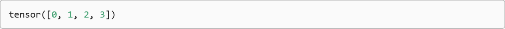
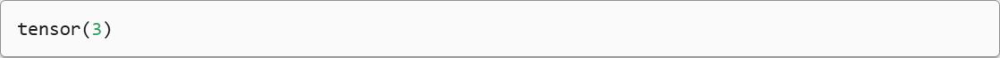
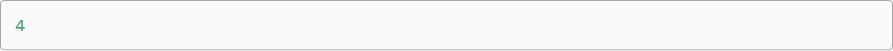
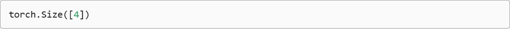

> 该内容为《动手学深度学习》的笔记

# 线性代数

## 标量

如果你曾经在餐厅支付餐费，那么应该已经知道一些基本的线性代数，比如在数字间相加或相乘。例如，北京的温度为 $52^\circ F$（华氏度，除摄氏度外的另一种温度计量单位）。严格来说，仅包含一个数值被称为 *标量(scalar)* 。如果要将此华氏度值转换为更常用的摄氏度，则可以计算表达式 $c = \frac{5}{9}(f - 32)$ ,并将 $f$ 赋为 $52$ 。在此等式中，每一项（ $5、9和32$ ）都是标量值。符号 $c$ 和 $f$ 称为 *变量(variable)* ，它们表示未知的标量值。

本书采用了 **数学表示法**，其中标量变量由普通小写字母表示（例如，$x、y和z$ ）。本书用 $\mathbb{R}$ 表示所有（连续）实数标量的空间，之后将严格定义空间（space）是什么，但现在只要记住表达式 $x \in \mathbb{R}$ 是表示 $x$ 是一个实值标量的正式形式。符号 $\in$ 称为“属于”，它表示“是集合中的成员”。例如 $x,y \in \{ 0,1 \}$ 可以用来表明 $x$ 和 $y$ 是值只能为 $0$ 或 $1$ 的数字。

标量由只有一个元素的张量表示。下面将实例化两个标量，并执行一些熟悉的算数运算，即加法、乘法、除法和指数。

```python
import torch

x = torch.tensor(3.0)
y = torch.tensor(2.0)

print(x + y, x * y, x / y, x**y)
```


## 向量

向量可以被视为标量值组成的列表。这些标量值被称为响亮的 *元素(element)* 或 *分量(component)* 。当向量表示数据集中的样本时，它们的值具有一定的现实意义。例如，如果我们正在训练一个模型来预测贷款违约风险，可能会将每个申请人与一个向量相关联，其分量与其收入、工作年限、过往违约次数和其他因素相对应。如果我们正在研究医院患者可能面临的心脏病发作风险，可能会用一个向量来表示每个患者，其分量为最近的生命体征、胆固醇水平、每天运动时间等。在数学表示法中，向量通常记为粗体、小写的符号（例如，$\mathbf{x}、\mathbf{y}和\mathbf{z}$ ）。

人们通过一维张量表示向量。一般来说，张量可以具有任意长度，取决于机器的内存限制。

```python
x = torch.arange(4)
print(x)
```



我们可以使用下标来引用向量的任一元素，例如可以通过 $x_i$ 来引用第 $i$ 个元素。注意，元素 $x_i$ 是一个标量，所以我们在引用它时不会加粗。大量文献认为列向量是向量的默认方向，在本书中也是如此。在数学中，向量 $\mathbf{x}$ 可以写为：

$$
\displaystyle \mathbf{x} = \begin{bmatrix}
    x_1 \\
    x_2 \\
    \vdots \\
    x_n
\end{bmatrix}
$$

其中 $x_1,...,x_n$ 是向量的元素。在代码中，我们通过张量的索引来访问任一元素。

```python
print(x[3])
```



### 长度、维度和形状

向量只是一个数字数组，就像每个数组都有一个长度一样，每个向量也是如此。在数学表示法中，如果我们想说一个向量 $\mathbf{x}$ 由 $n$ 个实值标量组成，可以将其表示为 $\mathbf{x} \in \mathbb{R}^{n}$ 。向量的长度通常称为向量的 *维度(deimension)* 。

与普通的Python数组一样，我们可以通过调用 Python 的内置 `len()` 函数来访问张量的长度。

```python
len(x)
```



当用张量表示一个向量（只有一个轴时，我们也可以通过 `.shape` 属性访问向量的长度。形状（shape）是一个元素组，列出了张量沿每个轴的长度（维数）。对于只有一个轴的张量，形状只有一个元素。

```python
print(x.shape)
```



> 请注意，*维度（dimension）* 这个词在不同上下文时往往会有不同的含义，这经常会使人感到困惑。为了清楚起见，我们在此明确一下：*向量* 或 *轴* 的维度被用来表示 *向量* 或 *轴* 的长度，即 *向量* 或 *轴* 的元素数量。然而，张量的维度用来表示张量具有的轴数。在这个意义上，张量的某个轴的维数就是这个轴的长度。