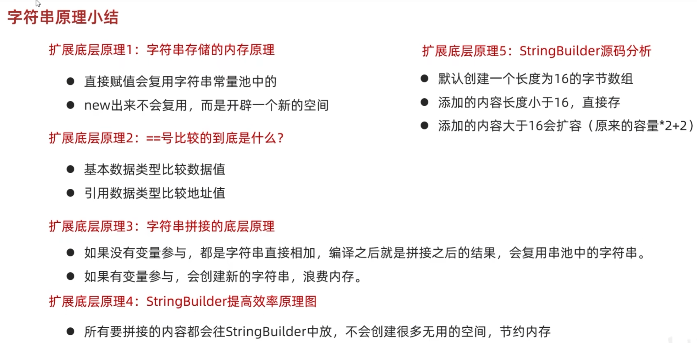

# String
只产生静态字符串，不可改变

方法：
1. length():长度

# StringBuilder
产生可变字符串

方法：
1. append():末尾添加
2. reverse():反转
3. length():长度
4. toString():StringBuilder变为字符串

# StringJoiner
产生可变字符串，可指定元素间隔符

格式：public StringJoiner (间隔符号, 开始符号, 结束符号)

方法：
1. add():添加元素
2. length():长度、
3. toString():转变为字符串

