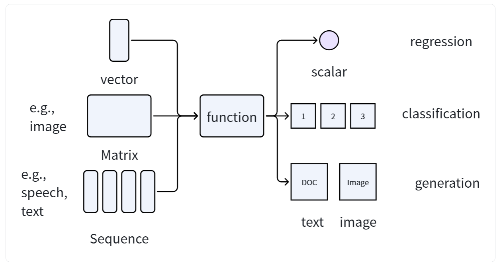
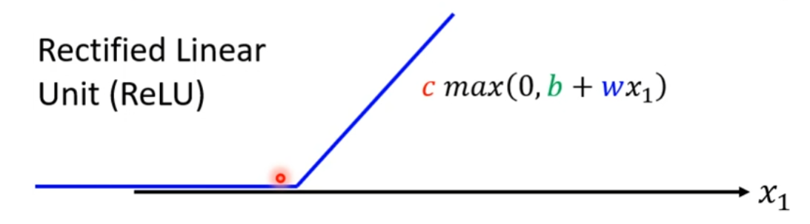
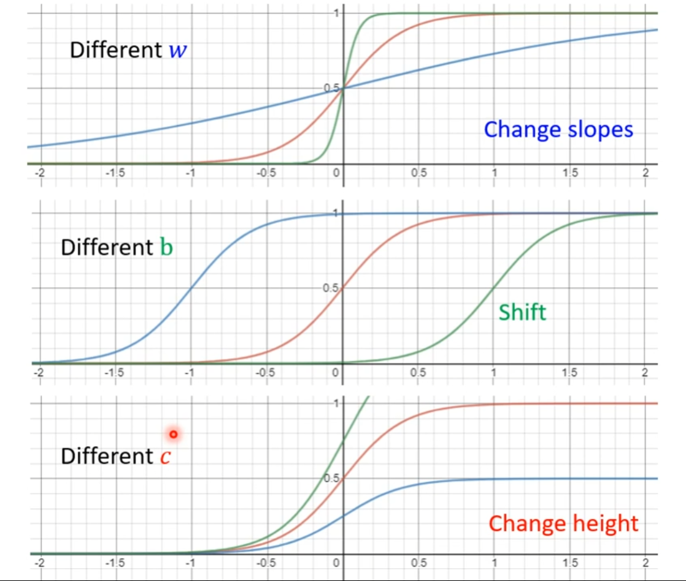

# 机器学习是什么
机器学习（`Machine Learning`）就是找到一个人类写不出来的可以解决目标问题的复杂函数函数。
# 机器学习的类别

- `regression`（回归任务）：预测，输出一个标量。
- `classification`（分类任务）：分类，输出一个类别（通常是独热编码的向量）。
- `generation` (生成式任务)：生成，输出一个文本、图片、语音等。

# 机器学习的方法

- `Supervised Learning`（监督学习）：数据集中每一条数据都包含特征（`feature`）和标签(`label`)，通过学习特征和标签的映射关系，拟合规律，最终实现对未知新数据进行预测。
- `Self-supervised Learning`（自监督学习）：先通过完全没有标注（无`label`）的数据集（上有数据）进行预训练（`Pre-train`）提前学习到一些知识，然后在使用有标注（有`label`）的数据集（下游数据）进行训练。
  - `Pre-trained Model`(预训练模型，又叫`Foundation Model`)：其中著名的模型有BERT。
- `Generative Adversarial Network`（生成性对抗网络）：拥有两个没有任务映射关系的数据集X、Y，通过`Generative Adversarial Network`可以找到X、Y之间的关系。
- `Reinforcement Learning`（强化学习）：不知道怎样标注`data`，但知道怎么定义成功的时候使用`Reinforcement Learning`。

# 进阶课题
- `Anomaly Detection`（异常检测）：当训练的模型遇到从未遇到的类别的数据，需要拥有说出我不知道的能力，这就是异常检测。
- `Explainable AI`（可解释性AI）：训练的模型不仅需要能够给出答案，还要能给出Because（原因），这就输可解释性`AI`。
- `Model Attack`（模型攻击）：给数据集添加`noise`（噪音）的技术。
- `Domain Adaptation`（领域自适应）：解决把一个数据集训练的模型在另一个不同（甚至差异很大）的数据集上训练，正确率暴跌的问题。
- `Network Compression`（模型轻量化）：将一个参数巨大的模型变为轻量化的手段。
- `Life-long Learning`（终身学习）：模型持续学习，持续进步。
- `Meta Learning`（元学习）：让机器通过过往经验来学习设计机器学习。
  - `Few-shot Learning`（少样本学习）：通常使用`meta-learning`来实现。

# 机器学习训练步骤（以Linear Model为例）
## 1、Function with Unknown Parameters
表达式：
$$y = b + \sum_i^n{w_ix_i}$$

- 未知参数：`w`,`b`
- 特征：`x`
- 标签：`y`

## 2、Define Loss from Training Data

`Loss`（损失函数）也是一个函数
$$L(\theta)$$
,
$$\theta$$
是包含所有未知参数的列向量。

表达式:

$$L = \frac{1}{N} \sum{e_n}$$

- $$e_n$$
:预测值和实际值之间的差距
  - $$e_n = \mid{y-f(x)}\mid$$
  ：绝对值误差，MAE（Mean Absolute Error）。
  - $$e_n = (y - f(x))^2$$
  ：平方差误差，MSE（Mean Square Error）。
  - 。。。

# 3、Optimization（最优化）
`Optimization`会通过`Gradient Descent`（梯度下降）的方法获得（局部）最优的参数。

最优参数:

$$
w^{\ast}, b^{\ast} = \arg\min_{w,b} L
$$

1. 随机设置
$$w_0,b_0$$
2. 计算
$$w_0,b_0$$
位置的偏导:

$$\frac{\partial{L}}{\partial{w}}\mid_{w = w_0,b = b_0}，\frac{\partial{L}}{\partial{b}}\mid_{w = w_0,b = b_0}$$

3. updata参数
$$w_1,b_1$$
:

$$w_1 = w_0 - \eta\frac{\partial{L}}{\partial{w}}\mid_{w = w_0,b = b_0}，b_1 = b_0 - \eta\frac{\partial{L}}{\partial{b}}\mid_{w = w_0,b = b_0}$$

4、反复迭代
$$w,b$$

扩展：
1. 随机设置
$$\theta^0$$
2. 计算
$$\theta^0$$
的梯度
$$g$$
:

$$
\large{g\atop{gradient}} = \begin{bmatrix}
\frac{\partial{L}}{\partial{\theta_1}}\mid_{\theta=\theta^0}\\
\frac{\partial{L}}{\partial{\theta_2}}\mid_{\theta=\theta^0}\\
...
\end{bmatrix}
$$

3. 更新参数
$$\theta^1$$
:

$$
\theta^1=\theta^0-\eta*g
$$

4. 反复迭代
$$\theta$$

  

    <strong>PS：</strong> 
    1. 对于大batch（批量）数据集，我们通常随机分成N份小batch数据集，每次使用一份小batch更新参数。
  

  
<strong>2. 名词：</strong>

  <ul style="margin: 0.5em 0 0 1.5em; padding: 0; font-size: 16px;">
    <li><code>batch</code>：批量</li>
    <li><code>epoch</code>：所有的批量（训练轮次）</li>
    <li><code>Rate</code>：学习率，η</li>
    <li><code>hyperparameter</code>：超参数，用户自己设置的参数</li>
    <li><code>parameter</code>：参数，模型自己学习的参数</li>
    <li><code>Neuron</code>：神经元</li>
    <li><code>Neural Network</code>：神经网络</li>
    <li><code>Hidden Layer</code>：隐藏层</li>
    <li><code>Deep Learning</code>：深度学习</li>
    <li><code>Overfitting</code>：过拟合</li>
    <li><code>Underfitting</code>：欠拟合</li>
    <li><code>Backpropagation</code>：反向传播</li>
  </ul>

# 激活函数
## 1、ReLU

$$
表达式：y = c*max(0,b+wx_1)
$$

拟合后的函数：

$$
y = b + \sum_{i}{c_i*max(0,b_i+\sum_j{w_{ij}x_j})}
$$

## 2、Sigmoid

$$
\text{表达式：}
\begin{equation}
\begin{split}
y &= c*\frac{1}{1 + e^{-(b + wx_1)}}\\
&= c*{sigmoid(b + wx_1)} 
\end{split}\nonumber
\end{equation}
$$

拟合后的函数：

$$
\begin{equation}
  \begin{split}
    y &= b + \sum_{i}{c_{i}*sigmoid(b_{i} + \sum_{j}{w_{ij}x_{j}})}\\
    &= b + c^{T} * \sigma(B + WX)
  \end{split}
\end{equation}
$$

  
<strong>Sigmoid ---> ReLU:</strong>

  

    \( y = b + \sum_{2i} c_i \cdot max(0, b_i + \sum_{j} w_{ij}x_j) \)
  

# 机器学习中常用的字符

- $$x$$
: input/feature
- $$y$$
: output/target
- $$m$$
: number of training examples
- $$(x,y)$$
: single training example
- $$(x^{（i）},y^{（i）})$$
: 
$$i^{th}$$
training example