# 1、数据可视化的原则
- 信: 准确表达，避免可视化的误导
- 达: 高效传达，有效信息直接高效传达
- 雅: 赏心悦目，设计美观的可视化（布局、配色）
# 2、可视化工具对比
<table cellpadding="0" cellspacing="0" style="border-collapse: collapse; width: 100%; font-size: 16px; font-family: system-ui, sans-serif; text-align: center;">
  <thead>
    <tr>
      <th style="padding: 16px; border-right: 1px solid #ccc; border-bottom: 1px solid #ccc; font-weight: 600;">工具</th>
      <th style="padding: 16px; border-right: 1px solid #ccc; border-bottom: 1px solid #ccc; font-weight: 600;">说明</th>
      <th style="padding: 16px; border-right: 1px solid #ccc; border-bottom: 1px solid #ccc; font-weight: 600;">优点</th>
      <th style="padding: 16px; border-bottom: 1px solid #ccc; font-weight: 600;">缺点</th>
    </tr>
  </thead>
  <tbody>
    <tr>
      <td style="padding: 12px; border-right: 1px solid #ccc; border-bottom: 1px solid #ccc;">matplotlib</td>
      <td style="padding: 12px; border-right: 1px solid #ccc; border-bottom: 1px solid #ccc;">Python最基础可视化库</td>
      <td style="padding: 12px; border-right: 1px solid #ccc; border-bottom: 1px solid #ccc;">灵活强大，定制性强</td>
      <td style="padding: 12px; border-bottom: 1px solid #ccc;">代码多、风格基础</td>
    </tr>
    <tr>
      <td style="padding: 12px; border-right: 1px solid #ccc; border-bottom: 1px solid #ccc;">seaborn</td>
      <td style="padding: 12px; border-right: 1px solid #ccc; border-bottom: 1px solid #ccc;">基于matplotlib的高级接口</td>
      <td style="padding: 12px; border-right: 1px solid #ccc; border-bottom: 1px solid #ccc;">风格美观、统计图方便</td>
      <td style="padding: 12px; border-bottom: 1px solid #ccc;">对简单图略繁琐</td>
    </tr>
    <tr>
      <td style="padding: 12px; border-right: 1px solid #ccc;">Pandas plot</td>
      <td style="padding: 12px; border-right: 1px solid #ccc;">快速图表、调用.plot()</td>
      <td style="padding: 12px; border-right: 1px solid #ccc;">快捷、适合EDA</td>
      <td style="padding: 12px;">图表样式较多</td>
    </tr>
  </tbody>
</table>

<div style="padding: 20px; background-color: #fff3e6; border-radius: 8px; border: 1px solid #ffcc99;">
  <p style="font-size: 18px; font-weight: bold; margin-top: 0;">
    图例的功能：
  </p>
  <ul style="font-size: 16px; line-height: 1.8; padding-left: 20px; margin: 10px 0 0;">
    <li>折线图：趋势随时间变化</li>
    <li>条形图/柱状图：类别之间对比</li>
    <li>饼图：整体组成比例</li>
    <li>散点图：两变量相关性</li>
    <li>箱线图：数据分布、异常</li>
  </ul>
</div>

# 3、折线图plot
```python
import matplotlib.pyplot as plt

#使用中文
from matplotlib import rcParams
rcParams['font.sans-serif'] = ['Microsoft YaHei'] #'Microsoft YaHei':中文字体样式

#创建图表，设置大小
plt.figure(figsize=(10,5)) #宽：10英寸，高：5英寸

#要绘制的数据
month = ['1月','2月','3月','4月']
sales = [100,150,80,130]

#绘制折线图
plt.plot(
    month,sales, #month:x轴,sales:y轴
    label='产品A'  #添加图例
)

#添加标题
plt.title('2025年销售趋势',color='red',fontsize=20)

#添加坐标轴标签
plt.xlabel('月份',fontsize=10)
plt.ylabel('销售额(万元)',fontsize=10)

#添加图例
plt.legend(loc='upper left',fontsize=10)

#添加网格线
plt.grid(
    True, #x,y轴都有网格线
    alpha=0.5,  #透明度
    linestyle='-', #样式'-':实线，'--'虚线
    color='black', #颜色
    linewidth=0.5, #线宽
)
# plt.grid(axis='y', linestyle='--', linewidth=0.5)   #单独设置y轴
# plt.grid(axis='x', linestyle='--', linewidth=0.5)   #单独设置x轴

#设置刻度位置+文字样式
plt.xticks(
    rotation= 0, #刻度文字旋转角度，0 = 水平显示(默认),正数 = 顺时针旋转,负数 = 逆时针旋转
    fontsize=10  #刻度文字字体大小（数字越大字越大）
)
plt.yticks(rotation= 0, fontsize=10)

#设置刻度范围
plt.xlim(0,3)
plt.ylim(0,160)

#设置点的数值显示
for x,y in zip(month,sales):
    plt.text(
        x, y + 1,#在（x,y + 1）的位置显示
        str(y), #显示内容
        ha='center', #水平方向对齐
        va='bottom', #底部方向对齐
        fontsize=10, #数值大小
    )

#显示图表
plt.show()
```
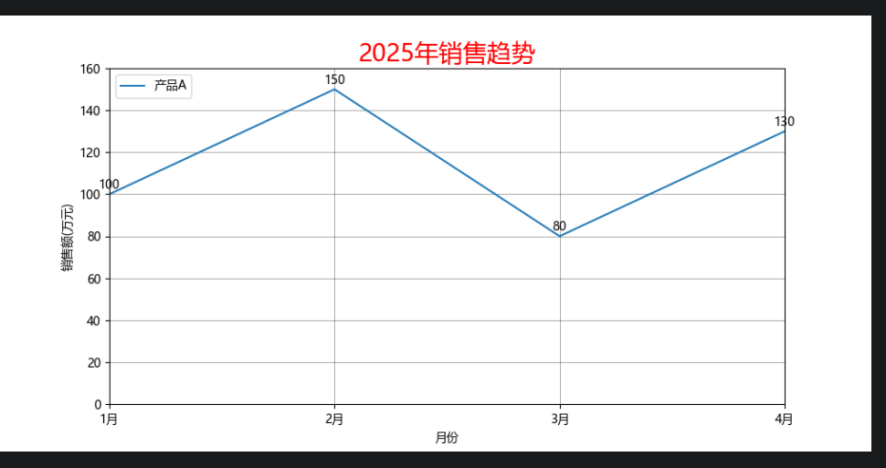
# 4、条形图bar
- 柱状图
```python
import matplotlib.pyplot as plt

#使用中文
from matplotlib import rcParams
rcParams['font.sans-serif'] = ['Microsoft YaHei'] #'Microsoft YaHei':中文字体样式

#创建图表，设置大小
plt.figure(figsize=(10,5)) #宽：10英寸，高：5英寸

#要绘制的数据
subjects = ['语文','数学','英语','科学']
scores = [85,92,78,88]

# #绘制柱状图
plt.bar(subjects,scores,label='小红',color='orange',width=0.6)

#添加标题
plt.title('2025年成绩分布',color='red',fontsize=20)

#添加坐标轴标签
plt.xlabel('科目',fontsize=10)
plt.ylabel('分数',fontsize=10)

#添加图例
plt.legend(loc='upper right',fontsize=10)

#添加网格线
plt.grid(
    axis="y", #y轴都有网格线
    alpha=0.5,  #透明度
    linestyle='-', #样式'-':实线，'--'虚线
    color='black', #颜色
    linewidth=0.5, #线宽
)

#设置刻度位置+文字样式
plt.xticks(
    rotation= 0, #刻度文字旋转角度，0 = 水平显示(默认),正数 = 顺时针旋转,负数 = 逆时针旋转
    fontsize=10  #刻度文字字体大小（数字越大字越大）
)
plt.yticks(rotation= 0, fontsize=10)

#设置刻度范围
plt.ylim(0,100)

#设置点的数值显示
for x,y in zip(subjects,scores):
    plt.text(
        x, y + 1,#在（x,y + 1）的位置显示
        str(y), #显示内容
        ha='center', #水平方向对齐
        va='bottom', #底部方向对齐
        fontsize=10, #数值大小
    )

#自动优化排版
plt.tight_layout()

#显示图表
plt.show()
```
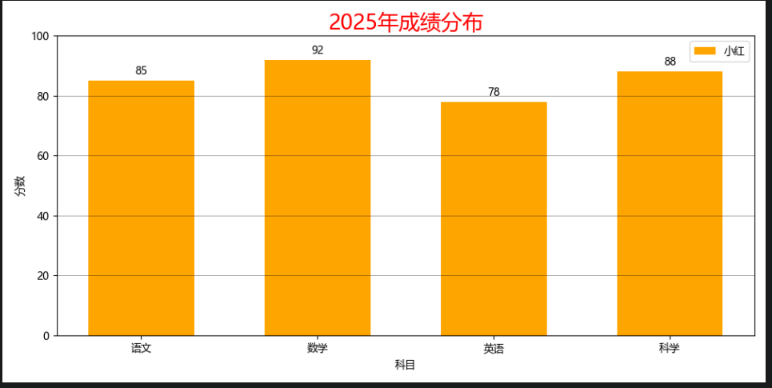
- 条形图barh
```python
import matplotlib.pyplot as plt

#使用中文
from matplotlib import rcParams
rcParams['font.sans-serif'] = ['Microsoft YaHei'] #'Microsoft YaHei':中文字体样式

#创建图表，设置大小
plt.figure(figsize=(10,5)) #宽：10英寸，高：5英寸

#要绘制的数据
countries = ['US','CN','JP','ID']
GDP = [85,92,78,88]

# #绘制条形图
plt.barh(countries,GDP,label = 'GDP')

#添加标题
plt.title('2025年GDP',color='red',fontsize=20)

#添加坐标轴标签
plt.xlabel('GDP',fontsize=10)
plt.ylabel('国家',fontsize=10)

#添加图例
plt.legend(loc='upper right',fontsize=10)

#添加网格线
plt.grid(
    axis="x", #y轴都有网格线
    alpha=0.5,  #透明度
    linestyle='-', #样式'-':实线，'--'虚线
    color='black', #颜色
    linewidth=0.5, #线宽
)

#设置刻度位置+文字样式
plt.xticks(
    rotation= 0, #刻度文字旋转角度，0 = 水平显示(默认),正数 = 顺时针旋转,负数 = 逆时针旋转
    fontsize=10  #刻度文字字体大小（数字越大字越大）
)
plt.yticks(rotation= 0, fontsize=10)

#设置刻度范围
plt.xlim(0,100)

#设置点的数值显示
for x,y in zip(GDP,countries):
    plt.text(
        x+1,y,#在（x,y + 1）的位置显示
        str(x), #显示内容
        ha='center', #水平方向对齐
        va='bottom', #底部方向对齐
        fontsize=10, #数值大小
    )

#自动优化排版
plt.tight_layout()

#显示图表
plt.show()
```
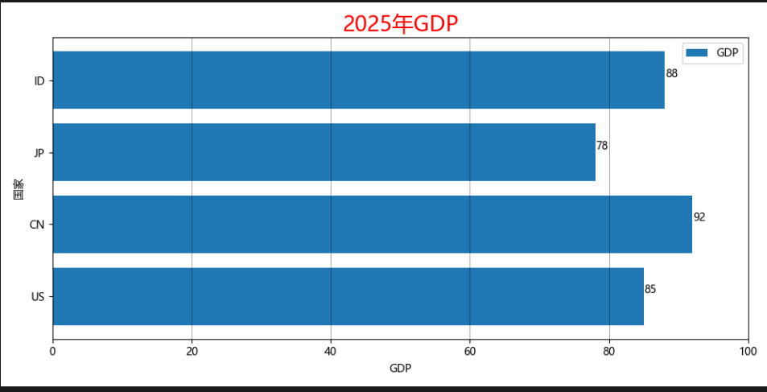
# 5、饼图pie
- 饼图pie
```python
import matplotlib.pyplot as plt

#使用中文
from matplotlib import rcParams
rcParams['font.sans-serif'] = ['Microsoft YaHei'] #'Microsoft YaHei':中文字体样式

#创建图表，设置大小
plt.figure(figsize=(10,5)) #宽：10英寸，高：5英寸

#要绘制的数据
thing = ['学习','娱乐','运动','睡觉','其他']
times = [6,4,1,8,5]

# #绘制条形图
plt.pie(
    times,labels=thing,
    autopct='%.1f%%',#占比显示
    startangle=90,#起始位置
    colors=['#888','#999','#777','#666','#555']
)#起始位置

#添加标题
plt.title('每天时间占比',color='red',fontsize=20)

#自动优化排版
plt.tight_layout()

#显示图表
plt.show()
```
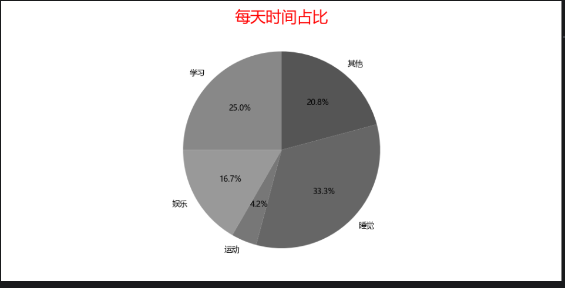
- 环形图
多设置一个参数wedgeprops={'width':0.5}，width是圆环的宽度
```python
import matplotlib.pyplot as plt

#使用中文
from matplotlib import rcParams
rcParams['font.sans-serif'] = ['Microsoft YaHei'] #'Microsoft YaHei':中文字体样式

#创建图表，设置大小
plt.figure(figsize=(10,5)) #宽：10英寸，高：5英寸

#要绘制的数据
thing = ['学习','娱乐','运动','睡觉','其他']
times = [6,4,1,8,5]

# #绘制条形图
plt.pie(
    times,labels=thing,
    autopct='%.1f%%',#占比显示
    startangle=90,#起始位置
    colors=['#888','#999','#777','#666','#555'],
    wedgeprops={'width':0.5}，
    pctdistance=0.8, #占比显示距圆心距离
)#起始位置

#添加标题
plt.title('每天时间占比',color='red',fontsize=20)
plt.text(0,0,'总计\n100%',ha='center',va='center',fontsize=20)
#自动优化排版
plt.tight_layout()

#显示图表
plt.show()
```
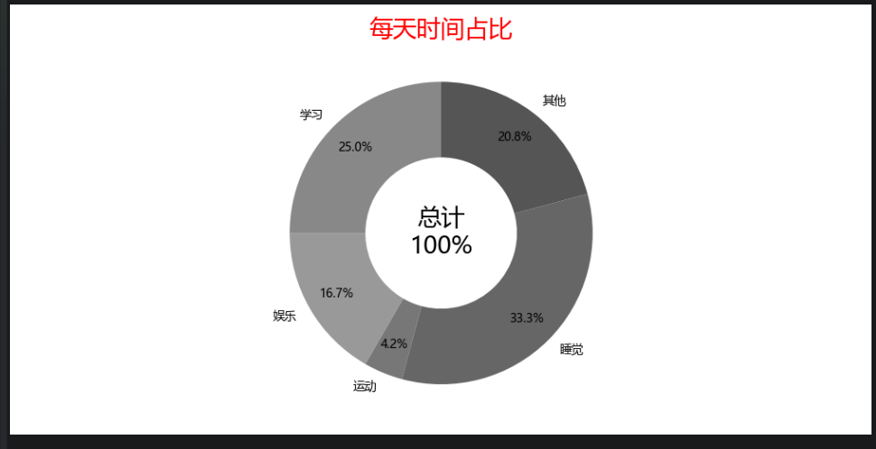
- 爆炸式饼图
多了一个参数explode=[0.1,0,0,0,0],每块偏移参数
```python
import matplotlib.pyplot as plt

#使用中文
from matplotlib import rcParams
rcParams['font.sans-serif'] = ['Microsoft YaHei'] #'Microsoft YaHei':中文字体样式

#创建图表，设置大小
plt.figure(figsize=(10,5)) #宽：10英寸，高：5英寸

#要绘制的数据
thing = ['学习','娱乐','运动','睡觉','其他']
times = [6,4,1,8,5]
explode = [0.1,0,0,0,0] #设置突出块的位置

# #绘制条形图
plt.pie(
    times,labels=thing,
    autopct='%.1f%%',#占比显示
    startangle=90,#起始位置
    colors=['#888','#999','#777','#666','#555'],
    explode = explode
)#起始位置

#添加标题
plt.title('每天时间占比',color='red',fontsize=20)

#自动优化排版
plt.tight_layout()

#显示图表
plt.show()
```
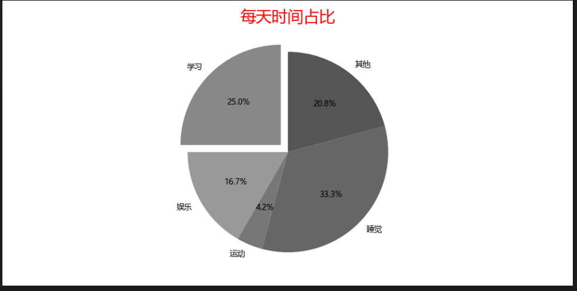
# 6、散点图scatter
```python
import matplotlib.pyplot as plt

#使用中文
from matplotlib import rcParams
rcParams['font.sans-serif'] = ['Microsoft YaHei'] #'Microsoft YaHei':中文字体样式

#创建图表，设置大小
plt.figure(figsize=(10,5)) #宽：10英寸，高：5英寸

#要绘制的数据
scores = [50,55,60,65,70,75,80]
hours = [1,2,3,4,5,6,7]

#绘制散点图
plt.scatter(
    hours,scores, #hours:x轴,scores:y轴
    label = 'Scores',
)

#添加标题
plt.title('测试散点图',color='red',fontsize=20)

#添加坐标轴标签
plt.xlabel('小时',fontsize=10)
plt.ylabel('数值',fontsize=10)

#添加图例
plt.legend(loc='upper left',fontsize=10)

#添加网格线
plt.grid(
    True, #x,y轴都有网格线
    alpha=0.5,  #透明度
    linestyle='-', #样式'-':实线，'--'虚线
    color='black', #颜色
    linewidth=0.5, #线宽
)
# plt.grid(axis='y', linestyle='--', linewidth=0.5)   #单独设置y轴
# plt.grid(axis='x', linestyle='--', linewidth=0.5)   #单独设置x轴

#设置刻度位置+文字样式
plt.xticks(
    rotation= 0, #刻度文字旋转角度，0 = 水平显示(默认),正数 = 顺时针旋转,负数 = 逆时针旋转
    fontsize=10  #刻度文字字体大小（数字越大字越大）
)
plt.yticks(rotation= 0, fontsize=10)

#设置刻度范围
plt.ylim(0,160)

#设置点的数值显示
for x,y in zip(hours,scores):
    plt.text(
        x, y + 1,#在（x,y + 1）的位置显示
        str(y), #显示内容
        ha='center', #水平方向对齐
        va='bottom', #底部方向对齐
        fontsize=10, #数值大小
    )

#显示图表
plt.show()
```
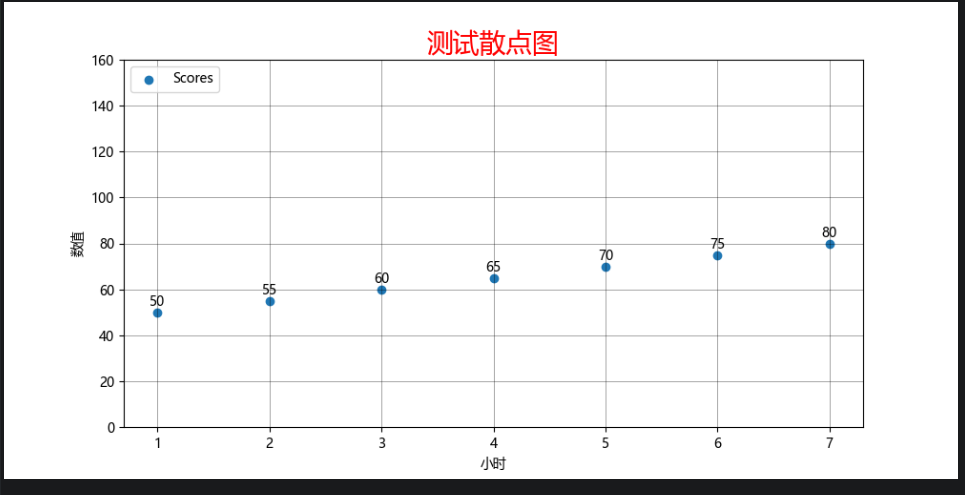
# 7、箱线图boxplot
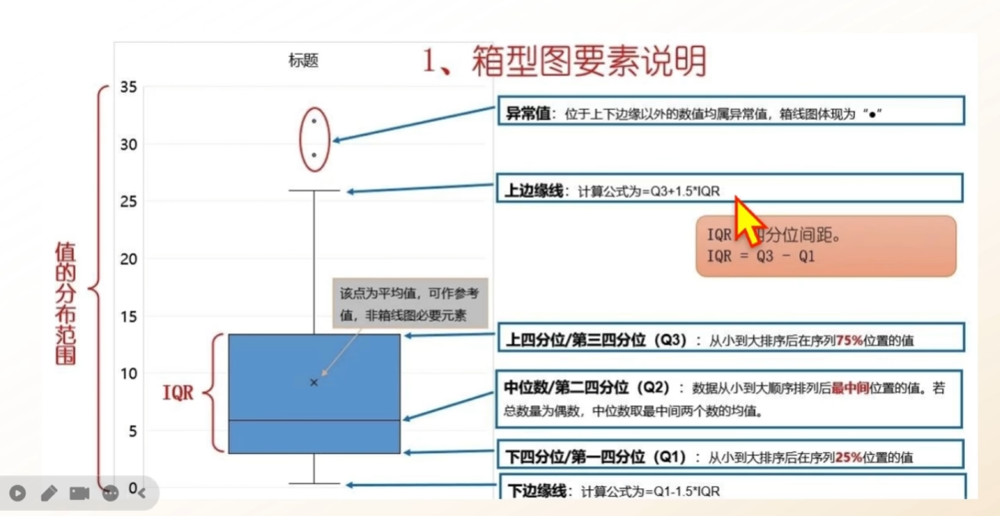
```python
import matplotlib.pyplot as plt
from matplotlib import rcParams
rcParams['font.sans-serif'] = ['SimHei']

#模拟3门课的成绩
data = {
    '语文':[82,85,88,70,90,76,84,83,95],
    '数学':[75,80,79,93,88,82,87,89,92],
    '英语':[70,72,68,65,78,80,85,90,95]
}

plt.figure(figsize=(8,6))
plt.boxplot(
    data.values(),#数据
    tick_labels=data.keys()#标签
)

plt.title('各科成绩分布（箱线图）')
plt.ylabel('分数')
plt.grid(True,axis='y',linestyle='--',alpha=0.5)
plt.show()
```
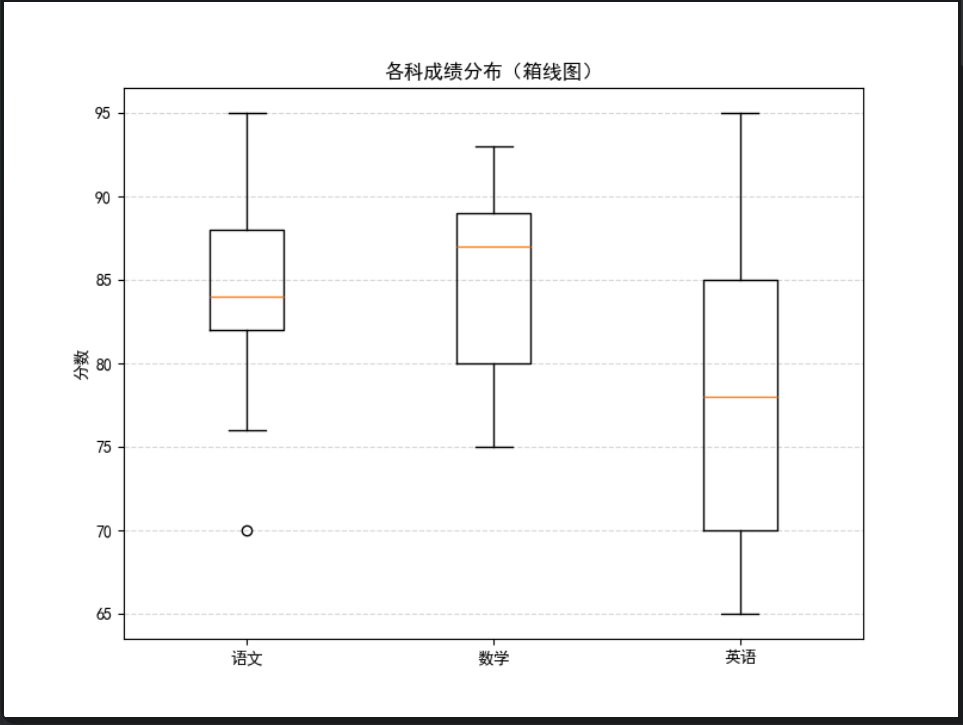
# 8、多个图表
```python
import matplotlib.pyplot as plt
from matplotlib import rcParams
rcParams['font.sans-serif'] = ['SimHei']

month = ['1','2','3','4']
sales = [100,150,80,130]
f1 = plt.subplot(2,2,1)#生成一个子图，行、列、索引,2行2列，第一张
f1.plot(month,sales)
f2 = plt.subplot(2,2,2)#2行2列，第二章
f2.bar(month,sales)
f3 = plt.subplot(2,2,3)
f3.scatter(month,sales)
f4 = plt.subplot(2,2,4)
f4.barh(month,sales)

plt.show()
```
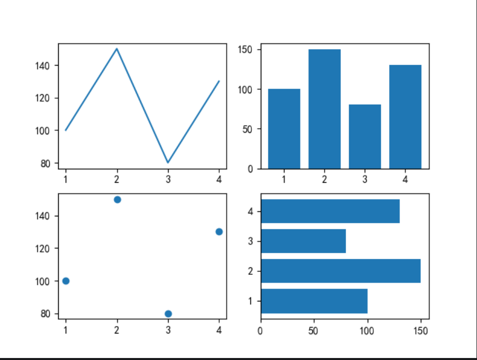
# 9、组合图
```python
import matplotlib.pyplot as plt
from matplotlib import rcParams
rcParams['font.sans-serif'] = ['SimHei']

month = ['1','2','3','4']
sales = [100,150,80,130]
plt.scatter(sales,month)
plt.plot(sales,month)
plt.show()
```
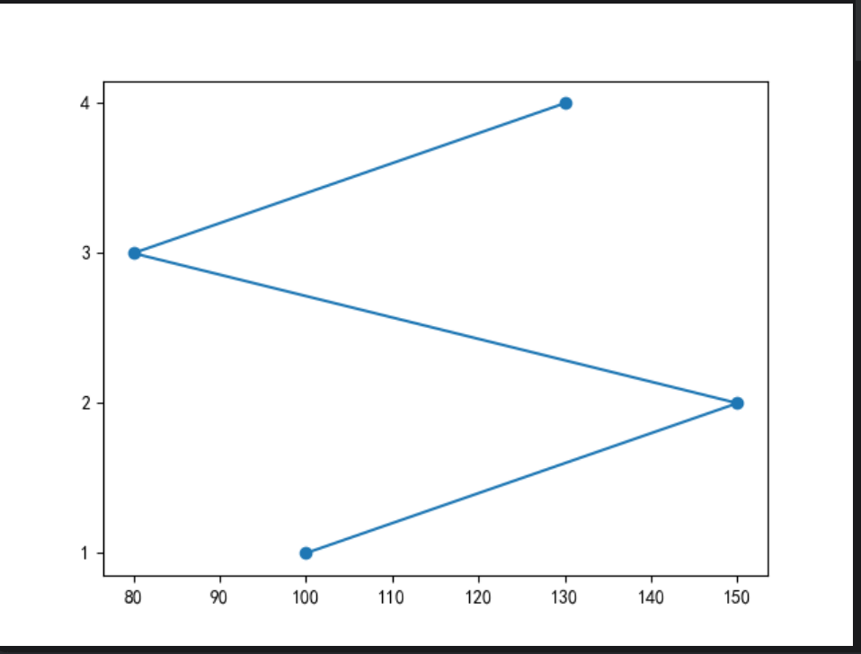
