# 1、ndarray的特性
## 1.1、多维性
支持高维数组
```python
import numpy as np
arr = np.array(5)
print(f'arr: {arr}')
print(f'arr的维度: {arr.ndim}')

arr = np.array([1,2,3,4,5])
print(f'arr: {arr}')
print(f'arr的维度: {arr.ndim}')

arr = np.array([[1,2,3],[4,5,6],[7,8,9]])
print(f'arr: {arr}')
print(f'arr的维度: {arr.ndim}')
```
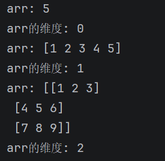
## 1.2、同质性
ndarray的每个元素必须类型相同（通过dtype指定），不同的数据类型会强制转换成相同的数据类型。
```python
import numpy as np
arr = np.array([1,'hello'])
print(arr)
```
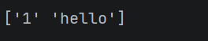
## 1.3、高效性
基于连续内存块存储，支持向量化运算。
# 2、ndarray的属性
- arr.shape：数组的形状
- arr.ndim：数组的维度
- arr.size：数组的总元素个数
- arr.dtype：数组中元素的类型
- arr.T：数组的转置
- arr.itemsize：单个元素占用的内存字节数
- arr.nbytes：数组总内存占用量，size*itemsize
- arr.flags：内存存储方式，是否连续存储（高级优化）
```python
import numpy as np
arr = np.array([[1, 2, 3], [4, 5, 6]])
print('arr.shape:', arr.shape)
print(f'arr.ndim:', arr.ndim)
print(f'arr.size:', arr.size)
print(f'arr.dtype:', arr.dtype)
print(f'arr.T:', arr.T)
print(f'arr.itemsize:', arr.itemsize)
print(f'arr.nbytes:', arr.nbytes)
print(f'arr.flags:', arr.flags)
```
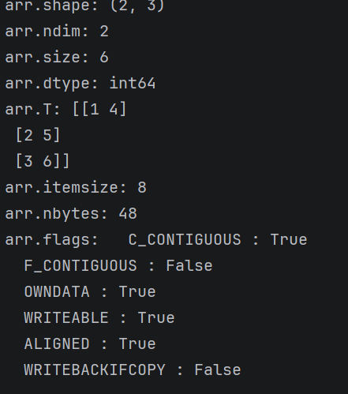
# 3、ndarray的创建方式
<table cellpadding="0" cellspacing="0" style="border-collapse: collapse; width: 100%; font-size: 16px; font-family: system-ui, sans-serif; text-align: center;">
  <thead>
    <tr>
      <th style="padding: 16px; border-right: 1px solid #ccc; border-bottom: 1px solid #ccc; font-weight: 600;">用途</th>
      <th style="padding: 16px; border-right: 1px solid #ccc; border-bottom: 1px solid #ccc; font-weight: 600;">方法</th>
      <th style="padding: 16px; border-right: 1px solid #ccc; border-bottom: 1px solid #ccc; font-weight: 600;"></th>
      <th style="padding: 16px; border-bottom: 1px solid #ccc; font-weight: 600;"></th>
    </tr>
  </thead>
  <tbody>
    <tr>
      <td style="padding: 12px; border-right: 1px solid #ccc; border-bottom: 1px solid #ccc;">基础构造</td>
      <td style="padding: 12px; border-right: 1px solid #ccc; border-bottom: 1px solid #ccc;">np.array()</td>
      <td style="padding: 12px; border-right: 1px solid #ccc; border-bottom: 1px solid #ccc;">np.copy()</td>
      <td style="padding: 12px; border-bottom: 1px solid #ccc;"></td>
    </tr>
    <tr>
      <td style="padding: 12px; border-right: 1px solid #ccc; border-bottom: 1px solid #ccc;">预定义形状填充</td>
      <td style="padding: 12px; border-right: 1px solid #ccc; border-bottom: 1px solid #ccc;">np.zeros()</td>
      <td style="padding: 12px; border-right: 1px solid #ccc; border-bottom: 1px solid #ccc;">np.ones()</td>
      <td style="padding: 12px; border-bottom: 1px solid #ccc;">np.empty() / np.full()</td>
    </tr>
    <tr>
      <td style="padding: 12px; border-right: 1px solid #ccc; border-bottom: 1px solid #ccc;">基于数值范围生成</td>
      <td style="padding: 12px; border-right: 1px solid #ccc; border-bottom: 1px solid #ccc;">np.arange()</td>
      <td style="padding: 12px; border-right: 1px solid #ccc; border-bottom: 1px solid #ccc;">np.linspace()</td>
      <td style="padding: 12px; border-bottom: 1px solid #ccc;">np.logspace()</td>
    </tr>
    <tr>
      <td style="padding: 12px; border-right: 1px solid #ccc; border-bottom: 1px solid #ccc;">特殊矩阵生成</td>
      <td style="padding: 12px; border-right: 1px solid #ccc; border-bottom: 1px solid #ccc;">np.eye()</td>
      <td style="padding: 12px; border-right: 1px solid #ccc; border-bottom: 1px solid #ccc;">np.diag()</td>
      <td style="padding: 12px; border-bottom: 1px solid #ccc;"></td>
    </tr>
    <tr>
      <td style="padding: 12px; border-right: 1px solid #ccc; border-bottom: 1px solid #ccc;">随机数组生成</td>
      <td style="padding: 12px; border-right: 1px solid #ccc; border-bottom: 1px solid #ccc;">np.random.rand()</td>
      <td style="padding: 12px; border-right: 1px solid #ccc; border-bottom: 1px solid #ccc;">np.random.randn()</td>
      <td style="padding: 12px; border-bottom: 1px solid #ccc;">np.random.randint()</td>
    </tr>
    <tr>
      <td style="padding: 12px; border-right: 1px solid #ccc;">高级构造方法</td>
      <td style="padding: 12px; border-right: 1px solid #ccc;">np.array()</td>
      <td style="padding: 12px; border-right: 1px solid #ccc;">np.loadtxt()</td>
      <td style="padding: 12px;">np.fromfunction()</td>
    </tr>
  </tbody>
</table>

## 3.1、基础构造
### 3.1.1、np.array()
```python
import numpy as np
arr = np.array([1,2,3],dtype=np.float64)
print(arr)
```
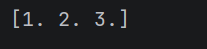
### 3.1.2、np.copy()
深拷贝
```python
import numpy as np
arr = np.array([1,2,3])
arr1 = np.copy(arr)
print(arr1)
```
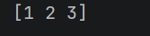
## 3.2、预定义形状填充
### 3.2.1、np.zeros()
全0
```python
import numpy as np
arr = np.zeros((2,3))
print(arr)
```
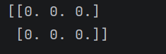
### 3.2.2、np.ones()
全1
```python
import numpy as np
arr = np.ones((2,3))
print(arr)
```
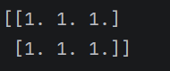
### 3.2.3、np.empty()
未初始化，值是随机的，只有形状
```python
import numpy as np
arr = np.empty((3,3))
print(arr)
```
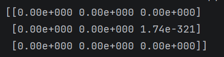
### 3.2.4、np.full()
全填充
```python
import numpy as np
arr = np.full((3,3), 5)
print(arr)
```
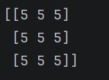
## 3.3、基于数值范围生成
### 3.3.1、np.arange()
等差数列
```python
import numpy as np
arr = np.arange(1,10,2) #[1,10),步长为2
print(arr)
```
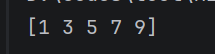
### 3.3.2、np.linspace()
等间隔数列
```python
import numpy as np
arr = np.linspace(1,10,5)#[1,10],平均取5个数
print(arr)
```
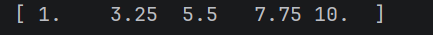
### 3.3.3、np.logspace()
对数间隔数列
```python
import numpy as np
arr = np.logspace(1,10,4,base=2)#[1,10],均分4个，在以2为底数做幂运算
print(arr)
```
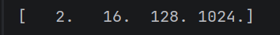
## 3.4、特殊矩阵生成
### 3.4.1、np.eye()
单位矩阵
```python
import numpy as np
arr = np.eye(5)
print(arr)
```
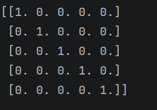
### 3.4.2、np.diag()
对角矩阵：主对角线非0，其他位置全0
```python
import numpy as np
arr = np.diag([1,2,3,4])
print(arr)
```
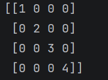
## 3.5、随机数组生成
### 3.5.1、np.random.rand()
生成0到1之间的随机浮点数（均匀分布）
```python
import numpy as np
arr = np.random.rand(2,3)  #shape =（2，3）
print(arr)
```
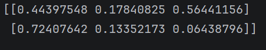
### 3.5.2、np.random.randn()
生成符合标准正态分布的随机数列
```python
import numpy as np
arr = np.random.randn(5,3)#shape = (5,3)
print(arr)
```
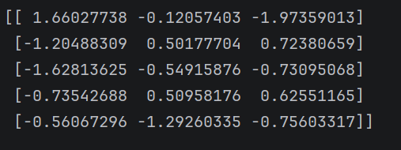
### 3.5.3、np.random.randint()
生成指定区间之间的随机整数
```python
import numpy as np
arr = np.random.randint(0,10,(2,3))#[0,10),shape = (2,3)
print(arr)
```
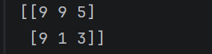
### 3.5.4、np.random.uniform()
```python
import numpy as np
arr = np.random.uniform(3,6,(2,3))#在[3，6)之间，shape = （2，3）
print(arr)
```
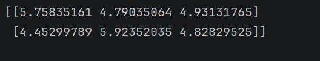
### 3.5.5、np.random.seed()
按照每个种子生成随机数组
```python
import numpy as np
np.random.seed(20)
arr = np.random.randint(1,10,(25))
print(arr)
print(arr)
```
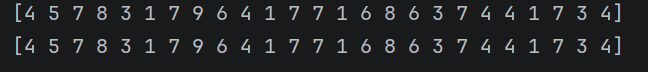
# 4、ndarray的数据类型
<table cellpadding="0" cellspacing="0" style="border-collapse: collapse; width: 100%; font-size: 16px; font-family: system-ui, sans-serif; text-align: center;">
  <thead>
    <tr>
      <th style="padding: 16px; border-right: 1px solid #ccc; border-bottom: 1px solid #ccc; font-weight: 600;">数据类型</th>
      <th style="padding: 16px; border-bottom: 1px solid #ccc; font-weight: 600;">说明</th>
    </tr>
  </thead>
  <tbody>
    <tr>
      <td style="padding: 12px; border-right: 1px solid #ccc; border-bottom: 1px solid #ccc;">bool</td>
      <td style="padding: 12px; border-bottom: 1px solid #ccc;"></td>
    </tr>
    <tr>
      <td style="padding: 12px; border-right: 1px solid #ccc; border-bottom: 1px solid #ccc;">int8, uint8</td>
      <td style="padding: 12px; border-bottom: 1px solid #ccc;">有符号位、无符号位8位（1字节）整形，-128~127，0~255</td>
    </tr>
    <tr>
      <td style="padding: 12px; border-right: 1px solid #ccc; border-bottom: 1px solid #ccc;">int16, uint16</td>
      <td style="padding: 12px; border-bottom: 1px solid #ccc;">有符号位、无符号位16位（2字节）整形</td>
    </tr>
    <tr>
      <td style="padding: 12px; border-right: 1px solid #ccc; border-bottom: 1px solid #ccc;">int32, uint32</td>
      <td style="padding: 12px; border-bottom: 1px solid #ccc;">有符号位、无符号位32位（4字节）整形</td>
    </tr>
    <tr>
      <td style="padding: 12px; border-right: 1px solid #ccc; border-bottom: 1px solid #ccc;">int64, uint64</td>
      <td style="padding: 12px; border-bottom: 1px solid #ccc;">有符号位、无符号位64位（8字节）整形</td>
    </tr>
    <tr>
      <td style="padding: 12px; border-right: 1px solid #ccc; border-bottom: 1px solid #ccc;">float16</td>
      <td style="padding: 12px; border-bottom: 1px solid #ccc;">半精度浮点型</td>
    </tr>
    <tr>
      <td style="padding: 12px; border-right: 1px solid #ccc; border-bottom: 1px solid #ccc;">float32</td>
      <td style="padding: 12px; border-bottom: 1px solid #ccc;">单精度浮点型</td>
    </tr>
    <tr>
      <td style="padding: 12px; border-right: 1px solid #ccc; border-bottom: 1px solid #ccc;">float64</td>
      <td style="padding: 12px; border-bottom: 1px solid #ccc;">双精度浮点型</td>
    </tr>
    <tr>
      <td style="padding: 12px; border-right: 1px solid #ccc; border-bottom: 1px solid #ccc;">complex64</td>
      <td style="padding: 12px; border-bottom: 1px solid #ccc;">用两个32位浮点数表示的复数</td>
    </tr>
    <tr>
      <td style="padding: 12px; border-right: 1px solid #ccc;">complex128</td>
      <td style="padding: 12px;">用两个64位浮点数表示的复数</td>
    </tr>
  </tbody>
</table>

# 5、索引与切片
<table cellpadding="0" cellspacing="0" style="border-collapse: collapse; width: 100%; font-size: 16px; font-family: system-ui, sans-serif; text-align: center;">
  <thead>
    <tr>
      <th style="padding: 16px; border-right: 1px solid #ccc; border-bottom: 1px solid #ccc; font-weight: 600;">索引/切片类型</th>
      <th style="padding: 16px; border-bottom: 1px solid #ccc; font-weight: 600;">描述/用法</th>
    </tr>
  </thead>
  <tbody>
    <tr>
      <td style="padding: 12px; border-right: 1px solid #ccc; border-bottom: 1px solid #ccc;">基本索引</td>
      <td style="padding: 12px; border-bottom: 1px solid #ccc;">通过整数索引直接访问元素。索引从0开始。</td>
    </tr>
    <tr>
      <td style="padding: 12px; border-right: 1px solid #ccc; border-bottom: 1px solid #ccc;">行/列切片</td>
      <td style="padding: 12px; border-bottom: 1px solid #ccc;">使用冒号: 切片语法选择行或列的子集。</td>
    </tr>
    <tr>
      <td style="padding: 12px; border-right: 1px solid #ccc; border-bottom: 1px solid #ccc;">连续切片</td>
      <td style="padding: 12px; border-bottom: 1px solid #ccc;">从起始索引到结束索引按步长切片。</td>
    </tr>
    <tr>
      <td style="padding: 12px; border-right: 1px solid #ccc; border-bottom: 1px solid #ccc;">使用slice函数</td>
      <td style="padding: 12px; border-bottom: 1px solid #ccc;">通过slice（start, stop, step）定义切片规则。</td>
    </tr>
    <tr>
      <td style="padding: 12px; border-right: 1px solid #ccc;">布尔索引</td>
      <td style="padding: 12px;">通过布尔条件筛选满足条件的元素。支持逻辑运算符&、|。</td>
    </tr>
  </tbody>
</table>

## 5.1、一维数组
```python
import numpy as np
arr = np.random.randint(1,100,20)
print(arr)
print(arr[1])
print(arr[0:20:2])#[start,stop),step：步长
print(arr[slice(0,20,2)])
print(arr[(arr>10)&(arr<70)])#打印arr中大于10小于70的元素
```
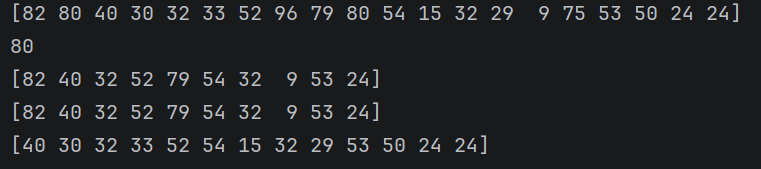
## 5.2、二维数组
```python
import numpy as np
arr = np.random.randint(1,100,(4,8))
print(arr)
print(arr[1,1])
print(arr[0:4:2,0:8:2])
print(arr[slice(0,4,2),slice(0,8,2)])
print(arr[arr>50])
```
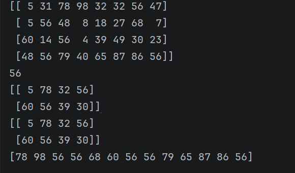
# 6、ndarray的运算
## 6.1、算数运算
```python
import numpy as np
a = np.array([1,2,3])
b = np.array([4,5,6])
print(a + b)
print(a - b)
print(a * b)
print(a / b)
print(a ** b)
print(a % b)
print(a // b)
```
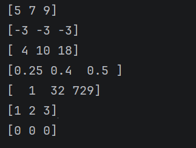
## 6.2、矩阵运算
### 6.2.1、矩阵乘法
```python
import numpy as np
a = np.array([1,2,3])
b = np.array([4,5,6])
print(a.dot(b))
print(a @ b)
print(np.dot(a, b))
```

## 6.3、广播机制
广播（Broadcasting） 是 NumPy 中不同形状的数组进行算术运算的规则，它能自动扩展维度较小的数组，让两个数组形状匹配后再计算，无需手动复制数据，是 NumPy 最核心、最实用的特性之一。
广播核心规则：
NumPy 从右往左（从最后一维到第一维）对比数组形状，满足以下任一条件即可广播：
1. 对应维度的大小相等；
2. 其中一个数组的对应维度大小为 1。
```python
import numpy as np
a = np.array([1,2,3])#shape（3，）
b = np.array([[4],[5],[6]])#shape（3，1）
print(a + b)
```
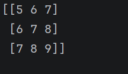
## 6.4、Numpy常用函数
<table cellpadding="0" cellspacing="0" style="border-collapse: collapse; width: 100%; font-size: 16px; font-family: system-ui, sans-serif; text-align: center;">
  <thead>
    <tr>
      <th colspan="7" style="padding: 16px; border: 1px solid #ccc; font-weight: 600;">基本数学</th>
    </tr>
  </thead>
  <tbody>
    <tr>
      <td style="padding: 12px; border: 1px solid #ccc;">np.sqrt(x)</td>
      <td style="padding: 12px; border: 1px solid #ccc;">np.exp(x)</td>
      <td style="padding: 12px; border: 1px solid #ccc;">np.log(x)</td>
      <td style="padding: 12px; border: 1px solid #ccc;">np.sin(x)</td>
      <td style="padding: 12px; border: 1px solid #ccc;">np.abs(x)</td>
      <td style="padding: 12px; border: 1px solid #ccc;">np.power(a,b)</td>
      <td style="padding: 12px; border: 1px solid #ccc;">np.round(x,n), np.ceil(x), np.floor(x),</td>
    </tr>
    <tr>
      <td style="padding: 12px; border: 1px solid #ccc;">\( \sqrt{x} \)</td>
      <td style="padding: 12px; border: 1px solid #ccc;">\( e^x \)</td>
      <td style="padding: 12px; border: 1px solid #ccc;">\( \ln(x) \)</td>
      <td style="padding: 12px; border: 1px solid #ccc;">\( \sin x \)</td>
      <td style="padding: 12px; border: 1px solid #ccc;">\( |x| \)</td>
      <td style="padding: 12px; border: 1px solid #ccc;">\( a^b \)</td>
      <td style="padding: 12px; border: 1px solid #ccc;">（银行家舍入）四舍五入；向上取整；向下取整</td>
    </tr>
  </tbody>
</table>

<table cellpadding="0" cellspacing="0" style="border-collapse: collapse; width: 100%; font-size: 16px; font-family: system-ui, sans-serif; text-align: center;">
  <thead>
    <tr>
      <th colspan="7" style="padding: 16px; border: 1px solid #ccc; font-weight: 600;">统计</th>
    </tr>
  </thead>
  <tbody>
    <tr>
      <td style="padding: 12px; border: 1px solid #ccc;">np.sum(x), np.cumsum(x), np.cumprod(x)</td>
      <td style="padding: 12px; border: 1px solid #ccc;">np.mean(x)</td>
      <td style="padding: 12px; border: 1px solid #ccc;">np.median(x)</td>
      <td style="padding: 12px; border: 1px solid #ccc;">np.std(x)</td>
      <td style="padding: 12px; border: 1px solid #ccc;">np.var(x)</td>
      <td style="padding: 12px; border: 1px solid #ccc;">np.min(x)/np.max(x)/np.argmax(x)/np.argmin(x)</td>
      <td style="padding: 12px; border: 1px solid #ccc;">np.percentile(x, q)</td>
    </tr>
    <tr>
      <td style="padding: 12px; border: 1px solid #ccc;">求和；求累计和；求累计积</td>
      <td style="padding: 12px; border: 1px solid #ccc;">求平均</td>
      <td style="padding: 12px; border: 1px solid #ccc;">求中位数</td>
      <td style="padding: 12px; border: 1px solid #ccc;">求标准差</td>
      <td style="padding: 12px; border: 1px solid #ccc;">求方差</td>
      <td style="padding: 12px; border: 1px solid #ccc;">求最小值/最大值/最大值索引/最小值索引</td>
      <td style="padding: 12px; border: 1px solid #ccc;">求百分位数</td>
    </tr>
  </tbody>
</table>

<table cellpadding="0" cellspacing="0" style="border-collapse: collapse; width: 100%; font-size: 16px; font-family: system-ui, sans-serif; text-align: center;">
  <thead>
    <tr>
      <th colspan="5" style="padding: 16px; border: 1px solid #ccc; font-weight: 600;">比较</th>
    </tr>
  </thead>
  <tbody>
    <tr>
      <td style="padding: 12px; border: 1px solid #ccc;">np.greater(a,b)</td>
      <td style="padding: 12px; border: 1px solid #ccc;">np.less(a,b)</td>
      <td style="padding: 12px; border: 1px solid #ccc;">np.equal(a,b)</td>
      <td style="padding: 12px; border: 1px solid #ccc;">np.logical_and(a,b), np.logical_or(a,b), np.logical_not(a)</td>
      <td style="padding: 12px; border: 1px solid #ccc;">np.where(condition, x, y)</td>
    </tr>
    <tr>
      <td style="padding: 12px; border: 1px solid #ccc;">a > b</td>
      <td style="padding: 12px; border: 1px solid #ccc;">a < b</td>
      <td style="padding: 12px; border: 1px solid #ccc;">a == b</td>
      <td style="padding: 12px; border: 1px solid #ccc;">a &amp; b; a | b; !a</td>
      <td style="padding: 12px; border: 1px solid #ccc;">if condition x, else y</td>
    </tr>
  </tbody>
</table>

<table cellpadding="0" cellspacing="0" style="border-collapse: collapse; width: 100%; font-size: 16px; font-family: system-ui, sans-serif; text-align: center;">
  <thead>
    <tr>
      <th colspan="2" style="padding: 16px; border: 1px solid #ccc; font-weight: 600;">去重</th>
    </tr>
  </thead>
  <tbody>
    <tr>
      <td style="padding: 12px; border: 1px solid #ccc;">np.unique(x)</td>
      <td style="padding: 12px; border: 1px solid #ccc;">np.isin(a, b)</td>
    </tr>
    <tr>
      <td style="padding: 12px; border: 1px solid #ccc;">去重 + 自动升序排序</td>
      <td style="padding: 12px; border: 1px solid #ccc;">a 的每个元素，是否属于集合 b</td>
    </tr>
  </tbody>
</table>

<table cellpadding="0" cellspacing="0" style="border-collapse: collapse; width: 100%; font-size: 16px; font-family: system-ui, sans-serif; text-align: center;">
  <thead>
    <tr>
      <th colspan="5" style="padding: 16px; border: 1px solid #ccc; font-weight: 600;">其他</th>
    </tr>
  </thead>
  <tbody>
    <tr>
      <td style="padding: 12px; border: 1px solid #ccc;">np.concatenate((a,b), axis=0)</td>
      <td style="padding: 12px; border: 1px solid #ccc;">np.split(x, indices)</td>
      <td style="padding: 12px; border: 1px solid #ccc;">np.reshape(x, shape)</td>
      <td style="padding: 12px; border: 1px solid #ccc;">np.copy(x)</td>
      <td style="padding: 12px; border: 1px solid #ccc;">np.isnan(x)</td>
    </tr>
    <tr>
      <td style="padding: 12px; border: 1px solid #ccc;">将多个数组按axis拼接，默认axis=0</td>
      <td style="padding: 12px; border: 1px solid #ccc;">将x切分，indices是切分规则</td>
      <td style="padding: 12px; border: 1px solid #ccc;">将x转换成shape形状</td>
      <td style="padding: 12px; border: 1px solid #ccc;">深拷贝x</td>
      <td style="padding: 12px; border: 1px solid #ccc;">逐元素判断：是不是NaN（缺失值/非数字）</td>
    </tr>
  </tbody>
</table>

<table cellpadding="0" cellspacing="0" style="border-collapse: collapse; width: 100%; font-size: 16px; font-family: system-ui, sans-serif; text-align: center;">
  <thead>
    <tr>
      <th colspan="4" style="padding: 16px; border: 1px solid #ccc; font-weight: 600;">排序</th>
    </tr>
  </thead>
  <tbody>
    <tr>
      <td style="padding: 12px; border: 1px solid #ccc;">np.sort(x)</td>
      <td style="padding: 12px; border: 1px solid #ccc;">x.sort()</td>
      <td style="padding: 12px; border: 1px solid #ccc;">np.argsort(x)</td>
      <td style="padding: 12px; border: 1px solid #ccc;">np.lexsort(keys)</td>
    </tr>
    <tr>
      <td style="padding: 12px; border: 1px solid #ccc;">对数组进行排序，返回一个从小到大排好的新数组</td>
      <td style="padding: 12px; border: 1px solid #ccc;">原地从小到大排序，直接修改原数组，不返回新数组。</td>
      <td style="padding: 12px; border: 1px solid #ccc;">不返回排序后的值，返回从小到大排序的元素下标索引</td>
      <td style="padding: 12px; border: 1px solid #ccc;">多关键字排序（先按 A 排，A 相同再按 B 排），返回排序后的下标索引</td>
    </tr>
  </tbody>
</table>

# 7、练习
## 7.1、温度数据分析
某城市一周的最高气温（℃）为
```python
[28,30,29,31,32,30,29]
```
- 计算平均气温、最高气温和最低气温
```python
import numpy as np
temperatue = [28,30,29,31,32,30,29]
print(f'平均气温：{np.mean(temperatue)}')
print(f'最高气温：{np.max(temperatue)}')
print(f'最低气温：{np.min(temperatue)}')
```
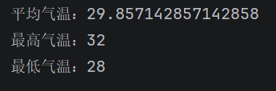
- 找出气温超过30℃的天数
```python
import numpy as np
temperature = np.array([28,30,29,31,32,30,29])
temperature_greater_30 = temperature[temperature > 30]
print(f'气温超过30℃的天数：{temperature_greater_30.__len__()}')
```

## 7.2、学生成绩统计
某班级5名学生的数学成绩为
```python
[85,90,78,92,88]
```
- 计算成绩的平均分、中位数、标准差
```python
import numpy as np
score = np.array([85,90,78,92,88])
print(f'平均分：{score.mean()}')
print(f'中位数：{np.median(score)}')
print(f'标准差：{np.std(score)}')
```
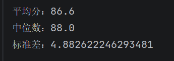
## 7.3、矩阵运算
给定矩阵
```python
A = [[1，2],[3,4]]
B = [[5,6],[7,8]]
```
- 计算A + B和A * B
```python
import numpy as np
A = np.array([[1,2],[3,4]])
B = np.array([[5,6],[7,8]])
print(f'A + B:{A+B}')
print(f'A * B:{A*B}')
```
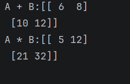
- 计算A和B的点积
```python
import numpy as np
A = np.array([[1,2],[3,4]])
B = np.array([[5,6],[7,8]])
print(f'A 和 B的点积:{np.dot(A,B)}')
```
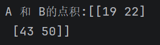
## 7.4、随机数据生成
生成一个（3，4）的随机整数数组，范围[0,10)
- 计算每列的最大值和每行的最小值
```python
import numpy as np
arr = np.random.randint(0,10,(3,4))
print(arr)
print(f'每列做大致：{np.max(arr,axis=0)}')
print(f'每行最小值：{np.min(arr,axis=1)}')
```
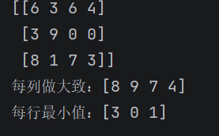
- 将数组中所有奇数替换为-1
```python
import numpy as np
arr = np.random.randint(0,10,(3,4))
print(arr)
arr_new = np.where(arr % 2 == 1,-1,arr)
print(arr_new)
arr[arr%2==1] = -1
print(arr)
```
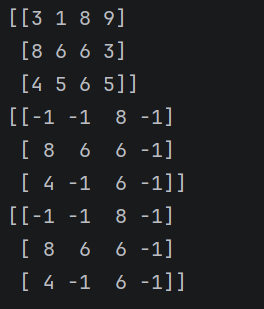
## 7.5、数组变形
创建一个1到12的一维数组，并转换为（3，4）的二维数组
- 计算每行的和与每列的平均值
```python
import numpy as np
arr = np.arange(1,13)
arr = arr.reshape((3,4))
print(arr)
sum = np.sum(arr,axis=1)
print(f'每行sum:{sum}')
mean = np.mean(arr,axis=0)
print(f'每列mean:{mean}')
```
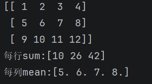
- 将数组展平为一维数组
```python
import numpy as np
arr = np.arange(1,13)
arr = arr.reshape((3,4))
print(arr)
arr = arr.reshape((-1,))
print(arr)
```
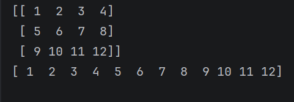
## 7.6唯一值与排序
给定数组
```python
[2,1,2,3,1,4,3]
```
- 找出数组中的唯一值并排序
- 计算每个唯一值出现的次数
```python
import numpy as np
arr = np.array([2,1,2,3,1,4,3])
print(arr)
u_arr, count = np.unique(arr, return_counts=True)
print(f'排序后arr：{u_arr}')
print(f'每个唯一值出现的次数：{count}')
```
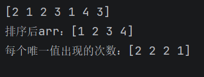