# 1、Pandas核心理念
- 标签化数据结构：提供带标签的轴
- 灵活处理缺失数据：内置NaN处理机制
- 智能数据对齐：自动按标签对齐数据
- 强大的IO工具：支持从CSV、Excel、SQL、JSON等20+数据源读写
- 时间序列处理：原生支持日期时间处理和频率转换
# 2、Excel、SQL和Python+Pandas对比
<table cellpadding="0" cellspacing="0" style="border-collapse: collapse; width: 100%; font-size: 16px; font-family: system-ui, sans-serif; text-align: center;">
  <thead>
    <tr>
      <th style="padding: 16px; border-right: 1px solid #ccc; border-bottom: 1px solid #ccc; font-weight: 600;">工具</th>
      <th style="padding: 16px; border-right: 1px solid #ccc; border-bottom: 1px solid #ccc; font-weight: 600;">功能特色</th>
      <th style="padding: 16px; border-bottom: 1px solid #ccc; font-weight: 600;">适用场景</th>
    </tr>
  </thead>
  <tbody>
    <tr>
      <td style="padding: 12px; border-right: 1px solid #ccc; border-bottom: 1px solid #ccc;">Excel</td>
      <td style="padding: 12px; border-right: 1px solid #ccc; border-bottom: 1px solid #ccc;">图形界面，简单上手</td>
      <td style="padding: 12px; border-bottom: 1px solid #ccc;">人工分析、小规模数据</td>
    </tr>
    <tr>
      <td style="padding: 12px; border-right: 1px solid #ccc; border-bottom: 1px solid #ccc;">SQL</td>
      <td style="padding: 12px; border-right: 1px solid #ccc; border-bottom: 1px solid #ccc;">高效读写，最终数据源</td>
      <td style="padding: 12px; border-bottom: 1px solid #ccc;">数据库查询和联表</td>
    </tr>
    <tr>
      <td style="padding: 12px; border-right: 1px solid #ccc;">Python + Pandas</td>
      <td style="padding: 12px; border-right: 1px solid #ccc;">算法和分析部署核心</td>
      <td style="padding: 12px;">数据清洗，统计分析，可视化等</td>
    </tr>
  </tbody>
</table>

# 3、Pandas学习路径

# 4、Pandas数据结构
<table cellpadding="0" cellspacing="0" style="border-collapse: collapse; width: 100%; font-size: 16px; font-family: system-ui, sans-serif; text-align: center;">
  <thead>
    <tr>
      <th style="padding: 16px; border-right: 1px solid #ccc; border-bottom: 1px solid #ccc; font-weight: 600;">特性</th>
      <th style="padding: 16px; border-right: 1px solid #ccc; border-bottom: 1px solid #ccc; font-weight: 600;">Series</th>
      <th style="padding: 16px; border-bottom: 1px solid #ccc; font-weight: 600;">DataFrame</th>
    </tr>
  </thead>
  <tbody>
    <tr>
      <td style="padding: 12px; border-right: 1px solid #ccc; border-bottom: 1px solid #ccc;">维度</td>
      <td style="padding: 12px; border-right: 1px solid #ccc; border-bottom: 1px solid #ccc;">一维</td>
      <td style="padding: 12px; border-bottom: 1px solid #ccc;">二维</td>
    </tr>
    <tr>
      <td style="padding: 12px; border-right: 1px solid #ccc; border-bottom: 1px solid #ccc;">索引</td>
      <td style="padding: 12px; border-right: 1px solid #ccc; border-bottom: 1px solid #ccc;">单索引</td>
      <td style="padding: 12px; border-bottom: 1px solid #ccc;">行索引+列名</td>
    </tr>
    <tr>
      <td style="padding: 12px; border-right: 1px solid #ccc; border-bottom: 1px solid #ccc;">数据存储</td>
      <td style="padding: 12px; border-right: 1px solid #ccc; border-bottom: 1px solid #ccc;">同质化数据类型</td>
      <td style="padding: 12px; border-bottom: 1px solid #ccc;">各列可不同数据类型</td>
    </tr>
    <tr>
      <td style="padding: 12px; border-right: 1px solid #ccc; border-bottom: 1px solid #ccc;">类比</td>
      <td style="padding: 12px; border-right: 1px solid #ccc; border-bottom: 1px solid #ccc;">Excel单列</td>
      <td style="padding: 12px; border-bottom: 1px solid #ccc;">整张Excel工作表</td>
    </tr>
    <tr>
      <td style="padding: 12px; border-right: 1px solid #ccc;">创建方式</td>
      <td style="padding: 12px; border-right: 1px solid #ccc;">pd.Series([1,2,3])</td>
      <td style="padding: 12px;">pd.DataFrame({'col':[1,2,3]})</td>
    </tr>
  </tbody>
</table>

# 5、Series数据类型
## 5.1、创建Series数据
### 5.1.1、使用列表创建Series
```python
import pandas as pd
s = pd.Series([1,2,3,4,5])
print(s)
s[6] = 6
print(s)
```

- 自定义索引
```python
import pandas as pd
# 自定义索引
s = pd.Series([1,2,3,4,5],index=[1,2,3,4,5])
print(s)
s = pd.Series([1,2,3,4,5],index=[1,2,3,4,5])
print(s)
```

- 定义name：Series的描述
```python
import pandas as pd
# 自定义索引
s = pd.Series([1,2,3,4,5],index=[1,2,3,4,5],name='数字')
print(s)
```

### 5.1.2、使用字典创建Series
```python
import pandas as pd
s = pd.Series({'a':1,'b':2,'c':3})
print(s)
```

### 5.1.3、从已有的Series中选择数据建立Series
```python
import pandas as pd
s = pd.Series({'a':1,'b':2,'c':3})
s1 = pd.Series(s,index=['a','c'])
print(s1)
```

## 5.2、Series的常见属性
<table cellpadding="0" cellspacing="0" style="border-collapse: collapse; width: 100%; font-size: 16px; font-family: system-ui, sans-serif; text-align: center;">
  <thead>
    <tr>
      <th style="padding: 16px; border-right: 1px solid #ccc; border-bottom: 1px solid #ccc; font-weight: 600;">属性</th>
      <th style="padding: 16px; border-bottom: 1px solid #ccc; font-weight: 600;">说明</th>
    </tr>
  </thead>
  <tbody>
    <tr>
      <td style="padding: 12px; border-right: 1px solid #ccc; border-bottom: 1px solid #ccc;">index</td>
      <td style="padding: 12px; border-bottom: 1px solid #ccc;">Series的索引对象</td>
    </tr>
    <tr>
      <td style="padding: 12px; border-right: 1px solid #ccc; border-bottom: 1px solid #ccc;">values</td>
      <td style="padding: 12px; border-bottom: 1px solid #ccc;">Series的值</td>
    </tr>
    <tr>
      <td style="padding: 12px; border-right: 1px solid #ccc; border-bottom: 1px solid #ccc;">dtype或dtypes</td>
      <td style="padding: 12px; border-bottom: 1px solid #ccc;">Series的元素类型</td>
    </tr>
    <tr>
      <td style="padding: 12px; border-right: 1px solid #ccc; border-bottom: 1px solid #ccc;">shape</td>
      <td style="padding: 12px; border-bottom: 1px solid #ccc;">Series的形状</td>
    </tr>
    <tr>
      <td style="padding: 12px; border-right: 1px solid #ccc; border-bottom: 1px solid #ccc;">ndim</td>
      <td style="padding: 12px; border-bottom: 1px solid #ccc;">Series的维度</td>
    </tr>
    <tr>
      <td style="padding: 12px; border-right: 1px solid #ccc; border-bottom: 1px solid #ccc;">size</td>
      <td style="padding: 12px; border-bottom: 1px solid #ccc;">Series的元素个数</td>
    </tr>
    <tr>
      <td style="padding: 12px; border-right: 1px solid #ccc; border-bottom: 1px solid #ccc;">name</td>
      <td style="padding: 12px; border-bottom: 1px solid #ccc;">Series的名称</td>
    </tr>
    <tr>
      <td style="padding: 12px; border-right: 1px solid #ccc; border-bottom: 1px solid #ccc;">loc[]</td>
      <td style="padding: 12px; border-bottom: 1px solid #ccc;">显示索引，按标签索引或切片</td>
    </tr>
    <tr>
      <td style="padding: 12px; border-right: 1px solid #ccc; border-bottom: 1px solid #ccc;">iloc[]</td>
      <td style="padding: 12px; border-bottom: 1px solid #ccc;">隐式索引，按位置索引或切片</td>
    </tr>
    <tr>
      <td style="padding: 12px; border-right: 1px solid #ccc; border-bottom: 1px solid #ccc;">at[]</td>
      <td style="padding: 12px; border-bottom: 1px solid #ccc;">使用标签访问单个元素</td>
    </tr>
    <tr>
      <td style="padding: 12px; border-right: 1px solid #ccc;">iat[]</td>
      <td style="padding: 12px;">使用位置访问单个元素</td>
    </tr>
  </tbody>
</table>

### 5.2.1、index
```python
import pandas as pd
s = pd.Series({'a':1,'b':2,'c':3,'d':4,'e':5})
print(s.index)
```

### 5.2.2、values
```python
import pandas as pd
s = pd.Series({'a':1,'b':2,'c':3,'d':4,'e':5})
print(s.values)
```

### 5.2.3、shape
```python
import pandas as pd
s = pd.Series({'a':1,'b':2,'c':3,'d':4,'e':5})
print(s.shape)
```

### 5.2.4、ndim
```python
import pandas as pd
s = pd.Series({'a':1,'b':2,'c':3,'d':4,'e':5})
print(s.ndim)
```

### 5.2.5、size
```python
import pandas as pd
s = pd.Series({'a':1,'b':2,'c':3,'d':4,'e':5})
print(s.size)
```

### 5.2.6、name
```python
import pandas as pd
s = pd.Series({'a':1,'b':2,'c':3,'d':4,'e':5})
s.name = 'test'
print(s.name)
```

### 5.2.7、dtype
```python
import pandas as pd
s = pd.Series({'a':1,'b':2,'c':3,'d':4,'e':5})
print(s.dtype)
```

### 5.2.8、loc[]
范围：首尾都要
```python
import pandas as pd
s = pd.Series({'a':1,'b':2,'c':3,'d':4,'e':5})
print(s.loc['a'])
print(s.loc['a':'d':2])
```

### 5.2.9、iloc[]
范围：左闭右开
```python
import pandas as pd
s = pd.Series({'a':1,'b':2,'c':3,'d':4,'e':5})
print(s.iloc[0])
print(s.iloc[0:4:2])
```

### 5.2.10、at[]
```python
import pandas as pd
s = pd.Series({'a':1,'b':2,'c':3,'d':4,'e':5})
print(s.at['a'])
```

### 5.2.11、iat[]
```python
import pandas as pd
s = pd.Series({'a':1,'b':2,'c':3,'d':4,'e':5})
print(s.iat[2])
```

## 5.3、访问Series数据
### 5.3.1、直接取用
【】里面是标签
```python
import pandas as pd
s = pd.Series({'a':1,'b':2,'c':3,'d':4,'e':5})
print(s['a'])
```

### 5.3.2、布尔索引
```python
import pandas as pd
s = pd.Series({'a':1,'b':2,'c':3,'d':4,'e':5})
print(s[s<3])
```

### 5.3.3、s.head（）访问
默认访问Series的前5个数据
```python
import pandas as pd
s = pd.Series({'a':1,'b':2,'c':3,'d':4,'e':5})
print(s.head())
print(s.head(3))
```

### 5.3.4、s.tail()访问
默认访问Series后5个数据
```python
import pandas as pd
s = pd.Series({'a':1,'b':2,'c':3,'d':4,'e':5})
print(s.tail())
print(s.tail(3))
```

### 5.4、Series的常用方法
<table cellpadding="0" cellspacing="0" style="border-collapse: collapse; width: 100%; font-size: 16px; font-family: system-ui, sans-serif; text-align: center;">
  <thead>
    <tr>
      <th style="padding: 16px; border-right: 1px solid #ccc; border-bottom: 1px solid #ccc; font-weight: 600;">方法</th>
      <th style="padding: 16px; border-bottom: 1px solid #ccc; font-weight: 600;">说明</th>
    </tr>
  </thead>
  <tbody>
    <tr>
      <td style="padding: 12px; border-right: 1px solid #ccc; border-bottom: 1px solid #ccc;">head()</td>
      <td style="padding: 12px; border-bottom: 1px solid #ccc;">查看前n行数据，默认前5行</td>
    </tr>
    <tr>
      <td style="padding: 12px; border-right: 1px solid #ccc; border-bottom: 1px solid #ccc;">tail()</td>
      <td style="padding: 12px; border-bottom: 1px solid #ccc;">查看后n行数据，默认后5行</td>
    </tr>
    <tr>
      <td style="padding: 12px; border-right: 1px solid #ccc; border-bottom: 1px solid #ccc;">isin()</td>
      <td style="padding: 12px; border-bottom: 1px solid #ccc;">判断元素是否包含在参数集合中</td>
    </tr>
    <tr>
      <td style="padding: 12px; border-right: 1px solid #ccc; border-bottom: 1px solid #ccc;">isna()</td>
      <td style="padding: 12px; border-bottom: 1px solid #ccc;">判断是否为缺失值（如NaN或None）</td>
    </tr>
    <tr>
      <td style="padding: 12px; border-right: 1px solid #ccc; border-bottom: 1px solid #ccc;">sum()</td>
      <td style="padding: 12px; border-bottom: 1px solid #ccc;">求和，自动忽略缺失值</td>
    </tr>
    <tr>
      <td style="padding: 12px; border-right: 1px solid #ccc; border-bottom: 1px solid #ccc;">mean()</td>
      <td style="padding: 12px; border-bottom: 1px solid #ccc;">平均值</td>
    </tr>
    <tr>
      <td style="padding: 12px; border-right: 1px solid #ccc; border-bottom: 1px solid #ccc;">min()</td>
      <td style="padding: 12px; border-bottom: 1px solid #ccc;">最小值</td>
    </tr>
    <tr>
      <td style="padding: 12px; border-right: 1px solid #ccc; border-bottom: 1px solid #ccc;">max()</td>
      <td style="padding: 12px; border-bottom: 1px solid #ccc;">最大值</td>
    </tr>
    <tr>
      <td style="padding: 12px; border-right: 1px solid #ccc; border-bottom: 1px solid #ccc;">var()</td>
      <td style="padding: 12px; border-bottom: 1px solid #ccc;">方差</td>
    </tr>
    <tr>
      <td style="padding: 12px; border-right: 1px solid #ccc; border-bottom: 1px solid #ccc;">std()</td>
      <td style="padding: 12px; border-bottom: 1px solid #ccc;">标准差</td>
    </tr>
    <tr>
      <td style="padding: 12px; border-right: 1px solid #ccc; border-bottom: 1px solid #ccc;">median()</td>
      <td style="padding: 12px; border-bottom: 1px solid #ccc;">中位数</td>
    </tr>
    <tr>
      <td style="padding: 12px; border-right: 1px solid #ccc; border-bottom: 1px solid #ccc;">mode()</td>
      <td style="padding: 12px; border-bottom: 1px solid #ccc;">众数（可返回多个）</td>
    </tr>
    <tr>
      <td style="padding: 12px; border-right: 1px solid #ccc; border-bottom: 1px solid #ccc;">quantile(q)</td>
      <td style="padding: 12px; border-bottom: 1px solid #ccc;">分位数，q取0~1之间</td>
    </tr>
    <tr>
      <td style="padding: 12px; border-right: 1px solid #ccc; border-bottom: 1px solid #ccc;">describe()</td>
      <td style="padding: 12px; border-bottom: 1px solid #ccc;">常见的统计信息（count、mean、std、min、25%、50%、75%、max）</td>
    </tr>
    <tr>
      <td style="padding: 12px; border-right: 1px solid #ccc; border-bottom: 1px solid #ccc;">value_counts()</td>
      <td style="padding: 12px; border-bottom: 1px solid #ccc;">每一个唯一值出现的次数</td>
    </tr>
    <tr>
      <td style="padding: 12px; border-right: 1px solid #ccc; border-bottom: 1px solid #ccc;">count()</td>
      <td style="padding: 12px; border-bottom: 1px solid #ccc;">非缺失值数量</td>
    </tr>
    <tr>
      <td style="padding: 12px; border-right: 1px solid #ccc; border-bottom: 1px solid #ccc;">nunique()</td>
      <td style="padding: 12px; border-bottom: 1px solid #ccc;">唯一值个数（去重）</td>
    </tr>
    <tr>
      <td style="padding: 12px; border-right: 1px solid #ccc; border-bottom: 1px solid #ccc;">unique()</td>
      <td style="padding: 12px; border-bottom: 1px solid #ccc;">获取去重后的值数组</td>
    </tr>
    <tr>
      <td style="padding: 12px; border-right: 1px solid #ccc; border-bottom: 1px solid #ccc;">drop_duplicates()</td>
      <td style="padding: 12px; border-bottom: 1px solid #ccc;">去除重复项</td>
    </tr>
    <tr>
      <td style="padding: 12px; border-right: 1px solid #ccc; border-bottom: 1px solid #ccc;">sample()</td>
      <td style="padding: 12px; border-bottom: 1px solid #ccc;">随机抽样</td>
    </tr>
    <tr>
      <td style="padding: 12px; border-right: 1px solid #ccc; border-bottom: 1px solid #ccc;">sort_index()</td>
      <td style="padding: 12px; border-bottom: 1px solid #ccc;">按索引排序</td>
    </tr>
    <tr>
      <td style="padding: 12px; border-right: 1px solid #ccc; border-bottom: 1px solid #ccc;">sort_value()</td>
      <td style="padding: 12px; border-bottom: 1px solid #ccc;">按值排序</td>
    </tr>
    <tr>
      <td style="padding: 12px; border-right: 1px solid #ccc; border-bottom: 1px solid #ccc;">replace()</td>
      <td style="padding: 12px; border-bottom: 1px solid #ccc;">替换值</td>
    </tr>
    <tr>
      <td style="padding: 12px; border-right: 1px solid #ccc;">keys()</td>
      <td style="padding: 12px;">返回Series的索引对象</td>
    </tr>
  </tbody>
</table>

### 5.4.1、head（）
```python
import pandas as pd
import numpy as np
s = pd.Series([10,2,np.nan,None,3,4,5],index=['A','B','C','D','E','F','G'])
print(s.head())
```

### 5.4.2、tail（）
```python
import pandas as pd
import numpy as np
s = pd.Series([10,2,np.nan,None,3,4,5],index=['A','B','C','D','E','F','G'])
print(s.tail())
```

### 5.4.3、describe()
```python
import pandas as pd
import numpy as np
s = pd.Series([10,2,np.nan,None,3,4,5],index=['A','B','C','D','E','F','G'])
print(s.describe())
```

### 5.4.4、count（）
获取元素个数，忽略缺失值
```python
import pandas as pd
import numpy as np
s = pd.Series([10,2,np.nan,None,3,4,5],index=['A','B','C','D','E','F','G'])
print(s.count())
```

### 5.4.5、keys（）
等价于s.index
```python
import pandas as pd
import numpy as np
s = pd.Series([10,2,np.nan,None,3,4,5],index=['A','B','C','D','E','F','G'])
print(s.keys())
```

### 5.4.6、isna()
检查Series中每一个元素是否为缺失值
```python
import pandas as pd
import numpy as np
s = pd.Series([10,2,np.nan,None,3,4,5],index=['A','B','C','D','E','F','G'])
print(s.isna())
```

### 5.4.7、isin（）
用来检查Series每个元素是否在集合中
```python
import pandas as pd
import numpy as np
s = pd.Series([10,2,np.nan,None,3,4,5],index=['A','B','C','D','E','F','G'])
print(s.isin([4，5，6]))
```

### 5.4.8、统计函数
分位数计算公式:

$$index = (n-1)*q\text{ (n为数组长度，q为分位数比例)}$$

$$index = k+f\text{ (k为整数部分，f为小数部分)}$$

$$value = x_k + f*(x_{k+1} - x_k)$$

```python
import pandas as pd
import numpy as np
s = pd.Series([10,2,np.nan,None,3,4,5],index=['A','B','C','D','E','F','G'])
print(s.mean())
print(s.std())
print(s.var())
print(s.sum())
print(s.max())
print(s.min())
print(s.quantile(.25))
print(s.quantile(.50))
print(s.quantile(.75))
print(s.median())
print(s.mode())
```

### 5.4.9、sort_values()
按值排序
```python
import pandas as pd
import numpy as np
s = pd.Series([10,2,np.nan,None,3,4,5],index=['A','B','C','D','E','F','G'])
print(s.sort_values())
```

### 5.4.10、value_counts()
把Series中所有非缺失值计数
```python
import pandas as pd
import numpy as np
s = pd.Series([10,2,np.nan,None,3,4,5],index=['A','B','C','D','E','F','G'])
print(s.value_counts())
```

### 5.4.11、drop_duplicates()
与s.unique()作用相同，都是去重，但是s.drop_duplicates()返回的是Series数据类型，s.unique()返回的是ndarray
```python
import pandas as pd
import numpy as np
s = pd.Series([10,2,np.nan,None,3,4,5],index=['A','B','C','D','E','F','G'])
print(s.drop_duplicates())
```

### 5.4.12、unique()
```python
import pandas as pd
import numpy as np
s = pd.Series([10,2,np.nan,None,3,4,5],index=['A','B','C','D','E','F','G'])
print(s.unique())
```

### 5.4.13、nunique()
统计去重后元素的个数
```python
import pandas as pd
import numpy as np
s = pd.Series([10,2,np.nan,None,3,4,5],index=['A','B','C','D','E','F','G'])
print(s.nunique())
```

### 5.4.13、sort_index()
按索引排序
```python
import pandas as pd
import numpy as np
s = pd.Series([10,2,np.nan,None,3,4,5],index=['A','B','C','D','E','F','G'])
print(s.sort_index())
```

### 5.4.14、diff()
s.diff () = 后一个数 − 前一个数
常用参数：
- periods = n
  - `diff(1)`：后 − 前
  - `diff(2)`：当前 − 前两行
  - `diff(-1)`：前 − 后（往前减）
```python
import pandas as pd
s = pd.Series([1,2,3,4,5,6,7,8,9])
print(s.diff())
```

### 5.4.15、shift()
整体上下平移数据，索引不动，数值挪位置
语法：
- `s.shift(periods=1, fill_value=np.nan)`
  - `periods>0`：向下移（数据往下滚，上面补 `NaN`）
  - `periods<0`：向上移（数据往上滚，下面补 `NaN`）
  - 默认空位补 `NaN`
```python
import pandas as pd
s = pd.Series([1,2,3,4,5,6,7,8,9])
print(s)
```

```python
print(s.shift())
```

```python
print(s.shift(2))
```

### 5.4.16、pct_change()
计算环百分比变化 =  $$\frac{\text{当前值 - 前一期值}}{前一期值}$$ = $$\frac{当前值}{前一期值}-1$$

语法：
`s.pct_change(periods=1)`
```python
import pandas as pd
test = pd.Series([1,2,3,4,5])
print(test.pct_change())
```
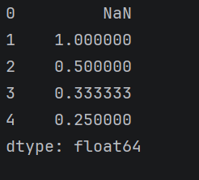
### 5.4.17、idxmax()、idxmin()
求最大值和最小值的标签
```python
import pandas as pd
s = pd.Series([1,2,3,4,5,6],index=['a','b','c','d','e','f'])
print(s.idxmax())
print(s.idxmin())
```
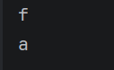
### 5.4.18、rolling()
rolling 是滑动窗，window 设大小；前几行补 NaN，逐窗算平均。
语法：
```python
s.rolling(window=窗口大小)
#常用的聚合函数
s.rolling(3).sum()    # 滑动求和
s.rolling(3).mean()   # 滑动平均
s.rolling(3).max()    # 滑动最大值
s.rolling(3).min()    # 滑动最小值
```
### 5.4.19、nlargest()、nsmallest()
找出最大或最小的几个数
```python
import pandas as pd
s = pd.Series([1,2,3,4,5,6])
print(s.nlargest(3))
print(s.nsmallest(3))
```
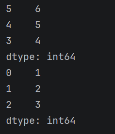
# 6、Series练习
## 6.1、学生成绩统计
创建一个包含10名学生数学成绩的Series，成绩范围在50-100之间。计算平均分、最高分、最低分，并找出高于平均分的学生人数。
```python
import pandas as pd
import numpy as np
# 随机生成成绩
np.random.seed(2026)
scores = pd.Series(
    np.random.randint(50,101,(10,)),
    index=['学生'+str(i) for i in range(1,11)]
)
print(scores)
print(f'平均分:{scores.mean()}')
print(f'最高分:{scores.max()}')
print(f'最低分:{scores.min()}')
print(f'高于平均分的人数:{scores[scores > scores.mean()].count()}')
```
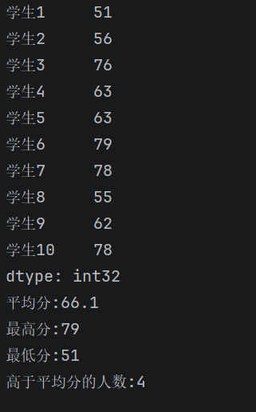
## 6.2、温度数据分析
给定某城市一周每天的最高温度Series，
```python
tempratures = pd.Series(
    [28,31,29,32,30,27,33],
    index=['周一','周二','周三','周四','周五','周六','周日']
)
```
完成以下任务：
1.找出温度超过30度的天数
2.计算平均温度
3.将温度从高到低排序
4.找出温度变化最大的两天
```python
import pandas as pd
tempratures = pd.Series(
    [28,31,29,32,30,27,33],
    index=['周一','周二','周三','周四','周五','周六','周日']
)
print(f'温度超过30度的天数:{tempratures[tempratures>30].count()}')
print(f'平均温度:{tempratures.mean()}')
print(f'温度从高到低排序:{tempratures.sort_values(ascending=False)}')
print(f'温度变化最大的两天:{tempratures.diff().abs().sort_values(ascending=False).head(2).index}')
```
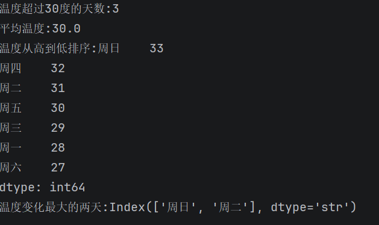
## 6.3、股票价格分析
给定某股票连续10个交易日的收盘价Series：
```python
price = pd.Series(
    [102.3,103.5,105.1,104.8,106.2,107.0,106.5,108.1,109.3,110.2],
    index=pd.date_range('2023-01-01',periods=10)
)
```
- 计算每日收益率（当日收盘价/前日收盘价 - 1）
- 找出收益率最高和最低的日期
- 计算波动率（收益率的标准差）
```python
import pandas as pd
import numpy as np
price = pd.Series(
    [102.3,103.5,105.1,104.8,106.2,107.0,106.5,108.1,109.3,110.2],
    index=pd.date_range('2023-01-01',periods=10)
)
print(f'每日收益率:{price.pct_change()}')
print(f'收益率最高和最低的日期:{price.pct_change().idxmax()},{price.pct_change().idxmin()}')
print(f'波动率:{price.pct_change().std()}')
```
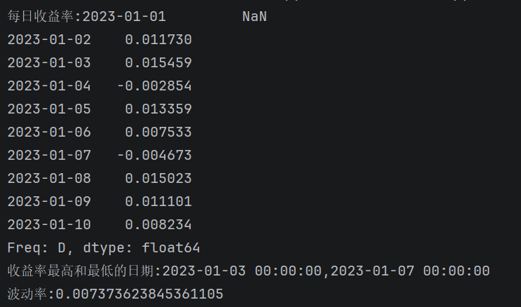
## 6.4、销售数据分析
某产品过去12个月的销售量Series：
```python
sales = pd.Series(
    [120,135,145,160,155,170,180,175,190,200,210,220],
    index=pd.date_range('2022-01-01', periods=12,freq='M')
)
```
- 计算季度平均销量（每3个月为一个季度）
```python
import pandas as pd
sales = pd.Series(
    [120,135,145,160,155,170,180,175,190,200,210,220],
    index=pd.date_range('2022-01-01', periods=12,freq='MS')
)
#季度的平均销量
print(f'季度的平均销量:{sales.resample('QS').mean()}')
```
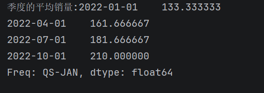
- 找出销量最高的月份
```python
print(f'销量最高的月份:{sales.idxmax()}')
```

- 计算月环比增长率
```python
print(f'月环比增长率:{sales.pct_change()}')
```
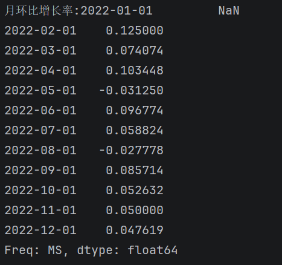
- 找出连续增长超过2个月的月份
```python
a = sales.pct_change()
b = a>0
print(b[b.rolling(3).sum()==3].keys())
```
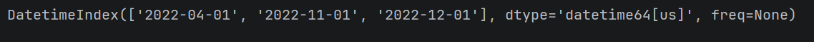
# 7、时间序列
## 7.1、pd.date_range()
生成一段时间序列
```python
pd.date_range(
    start='开始日期',
    periods=生成个数,
    freq='频率'  
    # 天(D),月末(ME)，月初(MS),小时(H),周(W)
    # 年初(YS)，年末(YE),季初(QS),季末(QE)
)
```
```python
import pandas as pd
time = pd.date_range(start='2020-04-01', periods=10, freq='D')
print(time)
```
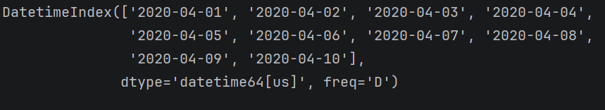
## 7.2、时间序列的标签
```python
#'年-月-日 时:分:秒'
import pandas as pd
time = pd.to_datetime('2025-01-01 00:00:00')

print(time.year)      # 年
print(time.month)     # 月
print(time.day)       # 日
print(time.hour)      # 时
print(time.minute)    # 分
print(time.second)    # 秒
print(time.weekday()) # 星期几（0=周一，6=周日）
#print(time.day_name())#英文星期几
```
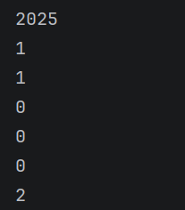
## 7.3、s.resample()
时间索引用 resample，给定频率自动分组，后面跟上聚合函数，按月按日随便收！
```python
#支持的聚合函数
.sum()    # 求和
.mean()   # 均值
.count()  # 计数
.max()    # 最大
.min()    # 最小
.last()   # 取最后一个
.first()  # 取第一个
```
```python
import pandas as pd
sales = pd.Series(
    [120,135,145,160,155,170,180,175,190,200,210,220],
    index=pd.date_range('2022-01-01', periods=12,freq='MS')
)
#季度的平均销量
print(pd.Series(sales.resample('QS')))
```
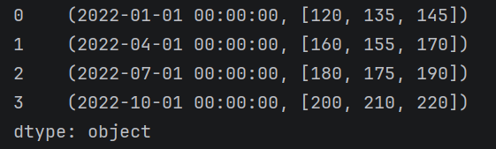
## 7.4、s.between_time()
选择在两个时间序列之间数据
语法：
```python
s.between_time(
    start_time,
    end_time,
    include_start=True,
    include_end=True
)
```
## 7.5、s.to_period()
把 时间戳（具体日期）→ 变成 周期（年月 / 季度 / 年）
```python
# 把日期转成 年月
s.dt.to_period('M')

# 转成 年
s.dt.to_period('Y')

# 转成 季度
s.dt.to_period('Q')
```
常见周期参数:
<table cellpadding="0" cellspacing="0" style="border-collapse: collapse; width: 100%; font-size: 16px; font-family: system-ui, sans-serif; text-align: center;">
  <thead>
    <tr>
      <th style="padding: 16px; border-right: 1px solid #ccc; border-bottom: 1px solid #ccc; font-weight: 600;">参数</th>
      <th style="padding: 16px; border-right: 1px solid #ccc; border-bottom: 1px solid #ccc; font-weight: 600;">含义</th>
      <th style="padding: 16px; border-bottom: 1px solid #ccc; font-weight: 600;">示例</th>
    </tr>
  </thead>
  <tbody>
    <tr>
      <td style="padding: 12px; border-right: 1px solid #ccc; border-bottom: 1px solid #ccc;">Y</td>
      <td style="padding: 12px; border-right: 1px solid #ccc; border-bottom: 1px solid #ccc;">年</td>
      <td style="padding: 12px; border-bottom: 1px solid #ccc;">2025</td>
    </tr>
    <tr>
      <td style="padding: 12px; border-right: 1px solid #ccc; border-bottom: 1px solid #ccc;">M</td>
      <td style="padding: 12px; border-right: 1px solid #ccc; border-bottom: 1px solid #ccc;">月</td>
      <td style="padding: 12px; border-bottom: 1px solid #ccc;">2025-05</td>
    </tr>
    <tr>
      <td style="padding: 12px; border-right: 1px solid #ccc; border-bottom: 1px solid #ccc;">Q</td>
      <td style="padding: 12px; border-right: 1px solid #ccc; border-bottom: 1px solid #ccc;">季度</td>
      <td style="padding: 12px; border-bottom: 1px solid #ccc;">2025Q2</td>
    </tr>
    <tr>
      <td style="padding: 12px; border-right: 1px solid #ccc; border-bottom: 1px solid #ccc;">D</td>
      <td style="padding: 12px; border-right: 1px solid #ccc; border-bottom: 1px solid #ccc;">日</td>
      <td style="padding: 12px; border-bottom: 1px solid #ccc;">2025-05-20</td>
    </tr>
    <tr>
      <td style="padding: 12px; border-right: 1px solid #ccc; border-bottom: 1px solid #ccc;">H</td>
      <td style="padding: 12px; border-right: 1px solid #ccc; border-bottom: 1px solid #ccc;">小时</td>
      <td style="padding: 12px; border-bottom: 1px solid #ccc;">2025-05-20 10</td>
    </tr>
    <tr>
      <td style="padding: 12px; border-right: 1px solid #ccc;">W</td>
      <td style="padding: 12px; border-right: 1px solid #ccc;">周</td>
      <td style="padding: 12px;">2025-02-23/2025-03-01</td>
    </tr>
  </tbody>
</table>

示例：
```python
import pandas as pd

# 日期数据
date_list = ['2025-01-15', '2025-02-20', '2025-03-10']
s = pd.Series(date_list)

# 先转成标准日期格式
s = pd.to_datetime(s)

print("原始日期：")
print(s)
#转换成年月
print(s.dt.to_period('M'))
#转换成年
print(s.dt.to_period('Y'))
#转换成季度
print(s.dt.to_period('Q'))
```
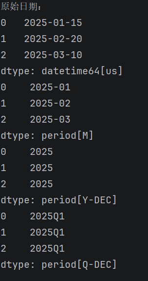
# 8、DataFrame数据类型
## 8.1、创建方法
### 8.1.1、通过Series创建
```python
import pandas as pd
import numpy as np
s1 = pd.Series([1,2,3,4,5])
s2 = pd.Series([6,7,8,9,10])
df = pd.DataFrame({'第一列':s1,'第二列':s2})
print(df)
print(type(df))
print(df['第一列'])
```
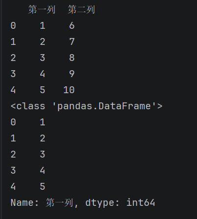
### 8.1.2、通过字典来创建
```python
import pandas as pd
import numpy as np
df = pd.DataFrame(
    {
        'id':[1,2,3,4,5],
        'name':['tom','jack','alice','bob','allen'],
        'age':[10,20,30,40,50],
        'score':[60.5,80.0,30.6,70.0,83.5]
    },
    index=[1,2,3,4,5],#改变行标签
    columns=['name','age','score']#指定哪些数据来创建DataFrame，并且可以确定列的顺序
)
print(df)
```
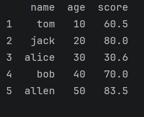
## 8.2、属性
<table cellpadding="0" cellspacing="0" style="border-collapse: collapse; width: 100%; font-size: 16px; font-family: system-ui, sans-serif; text-align: center;">
  <thead>
    <tr>
      <th style="padding: 16px; border-right: 1px solid #ccc; border-bottom: 1px solid #ccc; font-weight: 600;">属性</th>
      <th style="padding: 16px; border-bottom: 1px solid #ccc; font-weight: 600;">说明</th>
    </tr>
  </thead>
  <tbody>
    <tr>
      <td style="padding: 12px; border-right: 1px solid #ccc; border-bottom: 1px solid #ccc;">index</td>
      <td style="padding: 12px; border-bottom: 1px solid #ccc;">DataFrame的行索引</td>
    </tr>
    <tr>
      <td style="padding: 12px; border-right: 1px solid #ccc; border-bottom: 1px solid #ccc;">values</td>
      <td style="padding: 12px; border-bottom: 1px solid #ccc;">DataFrame的值</td>
    </tr>
    <tr>
      <td style="padding: 12px; border-right: 1px solid #ccc; border-bottom: 1px solid #ccc;">dtypes</td>
      <td style="padding: 12px; border-bottom: 1px solid #ccc;">DataFrame的元素类型</td>
    </tr>
    <tr>
      <td style="padding: 12px; border-right: 1px solid #ccc; border-bottom: 1px solid #ccc;">shape</td>
      <td style="padding: 12px; border-bottom: 1px solid #ccc;">DataFrame的形状</td>
    </tr>
    <tr>
      <td style="padding: 12px; border-right: 1px solid #ccc; border-bottom: 1px solid #ccc;">ndim</td>
      <td style="padding: 12px; border-bottom: 1px solid #ccc;">DataFrame的维度</td>
    </tr>
    <tr>
      <td style="padding: 12px; border-right: 1px solid #ccc; border-bottom: 1px solid #ccc;">size</td>
      <td style="padding: 12px; border-bottom: 1px solid #ccc;">DataFrame的元素个数</td>
    </tr>
    <tr>
      <td style="padding: 12px; border-right: 1px solid #ccc; border-bottom: 1px solid #ccc;">columns</td>
      <td style="padding: 12px; border-bottom: 1px solid #ccc;">DataFrame的列标签</td>
    </tr>
    <tr>
      <td style="padding: 12px; border-right: 1px solid #ccc; border-bottom: 1px solid #ccc;">loc[]</td>
      <td style="padding: 12px; border-bottom: 1px solid #ccc;">显示索引，按行列标签索引或切片</td>
    </tr>
    <tr>
      <td style="padding: 12px; border-right: 1px solid #ccc; border-bottom: 1px solid #ccc;">iloc[]</td>
      <td style="padding: 12px; border-bottom: 1px solid #ccc;">隐式索引，按行列位置索引或切片</td>
    </tr>
    <tr>
      <td style="padding: 12px; border-right: 1px solid #ccc; border-bottom: 1px solid #ccc;">at[]</td>
      <td style="padding: 12px; border-bottom: 1px solid #ccc;">使用行列标签访问单个元素</td>
    </tr>
    <tr>
      <td style="padding: 12px; border-right: 1px solid #ccc; border-bottom: 1px solid #ccc;">iat[]</td>
      <td style="padding: 12px; border-bottom: 1px solid #ccc;">使用行列位置访问单个元素</td>
    </tr>
    <tr>
      <td style="padding: 12px; border-right: 1px solid #ccc;">T</td>
      <td style="padding: 12px;">行列转置</td>
    </tr>
  </tbody>
</table>

### 8.2.1、index,columns,values
```python
print('行索引：')
print(df.index)
print('列标签：')
print(df.columns)
print('值：')
print(df.values)
```
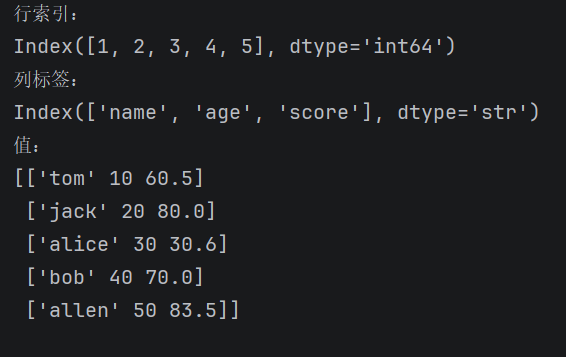
### 8.2.2、ndim,dtype,shape,size
```python
print('维度:',df.ndim)
print('数据类型:',df.dtypes)
print('形状:',df.shape)
print('元素个数:',df.size)
```
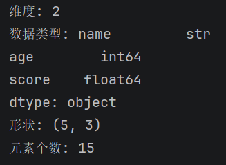
### 8.2.3、T
```python
print('转置:',df.T)
```
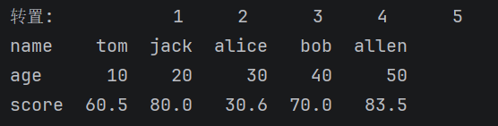
### 8.2.4、loc[],iloc[],at[],iat[]
```python
print(df.loc[1:4:2,'name':'score':1])
print(df.iloc[0:3:2,0:2:1])
print(df.at[2,'name'])
print(df.iat[0,2])
```
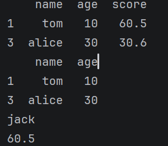
## 8.3、访问数据
### 8.3.1、获取单列数据
```python
print(df['name'])
print(type(df['name']))
print(df.name)
print(type(df.name))
```
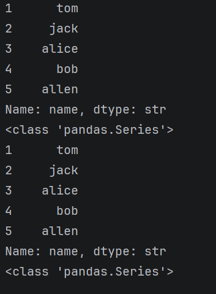
### 8.3.2、获取多列数据
```python
print(df[['name','score']])
print(type(df[['name','score']]))
```
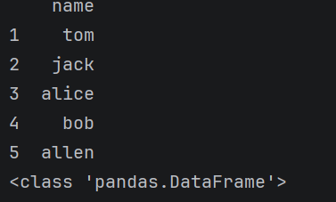
### 8.3.3、查看部分数据(head()/tail())
```python
print(df.head(2))
print(df.tail(2))
```
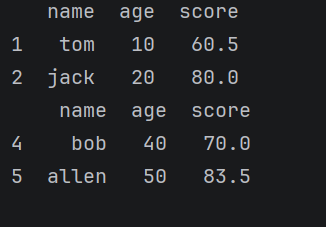
### 8.3.4、布尔索引筛选数据
```python
print(df[df.score>70])
```
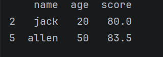
### 8.3.5、随机抽样sample()
```python
print(df.sample(2))#参数默认为1
```
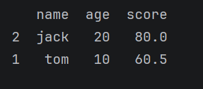
## 8.4、常用方法与统计
<table cellpadding="0" cellspacing="0" style="border-collapse: collapse; width: 100%; font-size: 16px; font-family: system-ui, sans-serif; text-align: center;">
  <thead>
    <tr>
      <th style="padding: 16px; border-right: 1px solid #ccc; border-bottom: 1px solid #ccc; font-weight: 600;">属性</th>
      <th style="padding: 16px; border-bottom: 1px solid #ccc; font-weight: 600;">说明</th>
    </tr>
  </thead>
  <tbody>
    <tr>
      <td style="padding: 12px; border-right: 1px solid #ccc; border-bottom: 1px solid #ccc;">head()</td>
      <td style="padding: 12px; border-bottom: 1px solid #ccc;">查看前n行数据，默认5行</td>
    </tr>
    <tr>
      <td style="padding: 12px; border-right: 1px solid #ccc; border-bottom: 1px solid #ccc;">tail()</td>
      <td style="padding: 12px; border-bottom: 1px solid #ccc;">查看后n行数据，默认5行</td>
    </tr>
    <tr>
      <td style="padding: 12px; border-right: 1px solid #ccc; border-bottom: 1px solid #ccc;">isin()</td>
      <td style="padding: 12px; border-bottom: 1px solid #ccc;">判断元素是否包含在参数集合中</td>
    </tr>
    <tr>
      <td style="padding: 12px; border-right: 1px solid #ccc; border-bottom: 1px solid #ccc;">isna()</td>
      <td style="padding: 12px; border-bottom: 1px solid #ccc;">判断是否为缺失值（如NaN或None）</td>
    </tr>
    <tr>
      <td style="padding: 12px; border-right: 1px solid #ccc; border-bottom: 1px solid #ccc;">sum()</td>
      <td style="padding: 12px; border-bottom: 1px solid #ccc;">求和，自动忽略缺失值</td>
    </tr>
    <tr>
      <td style="padding: 12px; border-right: 1px solid #ccc; border-bottom: 1px solid #ccc;">mean()</td>
      <td style="padding: 12px; border-bottom: 1px solid #ccc;">平均值</td>
    </tr>
    <tr>
      <td style="padding: 12px; border-right: 1px solid #ccc; border-bottom: 1px solid #ccc;">min()</td>
      <td style="padding: 12px; border-bottom: 1px solid #ccc;">最小值</td>
    </tr>
    <tr>
      <td style="padding: 12px; border-right: 1px solid #ccc; border-bottom: 1px solid #ccc;">max()</td>
      <td style="padding: 12px; border-bottom: 1px solid #ccc;">最大值</td>
    </tr>
    <tr>
      <td style="padding: 12px; border-right: 1px solid #ccc; border-bottom: 1px solid #ccc;">var()</td>
      <td style="padding: 12px; border-bottom: 1px solid #ccc;">方差</td>
    </tr>
    <tr>
      <td style="padding: 12px; border-right: 1px solid #ccc; border-bottom: 1px solid #ccc;">std()</td>
      <td style="padding: 12px; border-bottom: 1px solid #ccc;">标准差</td>
    </tr>
    <tr>
      <td style="padding: 12px; border-right: 1px solid #ccc; border-bottom: 1px solid #ccc;">median()</td>
      <td style="padding: 12px; border-bottom: 1px solid #ccc;">中位数</td>
    </tr>
    <tr>
      <td style="padding: 12px; border-right: 1px solid #ccc; border-bottom: 1px solid #ccc;">mode()</td>
      <td style="padding: 12px; border-bottom: 1px solid #ccc;">众数，可返回多个</td>
    </tr>
    <tr>
      <td style="padding: 12px; border-right: 1px solid #ccc; border-bottom: 1px solid #ccc;">quantile()</td>
      <td style="padding: 12px; border-bottom: 1px solid #ccc;">分位数，q取0~1之间</td>
    </tr>
    <tr>
      <td style="padding: 12px; border-right: 1px solid #ccc; border-bottom: 1px solid #ccc;">describe()</td>
      <td style="padding: 12px; border-bottom: 1px solid #ccc;">常见的统计信息（count,mean,std,min,25%,50%,75%,max）</td>
    </tr>
    <tr>
      <td style="padding: 12px; border-right: 1px solid #ccc; border-bottom: 1px solid #ccc;">value_counts()</td>
      <td style="padding: 12px; border-bottom: 1px solid #ccc;">每个唯一值的出现次数</td>
    </tr>
    <tr>
      <td style="padding: 12px; border-right: 1px solid #ccc; border-bottom: 1px solid #ccc;">count()</td>
      <td style="padding: 12px; border-bottom: 1px solid #ccc;">非缺失值数量</td>
    </tr>
    <tr>
      <td style="padding: 12px; border-right: 1px solid #ccc; border-bottom: 1px solid #ccc;">duplicated()</td>
      <td style="padding: 12px; border-bottom: 1px solid #ccc;">是否重复，可选参数subset=['列标签']</td>
    </tr>
    <tr>
      <td style="padding: 12px; border-right: 1px solid #ccc; border-bottom: 1px solid #ccc;">drop_duplicates()</td>
      <td style="padding: 12px; border-bottom: 1px solid #ccc;">去除重复项</td>
    </tr>
    <tr>
      <td style="padding: 12px; border-right: 1px solid #ccc; border-bottom: 1px solid #ccc;">sample()</td>
      <td style="padding: 12px; border-bottom: 1px solid #ccc;">随机抽样</td>
    </tr>
    <tr>
      <td style="padding: 12px; border-right: 1px solid #ccc; border-bottom: 1px solid #ccc;">replace()</td>
      <td style="padding: 12px; border-bottom: 1px solid #ccc;">替换值</td>
    </tr>
    <tr>
      <td style="padding: 12px; border-right: 1px solid #ccc; border-bottom: 1px solid #ccc;">sort_index()</td>
      <td style="padding: 12px; border-bottom: 1px solid #ccc;">按索引排序，ascending=False:从高到低</td>
    </tr>
    <tr>
      <td style="padding: 12px; border-right: 1px solid #ccc; border-bottom: 1px solid #ccc;">sort_values()</td>
      <td style="padding: 12px; border-bottom: 1px solid #ccc;">按值排序，by=['列标签1','列标签2']:先按列标签1排序，有相同的情况下，按列标签2排序; ascending=[False,True]:列标签1从高到低排序，'列标签2'按从低到高排序。</td>
    </tr>
    <tr>
      <td style="padding: 12px; border-right: 1px solid #ccc; border-bottom: 1px solid #ccc;">replace(a,b)</td>
      <td style="padding: 12px; border-bottom: 1px solid #ccc;">替换值,把a替换成b</td>
    </tr>
    <tr>
      <td style="padding: 12px; border-right: 1px solid #ccc; border-bottom: 1px solid #ccc;">nlargest(n,columns=['列标签1','列标签2'])</td>
      <td style="padding: 12px; border-bottom: 1px solid #ccc;">返回某列最大的n条数据,按照['列标签1','列标签2']排序</td>
    </tr>
    <tr>
      <td style="padding: 12px; border-right: 1px solid #ccc; border-bottom: 1px solid #ccc;">nsmallest()</td>
      <td style="padding: 12px; border-bottom: 1px solid #ccc;">返回某列最小的n条数据</td>
    </tr>
    <tr>
      <td style="padding: 12px; border-right: 1px solid #ccc; border-bottom: 1px solid #ccc;">cumsum()</td>
      <td style="padding: 12px; border-bottom: 1px solid #ccc;">累计和</td>
    </tr>
    <tr>
      <td style="padding: 12px; border-right: 1px solid #ccc; border-bottom: 1px solid #ccc;">cummax()</td>
      <td style="padding: 12px; border-bottom: 1px solid #ccc;">累计最大值</td>
    </tr>
    <tr>
      <td style="padding: 12px; border-right: 1px solid #ccc;">info()</td>
      <td style="padding: 12px;">df.info() 就是查看DataFrame基础信息、数据类型、有没有缺失值的最常用命令！</td>
    </tr>
  </tbody>
</table>

## 8.5、DataFrame练习
### 8.5.1、学生成绩分析
某班级的学生成绩数据如下，
```python
data = {
    '姓名':['张三','李四','王五','赵六','钱七'],
    '数学':[85,92,78,88,95],
    '英语':[90,88,85,92,80],
    '物理':[75,80,88,85,90]
}
```
- 计算每位学生的总分和平均分
- 找出数学成绩高于90分或英语成绩高于85分的学生
- 按总分从高到低排序，并输出前3名学生
```python
import pandas as pd
data = {
    '姓名':['张三','李四','王五','赵六','钱七'],
    '数学':[85,92,78,88,95],
    '英语':[90,88,85,92,80],
    '物理':[75,80,88,85,90]
}

score = pd.DataFrame(
    data
)
score['总分'] = score[['数学','英语','物理']].sum(axis=1)
score['平均分'] = score[['数学','英语','物理']].mean(axis=1).round(2)
print(score)
print(score[(score['数学']>90)|(score['英语']>85)])
print(score.sort_values('总分',ascending=False).head(3))
```
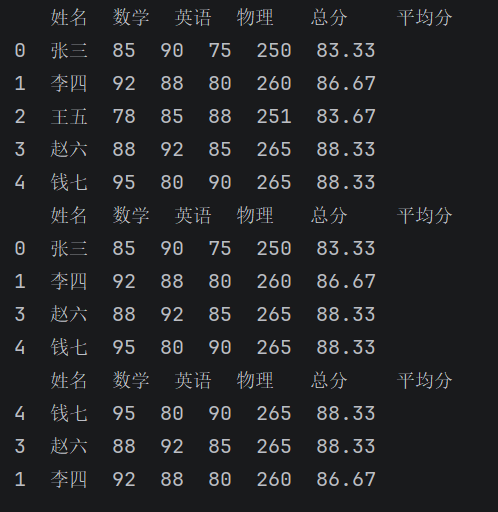
### 8.5.2、销售数据分析
某公司销售数据如下
```python
data = {
    '产品名称':['A','B','C','D'],
    '单价':[100,150,200,120],
    '销量':[50,30,20,40]
}
```
- 计算每种产品的总销售额（销售额=单价 x 销量）
- 找出销售额最高的产品
- 按销售额从高到低排序，并输出所有产品信息
```python
import pandas as pd

data = {
    '产品名称':['A','B','C','D'],
    '单价':[100,150,200,120],
    '销量':[50,30,20,40]
}
df = pd.DataFrame(
    data,
    index=data['产品名称']
).drop('产品名称',axis=1)
df['总销售额'] = df['单价']*df['销量']
print(df)
print(df['总销售额'].idxmax())
print(df.sort_values('总销售额',ascending=False))
```
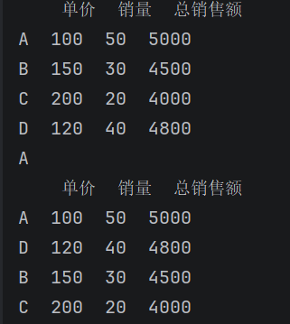
# 9、数据分析的完整流程

## 9.1、数据的导入导出
### 9.1.1、csv数据
- 数据的导入（csv文件）
```python
import pandas as pd
df = pd.read_csv('文件名')
```
- 数据的导出（csv文件）
```python
df.to_csv('文件路径')
```
### 9.1.2、JSON数据
- 数据的导入（json）
```python
import pandas as pd
import json

with open("文件名.json") as f:
    data = json.load(f)

df = pd.DataFrame(
    data['key']
)
```
## 9.2、数据清洗
### 9.2.1、缺失值的处理
- 缺失值
```python
import pandas as pd
import numpy as np
#nan:not a number
s = pd.Series([1,2,np.nan,None,pd.NA])
df = pd.DataFrame(
    [
        [1,pd.NA,2],
        [2,3,5],
        [None,4,6]
    ]
)
print(s)
print(df)
```
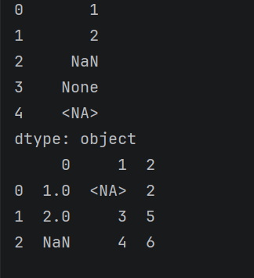
- 查看是否是缺失值
```python
print(s.isna())
print(s.isnull())
print(s.isna().sum())#查看缺失值的数量
```
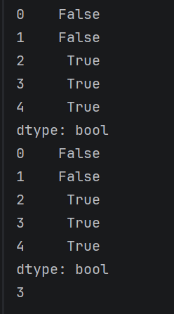
```python
print(df.isna())
print(df.isnull())
print(df.isna().sum())#sum参数axis：默认axis=0查看每列缺失值的数量，axis=1：查看每行的缺失值的数量
```
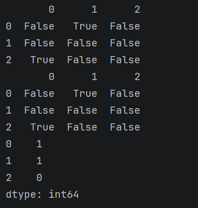
- 删除缺失值
```python
print(s)
print(s.dropna())
```
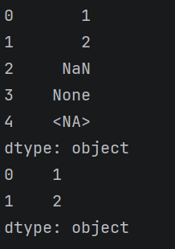
```python
print(df)
print(df.dropna())#只要有缺失值，删除这一条记录
#print(df.dropna(how='all'))#如果所有值都是缺失值，删除这一条记录
#print(df.dropna(thresh=n))#如果至少有n个值不是缺失值，那么保留这条记录
#print(df.dropna(axis=1))#删除一整列记录
#print(df.dropna(subset=['列标签']))#如果该列有缺失值，则删除这一行
```
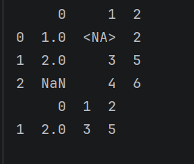
- 填充缺失值
```python
#固定值填充
df.fillna({'列标签':固定值,...})
#指定列的统计值填充
df.fillna(df[['wind']].mean())#平均值
#填充缺失值附近的值
df.ffill()#frontfill，前面的相邻值填充
df.bfill()#behindfill，后面的相邻值填充
```
### 9.2.2、重复数据处理
样例数据：
```python
import pandas as pd
import numpy as np
data = {
    'name':['alice','alice','bob','alice','jack','bob'],
    'age':[26,25,30,25,35,30],
    'city':['NY','NY','LA','NY','SF','LA']
}
df = pd.DataFrame(data)
print(df)
```
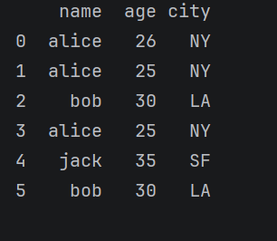
- 检查重复
```python
print(df.duplicated())#一整条记录都是一样的，标记为重复
```
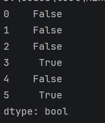
- 去重
```python
print(df.drop_duplicates())
#print(df.drop_duplicates(subset='name'))#根据指定列去重
print(df.drop_duplicates(subset='name',keep='last'))#keep保留最后一次（last）出现的行
```
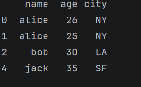
## 9.3、数据类型的转换
- `df.dtypes`:查看df的数据类型
- `df['列标签'].astype('数据类型')`：astype()转换数据类型,常用数据类型如下：
  - `int8,int16,int32,int64`
  - `float8,float16,float32,float64`
  - `category`:类别
- `Series.map(arg, na_action=None)`:map映射函数，只对Series生效（DataFrame每列都是Series）
  - `arg`：可以是字典、函数或其他可调用对象
  - `na_action`：`'ignore'` 时会跳过 `NaN`，不做处理
```python
import pandas as pd

data = {
    '产品名称':['A','B','C','D'],
    '单价':[100,150,200,120],
    '销量':[50,30,20,40]
}
df = pd.DataFrame(data).set_index('产品名称')
df['总销售额'] = df['单价'] * df['销量']

# 定义映射关系
category_map = {
    'A': '电子产品',
    'B': '家居用品',
    'C': '电子产品',
    'D': '文具用品'
}

# 新增一列
df['类别'] = df.index.map(category_map)
print(df)
```
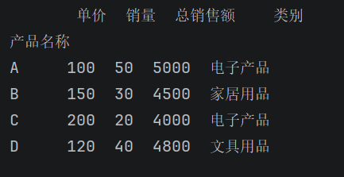
## 9.4、数据变形
样例数据：
```python
import pandas as pd
data = {
    'ID':[1,2],
    'name':['alice','bob'],
    'Math':[90,85],
    'English':[88,92],
    'Science':[95,89]
}
df = pd.DataFrame(data)
print(df)
```

### 9.4.1、转置
```python
print(df.T)
```
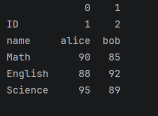
### 9.4.2、宽表转换为长表
`pd.melt()` 就是 把宽表格 → 变成长表格 的 pandas 函数！
- 宽表：科目（数学、英语、物理）都是列
- 长表：只有两列：变量(科目) + 值(分数)

原数据：

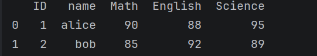

melt后：
```python
#df：宽表，id_vars:保持不动的列（标识列）,var_name:新的变量列名,value_name：新的数据列名
df2 = pd.melt(df,id_vars=['ID','name'],var_name='科目',value_name='分数')
print(df2.sort_values('name'))
```

### 9.4.3、长表转宽表
`pd.pivot()` = 长表 → 还原成宽表

原数据：

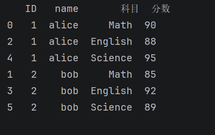

pivot后：
```python
#df2:长表,index:行索引是谁,columns:每一行变成什么列,values:单元格填什么值
df3 = pd.pivot(df2,index=['ID','name'],columns='科目',values='分数')
print(df3)
```
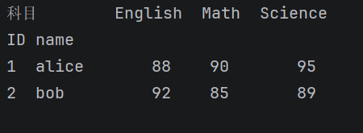
### 9.4.4、分列
-  `df['name'].str`
  - 专门处理字符串的工具
  - 必须加 .str 才能用字符串方法
- `.split(' ')`
  - 按空格把字符串切开
  - 比如 "王五 六" → ["王五","六"]
- `expand=True`（最关键！）
  - expand=True → 切完自动变成多列
  - 不加的话只会变成列表，无法拆分
- `df[['first','last']] = `
  - 把切开的两列分别赋值给 first、last

原数据：

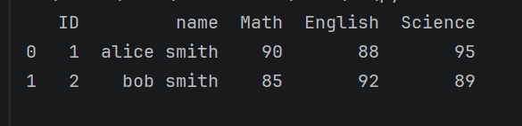

split后：
```python
#把 name 列按空格切开，分成两列，分别叫 first 和 last。
df[['first','last']] = df['name'].str.split(' ',expand=True)
print(df)
```
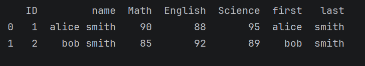
## 9.5、数据分箱
pd.cut () 就是给数值做【分段、分箱、打等级标签】的函数！
```python
pd.cut(
x,# 一维数组/Series 连续数值
bins,# 分段边界，bin为整数：分成几段，bin为列表：分段边界
labels=None,# 每段对应的文字标签
right=True,# 默认True左开右闭,False左闭右开
include_lowest=False)#是否包含最小值
```
示例：
```python
import pandas as pd

s = pd.Series([55, 72, 86, 93, 48])

# 边界：0,60,80,100
# 区间：[0,60), [60,80), [80,100]
res = pd.cut(
    s,
    bins=[0, 60, 80, 100],
    labels=['不及格','中等','优秀']
)

print(pd.DataFrame({'原始分数':s, '等级':res}))
```
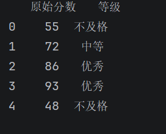
<div style="background: #fff3e6; border-radius: 8px; padding: 1em; border: 1px solid #ffd7b3;">
  <p style="margin: 0; font-size: 16px;">
    <strong>PS：</strong><br>
    字符串 --&gt; 类别（<code>astype('category')</code>） --&gt; 统计<br>
    数值 --&gt; 分箱（<code>pd.cut()</code>） --&gt; 统计
  </p>
</div>

## 9.6、其他转换
- df.rename():修改DataFrame的列标签或行标签
```python
import pandas as pd

df = pd.DataFrame(
    {
        'name':['a','b','c'],
        'age':[10,20,30],
        'gender':['male','female','male']
    }
)
df.rename(columns={'age':'年龄'},index={0:4},inplace=True)
#修改行标签和列标签也可以这样写
#df.index=[1,2,3,4]
#df.columns=['姓名','年龄','性别']
print(df)
```
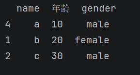
- df.set_index()
```python
import pandas as pd

df = pd.DataFrame(
    {
        'name':['a','b','c'],
        'age':[10,20,30],
        'gender':['male','female','male']
    }
)
df.set_index('name',inplace=True)
print(df)
```
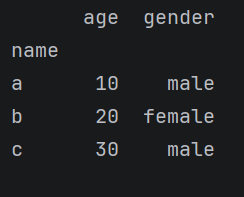
- df.reset_index()
```python
import pandas as pd

df = pd.DataFrame(
    {
        'name':['a','b','c'],
        'age':[10,20,30],
        'gender':['male','female','male']
    }
)
df.set_index('name',inplace=True)

df.reset_index(inplace=True)

print(df)
```
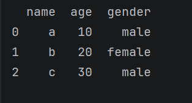
## 9.7、时间数据的处理
### 9.7.1、生成时间戳
```python
import pandas as pd
d = pd.Timestamp('2015-01-01 10:22:00')
print(d)
print(type(d))
```
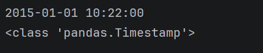
### 9.7.2、字符串转换为日期类型
```python
import pandas as pd
a = pd.to_datetime('2018-09-30 00:00:00')
print(a)
```
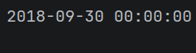
### 9.7.3、DataFrame的日期转换
```python
import pandas as pd
df = pd.DataFrame(
    {
        'sales':[100,200,300],
        'date':['20250601','20250602','20250603'],
    }
)
df['datetime'] = pd.to_datetime(df['date'])
print(df.info())
```
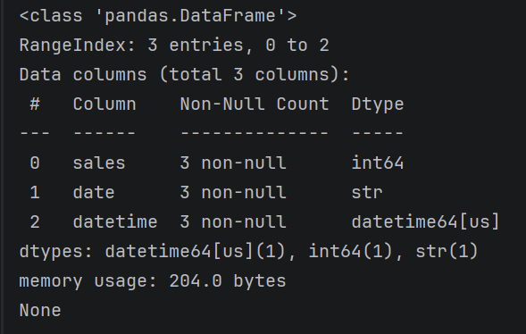
- DataFrame中的timeset操作必须中间加dt转换成Datatime类型
```python
print(df['datetime'].dt.day_name())
```
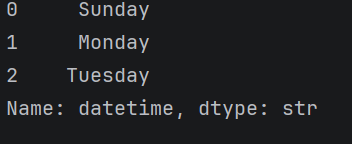
### 9.7.4、CSV中日期转换
```python
import pandas as pd
#pase_dates参数，将‘date’这列字符串解析成datetime类型
df = pd.read_csv('notes.csv',parse_dates=['date'])
print(df['date'].dt.day_name())
```
### 9.7.5、将日期数据作为索引
```python
df = df.set_index('date')#date列为时间列
```
### 9.7.6、创建时间序列
```python
days = pd.date_range('2025-07-03','2026-02-03',freq='W')#start：2025-07-03,end:2026-02-03,间隔：周
days = pd.date_range('2025-07-03',periods=10,freq='W')#start:2025-07-03,生成10个，间隔：周
```
## 9.8、分组聚合
语法：
```python
# 基础版（单字段分组 + 单字段聚合）
df.groupby(by='分组字段')['聚合字段'].聚合函数()

# 完整版（支持多分组、多聚合、自定义命名）
df.groupby(by=['分组字段1', '分组字段2'])[['聚合字段1', '聚合字段2']].agg({
    '聚合字段1': '函数1',
    '聚合字段2': ['函数2', '函数3']
})
```
<table cellpadding="0" cellspacing="0" style="border-collapse: collapse; width: 100%; font-size: 16px; font-family: system-ui, sans-serif; text-align: center;">
  <thead>
    <tr>
      <th style="padding: 16px; border-right: 1px solid #ccc; border-bottom: 1px solid #ccc; font-weight: 600;">部分</th>
      <th style="padding: 16px; border-bottom: 1px solid #ccc; font-weight: 600;">说明</th>
    </tr>
  </thead>
  <tbody>
    <tr>
      <td style="padding: 12px; border-right: 1px solid #ccc; border-bottom: 1px solid #ccc;">groupby()</td>
      <td style="padding: 12px; border-bottom: 1px solid #ccc;">分组操作，按指定列把数据分成多个小组</td>
    </tr>
    <tr>
      <td style="padding: 12px; border-right: 1px solid #ccc; border-bottom: 1px solid #ccc;">['聚合字段']</td>
      <td style="padding: 12px; border-bottom: 1px solid #ccc;">你要计算统计值的列（必须写，否则会对所有列聚合）</td>
    </tr>
    <tr>
      <td style="padding: 12px; border-right: 1px solid #ccc;">聚合函数()</td>
      <td style="padding: 12px;">对每个小组执行的计算（求和 / 均值 / 计数等）</td>
    </tr>
  </tbody>
</table>

- 常用聚合函数
  - `.sum()`     # 求和
  - `.mean()`    # 平均值
  - `.count()`   # 非空计数
  - `.size()`    # 每组行数（包含空值）
  - `.max()`     # 最大值
  - `.min()`     # 最小值
  - `.std()`     # 标准差
  - `.var()`     # 方差
  - `.nunique()` # 去重计数
示例：
```python
import pandas as pd

data = {
    '班级': ['一班', '一班', '二班', '二班', '三班'],
    '姓名': ['张三', '李四', '王五', '赵六', '钱七'],
    '分数': [90, 85, 92, 88, 95]
}
df = pd.DataFrame(data)
```
单分组+单聚合
```python
# 按班级分组，计算每个班级的总分
print(df.groupby('班级')['分数'].sum())
```
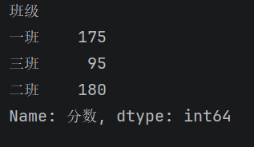

多分组+多聚合
```python
# 按班级分组，同时计算总分、平均分、最高分
print(df.groupby('班级')['分数'].agg(['sum', 'mean', 'max']))
```


多列分组 + 不同列不同聚合
```python
# 扩展数据后演示
df['年龄'] = [18,19,18,19,18]
# 按班级分组，分数求和、年龄求平均
print(df.groupby('班级').agg({'分数':'sum', '年龄':'mean'}))
```


重置索引（变成普通表格）

`groupby` 默认会把分组字段变成索引，用 `reset_index()` 还原成普通表格：
```python
# 推荐写法
result = df.groupby('班级')['分数'].sum().reset_index()
print(result)
```


查看分组
```python
print(df.groupby('班级').groups)
```


查看具体的某个分组数据
```python
print(df.groupby('班级').get_group('一班'))
```
