# 1、Pandas核心理念
- 标签化数据结构：提供带标签的轴
- 灵活处理缺失数据：内置NaN处理机制
- 智能数据对齐：自动按标签对齐数据
- 强大的IO工具：支持从CSV、Excel、SQL、JSON等20+数据源读写
- 时间序列处理：原生支持日期时间处理和频率转换
# 2、Excel、SQL和Python+Pandas对比
<table cellpadding="0" cellspacing="0" style="border-collapse: collapse; width: 100%; font-size: 16px; font-family: system-ui, sans-serif; text-align: center;">
  <thead>
    <tr>
      <th style="padding: 16px; border-right: 1px solid #ccc; border-bottom: 1px solid #ccc; font-weight: 600;">工具</th>
      <th style="padding: 16px; border-right: 1px solid #ccc; border-bottom: 1px solid #ccc; font-weight: 600;">功能特色</th>
      <th style="padding: 16px; border-bottom: 1px solid #ccc; font-weight: 600;">适用场景</th>
    </tr>
  </thead>
  <tbody>
    <tr>
      <td style="padding: 12px; border-right: 1px solid #ccc; border-bottom: 1px solid #ccc;">Excel</td>
      <td style="padding: 12px; border-right: 1px solid #ccc; border-bottom: 1px solid #ccc;">图形界面，简单上手</td>
      <td style="padding: 12px; border-bottom: 1px solid #ccc;">人工分析、小规模数据</td>
    </tr>
    <tr>
      <td style="padding: 12px; border-right: 1px solid #ccc; border-bottom: 1px solid #ccc;">SQL</td>
      <td style="padding: 12px; border-right: 1px solid #ccc; border-bottom: 1px solid #ccc;">高效读写，最终数据源</td>
      <td style="padding: 12px; border-bottom: 1px solid #ccc;">数据库查询和联表</td>
    </tr>
    <tr>
      <td style="padding: 12px; border-right: 1px solid #ccc;">Python + Pandas</td>
      <td style="padding: 12px; border-right: 1px solid #ccc;">算法和分析部署核心</td>
      <td style="padding: 12px;">数据清洗，统计分析，可视化等</td>
    </tr>
  </tbody>
</table>

# 3、Pandas学习路径
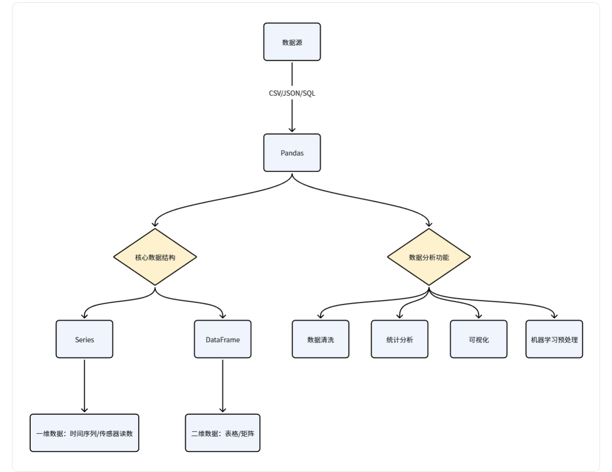
# 4、Pandas数据结构
<table cellpadding="0" cellspacing="0" style="border-collapse: collapse; width: 100%; font-size: 16px; font-family: system-ui, sans-serif; text-align: center;">
  <thead>
    <tr>
      <th style="padding: 16px; border-right: 1px solid #ccc; border-bottom: 1px solid #ccc; font-weight: 600;">特性</th>
      <th style="padding: 16px; border-right: 1px solid #ccc; border-bottom: 1px solid #ccc; font-weight: 600;">Series</th>
      <th style="padding: 16px; border-bottom: 1px solid #ccc; font-weight: 600;">DataFrame</th>
    </tr>
  </thead>
  <tbody>
    <tr>
      <td style="padding: 12px; border-right: 1px solid #ccc; border-bottom: 1px solid #ccc;">维度</td>
      <td style="padding: 12px; border-right: 1px solid #ccc; border-bottom: 1px solid #ccc;">一维</td>
      <td style="padding: 12px; border-bottom: 1px solid #ccc;">二维</td>
    </tr>
    <tr>
      <td style="padding: 12px; border-right: 1px solid #ccc; border-bottom: 1px solid #ccc;">索引</td>
      <td style="padding: 12px; border-right: 1px solid #ccc; border-bottom: 1px solid #ccc;">单索引</td>
      <td style="padding: 12px; border-bottom: 1px solid #ccc;">行索引+列名</td>
    </tr>
    <tr>
      <td style="padding: 12px; border-right: 1px solid #ccc; border-bottom: 1px solid #ccc;">数据存储</td>
      <td style="padding: 12px; border-right: 1px solid #ccc; border-bottom: 1px solid #ccc;">同质化数据类型</td>
      <td style="padding: 12px; border-bottom: 1px solid #ccc;">各列可不同数据类型</td>
    </tr>
    <tr>
      <td style="padding: 12px; border-right: 1px solid #ccc; border-bottom: 1px solid #ccc;">类比</td>
      <td style="padding: 12px; border-right: 1px solid #ccc; border-bottom: 1px solid #ccc;">Excel单列</td>
      <td style="padding: 12px; border-bottom: 1px solid #ccc;">整张Excel工作表</td>
    </tr>
    <tr>
      <td style="padding: 12px; border-right: 1px solid #ccc;">创建方式</td>
      <td style="padding: 12px; border-right: 1px solid #ccc;">pd.Series([1,2,3])</td>
      <td style="padding: 12px;">pd.DataFrame({'col':[1,2,3]})</td>
    </tr>
  </tbody>
</table>

# 5、Series数据类型
## 5.1、创建Series数据
### 5.1.1、使用列表创建Series
```python
import pandas as pd
s = pd.Series([1,2,3,4,5])
print(s)
s[6] = 6
print(s)
```
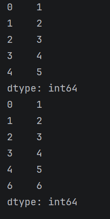
- 自定义索引
```python
import pandas as pd
# 自定义索引
s = pd.Series([1,2,3,4,5],index=[1,2,3,4,5])
print(s)
s = pd.Series([1,2,3,4,5],index=[1,2,3,4,5])
print(s)
```
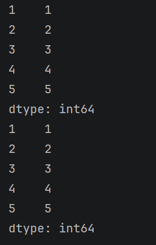
- 定义name：Series的描述
```python
import pandas as pd
# 自定义索引
s = pd.Series([1,2,3,4,5],index=[1,2,3,4,5],name='数字')
print(s)
```
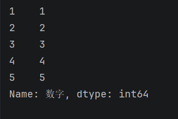
### 5.1.2、使用字典创建Series
```python
import pandas as pd
s = pd.Series({'a':1,'b':2,'c':3})
print(s)
```
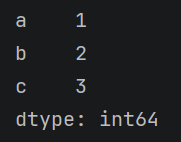
### 5.1.3、从已有的Series中选择数据建立Series
```python
import pandas as pd
s = pd.Series({'a':1,'b':2,'c':3})
s1 = pd.Series(s,index=['a','c'])
print(s1)
```
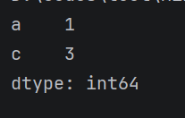
## 5.2、Series的常见属性
<table cellpadding="0" cellspacing="0" style="border-collapse: collapse; width: 100%; font-size: 16px; font-family: system-ui, sans-serif; text-align: center;">
  <thead>
    <tr>
      <th style="padding: 16px; border-right: 1px solid #ccc; border-bottom: 1px solid #ccc; font-weight: 600;">属性</th>
      <th style="padding: 16px; border-bottom: 1px solid #ccc; font-weight: 600;">说明</th>
    </tr>
  </thead>
  <tbody>
    <tr>
      <td style="padding: 12px; border-right: 1px solid #ccc; border-bottom: 1px solid #ccc;">index</td>
      <td style="padding: 12px; border-bottom: 1px solid #ccc;">Series的索引对象</td>
    </tr>
    <tr>
      <td style="padding: 12px; border-right: 1px solid #ccc; border-bottom: 1px solid #ccc;">values</td>
      <td style="padding: 12px; border-bottom: 1px solid #ccc;">Series的值</td>
    </tr>
    <tr>
      <td style="padding: 12px; border-right: 1px solid #ccc; border-bottom: 1px solid #ccc;">dtype或dtypes</td>
      <td style="padding: 12px; border-bottom: 1px solid #ccc;">Series的元素类型</td>
    </tr>
    <tr>
      <td style="padding: 12px; border-right: 1px solid #ccc; border-bottom: 1px solid #ccc;">shape</td>
      <td style="padding: 12px; border-bottom: 1px solid #ccc;">Series的形状</td>
    </tr>
    <tr>
      <td style="padding: 12px; border-right: 1px solid #ccc; border-bottom: 1px solid #ccc;">ndim</td>
      <td style="padding: 12px; border-bottom: 1px solid #ccc;">Series的维度</td>
    </tr>
    <tr>
      <td style="padding: 12px; border-right: 1px solid #ccc; border-bottom: 1px solid #ccc;">size</td>
      <td style="padding: 12px; border-bottom: 1px solid #ccc;">Series的元素个数</td>
    </tr>
    <tr>
      <td style="padding: 12px; border-right: 1px solid #ccc; border-bottom: 1px solid #ccc;">name</td>
      <td style="padding: 12px; border-bottom: 1px solid #ccc;">Series的名称</td>
    </tr>
    <tr>
      <td style="padding: 12px; border-right: 1px solid #ccc; border-bottom: 1px solid #ccc;">loc[]</td>
      <td style="padding: 12px; border-bottom: 1px solid #ccc;">显示索引，按标签索引或切片</td>
    </tr>
    <tr>
      <td style="padding: 12px; border-right: 1px solid #ccc; border-bottom: 1px solid #ccc;">iloc[]</td>
      <td style="padding: 12px; border-bottom: 1px solid #ccc;">隐式索引，按位置索引或切片</td>
    </tr>
    <tr>
      <td style="padding: 12px; border-right: 1px solid #ccc; border-bottom: 1px solid #ccc;">at[]</td>
      <td style="padding: 12px; border-bottom: 1px solid #ccc;">使用标签访问单个元素</td>
    </tr>
    <tr>
      <td style="padding: 12px; border-right: 1px solid #ccc;">iat[]</td>
      <td style="padding: 12px;">使用位置访问单个元素</td>
    </tr>
  </tbody>
</table>

### 5.2.1、index
```python
import pandas as pd
s = pd.Series({'a':1,'b':2,'c':3,'d':4,'e':5})
print(s.index)
```
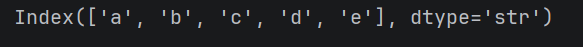
### 5.2.2、values
```python
import pandas as pd
s = pd.Series({'a':1,'b':2,'c':3,'d':4,'e':5})
print(s.values)
```
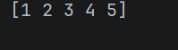
### 5.2.3、shape
```python
import pandas as pd
s = pd.Series({'a':1,'b':2,'c':3,'d':4,'e':5})
print(s.shape)
```
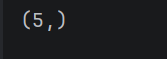
### 5.2.4、ndim
```python
import pandas as pd
s = pd.Series({'a':1,'b':2,'c':3,'d':4,'e':5})
print(s.ndim)
```

### 5.2.5、size
```python
import pandas as pd
s = pd.Series({'a':1,'b':2,'c':3,'d':4,'e':5})
print(s.size)
```

### 5.2.6、name
```python
import pandas as pd
s = pd.Series({'a':1,'b':2,'c':3,'d':4,'e':5})
s.name = 'test'
print(s.name)
```
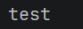
### 5.2.7、dtype
```python
import pandas as pd
s = pd.Series({'a':1,'b':2,'c':3,'d':4,'e':5})
print(s.dtype)
```
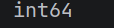
### 5.2.8、loc[]
范围：首尾都要
```python
import pandas as pd
s = pd.Series({'a':1,'b':2,'c':3,'d':4,'e':5})
print(s.loc['a'])
print(s.loc['a':'d':2])
```
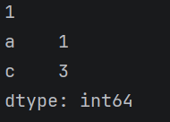
### 5.2.9、iloc[]
范围：左闭右开
```python
import pandas as pd
s = pd.Series({'a':1,'b':2,'c':3,'d':4,'e':5})
print(s.iloc[0])
print(s.iloc[0:4:2])
```
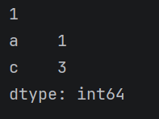
### 5.2.10、at[]
```python
import pandas as pd
s = pd.Series({'a':1,'b':2,'c':3,'d':4,'e':5})
print(s.at['a'])
```

### 5.2.11、iat[]
```python
import pandas as pd
s = pd.Series({'a':1,'b':2,'c':3,'d':4,'e':5})
print(s.iat[2])
```

## 5.3、访问Series数据
### 5.3.1、直接取用
【】里面是标签
```python
import pandas as pd
s = pd.Series({'a':1,'b':2,'c':3,'d':4,'e':5})
print(s['a'])
```

### 5.3.2、布尔索引
```python
import pandas as pd
s = pd.Series({'a':1,'b':2,'c':3,'d':4,'e':5})
print(s[s<3])
```
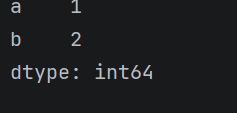
### 5.3.3、s.head（）访问
默认访问Series的前5个数据
```python
import pandas as pd
s = pd.Series({'a':1,'b':2,'c':3,'d':4,'e':5})
print(s.head())
print(s.head(3))
```
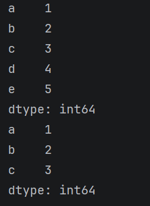
### 5.3.4、s.tail()访问
默认访问Series后5个数据
```python
import pandas as pd
s = pd.Series({'a':1,'b':2,'c':3,'d':4,'e':5})
print(s.tail())
print(s.tail(3))
```
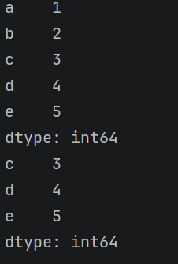
### 5.4、Series的常用方法
<table cellpadding="0" cellspacing="0" style="border-collapse: collapse; width: 100%; font-size: 16px; font-family: system-ui, sans-serif; text-align: center;">
  <thead>
    <tr>
      <th style="padding: 16px; border-right: 1px solid #ccc; border-bottom: 1px solid #ccc; font-weight: 600;">方法</th>
      <th style="padding: 16px; border-bottom: 1px solid #ccc; font-weight: 600;">说明</th>
    </tr>
  </thead>
  <tbody>
    <tr>
      <td style="padding: 12px; border-right: 1px solid #ccc; border-bottom: 1px solid #ccc;">head()</td>
      <td style="padding: 12px; border-bottom: 1px solid #ccc;">查看前n行数据，默认前5行</td>
    </tr>
    <tr>
      <td style="padding: 12px; border-right: 1px solid #ccc; border-bottom: 1px solid #ccc;">tail()</td>
      <td style="padding: 12px; border-bottom: 1px solid #ccc;">查看后n行数据，默认后5行</td>
    </tr>
    <tr>
      <td style="padding: 12px; border-right: 1px solid #ccc; border-bottom: 1px solid #ccc;">isin()</td>
      <td style="padding: 12px; border-bottom: 1px solid #ccc;">判断元素是否包含在参数集合中</td>
    </tr>
    <tr>
      <td style="padding: 12px; border-right: 1px solid #ccc; border-bottom: 1px solid #ccc;">isna()</td>
      <td style="padding: 12px; border-bottom: 1px solid #ccc;">判断是否为缺失值（如NaN或None）</td>
    </tr>
    <tr>
      <td style="padding: 12px; border-right: 1px solid #ccc; border-bottom: 1px solid #ccc;">sum()</td>
      <td style="padding: 12px; border-bottom: 1px solid #ccc;">求和，自动忽略缺失值</td>
    </tr>
    <tr>
      <td style="padding: 12px; border-right: 1px solid #ccc; border-bottom: 1px solid #ccc;">mean()</td>
      <td style="padding: 12px; border-bottom: 1px solid #ccc;">平均值</td>
    </tr>
    <tr>
      <td style="padding: 12px; border-right: 1px solid #ccc; border-bottom: 1px solid #ccc;">min()</td>
      <td style="padding: 12px; border-bottom: 1px solid #ccc;">最小值</td>
    </tr>
    <tr>
      <td style="padding: 12px; border-right: 1px solid #ccc; border-bottom: 1px solid #ccc;">max()</td>
      <td style="padding: 12px; border-bottom: 1px solid #ccc;">最大值</td>
    </tr>
    <tr>
      <td style="padding: 12px; border-right: 1px solid #ccc; border-bottom: 1px solid #ccc;">var()</td>
      <td style="padding: 12px; border-bottom: 1px solid #ccc;">方差</td>
    </tr>
    <tr>
      <td style="padding: 12px; border-right: 1px solid #ccc; border-bottom: 1px solid #ccc;">std()</td>
      <td style="padding: 12px; border-bottom: 1px solid #ccc;">标准差</td>
    </tr>
    <tr>
      <td style="padding: 12px; border-right: 1px solid #ccc; border-bottom: 1px solid #ccc;">median()</td>
      <td style="padding: 12px; border-bottom: 1px solid #ccc;">中位数</td>
    </tr>
    <tr>
      <td style="padding: 12px; border-right: 1px solid #ccc; border-bottom: 1px solid #ccc;">mode()</td>
      <td style="padding: 12px; border-bottom: 1px solid #ccc;">众数（可返回多个）</td>
    </tr>
    <tr>
      <td style="padding: 12px; border-right: 1px solid #ccc; border-bottom: 1px solid #ccc;">quantile(q)</td>
      <td style="padding: 12px; border-bottom: 1px solid #ccc;">分位数，q取0~1之间</td>
    </tr>
    <tr>
      <td style="padding: 12px; border-right: 1px solid #ccc; border-bottom: 1px solid #ccc;">describe()</td>
      <td style="padding: 12px; border-bottom: 1px solid #ccc;">常见的统计信息（count、mean、std、min、25%、50%、75%、max）</td>
    </tr>
    <tr>
      <td style="padding: 12px; border-right: 1px solid #ccc; border-bottom: 1px solid #ccc;">value_counts()</td>
      <td style="padding: 12px; border-bottom: 1px solid #ccc;">每一个唯一值出现的次数</td>
    </tr>
    <tr>
      <td style="padding: 12px; border-right: 1px solid #ccc; border-bottom: 1px solid #ccc;">count()</td>
      <td style="padding: 12px; border-bottom: 1px solid #ccc;">非缺失值数量</td>
    </tr>
    <tr>
      <td style="padding: 12px; border-right: 1px solid #ccc; border-bottom: 1px solid #ccc;">nunique()</td>
      <td style="padding: 12px; border-bottom: 1px solid #ccc;">唯一值个数（去重）</td>
    </tr>
    <tr>
      <td style="padding: 12px; border-right: 1px solid #ccc; border-bottom: 1px solid #ccc;">unique()</td>
      <td style="padding: 12px; border-bottom: 1px solid #ccc;">获取去重后的值数组</td>
    </tr>
    <tr>
      <td style="padding: 12px; border-right: 1px solid #ccc; border-bottom: 1px solid #ccc;">drop_duplicates()</td>
      <td style="padding: 12px; border-bottom: 1px solid #ccc;">去除重复项</td>
    </tr>
    <tr>
      <td style="padding: 12px; border-right: 1px solid #ccc; border-bottom: 1px solid #ccc;">sample()</td>
      <td style="padding: 12px; border-bottom: 1px solid #ccc;">随机抽样</td>
    </tr>
    <tr>
      <td style="padding: 12px; border-right: 1px solid #ccc; border-bottom: 1px solid #ccc;">sort_index()</td>
      <td style="padding: 12px; border-bottom: 1px solid #ccc;">按索引排序</td>
    </tr>
    <tr>
      <td style="padding: 12px; border-right: 1px solid #ccc; border-bottom: 1px solid #ccc;">sort_value()</td>
      <td style="padding: 12px; border-bottom: 1px solid #ccc;">按值排序</td>
    </tr>
    <tr>
      <td style="padding: 12px; border-right: 1px solid #ccc; border-bottom: 1px solid #ccc;">replace()</td>
      <td style="padding: 12px; border-bottom: 1px solid #ccc;">替换值</td>
    </tr>
    <tr>
      <td style="padding: 12px; border-right: 1px solid #ccc;">keys()</td>
      <td style="padding: 12px;">返回Series的索引对象</td>
    </tr>
  </tbody>
</table>

### 5.4.1、head（）
```python
import pandas as pd
import numpy as np
s = pd.Series([10,2,np.nan,None,3,4,5],index=['A','B','C','D','E','F','G'])
print(s.head())
```
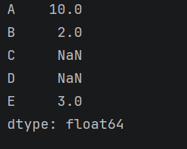
### 5.4.2、tail（）
```python
import pandas as pd
import numpy as np
s = pd.Series([10,2,np.nan,None,3,4,5],index=['A','B','C','D','E','F','G'])
print(s.tail())
```
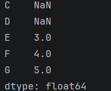
### 5.4.3、describe()
```python
import pandas as pd
import numpy as np
s = pd.Series([10,2,np.nan,None,3,4,5],index=['A','B','C','D','E','F','G'])
print(s.describe())
```
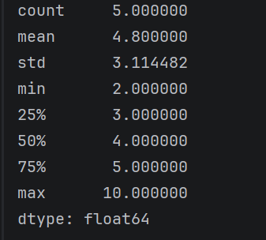
### 5.4.4、count（）
获取元素个数，忽略缺失值
```python
import pandas as pd
import numpy as np
s = pd.Series([10,2,np.nan,None,3,4,5],index=['A','B','C','D','E','F','G'])
print(s.count())
```

### 5.4.5、keys（）
等价于s.index
```python
import pandas as pd
import numpy as np
s = pd.Series([10,2,np.nan,None,3,4,5],index=['A','B','C','D','E','F','G'])
print(s.keys())
```
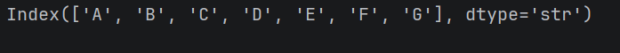
### 5.4.6、isna()
检查Series中每一个元素是否为缺失值
```python
import pandas as pd
import numpy as np
s = pd.Series([10,2,np.nan,None,3,4,5],index=['A','B','C','D','E','F','G'])
print(s.isna())
```
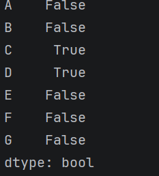
### 5.4.7、isin（）
用来检查Series每个元素是否在集合中
```python
import pandas as pd
import numpy as np
s = pd.Series([10,2,np.nan,None,3,4,5],index=['A','B','C','D','E','F','G'])
print(s.isin([4，5，6]))
```
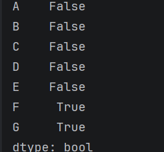
### 5.4.8、统计函数
分位数计算公式:

$$index = (n-1)*q\text{ (n为数组长度，q为分位数比例)}$$

$$index = k+f\text{ (k为整数部分，f为小数部分)}$$

$$value = x_k + f*(x_{k+1} - x_k)$$

```python
import pandas as pd
import numpy as np
s = pd.Series([10,2,np.nan,None,3,4,5],index=['A','B','C','D','E','F','G'])
print(s.mean())
print(s.std())
print(s.var())
print(s.sum())
print(s.max())
print(s.min())
print(s.quantile(.25))
print(s.quantile(.50))
print(s.quantile(.75))
print(s.median())
print(s.mode())
```
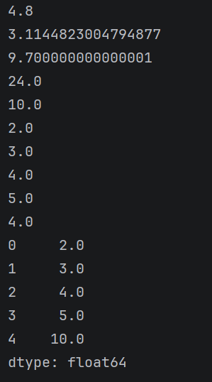
### 5.4.9、sort_values()
按值排序
```python
import pandas as pd
import numpy as np
s = pd.Series([10,2,np.nan,None,3,4,5],index=['A','B','C','D','E','F','G'])
print(s.sort_values())
```
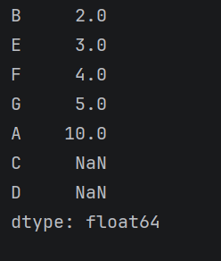
### 5.4.10、value_counts()
把Series中所有非缺失值计数
```python
import pandas as pd
import numpy as np
s = pd.Series([10,2,np.nan,None,3,4,5],index=['A','B','C','D','E','F','G'])
print(s.value_counts())
```
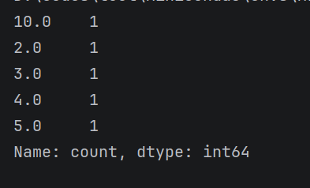
### 5.4.11、drop_duplicates()
与s.unique()作用相同，都是去重，但是s.drop_duplicates()返回的是Series数据类型，s.unique()返回的是ndarray
```python
import pandas as pd
import numpy as np
s = pd.Series([10,2,np.nan,None,3,4,5],index=['A','B','C','D','E','F','G'])
print(s.drop_duplicates())
```
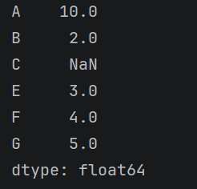
### 5.4.12、unique()
```python
import pandas as pd
import numpy as np
s = pd.Series([10,2,np.nan,None,3,4,5],index=['A','B','C','D','E','F','G'])
print(s.unique())
```
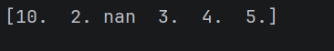
### 5.4.13、nunique()
统计去重后元素的个数
```python
import pandas as pd
import numpy as np
s = pd.Series([10,2,np.nan,None,3,4,5],index=['A','B','C','D','E','F','G'])
print(s.nunique())
```

### 5.4.13、sort_index()
按索引排序
```python
import pandas as pd
import numpy as np
s = pd.Series([10,2,np.nan,None,3,4,5],index=['A','B','C','D','E','F','G'])
print(s.sort_index())
```
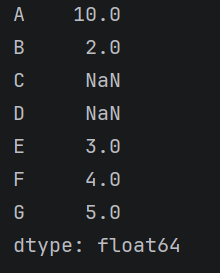
### 5.4.14、diff()
s.diff () = 后一个数 − 前一个数
常用参数：
- periods = n
  - `diff(1)`：后 − 前
  - `diff(2)`：当前 − 前两行
  - `diff(-1)`：前 − 后（往前减）
```python
import pandas as pd
s = pd.Series([1,2,3,4,5,6,7,8,9])
print(s.diff())
```
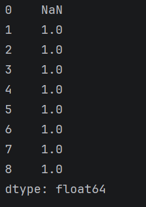
### 5.4.15、shift()
整体上下平移数据，索引不动，数值挪位置
语法：
- `s.shift(periods=1, fill_value=np.nan)`
  - `periods>0`：向下移（数据往下滚，上面补 `NaN`）
  - `periods<0`：向上移（数据往上滚，下面补 `NaN`）
  - 默认空位补 `NaN`
```python
import pandas as pd
s = pd.Series([1,2,3,4,5,6,7,8,9])
print(s)
```
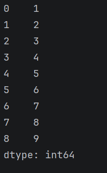
```python
print(s.shift())
```
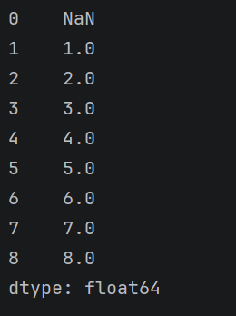
```python
print(s.shift(2))
```
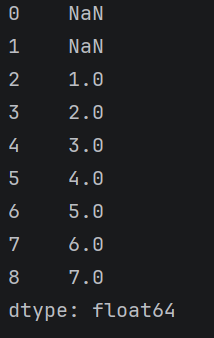
### 5.4.16、pct_change()
计算环百分比变化 =  $$\frac{\text{当前值 - 前一期值}}{前一期值}$$ = $$\frac{当前值}{前一期值}-1$$

语法：
`s.pct_change(periods=1)`