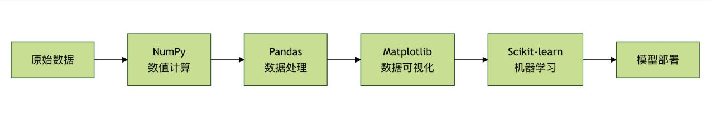

# Python 机器学习库
本章将为你详细介绍机器学习中最核心的四个Python库：NumPy、Pandas、Matplotlib 和 Scikit-learn。
**机器学习库就像一套专业的工具箱**，每个库都有特定的用途，配合使用可以完成复杂的机器学习任务。



## 四大核心库的角色
- **NumPy**：数值计算的基础，提供高效的数组操作
- **Pandas**：数据处理的利器，提供数据结构和分析工具
- **Matplotlib**：数据可视化的画笔，创建各种图表
- **scikit-learn**：机器学习的瑞士军刀，提供完整的ML工具链

# NumPy：数值计算的基础
## 什么是 NumPy？
**NumPy就像是数学计算的计算器**，但功能强大无数倍。它是 Python 科学计算的基础库，提供了高效的多维数组对象。
## NumPy 的核心概念

1. 数组（Array）

```python
# NumPy 数组基础操作
import numpy as np

# 创建数组的不同方式
print("=== NumPy 数组创建 ===")

# 从列表创建
arr1 = np.array([1, 2, 3, 4, 5])
print(f"从列表创建：{arr1}")

# 创建等差数组
arr2 = np.arange(0, 10, 2)
print(f"等差数组：{arr2}")

# 创建等间隔数组
arr3 = np.linspace(0, 1, 5)
print(f"等间隔数组：{arr3}")

# 创建特殊数组
zeros_arr = np.zeros((2,3))
ones_arr = np.ones((2,3))
identity_arr = np.eye(3)

print(f"零数组：\n{zeros_arr}")
print(f"一数组：\n{ones_arr}")
print(f"单位矩阵：\n{identity_arr}")
```

2. 数组操作

```python
# 数组的基本操作
print("\n=== 数组基本操作 ===")

# 数组属性
arr = np.array([[1, 2, 3], [4, 5, 6]])
print(f"数组：\n{arr}")
print(f"形状：{arr.shape}")
print(f"维度：{arr.ndim}")
print(f"元素个数：{arr.size}")
print(f"数据类型：{arr.dtype}")

# 数组索引和切片
print(f"第一行：{arr[0]}")
print(f"第一列：{arr[:, 0]}")
print(f"元素[1,2]：{arr[1, 2]}")

# 数组运算
arr1 = np.array([1, 2, 3])
arr2 = np.array([4, 5, 6])

print(f"加法：{arr1 + arr2}")
print(f"乘法：{arr1 * arr2}")
print(f"点积：{np.dot(arr1, arr2)}")

# 统计函数
data = np.array([1, 2, 3, 4, 5, 6, 7, 8, 9, 10])
print(f"均值：{np.mean(data)}")
print(f"标准差：{np.std(data)}")
print(f"最大值：{np.max(data)}")
print(f"最小值：{np.min(data)}")
print(f"中位数：{np.median(data)}")
```

**NumPy 实际应用示例**

```python
# NumPy 实际应用：简单线性回归
def numpy_linear_regression():
    """使用 NumPy 实现简单线性回归"""
    
    # 生成示例数据
    np.random.seed(42)
    X = 2 * np.random.rand(100, 1)  # 特征
    y = 4 + 3 * X + np.random.randn(100, 1)  # 标签 + 噪声
    
    # 添加 x0 = 1 到 X
    X_b = np.c_[np.ones((100, 1)), X]  # 添加偏置项
    
    # 使用正规方程求解：θ = (X^T * X)^(-1) * X^T * y
    theta_best = np.linalg.inv(X_b.T.dot(X_b)).dot(X_b.T).dot(y)
    
    print("=== NumPy 线性回归示例 ===")
    print(f"学习到的参数：截距={theta_best[0][0]:.2f}, 斜率={theta_best[1][0]:.2f}")
    
    # 预测
    X_new = np.array([[0], [2]])
    X_new_b = np.c_[np.ones((2, 1)), X_new]
    y_predict = X_new_b.dot(theta_best)
    
    print(f"预测结果：X=0 时 y={y_predict[0][0]:.2f}, X=2 时 y={y_predict[1][0]:.2f}")
    
    return theta_best, X, y

# 运行示例
theta, X, y = numpy_linear_regression()
```

# Pandas：数据处理的利器
## 什么是 Pandas？
**Pandas 就像是数据处理的瑞士军刀**，提供了强大的数据结构和数据分析工具，特别适合处理表格性数据。
## Pandas 的核心数据结构

1. Series（一维数据）

```python
# Pandas Series 基础操作
import pandas as pd

print("=== Pandas Series ===")

# 从列表创建 Series
s1 = pd.Series([1, 2, 3, 4, 5])
print(f"从列表创建：\n{s1}")

# 带索引的 Series
s2 = pd.Series([10, 20, 30], index=['a', 'b', 'c'])
print(f"\n带索引的 Series：\n{s2}")

# 从字典创建 Series
s3 = pd.Series({'数学': 90, '英语': 85, '物理': 88})
print(f"\n从字典创建：\n{s3}")

# Series 操作
print(f"\n访问元素：s2['b'] = {s2['b']}")
print(f"切片：s2[0:2] =\n{s2[0:2]}")
print(f"统计信息：\n{s2.describe()}")
```

2. DataFrame（二维数据）

```python
# Pandas DataFrame 基础操作
print("\n=== Pandas DataFrame ===")

# 创建 DataFrame
data = {
    '姓名': ['张三', '李四', '王五', '赵六'],
    '年龄': [25, 30, 35, 28],
    '城市': ['北京', '上海', '广州', '深圳'],
    '薪资': [15000, 20000, 18000, 22000]
}

df = pd.DataFrame(data)
print("原始 DataFrame：")
print(df)

# DataFrame 基本操作
print(f"\nDataFrame 形状：{df.shape}")
print(f"\n列名：{list(df.columns)}")
print(f"\n数据类型：\n{df.dtypes}")

# 选择数据
print(f"\n选择'姓名'列：\n{df['姓名']}")
print(f"\n选择前两行：\n{df.head(2)}")
print(f"\n选择年龄大于28的行：\n{df[df['年龄'] > 28]}")

# 统计信息
print(f"\n数值列的统计信息：\n{df.describe()}")

# 添加新列
df['年薪'] = df['薪资'] * 12
print(f"\n添加年薪列后：\n{df}")
```

**Pandas 数据处理示例**

```python
# Pandas 数据处理完整示例
def pandas_data_processing():
    """演示 Pandas 数据处理的完整流程"""
    
    print("=== Pandas 数据处理示例 ===")
    
    # 1. 创建示例数据
    np.random.seed(42)
    n_samples = 1000
    
    data = {
        '学生ID': range(1, n_samples + 1),
        '姓名': [f'学生{i}' for i in range(1, n_samples + 1)],
        '年龄': np.random.randint(18, 25, n_samples),
        '性别': np.random.choice(['男', '女'], n_samples),
        '数学成绩': np.random.normal(75, 15, n_samples),
        '英语成绩': np.random.normal(80, 12, n_samples),
        '物理成绩': np.random.normal(72, 18, n_samples),
        '班级': np.random.choice(['一班', '二班', '三班'], n_samples)
    }
    
    df = pd.DataFrame(data)
    
    # 2. 数据清洗
    print("原始数据形状：", df.shape)
    
    # 处理异常值（成绩应在 0-100 之间）
    score_columns = ['数学成绩', '英语成绩', '物理成绩']
    for col in score_columns:
        df[col] = df[col].clip(0, 100)
    
    # 3. 特征工程
    # 计算总分和平均分
    df['总分'] = df[score_columns].sum(axis=1)
    df['平均分'] = df[score_columns].mean(axis=1)
    
    # 添加等级
    def get_grade(score):
        if score >= 90:
            return 'A'
        elif score >= 80:
            return 'B'
        elif score >= 70:
            return 'C'
        elif score >= 60:
            return 'D'
        else:
            return 'F'
    
    df['等级'] = df['平均分'].apply(get_grade)
    
    # 4. 数据分析
    print("\n=== 数据分析结果 ===")
    
    # 基本统计
    print("各科平均分：")
    print(df[score_columns].mean())
    
    # 按班级分析
    print("\n各班级平均分：")
    class_avg = df.groupby('班级')['平均分'].mean()
    print(class_avg)
    
    # 按性别分析
    print("\n性别分布：")
    gender_count = df['性别'].value_counts()
    print(gender_count)
    
    # 等级分布
    print("\n等级分布：")
    grade_dist = df['等级'].value_counts().sort_index()
    print(grade_dist)
    
    # 5. 数据筛选
    print("\n=== 特定数据筛选 ===")
    
    # 优秀学生（平均分 > 85）
    excellent_students = df[df['平均分'] > 85].head(5)
    print("优秀学生（前5名）：")
    print(excellent_students[['姓名', '平均分', '等级']])
    
    # 各班级最高分学生
    print("\n各班级最高分学生：")
    top_students = df.loc[df.groupby('班级')['平均分'].idxmax()]
    print(top_students[['班级', '姓名', '平均分']])
    
    return df

# 运行示例
student_df = pandas_data_processing()
```

# Matplotlib：数据可视化的画笔
## 什么是 Matplotlib？
**Matplotlib 就像是数据艺术家的画笔**，可以将枯燥的数据转换成直观的图表，帮助我们理解数据中的模式和关系。
## Matplotlib 基础图标

```python
# Matplotlib 基础图表示例
import matplotlib.pyplot as plt
import numpy as np

# 设置中文字体（防止中文显示为方框）
plt.rcParams['font.sans-serif'] = ['SimHei', 'Arial Unicode MS']
plt.rcParams['axes.unicode_minus'] = False

def matplotlib_basic_charts():
    """演示 Matplotlib 基础图表"""
    
    print("=== Matplotlib 基础图表示例 ===")
    
    # 1. 折线图
    plt.figure(figsize=(12, 8))
    
    plt.subplot(2, 3, 1)
    x = np.linspace(0, 10, 100)
    y1 = np.sin(x)
    y2 = np.cos(x)
    plt.plot(x, y1, label='sin(x)')
    plt.plot(x, y2, label='cos(x)')
    plt.title('三角函数')
    plt.xlabel('x')
    plt.ylabel('y')
    plt.legend()
    plt.grid(True)
    
    # 2. 散点图
    plt.subplot(2, 3, 2)
    np.random.seed(42)
    x = np.random.randn(100)
    y = 2 * x + np.random.randn(100) * 0.5
    plt.scatter(x, y, alpha=0.6, c='blue')
    plt.title('散点图')
    plt.xlabel('X')
    plt.ylabel('Y')
    
    # 3. 柱状图
    plt.subplot(2, 3, 3)
    categories = ['A', 'B', 'C', 'D', 'E']
    values = [23, 45, 56, 78, 32]
    plt.bar(categories, values, color=['red', 'green', 'blue', 'orange', 'purple'])
    plt.title('柱状图')
    plt.xlabel('类别')
    plt.ylabel('数值')
    
    # 4. 直方图
    plt.subplot(2, 3, 4)
    data = np.random.normal(100, 15, 1000)
    plt.hist(data, bins=30, alpha=0.7, color='skyblue', edgecolor='black')
    plt.title('直方图')
    plt.xlabel('数值')
    plt.ylabel('频数')
    
    # 5. 饼图
    plt.subplot(2, 3, 5)
    sizes = [30, 25, 20, 15, 10]
    labels = ['A', 'B', 'C', 'D', 'E']
    colors = ['gold', 'lightcoral', 'lightskyblue', 'lightgreen', 'plum']
    plt.pie(sizes, labels=labels, colors=colors, autopct='%1.1f%%', startangle=90)
    plt.title('饼图')
    
    # 6. 箱线图
    plt.subplot(2, 3, 6)
    data1 = np.random.normal(0, 1, 100)
    data2 = np.random.normal(2, 1, 100)
    data3 = np.random.normal(-2, 1, 100)
    plt.boxplot([data1, data2, data3], labels=['组1', '组2', '组3'])
    plt.title('箱线图')
    plt.ylabel('数值')
    
    plt.tight_layout()
    plt.show()
    
    print("图表已显示！")

# 运行示例
matplotlib_basic_charts()
```

**高级可视化示例**

```python
# 高级可视化示例
def advanced_visualization():
    """演示高级可视化技巧"""
    
    print("=== 高级可视化示例 ===")
    
    # 创建更复杂的数据
    np.random.seed(42)
    n_points = 200
    
    # 生成相关数据
    x = np.random.randn(n_points)
    y = 2 * x + np.random.randn(n_points) * 0.5
    colors = np.random.rand(n_points)
    sizes = 1000 * np.random.rand(n_points)
    
    # 1. 气泡图
    plt.figure(figsize=(15, 5))
    
    plt.subplot(1, 3, 1)
    scatter = plt.scatter(x, y, c=colors, s=sizes, alpha=0.6, cmap='viridis')
    plt.colorbar(scatter, label='颜色值')
    plt.title('气泡图')
    plt.xlabel('X')
    plt.ylabel('Y')
    
    # 2. 热力图
    plt.subplot(1, 3, 2)
    data = np.random.randn(10, 10)
    im = plt.imshow(data, cmap='coolwarm', aspect='auto')
    plt.colorbar(im, label='数值')
    plt.title('热力图')
    
    # 3. 子图组合
    plt.subplot(1, 3, 3)
    
    # 创建子图
    gs = plt.GridSpec(2, 2, subplot_kw={'projection': 'polar'})
    
    ax1 = plt.subplot(gs[0, 0])
    theta = np.linspace(0, 2*np.pi, 100)
    r = np.sin(3*theta)
    ax1.plot(theta, r)
    ax1.set_title('极坐标图')
    
    ax2 = plt.subplot(gs[0, 1])
    categories = ['A', 'B', 'C', 'D']
    values = [15, 30, 45, 10]
    ax2.bar(categories, values)
    ax2.set_title('柱状图')
    
    ax3 = plt.subplot(gs[1, :])
    x_line = np.linspace(0, 10, 100)
    y_line1 = np.sin(x_line)
    y_line2 = np.cos(x_line)
    ax3.plot(x_line, y_line1, label='sin')
    ax3.plot(x_line, y_line2, label='cos')
    ax3.set_title('组合图')
    ax3.legend()
    
    plt.tight_layout()
    plt.show()
    
    print("高级图表已显示！")

# 运行示例
advanced_visualization()
```

# Scikit-learn：机器学习的瑞士军刀
## 什么是 Scikit-learn？
**Scikit-learn 就像是机器学习的工具箱**，提供了从数据预处理到模型训练、评估的完整工具链，是 Python 机器学习的事实标准。
## Scikit-learn 核心功能

```python
# Scikit-learn 核心功能示例
from sklearn.datasets import make_classification, load_iris
from sklearn.model_selection import train_test_split
from sklearn.preprocessing import StandardScaler, LabelEncoder
from sklearn.linear_model import LogisticRegression
from sklearn.ensemble import RandomForestClassifier
from sklearn.svm import SVC
from sklearn.metrics import accuracy_score, classification_report, confusion_matrix

def scikit_learn_basics():
    """演示 Scikit-learn 的核心功能"""
    
    print("=== Scikit-learn 核心功能示例 ===")
    
    # 1. 数据生成
    X, y = make_classification(
        n_samples=1000, 
        n_features=20, 
        n_classes=3, 
        n_informative=15,
        random_state=42
    )
    
    print(f"数据形状：X={X.shape}, y={y.shape}")
    print(f"类别分布：{np.bincount(y)}")
    
    # 2. 数据划分
    X_train, X_test, y_train, y_test = train_test_split(
        X, y, test_size=0.2, random_state=42, stratify=y
    )
    
    print(f"训练集大小：{X_train.shape[0]}")
    print(f"测试集大小：{X_test.shape[0]}")
    
    # 3. 数据预处理
    scaler = StandardScaler()
    X_train_scaled = scaler.fit_transform(X_train)
    X_test_scaled = scaler.transform(X_test)
    
    print("数据标准化完成")
    
    # 4. 模型训练和比较
    models = {
        '逻辑回归': LogisticRegression(random_state=42),
        '随机森林': RandomForestClassifier(n_estimators=100, random_state=42),
        '支持向量机': SVC(random_state=42)
    }
    
    results = {}
    
    for name, model in models.items():
        print(f"\n训练 {name}...")
        
        # 训练模型
        model.fit(X_train_scaled, y_train)
        
        # 预测
        y_pred = model.predict(X_test_scaled)
        
        # 评估
        accuracy = accuracy_score(y_test, y_pred)
        results[name] = accuracy
        
        print(f"{name} 准确率：{accuracy:.4f}")
        print(f"分类报告：\n{classification_report(y_test, y_pred)}")
    
    # 5. 结果比较
    print("\n=== 模型比较 ===")
    for name, accuracy in results.items():
        print(f"{name}: {accuracy:.4f}")
    
    best_model = max(results, key=results.get)
    print(f"\n最佳模型：{best_model}")
    
    return models[best_model]

# 运行示例
best_model = scikit_learn_basics()
```

## 完整的机器学习流程

```python
# 完整的机器学习流程示例
def complete_ml_pipeline():
    """演示完整的机器学习流程"""
    
    print("=== 完整机器学习流程 ===")
    
    # 1. 加载数据
    iris = load_iris()
    X = iris.data
    y = iris.target
    feature_names = iris.feature_names
    target_names = iris.target_names
    
    print(f"数据集：{iris.DESCR.split('\n')[0]}")
    print(f"特征数量：{len(feature_names)}")
    print(f"类别数量：{len(target_names)}")
    
    # 2. 数据探索
    df = pd.DataFrame(X, columns=feature_names)
    df['target'] = y
    
    print("\n数据预览：")
    print(df.head())
    
    print("\n数据统计：")
    print(df.describe())
    
    # 3. 数据可视化
    plt.figure(figsize=(12, 4))
    
    plt.subplot(1, 2, 1)
    for i, target_name in enumerate(target_names):
        plt.scatter(
            df[df['target'] == i]['sepal length (cm)'],
            df[df['target'] == i]['sepal width (cm)'],
            label=target_name
        )
    plt.xlabel('花萼长度')
    plt.ylabel('花萼宽度')
    plt.title('花萼尺寸分布')
    plt.legend()
    
    plt.subplot(1, 2, 2)
    for i, target_name in enumerate(target_names):
        plt.scatter(
            df[df['target'] == i]['petal length (cm)'],
            df[df['target'] == i]['petal width (cm)'],
            label=target_name
        )
    plt.xlabel('花瓣长度')
    plt.ylabel('花瓣宽度')
    plt.title('花瓣尺寸分布')
    plt.legend()
    
    plt.tight_layout()
    plt.show()
    
    # 4. 数据准备
    X_train, X_test, y_train, y_test = train_test_split(
        X, y, test_size=0.3, random_state=42, stratify=y
    )
    
    # 5. 模型训练
    from sklearn.ensemble import RandomForestClassifier
    model = RandomForestClassifier(n_estimators=100, random_state=42)
    model.fit(X_train, y_train)
    
    # 6. 模型评估
    y_pred = model.predict(X_test)
    accuracy = accuracy_score(y_test, y_pred)
    
    print(f"\n模型准确率：{accuracy:.4f}")
    print("\n混淆矩阵：")
    print(confusion_matrix(y_test, y_pred))
    print("\n分类报告：")
    print(classification_report(y_test, y_pred, target_names=target_names))
    
    # 7. 特征重要性
    feature_importance = model.feature_importances_
    feature_df = pd.DataFrame({
        '特征': feature_names,
        '重要性': feature_importance
    }).sort_values('重要性', ascending=False)
    
    print("\n特征重要性：")
    print(feature_df)
    
    # 8. 特征重要性可视化
    plt.figure(figsize=(8, 4))
    plt.bar(feature_df['特征'], feature_df['重要性'])
    plt.title('特征重要性')
    plt.xlabel('特征')
    plt.ylabel('重要性')
    plt.xticks(rotation=45)
    plt.tight_layout()
    plt.show()
    
    return model, feature_df

# 运行示例
trained_model, feature_importance = complete_ml_pipeline()
```

# 四库协同工作示例

```python
# 四库协同工作：完整的机器学习项目
def four_libraries_integration():
    """演示 NumPy、Pandas、Matplotlib、Scikit-learn 的协同工作"""
    
    print("=== 四库协同工作示例 ===")
    
    # 1. NumPy：生成模拟数据
    np.random.seed(42)
    n_samples = 500
    
    # 生成特征
    study_hours = np.random.uniform(1, 10, n_samples)  # 学习时间
    sleep_hours = np.random.uniform(5, 9, n_samples)   # 睡眠时间
    practice_tests = np.random.randint(0, 20, n_samples) # 练习题数量
    
    # 生成标签（考试成绩），基于特征的线性组合加噪声
    exam_scores = (
        5 * study_hours + 
        3 * sleep_hours + 
        2 * practice_tests + 
        np.random.normal(0, 10, n_samples)
    )
    
    # 确保分数在 0-100 范围内
    exam_scores = np.clip(exam_scores, 0, 100)
    
    # 2. Pandas：创建数据框并进行数据处理
    df = pd.DataFrame({
        '学习时间': study_hours,
        '睡眠时间': sleep_hours,
        '练习题数': practice_tests,
        '考试成绩': exam_scores
    })
    
    # 添加等级列
    df['等级'] = pd.cut(df['考试成绩'], 
                       bins=[0, 60, 70, 80, 90, 100], 
                       labels=['F', 'D', 'C', 'B', 'A'])
    
    print("数据预览：")
    print(df.head())
    print(f"\n数据形状：{df.shape}")
    print(f"\n等级分布：")
    print(df['等级'].value_counts().sort_index())
    
    # 3. Matplotlib：数据可视化
    plt.figure(figsize=(15, 10))
    
    # 子图1：特征分布
    plt.subplot(2, 3, 1)
    df[['学习时间', '睡眠时间', '练习题数']].hist(bins=20, ax=plt.gca())
    plt.title('特征分布')
    
    # 子图2：成绩分布
    plt.subplot(2, 3, 2)
    plt.hist(df['考试成绩'], bins=20, alpha=0.7, color='skyblue')
    plt.title('考试成绩分布')
    plt.xlabel('分数')
    plt.ylabel('频数')
    
    # 子图3：学习时间 vs 成绩
    plt.subplot(2, 3, 3)
    plt.scatter(df['学习时间'], df['考试成绩'], alpha=0.6)
    plt.xlabel('学习时间')
    plt.ylabel('考试成绩')
    plt.title('学习时间与成绩关系')
    
    # 子图4：睡眠时间 vs 成绩
    plt.subplot(2, 3, 4)
    plt.scatter(df['睡眠时间'], df['考试成绩'], alpha=0.6, color='orange')
    plt.xlabel('睡眠时间')
    plt.ylabel('考试成绩')
    plt.title('睡眠时间与成绩关系')
    
    # 子图5：练习题数 vs 成绩
    plt.subplot(2, 3, 5)
    plt.scatter(df['练习题数'], df['考试成绩'], alpha=0.6, color='green')
    plt.xlabel('练习题数')
    plt.ylabel('考试成绩')
    plt.title('练习题数与成绩关系')
    
    # 子图6：等级分布饼图
    plt.subplot(2, 3, 6)
    grade_counts = df['等级'].value_counts()
    plt.pie(grade_counts.values, labels=grade_counts.index, autopct='%1.1f%%')
    plt.title('等级分布')
    
    plt.tight_layout()
    plt.show()
    
    # 4. Scikit-learn：机器学习建模
    from sklearn.linear_model import LinearRegression
    from sklearn.ensemble import RandomForestRegressor
    from sklearn.metrics import mean_squared_error, r2_score
    
    # 准备数据
    X = df[['学习时间', '睡眠时间', '练习题数']]
    y = df['考试成绩']
    
    X_train, X_test, y_train, y_test = train_test_split(
        X, y, test_size=0.2, random_state=42
    )
    
    # 训练线性回归模型
    lr_model = LinearRegression()
    lr_model.fit(X_train, y_train)
    lr_pred = lr_model.predict(X_test)
    lr_mse = mean_squared_error(y_test, lr_pred)
    lr_r2 = r2_score(y_test, lr_pred)
    
    # 训练随机森林模型
    rf_model = RandomForestRegressor(n_estimators=100, random_state=42)
    rf_model.fit(X_train, y_train)
    rf_pred = rf_model.predict(X_test)
    rf_mse = mean_squared_error(y_test, rf_pred)
    rf_r2 = r2_score(y_test, rf_pred)
    
    # 模型比较
    print("\n=== 模型比较 ===")
    print(f"线性回归：MSE={lr_mse:.2f}, R²={lr_r2:.4f}")
    print(f"随机森林：MSE={rf_mse:.2f}, R²={rf_r2:.4f}")
    
    # 线性回归系数
    print(f"\n线性回归系数：")
    for feature, coef in zip(X.columns, lr_model.coef_):
        print(f"{feature}: {coef:.2f}")
    
    # 随机森林特征重要性
    print(f"\n随机森林特征重要性：")
    for feature, importance in zip(X.columns, rf_model.feature_importances_):
        print(f"{feature}: {importance:.4f}")
    
    # 预测结果可视化
    plt.figure(figsize=(12, 5))
    
    plt.subplot(1, 2, 1)
    plt.scatter(y_test, lr_pred, alpha=0.6)
    plt.plot([y_test.min(), y_test.max()], [y_test.min(), y_test.max()], 'r--')
    plt.xlabel('真实成绩')
    plt.ylabel('预测成绩')
    plt.title('线性回归预测结果')
    
    plt.subplot(1, 2, 2)
    plt.scatter(y_test, rf_pred, alpha=0.6)
    plt.plot([y_test.min(), y_test.max()], [y_test.min(), y_test.max()], 'r--')
    plt.xlabel('真实成绩')
    plt.ylabel('预测成绩')
    plt.title('随机森林预测结果')
    
    plt.tight_layout()
    plt.show()
    
    return {
        'data': df,
        'linear_model': lr_model,
        'rf_model': rf_model,
        'linear_metrics': {'mse': lr_mse, 'r2': lr_r2},
        'rf_metrics': {'mse': rf_mse, 'r2': rf_r2}
    }

# 运行完整示例
results = four_libraries_integration()
```