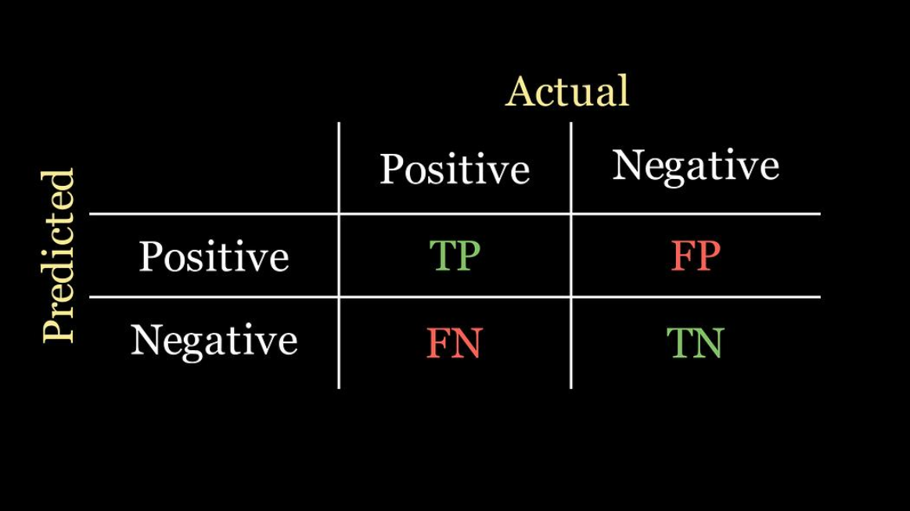
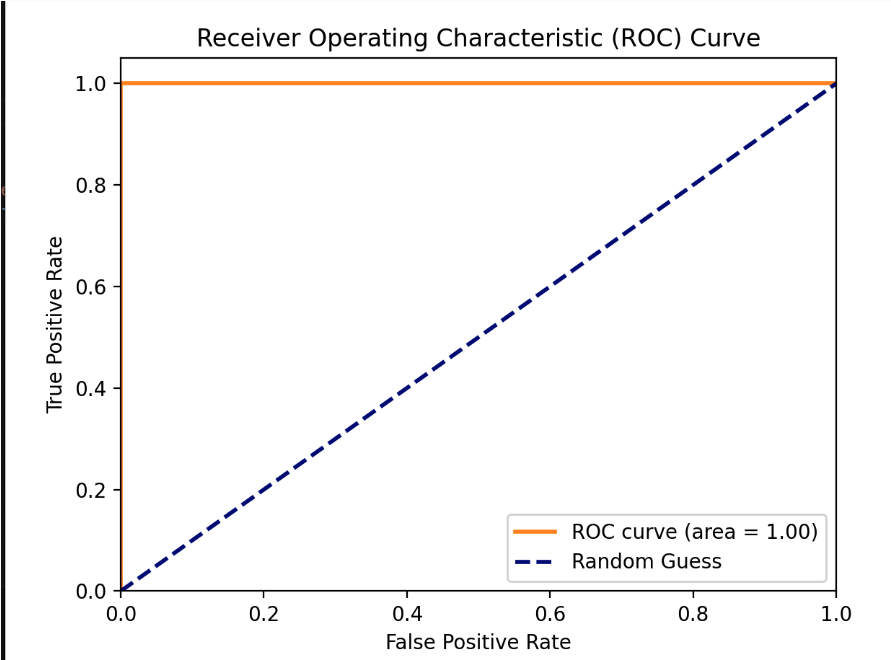
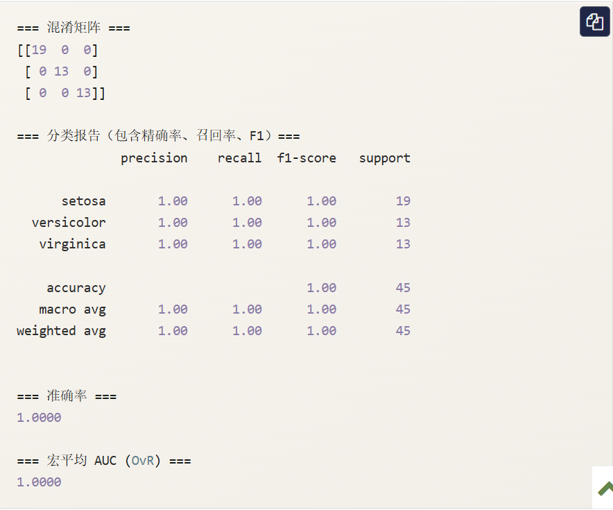

# 分类指标
在机器学习的世界里，构建一个分类模型只是第一步。就像一位医生不能仅凭感觉判断病情，我们也需要一套科学的**体检指标**来评估模型的健康状况。这些指标就是**分类指标**，它们能告诉我们模型预测得有多准、哪里做得好、哪里还有不足。
今天，我们将一起学习这些至关重要的评估工具。

---

# 为什么需要分类指标？
想象一下，你训练了一个模型来识别邮件是否为垃圾邮件。模型对100封邮件进行了预测，你可能会问：

- “它预测对了多少封？” --> 这引出了**准确率**。
- “在真正的垃圾邮件中，他找出了多少？” --> 这引出了**召回率**。
- “他说是垃圾邮件的，有多少真的是垃圾？” --> 这引出了**精确率**。

如果只用对了多少来评判，就像只用考试总分评价学生，会忽略很多重要信息。不同的业务场景关注的重点不同：

- **疾病诊断**：我们更关心别漏掉任何一个病人（高召回率），哪怕多检查一些健康的人（牺牲一些精确率）。
- **垃圾邮件过滤**：我们更关心别把重要邮件扔进垃圾箱（高精确率），哪怕漏掉一些垃圾邮件（牺牲一些召回率）。

因此，我们需要一系列指标，从不同角度全面评估模型性能。

---

## 核心概念：混淆矩阵
几乎所有分类指标都源于一个强大的工具——**混淆矩阵**。它是理解模型预测结果的"全景地图"。
## 什么是混淆矩阵？
它是一个表格，展示了模型预测结果与真实标签之间的所有四种可能情况。

```python
# 一个混淆矩阵的示例（以二分类"是/否垃圾邮件"为例）
from sklearn.metrics import confusion_matrix
import seaborn as sns
import matplotlib.pyplot as plt

# 假设我们有真实标签和预测标签
y_true = [1, 0, 1, 1, 0, 0, 1, 0, 0, 1]  # 1代表垃圾邮件，0代表正常邮件
y_pred = [1, 0, 0, 1, 0, 0, 1, 1, 0, 1]  # 模型的预测结果

# 计算混淆矩阵
cm = confusion_matrix(y_true, y_pred)
print("混淆矩阵：")
print(cm)
# 输出可能为：
# [[4 1]   # 真实为0（正常），预测为0的有4个（TN），预测为1的有1个（FP）
#  [1 4]]  # 真实为1（垃圾），预测为0的有1个（FN），预测为1的有4个（TP）
```

为了更好地理解，我们将其可视化：



让我们拆解这四个核心术语：

| 术语 | 缩写 | 含义 | 在垃圾邮件例子中的解释 |
|---|---|---|---|
| **真正例** | **TP** | 模型预测为**正**，真实也是**正**。 | 模型正确识别出的**垃圾邮件**。 |
| **假正例** | **FP** | 模型预测为**正**，但真实是**负**。 | 模型**误判**为垃圾邮件的**正常邮件**。（Type Error 1） |
| **真负例** | **TN** | 模型预测为**负**，真实也是**负**。 |模型正确识别出的**正常邮件**。 |
| **假负例** | **FN** | 模型预测为**负**，但真实是**正**。 | 模型**漏掉**的**垃圾邮件**。（Type Error 2） |

**记忆技巧**：

- **真/假**：指的是**预测是否正确**。
- **正/负**：指的是**模型的预测结果**。

---

# 核心分类指标详解
有了混淆矩阵，我们就可以像用公式计算一样，得出各种评估指标。
## 1、准确率-最直观的指标
**准确率**衡量了模型预测正确的样本占总样本的比例。

$$
    准确率 = \displaystyle \frac{TP + TN}{TP + TN + FP + FN}
$$

```python
from sklearn.metrics import accuracy_score

accuracy = accuracy_score(y_true, y_pred)
print(f"准确率: {accuracy:.2f}")  # 输出: 0.80 (8/10)
```

**特点与局限**：

- **优点**：非常直观，易于理解。
- **缺点**：在**数据不平衡**时，具有误导性。例如，如果99%的邮件都是正常邮件，一个把所有邮件都预测为正常的“笨模型”，准确率也能高达99%，但它一个垃圾邮件都抓不到。

## 2、精确率-“宁缺毋滥”的指标
**精确率**关注模型预测出的**正例**中有多少是真正的正例。它衡量了预测结果的**可靠性** 或 **精确度**。

$$
    精确率 = \displaystyle \frac{TP}{TP + FP}
$$

问题：在我们预测为垃圾邮件的邮件中，有多少真的是垃圾邮件？**高精确率意味着**：模型说“这是垃圾邮件”时，可信度很高。

```python
from sklearn.metrics import precision_score

precision = precision_score(y_true, y_pred)
print(f"精确率: {precision:.2f}")  # 输出: 0.80 (TP=4, TP+FP=5)
```

## 3、召回率-“宁可错杀”的指标
**召回率**关注所有真实的**正例**中被模型找出了多少。它衡量了模型发现正例的**能力**。

$$
    召回率 = \displaystyle \frac{TP}{TP + FN}
$$

**问题**：在所有真正的垃圾邮件中，我们找出了多少？**高召回率意味着**：模型很少漏掉真正的垃圾邮件。

```python
from sklearn.metrics import recall_score

recall = recall_score(y_true, y_pred)
print(f"召回率: {recall:.2f}")  # 输出: 0.80 (TP=4, TP+FN=5)
```

## 4、F1分数-精确率与召回率的调和平均
精确率和召回率通常相互矛盾（提高一个，另一个往往会降低）。**F1分数**是它们的调和平均数，旨在找到一个平衡点。

$$
    F1分数 =  2 * \displaystyle \frac{精确率*召回率}{精确率+召回率}
$$

**调和平均的特点**：它更倾向于惩罚极端值。只有当精确率和召回率都较高时，F1分数才会高。

```python
from sklearn.metrics import f1_score

f1 = f1_score(y_true, y_pred)
print(f"F1分数: {f1:.2f}")  # 输出: 0.80
```

## 指标对比与选择指南

| 指标 | 公式 | 关注点 | 使用场景举例 |
|---|---|---|---|
| **准确率** | (TP + TN)/总数 | 整体预测正确率 | 类别均衡，且FP和FN代价相似的场景。 |
| **精确率** | TP/（TP + FN） | **预测为正**的样本的准确性 | **FP代价高**：如垃圾邮件过滤（怕误删重要邮件）、推荐系统（怕推荐劣质商品）。 |
| **召回率** | TP/（TP + FN） | **真实为正**的样本被找出的比例 | **FN代价高**：如疾病筛查（怕漏诊）、欺诈检测（怕漏掉欺诈交易）。 |
| **F1分数** | 2PR/（P + R） | 精确率与召回率的平衡 | 需要综合考量，没有明确偏向的场景；类别不平很时比准确率更好。 |

---

# 进阶指标：ROC曲线和AUC
当模型的预测结果是一个概率值（例如，某邮件是垃圾邮件的概率是0.8）时，我们需要设定一个**阈值**（如0.5）来决定最终分类。ROC曲线帮助我们评估模型在不同阈值下的整体性能。

## 1、真正率与假正率

- **真正率**：其实就是**召回率**。TPR = TP/（TP + FN）
- **假正率**：所有真实负例中，被错误预测为正例的比例。FPR = FP/（FP + TN）

## 2、ROC曲线
ROC曲线以**FPR为横轴，TPR为纵轴**。曲线上的每一个点，都对应一个特定的分类阈值。

- **理想点**：左上角（0，1），即FPR = 0（没有误报），TPR = 1(全部召回)。
- **随机线**：从（0，0）到（1，1）的对角线，代表一个随机猜测模型的性能。

## 3、AUC值
AUC是ROC曲线下的面积。

- **AUC = 1**：完美模型。
- **AUC = 0.5**：模型没有区分能力，等同于随机猜测。
- **0.5 < AUC < 1**：模型具有一定的预测能力，值越大越好。
- **AUC < 0.5**：模型比随机猜测还差，通常意味着预测方向反了。

AUC的优势在于它**对类别不平衡不敏感**，并且评估的是模型整体的排序能力（将正样本排在负样本前面的能力）。

```python
from sklearn.metrics import roc_curve, auc
import numpy as np
import matplotlib.pyplot as plt
# 假设我们有一些预测概率（这里用随机数模拟）
y_true = [1, 0, 1, 0, 1]
y_scores = [0.9, 0.4, 0.6, 0.3, 0.8]  # 模型预测为正例的概率

fpr, tpr, thresholds = roc_curve(y_true, y_scores)
roc_auc = auc(fpr, tpr)

print(f"AUC 值: {roc_auc:.2f}")

# 绘制ROC曲线（可选，需要matplotlib）
plt.figure()
plt.plot(fpr, tpr, color='darkorange', lw=2, label=f'ROC curve (area = {roc_auc:.2f})')
plt.plot([0, 1], [0, 1], color='navy', lw=2, linestyle='--', label='Random Guess')
plt.xlim([0.0, 1.0])
plt.ylim([0.0, 1.05])
plt.xlabel('False Positive Rate')
plt.ylabel('True Positive Rate')
plt.title('Receiver Operating Characteristic (ROC) Curve')
plt.legend(loc="lower right")
plt.show()
```

输出：




---

# 多分类问题的指标
当类别超过两个时（如识别猫、狗、兔子），上述指标可以通过以下方式扩展：

1. **宏平均**：先计算每个类别的指标（如精确率），再对所有类别的指标取算术平均。**平等看待每个类别**。
2. **微平均**：先汇总所有类别的TP、FP等，再用汇总后的值计算一个全局指标。**平等看待每个样本**，受大类别影响更大。

在 Scikit-learn 中，可以通过 average 参数指定：

```python
from sklearn.metrics import precision_score
# y_true 和 y_pred 现在是多类标签，例如 [0, 1, 2, 0, 1]

precision_macro = precision_score(y_true, y_pred, average='macro') # 宏平均
precision_micro = precision_score(y_true, y_pred, average='micro') # 微平均
```

---

# 实践练习：综合评估一个分类模型
现在，让我们用真实的数据集来实践一下。我们将使用著名的鸢尾花数据集。

```python
from sklearn.datasets import load_iris
from sklearn.model_selection import train_test_split
from sklearn.linear_model import LogisticRegression
from sklearn.metrics import classification_report, confusion_matrix, accuracy_score

# 1. 加载数据
iris = load_iris()
X = iris.data
y = iris.target
target_names = iris.target_names

# 2. 划分训练集和测试集
X_train, X_test, y_train, y_test = train_test_split(X, y, test_size=0.3, random_state=42)

# 3. 训练一个简单的逻辑回归模型
model = LogisticRegression(max_iter=200)
model.fit(X_train, y_train)

# 4. 在测试集上进行预测
y_pred = model.predict(X_test)
y_pred_proba = model.predict_proba(X_test) # 获取预测概率，用于AUC

# 5. 计算并打印各种指标
print("=== 混淆矩阵 ===")
print(confusion_matrix(y_test, y_test))
# 注意：多分类的混淆矩阵是 N x N 的

print("\n=== 分类报告（包含精确率、召回率、F1）===")
print(classification_report(y_test, y_pred, target_names=target_names))
# classification_report 是一个非常方便的函数，一次性输出多个指标。

print(f"\n=== 准确率 ===")
print(f"{accuracy_score(y_test, y_pred):.4f}")

# 6. 对于多分类的AUC，通常计算每个类别相对于其他类别的"一对多"AUC，然后取平均。
from sklearn.metrics import roc_auc_score
# 注意：roc_auc_score 在多分类时需要指定 multi_class='ovr' (One-vs-Rest) 和 average
try:
    auc_ovr = roc_auc_score(y_test, y_pred_proba, multi_class='ovr', average='macro')
    print(f"\n=== 宏平均 AUC (OvR) ===")
    print(f"{auc_ovr:.4f}")
except Exception as e:
    print(f"\n计算AUC时出错（可能某些类别在测试集中未出现）: {e}")
```

运行这段代码，你将看到一个完整的模型评估报告。请尝试修改模型参数或使用不同的模型（如`sklearn.tree.DecisionTreeClassifier`），观察这些指标如何变化。


