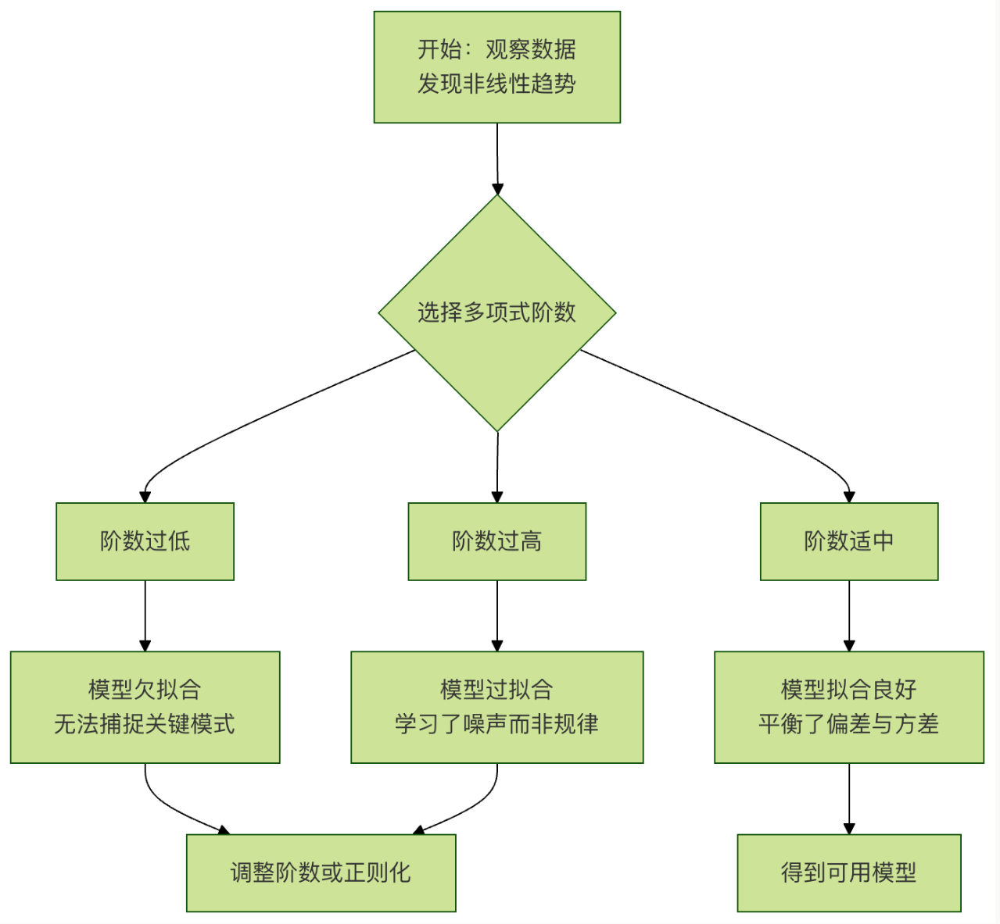

# 多项式回归
想象一下，你正在观察一个物体从空中落下的轨迹，它下落的速度不是均匀的，而是越来越快。如果你用一条直线取拟合这个轨迹，效果会很差，因为直线无法描述这种弯曲的变化。这时，我们就需要一种能弯曲的线——多项式回归就是解决这类问题的强大工具。
简单来说，**多项式回归**是线性回归的一种扩展。它通过为原始特征添加高次项（如平方项、立方项），将数据映射到更高维度的空间，从而用一条“曲线”来拟合数据中存在的非线性关系。

---

# 一、核心概念：从直线到曲线
## 1.1 回顾线性回归
线性回归的模型公式非常简单：$y = w_1 * x + b$ 其中：

- $y$ 是我们要预测的目标值。
- $x$ 是输入特征。
- $w_1$ 是特征的权重（斜率）。
- $b$ 是偏置项（截距）。

这个模型决定了它只能画出一条**直线**。
## 1.2 引入多项式回归
多项式回归的核心思想是：**将特征的高次幂视为新的特征**，然后在这个扩展后的特征集上应用线性回归。
例如，一个二次多项式回归模型：$y = w_1 * x + w_2 * x^2 + b$
你看，虽然方程里出现了$x^2$，但如果我们把$x$和$x^2$看作两个独立的特征$X1$和$X2$，那么模型就变成了：$y = w_1 * X1 + w_2 * X2 + b$这本质上仍然是一个**线性模型**，只不过它是关于**特征**$X1$和$X2$线性的。这就是为什么说多项式回归是“线性回归的扩展”。
## 1.3 关键术语

- **阶数/次数**：多项式中最高的指数。阶数为2是二次曲线（抛物线），阶数为3是三次曲线，以此类推。
- **过拟合**：如果选择的阶数太高，模型会变得非常“曲折”，完美穿过所有训练数据点，但对新数据的预测能力会急剧下降。就像用一张复杂的网去捕捉几个点，网眼太细，反而抓不住大鱼。
- **欠拟合**：如果阶数太低（比如用直线去拟合明显弯曲的数据），模型无法捕捉数据中的基本模式，预测能力同样很差。

下面的流程图展示了应用多项式回归的典型思考过程：



---

# 二、实战：用Python实现多项式回归
我们将使用`scikit-learn`这个强大的机器学习库，它让实现多项式回归变得非常简单。
## 2.1 准备环境与数据
首先，确保安装了必要的库，并创建一组模拟的非线性数据。

```python
# 导入必要的库
import numpy as np
import matplotlib.pyplot as plt
from sklearn.preprocessing import PolynomialFeatures
from sklearn.linear_model import LinearRegression
from sklearn.metrics import mean_squared_error, r2_score

# 设置随机种子，确保每次运行结果一致
np.random.seed(42)

# 创建模拟数据：y 是 x 的二次函数加上一些随机噪声
X = 6 * np.random.rand(100, 1) - 3 # 生成100个在[-3, 3)
y = 0.5 * X**2 + X + 2 + np.random.randn(100, 1) # y = 0.5x² + x + 2 + 噪声

# 可视化原始数据
plt.scatter(X, y, s=10, alpha=0.7, label='原始数据')
plt.xlabel('X')
plt.ylabel('y')
plt.title('模拟的非线性数据')
plt.legend()
plt.show()
```

运行这段代码，你会看到数据点大致呈现一个“U”形（抛物线）分布，用直线拟合显然不合适。
## 2.2 核心步骤：特征转换与模型训练
关键步骤是使用`PolynomialFeatures`来生成高次项特征。

```python
# 1. 创建多项式特征
# 参数 degree 决定了多项式的阶数，这里我们尝试2阶
poly_features = PolynomialFeatures(degree=2, include_bias=False)
# 将原始特征X转换为包含X和X^2的新特征矩阵X_poly
X_poly = poly_features.fit_transform(X)

print(f"原始X的形状: {X.shape}")
print(f"转换后X_poly的形状: {X_poly.shape}")
print(f"前5行X_poly数据:\n{X_poly[:5]}")
# 输出显示，X_poly 有两列：第一列是X，第二列是X^2

# 2. 在转换后的特征上训练线性回归模型
lin_reg = LinearRegression()
lin_reg.fit(X_poly, y)  # 使用X_poly，而不是原始的X

# 3. 查看学到的模型参数（权重和偏置）
print(f"\n模型参数（权重w1, w2）: {lin_reg.coef_.ravel()}")
print(f"模型偏置（截距b）: {lin_reg.intercept_}")
# 输出结果应接近我们生成数据时用的参数 [1, 0.5] 和 2
```

## 2.3 可视化拟合结果
让我们看看训练好的“曲线”模型是什么样的？

```python
# 为了画出平滑的曲线，需要生成一组均匀分布的点
X_new = np.linspace(-3, 3, 100).reshape(100, 1)
# 对这组新点同样进行多项式特征转换
X_new_poly = poly_features.transform(X_new)
# 用模型进行预测
y_new = lin_reg.predict(X_new_poly)

# 开始绘图
plt.scatter(X, y, s=10, alpha=0.7, label='训练数据')
plt.plot(X_new, y_new, 'r-', linewidth=2, label='多项式回归拟合 (degree=2)')
plt.xlabel('X')
plt.ylabel('y')
plt.title('二次多项式回归拟合效果')
plt.legend()
plt.show()
```

你应该能看到一条漂亮的红色曲线，很好地捕捉了数据的抛物线趋势。

---

# 三、重要议题：如何选择正确的阶数？
选择阶数是一个权衡过程。我们可以通过可视化不同阶数的拟合效果来直观感受。

```python
# 尝试不同的阶数：1（线性）， 2， 15（过高）
degrees = [1, 2, 15]
plt.figure(figsize=(15, 4))

for i, degree in enumerate(degrees):
    # 创建子图
    ax = plt.subplot(1, len(degrees), i + 1)
    
    # 生成多项式特征并训练模型
    poly_features = PolynomialFeatures(degree=degree, include_bias=False)
    X_poly = poly_features.fit_transform(X)
    lin_reg = LinearRegression()
    lin_reg.fit(X_poly, y)
    
    # 预测并绘图
    y_new = lin_reg.predict(poly_features.transform(X_new))
    
    ax.scatter(X, y, s=10, alpha=0.7)
    ax.plot(X_new, y_new, 'r-', linewidth=2)
    ax.set_title(f'Degree = {degree}')
    ax.set_xlabel('X')
    ax.set_ylabel('y')
    # 计算并显示R²分数（越接近1越好）
    y_pred = lin_reg.predict(X_poly)
    r2 = r2_score(y, y_pred)
    ax.text(0.05, 0.95, f'$R^2$ = {r2:.3f}', transform=ax.transAxes, 
            verticalalignment='top', bbox=dict(boxstyle='round', facecolor='wheat', alpha=0.5))

plt.tight_layout()
plt.show()
```

**观察与解释**：

- **Degree=1**（线性）：一条直线，$R^2$分数较低，明显**欠拟合**，无法表达数据的弯曲。
- **Degree=2**（二次）：一条平滑的曲线，$R^2$分数很高，拟合效果很好。
- **Degree=2**（十五次）曲线剧烈震荡，穿过了很多数据点，但对数据点之间的趋势预测怪异。他在训练数据上$R^2$可能接近1，但对新数据的预测会非常差，这就是典型的**过拟合**。

## 3.1 更科学的方法：交叉验证
在实践中，我们通过**交叉验证**来评估不同阶数模型在未知数据上的表现，选择在验证集上性能最好的模型。`scikit_learn`的`cross_val_score`可以方便地实现这一点。

```python
from sklearn.model_selection import cross_val_score

# 测试一系列阶数
degrees_to_try = range(1, 11)
cv_scores = []

for degree in degrees_to_try:
    poly_features = PolynomialFeatures(degree=degree, include_bias=False)
    X_poly = poly_features.fit_transform(X)
    lin_reg = LinearRegression()
    # 使用5折交叉验证，以负均方误差作为评分（sklearn约定：分数越高越好，所以用负MSE）
    scores = cross_val_score(lin_reg, X_poly, y, cv=5, scoring='neg_mean_squared_error')
    cv_scores.append(-scores.mean())  # 取平均并转回正数MSE

# 找到使交叉验证误差最小的阶数
best_degree = degrees_to_try[np.argmin(cv_scores)]
print(f"根据交叉验证，最佳阶数是: {best_degree}")

# 可视化交叉验证误差随阶数的变化
plt.plot(degrees_to_try, cv_scores, 'bo-')
plt.xlabel('多项式阶数')
plt.ylabel('5折交叉验证平均MSE')
plt.title('交叉验证选择最佳阶数')
plt.axvline(x=best_degree, color='r', linestyle='--', label=f'最佳阶数={best_degree}')
plt.legend()
plt.grid(True)
plt.show()
```

---

# 四、实践练习
现在，是时候动手巩固所学知识了。
**练习1**：**诊断与修复**运行下面这段代码。它试图用多项式回归拟合数据，但效果不佳。请分析问题可能出在哪里，并修改代码使其正确拟合。

```python
# 有问题的代码
import numpy as np
import matplotlib.pyplot as plt
from sklearn.preprocessing import PolynomialFeatures
from sklearn.linear_model import LinearRegression

X = np.array([1, 2, 3, 4, 5]).reshape(-1, 1)
y = np.array([2, 4, 9, 16, 25])  # 大致是 y = x^2

# 尝试用1阶多项式（线性）拟合
poly = PolynomialFeatures(degree=1)
X_poly = poly.fit_transform(X)
model = LinearRegression().fit(X_poly, y)

X_plot = np.linspace(1, 5, 100).reshape(-1, 1)
X_plot_poly = poly.transform(X_plot)
y_plot = model.predict(X_plot_poly)

plt.scatter(X, y, label='Data')
plt.plot(X_plot, y_plot, 'r-', label='Fit')
plt.legend()
plt.show()
```

**练习2**：**探索真是数据集**使用`scikit-learn`自带的`波士顿房价数据集`或`糖尿病数据集`,选择一个与目标值呈现非线性关系的特征，应用多项式回归。

1. 绘制原始数据散点图。
2. 尝试不同阶数（2，3，4），可视化拟合曲线。
3. 使用交叉验证找出对该特征而言预测效果最好的多项式阶数。

**练习3**：**挑战-多元多项式回归**我们上面的例子只有一个特征$x$。多项式回归同样适用于多个特征。例如，有两个特征$x1$和$x2$时，`degree=2`的多项式特征会包括：$x1$,$x2$,$x1^2$,$x1*x2$,$x2^2$。尝试创建一个包含两个特征(x1,x2)的模拟数据集(例如，$y = x1 + x2^2 + 噪声$),并使用`PolynomialFeatures(degree=2)`进行拟合。观察生成的特征矩阵形状，并理解其含义。