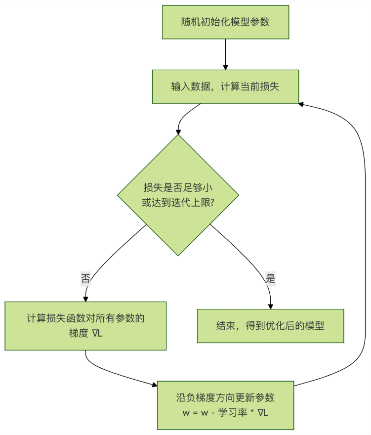
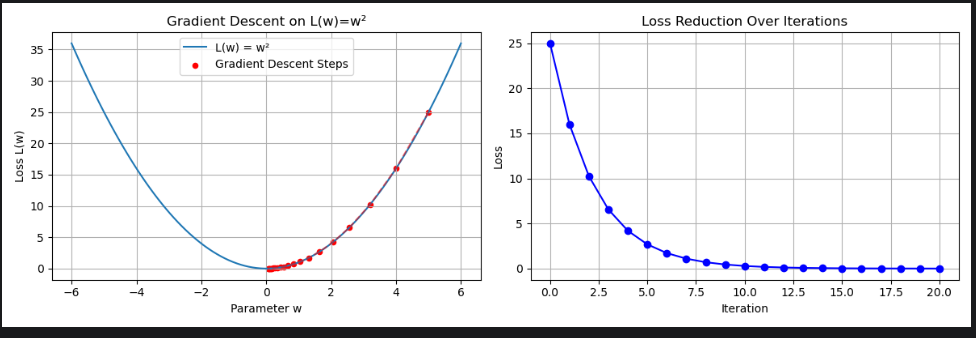

# 损失函数与梯度
本章节我们将一起探索两个至关重要的核心概念：**损失函数**和**梯度**，它们是机器学习算法能够`学习`和`改进`的基石。
想象一下，你在学习投篮，每次投球后，你都会观察球是进了、偏左了还是偏右了。这个观察结果与完美进球之间的差距，就是你的`损失`。而为了下次投的更准，你会根据这次偏差的方向和大小来调整你的姿势和力度，这个**调整的方向和大小**就类似于`梯度`。
在机器学习中，模型就是那个`学习者`，损失函数衡量它的`错误程度`，而梯度则告诉它**如何改进**。理解它们，你就掌握了机器学习如何工作的核心逻辑。

---

# 一、损失函数：模型的成绩单
## 1.1 什么手机损失函数?
**损失函数**，有时也叫**代价函数**或**目标函数**，是一个用来**量化模型预测值与真实值之间差异**的函数。

- **核心作用**：它给模型的预测表现打了一个具体的“分数”。这个分数越低，说明模型预测锝越准确；分数越高，说明预测误差越大。
- **类比理解**：就像考试一样，损失函数的“分数”就是模型的考试成绩。我们的终极目标就是通过“学习”（调整模型参数），让这个分数（损失）越来越低。

## 1.2 常见损失函数举例
不同的任务需要使用不同的**评分标准**，以下是两个最基础的损失函数：
**均方误差 - 适用于回归问题（预测连续值，如房价、温度）**
均方误差计算的是所有样本的**预测值与真实值之差的平方的平均值**。
**公式**：$MSE = (1 / n) * \sum{(真实值_i - 预测值_i)^2}$

- n：样本数量
- $\sum$：求和符号
- $真实值_i$：第i和样本的真实值
- $预测值_i$：模型对第i个样本的预测值

**特点**：由于使用了平方，它对较大的误差惩罚更重（误差为2时，平方后贡献为4；误差为10时，平方后贡献高达100）。
**代码示例**：

```python
import numpy as np

# 假设我们有 5 个样本的真实值和预测值
y_true = np.array([3, -0.5, 2, 7, 4])      # 真实值
y_pred = np.array([2.5, 0.0, 2, 8, 5])     # 预测值

# 手动计算 MSE
n = len(y_true)
squared_errors = (y_true - y_pred) ** 2    # 计算每个样本的平方误差
mse_manual = np.sum(squared_errors) / n    # 求和并取平均
print(f"手动计算的 MSE: {mse_manual}")

# 使用 sklearn 库函数验证
from sklearn.metrics import mean_squared_error
mse_sklearn = mean_squared_error(y_true, y_pred)
print(f"Sklearn 计算的 MSE: {mse_sklearn}")
```

**交叉熵损失 - 适用于分类问题（预测类别，如图片是猫还是狗）**
交叉熵衡量的是**模型预测的概率分布**与**真实的概念分布**之间的差异。在二分类中，真实分布通常是[1，0]（是类别A）或[0，1]（是类别B）。
**二分类公式（对数损失）**：$Log Loss = -(1 / n) * \sum{[真实值_i * log(预测概率_i) + (1 - 真实值_i) * log(1 - 预测概率_i)]}$
**直观理解**：当真实标签为1时，我们希望模型预测的概率也接近1。如果此时模型预测了一个很低的概率（比如0.1），那么log（0.1）会是一个很大的负数，再乘以前面的负号，就会导致损失值变得很大，表示惩罚很重。
**代码示例**：

```python
import numpy as np
from sklearn.metrics import log_loss

# 二分类示例：真实标签（1代表"是"，0代表"否"）
y_true_binary = np.array([1, 0, 0, 1]) # 真实类别：是，否，否，是
# 模型预测为"是"这个类别的概率
y_pred_prob = np.array([0.9, 0.1, 0.2, 0.8]) # 预测概率：0.9, 0.1, 0.2, 0.8

# 使用 sklearn 计算交叉熵损失（对数损失）
ce_loss = log_loss(y_true_binary, y_pred_prob)
print(f"交叉熵损失 (Log Loss): {ce_loss}")
```

---

# 二、梯度：指引优化方向的“指南针”
现在我们直到了如何给模型打分（损失函数），接下来最关键的问题是：**模型如何根据这个分数来改进自己？**答案就是通过**梯度**。
## 2.1 什么是梯度？
在机器学习中，模型通常由许多**参数**（或叫**权重**）构成。我们可以把**损失函数L**看作是所有这些参数的函数：$L(w_1,w_2,...,w_n)$。

- **梯度**就是损失函数对**每个参数**的**偏导数**所构成的向量。
- **数学表示**：$\nabla{L} = [\partial{L}/\partial{w_1},\partial{L}/\partial{w_2},...,\partial{L}/\partial{w_n}]$
- **核心意义**：
  1. **方向**：梯度向量所指的方向，是损失函数在该点**上升最快**的方向。
  2. **大小**：每个偏导数的绝对值大小，表示损失函数对该参数变化的**敏感度**。

## 2.2 为什么梯度能指引优化？
我们的目标是**最小化损失函数**。既然梯度指向了损失上升最快的方向，那么它的反方向$-\nabla{L}$自然就是损失**下降最快**的方向。
**优化过程（梯度下降）可以形象地理解为**：

你站在一座山谷（损失曲面）的某个山坡上，蒙着眼睛想要走到谷底（损失最小点）。你每走一步前，都用脚感受一下四周哪个方向最陡峭（计算梯度），然后朝着最陡峭的**下坡方向**（负梯度方向）迈出一步（更新参数）。重复这个过程，你最终就能到达谷底。

这个过程可以用下面的流程图概括：



## 2.3 梯度下降的简单示例
让我们用一个最简单的例子——只有一个参数w的线性模型，来演示梯度下降。
假设我们的损失函数是$L(w) = w^2$。显然，当$w = 0$时，损失最小。

- **梯度计算**：$\nabla{L} = dL / dw = 2w$
- **参数更新公式**：$w_new = w_old - \eta * (2 * w_old)$
  - $\eta$是**学习率**，控制每一步买多大。

```python
import numpy as np
import matplotlib.pyplot as plt

# 定义损失函数 L(w) = w^2
def loss(w):
    return w ** 2

# 定义梯度 dL/dw = 2*w
def gradient(w):
    return 2 * w

# 梯度下降算法
def gradient_descent(start_w, learning_rate, iterations):
    w = start_w
    w_history = [w]  # 记录 w 的变化历史
    loss_history = [loss(w)]  # 记录损失的变化历史

    for i in range(iterations):
        grad = gradient(w)  # 计算当前点的梯度
        w = w - learning_rate * grad  # 沿负梯度方向更新参数
        w_history.append(w)
        loss_history.append(loss(w))

    return w_history, loss_history

# 执行梯度下降：从 w=5 开始，学习率 0.1，迭代 20 次
w_start = 5.0
lr = 0.1
iters = 20
w_hist, loss_hist = gradient_descent(w_start, lr, iters)

print(f"初始 w: {w_hist[0]:.4f}, 初始损失: {loss_hist[0]:.4f}")
print(f"最终 w: {w_hist[-1]:.4f}, 最终损失: {loss_hist[-1]:.4f}")

# 可视化优化过程
plt.figure(figsize=(12, 4))

# 图1：损失函数曲线及优化路径
plt.subplot(1, 2, 1)
w_vals = np.linspace(-6, 6, 100)
plt.plot(w_vals, loss(w_vals), label='L(w) = w²')
plt.scatter(w_hist, loss_hist, c='red', s=20, label='Gradient Descent Steps')
plt.plot(w_hist, loss_hist, 'r--', alpha=0.5)
plt.xlabel('Parameter w')
plt.ylabel('Loss L(w)')
plt.title('Gradient Descent on L(w)=w²')
plt.legend()
plt.grid(True)

# 图2：损失值随迭代次数的下降曲线
plt.subplot(1, 2, 2)
plt.plot(range(len(loss_hist)), loss_hist, 'b-o')
plt.xlabel('Iteration')
plt.ylabel('Loss')
plt.title('Loss Reduction Over Iterations')
plt.grid(True)

plt.tight_layout()
plt.show()
```



**运行这段代码，你会看到**：

1. 左边的图展示了参数w如何从5.0开始，一步步“滚下”抛物线，最终接近最小值点0.
2. 右边的图展示了损失值如何随着迭代次数的增加而迅速下滑。

---

# 三、核心要点与联系总结

| 概念 | 比喻 | 核心作用 | 关键点 |
|---|---|---|---|
| **损失函数** | **成绩单/误差测量尺** | 定量评估模型预测的好坏。 | 1.不同类型任务（回归、分类）是用不同的损失函数。2.损失值越小，模型性能越好。 |
| **梯度** | **指南针/最陡下坡方向** | 指出为了最快降低损失，每个模型参数应该如何调整。 | 1.是损失函数对所有函数的偏导数向量。2.**负梯度方向**是损失下降最快的方向。 | 
| **梯度下降** | **蒙眼下山法** | 利用梯度信息，迭代地更新参数以最小化损失。 | 1.**学习率**是关键超参数，太小则学习慢，太大可能无法收敛。2.是大多数机器学习模型训练的底层优化算法。 |

**它们之间的关系链是：模型做出预测 --> 损失函数计算误差 --> 计算误差相对于个参数的梯度 --> 沿负梯度方向更新参数 --> 模型改进 --> 重复...**