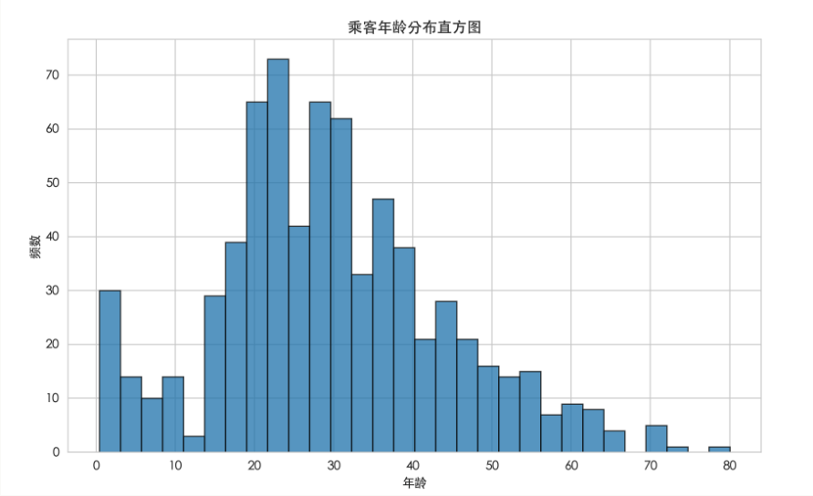

# 数据可视化
在开始构建一个复杂的机器学习模型之前，我们首先要做的不是选择算法，而是**理解数据**。
如果把机器学习比作烹饪，那么数据就是食材。
一个优秀的厨师必须了解食材的特性——是新鲜的还是变质的，是偏甜的还是偏酸的，是合适炖煮还是快炒。
数据可视化，就是我们观察和品尝数据这道食材的 **放大镜** 和 **味蕾**。
数据可视化通过图表、图形等视觉元素，将枯燥的数学转化为直观的图像，帮助我们：

- **发现数据中的模式和趋势**（例如：销售额是否随季节变化？）
- **识别异常值和错误数据**（例如：年龄为300岁的记录）
- **理解特征（变量）之间的关系**（例如：房屋面积和价格是否正相关？）
- **验证假设**，并为后续的特征工程和模型选择提供依据。

本文将使用 Python 中最流行的数据科学库 pandas 和可视化库 matplotlib、seaborn，带你掌握数据可视化的核心技能。

---

## 准备工作：环境与数据
在开始画图之前，我们需要准备好“画布”和“颜料”。
### 安装必要的库
如果你使用的Anaconda，这些库通常已预装，否则，可以通过以下命令安装：

```bash
pip install pandas matplotlib seaborn
```

### 导入库与加载数据
我们将使用一个经典的公开数据集：泰坦尼克号乘客数据集。它包含了乘客的生存情况、舱位、年龄、性别等信息。

```python
# 导入必要的库
import pandas as pd
import matplotlib.pyplot as plt
import seaborn as sns

# 设置图表风格，让图表更好看
sns.set_style("whitegrid")
# -------------------------- 设置中文字体 start --------------------------
plt.rcParams['font.sans-serif'] = [
    # Windows 优先
    'SimHei', 'Microsoft YaHei',
    # macOS 优先
    'PingFang SC', 'Heiti TC',
    # Linux 优先
    'WenQuanYi Micro Hei', 'DejaVu Sans'
]
# 修复负号显示为方块的问题
plt.rcParams['axes.unicode_minus'] = False
# -------------------------- 设置中文字体 end --------------------------

# 加载数据
# 这里我们直接从 seaborn 的内置数据集加载
df = sns.load_dataset('titanic')

# 查看数据的前几行和基本信息
print("数据形状（行数，列数）:", df.shape)
print("\n数据前5行：")
print(df.head())
print("\n数据基本信息（类型、非空值数量等）：")
print(df.info())
```
运行上面的代码，你会看到数据有891行（乘客）和15列（特征）。`df.head()`可以让你对数据长什么样有一个初步的印象。

---

## 单变量分析：了解单个特征的分布
单变量分析关注**一个**特征（变量）的分布情况。这是最基础的分析。
### 1.数值型特征：直方图与箱线图
对于像 age(年龄)、fare(票价)这样的连续数值型特征，我们常用**直方图** 和 **箱线图**。 **直方图**展示了数据在不同区间（“桶”）内的频率分布。

```python
# 导入必要的库
import pandas as pd
import matplotlib.pyplot as plt
import seaborn as sns

# 设置图表风格，让图表更好看
sns.set_style("whitegrid")
# -------------------------- 设置中文字体 start --------------------------
plt.rcParams['font.sans-serif'] = [
    # Windows 优先
    'SimHei', 'Microsoft YaHei',
    # macOS 优先
    'PingFang SC', 'Heiti TC',
    # Linux 优先
    'WenQuanYi Micro Hei', 'DejaVu Sans'
]
# 修复负号显示为方块的问题
plt.rcParams['axes.unicode_minus'] = False
# -------------------------- 设置中文字体 end --------------------------

# 加载数据
# 这里我们直接从 seaborn 的内置数据集加载
df = sns.load_dataset('titanic')

# 查看数据的前几行和基本信息
print("数据形状（行数，列数）:", df.shape)
print("\n数据前5行：")
print(df.head())
print("\n数据基本信息（类型、非空值数量等）：")
print(df.info())

# 绘制年龄的直方图
plt.figure(figsize=(10, 6)) # 设置图表大小
plt.hist(df['age'].dropna(), bins=30, edgecolor='black', alpha=0.7) # dropna() 忽略缺失值
plt.title('乘客年龄分布直方图')
plt.xlabel('年龄')
plt.ylabel('频数')
plt.show()
```



**解读**：这张图可以告诉我们乘客的年龄主要几种在哪个区间（例如 20-30 岁），分布是否对称，是否有异常值等。
**箱线图**可以清晰地显示数据的**中位数、四分位数和异常值**。

```python
# 绘制票价的箱线图
plt.figure(figsize=(8, 5))
plt.boxplot(df['fare'].dropna())
plt.title('票价箱线图')
plt.ylabel('票价')
plt.show()
```

**解读**：箱体中间的线是中位数。箱体上下边界是上四分位数（Q3）和下四分位数（Q1）。上下“胡须”通常延伸到 1.5 倍四分位距以内的最远数据点，之外的点被视为**异常值**（图中上方的圆圈）。这张图立刻告诉我们，票价存在很多极高的异常值。
### 2.类别型特征：柱状图
对于像 `sex`（性别）、`embarked`（登船港口）、`survived`（是否幸存）这样的类别型特征，我们使用**柱状图**来统计每个类别的数量。

```python
# 绘制乘客性别的柱状图
survival_counts = df['sex'].value_counts()
plt.figure(figsize=(8, 5))
plt.bar(survival_counts.index, survival_counts.values, color=['lightblue', 'lightcoral'])
plt.title('乘客性别分布')
plt.xlabel('性别')
plt.ylabel('人数')
plt.show()
```

---

## 双变量分析：探索特征间的关系
双变量分析探索**两个**特征之间的关系。
### 1.数值 vs 数值：散点图
散点图是研究两个连续变量相关性的利器。

```python
# 绘制年龄与票价的散点图
plt.figure(figsize=(10, 6))
plt.scatter(df['age'], df['fare'], alpha=0.5) # alpha 设置透明度，便于观察点密度
plt.title('年龄 vs 票价 散点图')
plt.xlabel('年龄')
plt.ylabel('票价')
plt.show()
```

**解读**：点的分析模式可以暗示相关性。例如，如果点大致沿一条线斜线分布，则说明两者相关。从这张图看，年龄和票价没有明显的线性关系，但能再次确认高票价（异常值）的存在。
### 2.类别 vs 数值：分组箱线图或小提琴图
我们常常想知道不同类别下，某个数值特征的分布有何不同。例如：“不同舱位的乘客，票价分布有何差异？”

```python
# 使用 seaborn 绘制分组箱线图 (pclass: 舱位等级，1/2/3等舱)
plt.figure(figsize=(10, 6))
sns.boxplot(x='pclass', y='fare', data=df)
plt.title('不同舱位的票价分布')
plt.show()
```

**解读**：非常清晰！舱位等级越高（1等舱），票价的中位数和整体范围都显著更多。这完全符合我们的常识。

**小提琴图**是箱线图的高级版本，它不仅显示了统计量，还通过核密度估计展示了数据的实际分布形状。

```python
# 绘制不同性别下年龄分布的小提琴图
plt.figure(figsize=(10, 6))
sns.violinplot(x='sex', y='age', data=df, inner='quartile') # inner 参数显示四分位线
plt.title('不同性别的年龄分布（小提琴图）')
plt.show()
```

### 3.类别 vs 类别：堆叠柱状图或热力图
对于两个类别型变量，我们可以用**堆叠柱状图**来观察组合情况。例如：“不同性别的幸存比例如何？”

```python
# 创建性别与生存情况的交叉表
cross_tab = pd.crosstab(df['sex'], df['survived'], normalize='index') # normalize='index' 按行计算比例
print(cross_tab)

# 绘制堆叠柱状图
cross_tab.plot(kind='bar', stacked=True, figsize=(10, 6), color=['tomato', 'lightgreen'])
plt.title('不同性别的生存比例')
plt.xlabel('性别')
plt.ylabel('比例')
plt.legend(['未幸存', '幸存'])
plt.show()
```

**解读**：从图表和交叉表可以明显看出，女性的幸存比例远高于男性。这是一个非常强的信号，说明sex特征对于预测生存至关重要。

---

## 多变量分析与高级可视化
有时我们需要同时考虑三个甚至更多变量。seaborn库让这变得简单。
### 1.带分组的散点图
我们可以在散点图的基础上，用颜色或形状区分第三个（类别型）变量。

```python
# 在年龄-票价散点图中，用颜色区分是否幸存
plt.figure(figsize=(12, 8))
sns.scatterplot(x='age', y='fare', hue='survived', style='survived', data=df, alpha=0.7)
plt.title('年龄 vs 票价（按生存情况着色）')
plt.show()
```

**解读**：这张图可以让我们直观地感受，幸存者（橙色）和非幸存者（蓝色）在“年龄-票价”这个二维空间中的分布是否有区别。

### 2.相关矩阵热力图
当我们有多个数值特征时，可以一次性计算它们两两之间的相关系数，并用热力图展示。

```python
# 选择数值型列
numeric_df = df.select_dtypes(include=['float64', 'int64'])

# 计算相关系数矩阵
corr_matrix = numeric_df.corr()

# 绘制热力图
plt.figure(figsize=(12, 8))
sns.heatmap(corr_matrix, annot=True, cmap='coolwarm', center=0, square=True)
plt.title('数值特征相关矩阵热力图')
plt.show()
```

**解读**：颜色越暖（红），表示正相关性越强；越冷（蓝），表示负相关性越强。`annot=True`将具体数值显示在方格内。例如，`pclass(舱位)`和`fare（票价）`呈强负相关（-0.55），即舱位号越小（等级越高），票价越高，这与我们之前的分析一致。

---

## 实践练习：动手探索
现在，请你尝试完成以下练习，巩固所学知识：

1. **数据检查**：使用`df.isnull().sum()`查看数据集中哪些列有缺失值，缺失了多少。
2. **绘制分布**：为`age`列绘制一个**小提琴图**，并按照`survived（生存情况）`进行分组（使用`sns.violinplot(x='survived',y='age',data=df)`）。观察幸存者和非幸存者的年龄分布有何不同。
3. **探索关系**：使用`sns.countplot(x='pclass',hue='survived',data=df)`绘制一个计数柱状图，查看不同舱位等级的幸村人数对比。你能得出什么结论？
4. **（挑战）多变量图：尝试绘制一个**散点图矩阵**，一次性查看`age、fare、parch（父母/子女数量）`这几个数值变量两两之间的关系。提示：可以使用`sns.pairplot(df[['age','fare','parch','survived']],hue='survived')`。

## 总结
数据可视化是机器学习工作流中**不可或缺的探索性步骤**。通过本文，你学会了：
**核心工具**：使用matplotlib进行基础绘图，使用seaborn绘制更美观、信息量更丰富的统计图形。
**分析思路**：

- **单变量分析**：用直方图/箱线图看分布，用柱状图数个数。
- **双变量分析**：用散点图看数值关系，用分组箱线图看类别对数值的影响，用堆叠柱状图看类别组合。
- **多变量分析**：用着色散点图、相关热力图揭示更复杂的模式。

**核心目标**：所有图表都是为了 **提出假设** 和 **发现洞察**，例如性别可能是一个重要的预测特征、票价数据中有大量异常值需要处理。
记住，在把数据为给模型之前，请务必花时间好好看看它。一个清晰的可视化发现，往往能避复杂的算法更早地指引你走向正确的方向。
