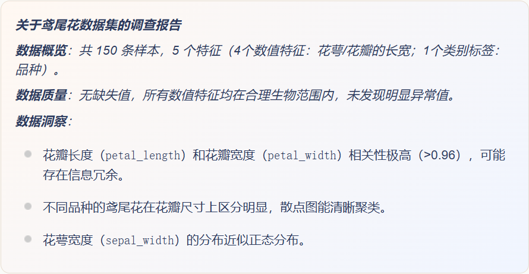

# 数据理解
在开始任何机器学习项目之前，比如预测房价、识别图片中的猫狗，或者推荐你喜欢的电影，我们首先需要面对一个最基础也最关键的环节：**数据理解**。
你可以把数据理解想象成一位侦探在调查案件前，仔细研究所有线索和档案的过程。如果不了解线索（数据）的来龙去脉、真伪和含义，后续的任何推理（建模）都可以建立在错误的基础上。
数据理解是整个机器学习流程的基石，它决定了我们后续如何清洗数据、选择模型，并最终影响模型的成败。
# 什么是数据理解？
数据理解，顾名思义，就是深入认识你手中的数据集。它的核心目标是回答以下几个问题：

- **我有什么数据？**（数据的结构和类型）
- **数据质量如何？**（数据是否干净、完整、可靠）
- **数据在“说”什么？**（数据中隐藏了哪些模式、关系和分布）

这个过程不涉及复杂的代码和算法，更多的是通过观察、统计和可视化来获得对数据的“直觉”。

# 数据理解的核心步骤与工具
我们将使用 Python 中最流行的数据分析库 **Pandas** 和可视化库 **Matplotlib/Seaborn** 来进行演示。请确保你已经安装了它们（`pip install pandas matplotlib serborn`）。
## 步骤一：初次见面——加载与概览
首先，我们需要把数据加载到程序中，并快速浏览器整体样貌。

```python
import pandas as pd
import matplotlib.pyplot as plt
import seaborn as sns

# 1. 加载数据（这里以经典的鸢尾花数据集为例，你也可以加载自己的CSV文件）
# 从网络加载
url = "https://raw.githubusercontent.com/uiuc-cse/data-fa14/gh-pages/data/iris.csv"
df = pd.read_csv(url)

# 或者从本地文件加载
# df = pd.read_csv('your_dataset.csv')

# 2. 查看数据的前几行 - 第一印象
print("数据的前5行：")
print(df.head())
print("\n" + "="*50 + "\n")

# 3. 查看数据的整体信息：行数、列数、数据类型、内存占用
print("数据集的基本信息：")
print(df.info())
print("\n" + "="*50 + "\n")

# 4. 查看数据的形状（多少行，多少列）
print(f"数据集形状：{df.shape}") # 输出 (行数， 列数)
print(f"共有 {df.shape[0]} 条样本， {df.shape[1]} 个特征。")
```

**代码解析**：

- `df.head()`：像翻阅一本书的目录一样，快速查看数据的前几行，了解数据长什么样。
- `df.info()`：这是数据的“体检报告”。它会告诉你：
  - 每列的名称（Column）
  - 非空值的数量（Non-Null Count），可以立刻发现是否有数据缺失
  - 数据类型（Dtype），如`int64`（整数），`float64`（小数），`object`（文本或混合类型）
- `df.shape`：直接获取数据表的维度。

## 步骤二：质量检查——发现缺失与异常
数据很少是完美无缺的。常见的“数据病”包括 **缺失值** （某些位置是空的）和 **异常值** （某些数字大的离谱或小的离谱）。

```python
# 1. 检查缺失值
print("各特征缺失值数量：")
print(df.isnull().sum())
print("\n" + "="*50 + "\n")

# 如果缺失值很多，可以计算缺失比例
missing_ratio = df.isnull().sum() / len(df) * 100
print("各特征缺失值比例（%）:")
print(missing_round)
print("\n" + "="*50 + "\n")

# 2. 检查数值型特征的统计摘要 - 可以发现异常值的线索
print("数值型特征的统计描述：")
print(df.describe())
```

**代码解析**：

- `df.isnull().sum()`：计算每一列中空值（NaN）的总数。
- `df.describe()`：生成数值列的统计摘要，包括：
  - `count`：数量（可用于再次确认缺失）
  - `mean`：平均值
  - `std`：标准差（数据波动大小）
  - `min`：最小值
  - `25%,50%(中位数),75%`：四分位数
  - `max`：最大值
  - **通过观察 min 和 max，你可以初步判断是否有异常值**（例如，年龄列出现200岁）。

## 步骤三：深入洞察——分布与关系可视化
文字和数字是抽象的，而图表能让我们直观地“看到”数据。这是数据理解中最有趣地部分。

```python
# 设置图表风格
sns.set(style="whitegrid")

# 1. 单变量分布 - 了解每个特征自身的分布情况
fig, axes = plt.subplots(2, 2, figsize=(12, 8)) # 创建2x2的画布
features = ['sepal_length'， 'sepal_width'， 'petal_length'， 'petal_width']
colors = ['skyblue'， 'lightgreen'， 'salmon'， 'gold']

for i, (ax, feature, color) in enumerate(zip(axes.flat, features, colors)):
    # 绘制直方图（分布）与核密度估计曲线
    sns.histplot(df[feature], kde=True, ax=ax, color=color, bins=20)
    ax.set_title(f'{feature} 的分布'， fontsize=14)
    ax.set_xlabel(feature)
    ax.set_ylabel('频数')

plt.tight_layout()
plt.show()

# 2. 箱线图 - 查看数据分布与异常值（更直观）
plt.figure(figsize=(10, 6))
# 选择数值列绘制箱线图
df_box = df.drop(columns=['species']) # 假设'species'是文本标签列，先去掉
sns.boxplot(data=df_box)
plt.title('各数值特征的箱线图（查看分布与异常值）'， fontsize=14)
plt.xticks(rotation=45)
plt.show()

# 3. 变量间关系 - 散点图矩阵
print("\n绘制特征间关系的散点图矩阵...（这能帮助我们发现特征之间的关联）")
# 使用Seaborn的pairplot， hue参数可以根据类别着色（如鸢尾花的品种）
sns.pairplot(df, hue='species'， height=2.5)
plt.suptitle('特征关系散点图矩阵（按种类着色）'， y=1.02, fontsize=16)
plt.show()

# 4. 相关性热力图 - 量化特征间的线性关系
plt.figure(figsize=(8, 6))
# 计算数值特征之间的相关系数
numeric_df = df.select_dtypes(include=['float64'， 'int64'])
correlation_matrix = numeric_df.corr()
sns.heatmap(correlation_matrix, annot=True, cmap='coolwarm'， center=0, square=True)
plt.title('特征相关性热力图'， fontsize=14)
plt.show()
```

**图表解析**：

- **直方图**：展示了某个特征（如花瓣长度）的值是如何分布的。实际中在某个区间，还是分散的？
- **箱线图**：
  - 箱子中间的线代表**中位数**。
  - 箱子的上下边界代表**第25%（Q1）和75%（Q3）分位数。
  - 上下延伸的“须”通常代表合理范围（Q1-1.5IQR 到 Q3+1.5IQR）。
  - **单独的点**很可能就是**异常值**！
- **散点图矩阵**：同时查看任意两个特征之间的关系。点呈带状分布说明可能相关。
- **相关性热力图**：用颜色和数字（-1 到 1）精确表示两个特征的线性相关程度。
  - **1**：完全正相关（一个变大，另一个也变大）
  - **-1**：完全负相关（一个变大，另一个变小）
  - **0**：没有线性关系

# 数据理解的产出：一份“数据调查报告”
完成上述步骤后，你应该能总结出一份关于当前数据集的清晰报告，例如：

