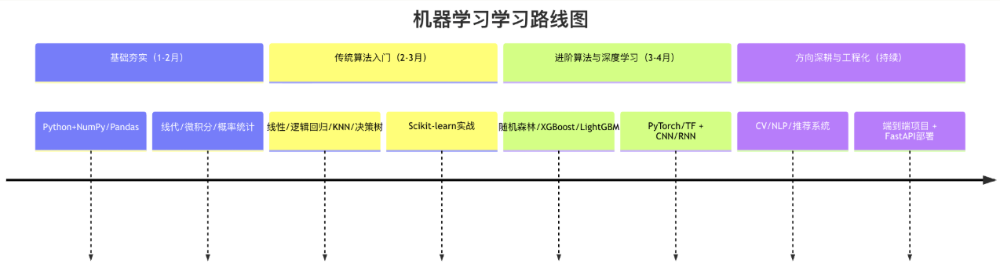
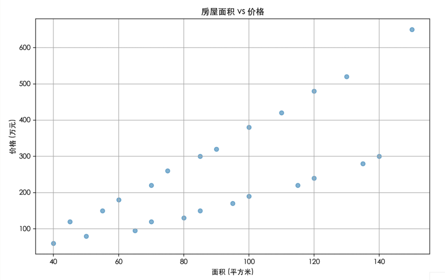
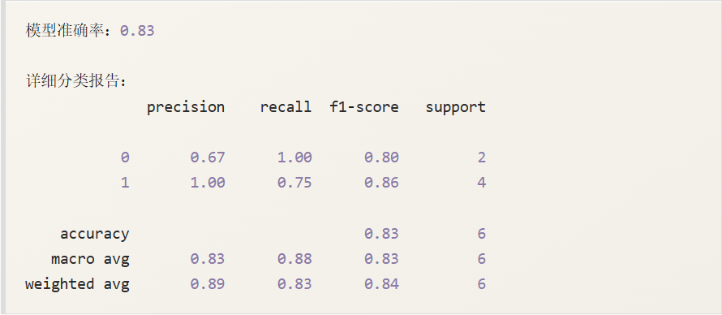
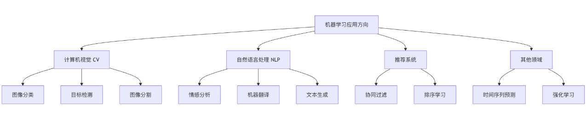

# 机器学习-学习路线
机器学习是当今最热门的技术领域之一，它让计算机能够从数据中学习并作出预测或决策。对于初学者来说，面对海量的算法、数学理论和变成工具，很容易感到迷茫，不知从何入手。本文将介绍从零基础到具备实践能力的机器学习学习路线图。



# 机器学习-学习课程列表
1. 基础入门
   - 机器学习教程
   - 机器学习简介
   - 机器学习生命周期
   - 机器学习如何工作
   - 机器学习基础术语
   - Python入门机器学习
   - Python机器学习库
   - 常用数据类型
   - 机器学习应用
2. 数据处理与统计
   - 数据理解
   - 数据清洗
   - 特征工程
   - 数据可视化
   - 训练集测试集划分
   - 统计学基础
   - 概率思维
   - 损失函数与梯度
   - 过拟合、欠拟合、偏差与方差
3. 监督学习
   - 机器学习算法
   - 线性回归
   - 多元线性回归
   - 多项式回归
   - 逻辑回归
   - 回归模型评估
   - 决策树
   - 支持向量机
   - K近邻算法
   - 集成学习
   - 朴素贝叶斯
   - 随机森林
   - 分类指标
4. 无监督学习
   - 聚类
   - 降维
5. 强化学习
   - 强化学习基本框架
   - 强化学习探索vs开采
   - 强化学习Q-learning与SARSA
   - 深度强化学习
6. 模型优化与工程
   - 交叉验证
   - 政策话
   - 数据泄露
   - 集成方法
   - 超参搜索
   - MLOps概念
   - 常见问题排查
7. 机器学习的限制与边界
   - 可解释性问题
   - 假设限制
   - 数据偏差
   - 模型的现实成本
8. 实战案例
   - 泰坦尼克号生存预测
   - 房价预测
   - 客户分群
   - PCA可视化
   - 强化学习示例

# 第一阶段：筑基期-打好坚实基础
在接触复杂的算法之前，你需要先搭建起支撑知识大厦的地基。这个阶段的目标是掌握必要的数学、编程和数据分析技能。
## 核心技能一：编程语言（Python）
Python是机器学习领域的通用语言，因其语法简洁，库生态丰富而备受青睐。
**学习目标**：掌握Python基础语法、数据结构、函数和面向对象编程。
**关键库**：
- `Numpy`：用于高效的数值计算，是几乎所有科学计算库的基础。
- `Pandas`：用于数据清洗、分析和处理、操作数据表格（DataFrame）的利器。
- `Matplotlib/Seaborn`：用于数据可视化，将数据转化为直观的图表。

接下来我们可以看一个案例。
测试数据house_prices.csv文件内容：

```
面积,价格,房龄,卧室数,城市
45,120,15,1,北京
60,180,12,2,北京
75,260,8,2,北京
90,320,6,3,北京
110,420,5,3,北京
130,520,3,4,北京
50,80,20,1,成都
70,120,15,2,成都
85,150,12,3,成都
100,190,10,3,成都
120,240,8,4,成都
140,300,5,4,成都
55,150,18,1,上海
70,220,14,2,上海
85,300,10,2,上海
100,380,8,3,上海
120,480,6,3,上海
150,650,4,4,上海
40,60,22,1,武汉
65,95,16,2,武汉
80,130,12,2,武汉
95,170,9,3,武汉
115,220,7,3,武汉
135,280,5,4,武汉
```

实例：
```python
# 示例：使用 Pandas 和 Matplotlib 进行基础数据分析
import pandas as pd
import matplotlib.pyplot as plt

# ------------------ 设置中文字体  start -------------------
plt.rcParams['font.sans-serif'] = [
    # Windows 优先
    'SimHei', 'Microsoft YaHei',
    # macOS 优先
    'PingFang SC', 'Heiti TC',
    # Linux 优先
    'WenQuanYi Micro Hei', 'DejaVu Sans'
]
# 修复负号显示为方块的问题
plt.rcParams['axes.unicode_minus'] = False
# ------------------ 设置中文字体  end ---------------------

# 1. 读取数据
data = pd.read_csv('house_prices.csv')
print("数据前5行：")
print(data.head())

# 2. 查看数据基本信息
print("\n数据信息：")
print(data.info())

# 3. 绘制房屋面积与价格的散点图
plt.figure(figsize=(10, 6))
plt.scatter(data["面积"], data["价格"], alpha=0.5)
plt.title("房屋面积 vs 价格")
plt.xlabel("面积（平方米）")
plt.ylabel("价格（万元）")
plt.grid(True)
plt.show()
```

执行后，输出的图如下：


## 核心技能二：必要数学知识
你不需要成为数学家，但需要理解算法背后的基本逻辑。
- **线性代数**：理解向量、矩阵、矩阵乘法。这是理解数据在多维空间中表示和变换的基础。
- **微积分**：重点是理解导数和偏导数的概念。它们是优化算法（如梯度下降）的核心，用于寻找模型的最佳参数。
- **概率与统计**：理解均值、方差、标准差、概率分布、条件概率和贝叶斯定理。这对于评估模型、理解不确定性至关重要。

**比喻**：把机器学习模型想象成一个复杂的**调音台**。数学知识就是你理解每个旋钮（参数）如何影响最终声音（预测结果）的说明书，没有说明书，你只能盲目乱拧。

# 第二阶段：金丹期-掌握经典算法
有了坚实的基础，你可以开始探索机器学习的核心———算法。建议从最经典、最直观的算法开始。
## 监督学习入门
监督学习是指用已有的标签的数据来训练模型。
1. **线性回归**：预测连续值（如房价）。理解它的代价函数和梯度下降优化过程。
2. **逻辑回归**：解决分类问题（如判断邮件是否为垃圾邮件）。理解Sigmoid函数和决策边界。
3. **K-最近邻（K-NN）算法**：一种基于实例的简单分类/回归算法。
4. **决策树**：模拟人类决策过程，非常直观易懂。

## 无监督学习入门
无监督学习用于发现数据内在的结构和模式。
1. **K-均值聚类**：将数据自动分组到K个类别中。
2. **主成分分析（PCA）**：用于数据降维和可视化，提取最重要的特征。

**工具升级**：在此阶段，开始系统性地使用scikit-learn库，它提供了统一的API，让你能快速实现，比较和评估各种算法。
实例：
```python
import numpy as np
from sklearn.model_selection import train_test_split
from sklearn.linear_model import LogisticRegression
from sklearn.metrics import accuracy_score, classification_report

# ======================
# 1. 构造可运行的测试数据
# 场景：是否通过考试（1 = 通过，0 = 未通过）
# 特征：学习时长、出勤率、作业完成率
# ======================
x = np.array([
    [2, 60, 50],
    [3, 65, 55],
    [4, 70, 65],
    [5, 75, 70],
    [6, 80, 75],
    [7, 85, 80],
    [8, 90, 85],
    [9, 92, 88],
    [10, 95, 90],
    [11, 97, 92],
    [1, 50, 40],
    [2, 55, 45],
    [3, 60, 50],
    [4, 65, 55],
    [5, 70, 60],
    [6, 75, 65],
    [7, 80, 70],
    [8, 85, 75],
    [9, 90, 80],
    [10, 95, 85]
])

y = np.array([
    0, 0, 0, 0, 1,
    1, 1, 1, 1, 1,
    0, 0, 0, 0, 0,
    1, 1, 1, 1, 1
])

# ======================
# 2. 划分训练集和测试集
# ======================
X_train, X_test, y_train, y_test = train_test_split(
    X, y, test_size=0.3, random_state=42
)

# ======================
# 3. 创建并训练模型
# ======================
model = LogisticRegression(max_iter=1000)
model.fit(X_train, y_train)

# ======================
# 4. 进行预测
# ======================
y_pred = model.predict(X_test)

# ======================
# 5. 评估模型性能
# ======================
print(f"模型准确率：{accuracy_score(y_test, y_pred):.2f}")
print("\n详细分类报告：")
print(classification_report(y_test, y_pred))
```

输出内容：


# 第三阶段：元婴期-深入核心领域
掌握了经典算法后，你可以向更现代、更强大的领域进发。
## 升入传统机器学习
- **继承学习**：学习如何组合多个弱模型来构建一个强模型。
  - **随即森林**：多棵决策树的集成，抗过拟合能力强。
  - **梯度提升树（如XGBoost，LightGBM）**：在竞赛和工业界几位流传的高性能算法。
- **支持向量机（SVM）**：理解其最大化“间隔”的核心思想。
- **模型评估与优化**：深入学习交叉验证、超参数调优（如GridSearchCV）、以及解决过拟合/欠拟合的方法。
## 踏入深度学习
当数据（特别是图像、文本、语音）变得复杂时，深度学习开始展现其强大能力。
- **神经网络基础**：理解神经元、激活函数、前向传播、反向传播和损失函数。
- **深度学习框架**：选择PyTorch（研究友好、灵活）或TensorFlow/Keras（生产环境成熟、生态完整）之一深入学习。
- **卷积神经网络（GNN）**：处理图像数据的标配，理解卷积层、池化层的作用。
- **循环神经网络（RNN）与长短时记忆网络（LSTM）**：处理序列数据（如文本、时间序列）的利器。

```python
# 示例：使用 PyTorch 快速构建一个简单的神经网络
import torch
import torch.nn as nn
import torch.optim as optim

# 1. 定义网络模型类
class BinaryNet(nn.Module):
    def __init__(self, input_dim):
        super.__init__()
        self.net = nn.Sequential(
            nn.Linear(input_dim,64),  # Dense(64)
            nn.ReLU(),                           # ReLU激活
            nn.Dropout(0.2),                     # Dropout(0.2)
            nn.Linear(64,32),
            nn.ReLU(),
            nn.Linear(32,1),
            nn.Sigmoid()
        )
    def forward(self, x):
        return self.net(x)

# ------------ 初始化与编译等价操作 --------------
input_dim = 10 # 自行替换你的feature维度
model = BinaryNet(input_dim)

# 优化器、损失函数
optimizer = optim.Adam(model.parameters())  # 使用Adam优化参数
criterion = nn.BCELoss()                    # 二分类交叉熵损失Binary Cross Entropy

# 如需查看网络结构，可使用：
print(model)

# ---------- 之后训练示例片段 ------------
# for epoch in range(epochs):
#     for data, label in dataloader:
#         pred = model(data)
#         loss = criterion(pred, label)
#         optimizer.zero_grad()
#         loss.backward()
#         optimizer.step()
```

# 第四阶段：化神期-聚焦方向，解决实际问题
机器学习分支众多，此时你需要根据兴趣或职业规划选择一个方向深入。
## 主要方向选择


- **计算机视觉（cv）**：深入研究CNN的变体（ResNet，YOLO），学习图像分割、目标检测。
- **自然语言处理（NLP）**：从词嵌入（Word2Vec）学到Transformer架构（BERT，GPT），掌握文本分类、情感分析、机器翻译。
- **推荐系统**：学习协同过滤、矩阵分解、深度学习推荐模型。
- **强化学习**：让智能体通过与环境交互来学习最优策略，是游戏AI和机器人控制的核心。

## 工程化与部署
学习如何将训练好的模型部署到生产环境，提供真正的服务。
- **模型保存于加载**（pickle，joblib，.h5文件）。
- **使用 Flask/FastAPI 构建简单的 API 服务**。
- **了解 Docker 容器化**和云服务（如AWS SageMaker，Google AI Platform）的基本概念。

# 总结与资源推荐
## 学习路径可视化
## 实践是唯一的结晶
### 最重要的建议：边学边做，项目驱动！
  1. 模仿：复现教程和论文中的项目
  2. 实践：在Kaggle、天池等平台参加入门级比赛。
  3. 创造：尝试用机器学习解决一个你个人感兴趣的小问题（如分析你的运动数据、自动分类你的照片集）。
## 优质资源推荐
- 经典课程：吴恩达《机器学习》（Coursera），李沐《动手学深度学习》。
- 实践平台：Kaggle（竞赛和数据集），Colab/jupyter Notebook（免费云端环境）。
- 知识巩固：阅读scikit-learn、PyTorch官方文档，在Stack Overflow和相关论坛社区交流。