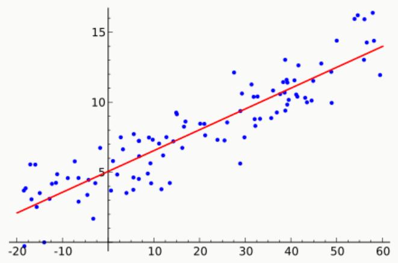
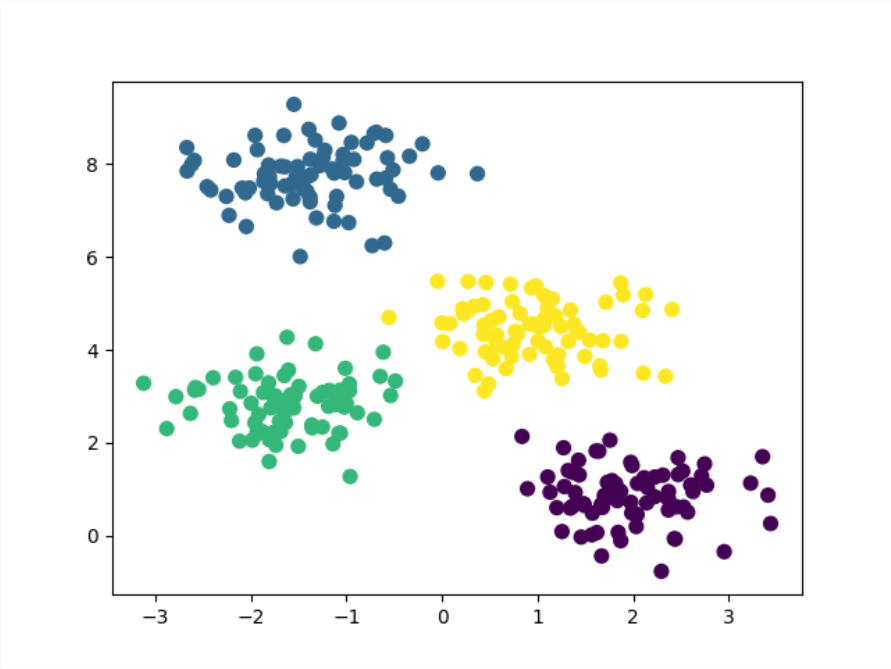
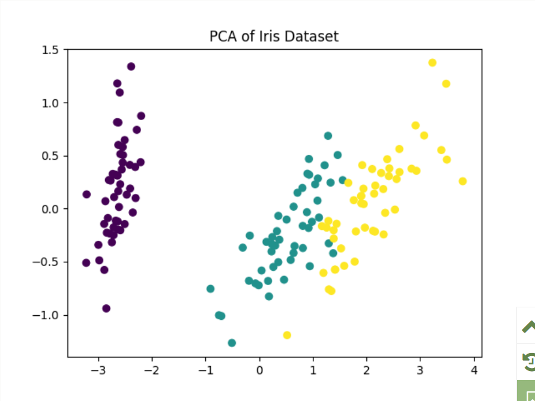

# 机器学习算法
机器学习算法可以分为监督学习、无监督学习、强化学习等类别。
**监督学习算法**：

- **线性回归（Linear Regression）**：用于回归任务，预测连续的数值。
- **逻辑回归（Logistic Regression）**：用于二分类任务，预测类别。
- **支持向量机（SVM）**：用于分类任务，构建超平面进行分类。
- **决策树（Decision Tree）**：基于树状结构进行决策的分类或回归方法。

**无监督学习算法**：

- **K-means聚类**：通过聚类中心将数据分组。
- **主成分分析（PCA）**：用于降维，提取数据的主成分。

每种算法都有其使用的场景，在实际应用中，可以根据数据的特征（如是否有标签、数据的维度等）来选择最合适的机器学习算法。

| 分类维度 | 类别 | 核心定义 | 典型算法 | 核心优缺点 | 使用场景 |
|---|---|---|---|---|---|
| **学习方法** | 监督学习 | 用带标签数据学习输入到输出的映射 | 逻辑回归、SVM、决策树、CNN、LSTM | 优点：预测精度高；缺点：以来高质量标注数据 | 分类、回归、图像识别、文本翻译 |
|  | 无监督学习 | 用无标签数据挖掘数据内在规律 | K-Means、PCA、DBSCAN、自编码器 | 优点：无需标注；缺点：结果可解释性弱 | 数据聚类、降维、异常检测、用户分群 |
|  | 半监督学习 | 结合少量标签数据和大量无标签数据训练 | 半监督SVM、标签传播算法 | 优点：降低标注成本；缺点：模型设计复杂 | 医疗影像分析、小众语种NLP |
|  | 强化学习 | 模型通过与环境交互，以奖励信号优化策略 | Q-Learning、DQN、PPO | 优点：适配动态决策；缺点：训练周期长 | 游戏AI、机器人控制、推荐策略优化 |
| **任务目标** | 分类算法 | 预测离散的类别标签 | 逻辑回归、随机森林、CNN | 优点：适配分类场景；缺点：对类别不平衡敏感 | 垃圾邮件识别、图像分类、疾病诊断 |
|  | 回归算法 | 预测连续的数值输出 | 线性回归、岭回归、XGBoost | 优点：输出连续值；缺点：对异常值敏感 | 房价预测、销量预测、温度预测 |
|  | 聚类算法 | 无标签下将相似数据归为一类 | K-Means、层次聚类、DBSCAN | 优点：自动分群；缺点：聚类效果依赖距离度量 | 市场细分、用户画像、异常检测 |
|  | 降维算法 | 减少特征维度，保留核心信息 | PCA、t-SNE、LDA | 优点：降低计算成本；缺点：可能丢失部分信息 | 高维数据可视化、特征预处理 |
| **模型结构** | 线性模型 | 假设输入与输出为线性关系 | 线性回归、逻辑回归、岭回归 | 优点：可解释性强、训练快；缺点：难以拟合非线性关系 | 简单分类回归、基线模型搭建 |
|  | 树模型 | 基于决策树构建、处理非线性关系 | 决策树、随机森林、XGBoost、LightGBM | 优点：无需特征归一化；缺点：树过深易过拟合 | 工业级分类回归、竞赛级任务 |
|  | 神经网络模型 | 多层神经元结构，自动提取复杂特征 | ANN、CNN、RNN、Transformer | 优点：拟合复杂关系；缺点：需大量数据和算力 | 图像识别、NLP、语音合成 |
|  | 概率模型 | 基于概率统计理论、计算概率分布 | 朴素贝叶斯、隐马尔科夫模型 | 优点：理论基础扎实；缺点：依赖强假设 | 文本分类、语音识别、序列标注 |

---

# 监督学习算法
## 线性回归（Linear Regression）
线性回归是一种用于回归问题的算法，它通过学习输入特征与目标值之间的线性关系，来预测一个连续的输出。
**应用场景**：预测房价、股票价格等。
线性回归的目标是找到一个最佳的线性方程：

$$y = w_{1}x_{1} + w_{2}x_{2} + ... + w_{n}x_{n} + b$$

- y是预测值（目标值）。
- $x_1,x_2,x_n$是输入特征。
- $w_1,w_2,w_n$是待学习的权重（模型参数）。
- b是偏置项。



接下来我们使用sklearn进行简单的房价预测：

```python
from sklearn.linear_model import LinearRegression
from sklearn.model_selection import train_test_split
import pandas as pd

# 假设我们有一个简单的房价数据集
data = {
    '面积': [50, 60, 80, 100, 120],
    '房价': [150, 180, 240, 300, 350]
}
df = pd.DataFrame(data)

# 特征和标签
X = df[['面积']]
y = df['房价']

# 数据分割
X_train, X_test, y_train, y_test = train_test_split(X, y, test_size=0.2, random_state=42)

# 训练线性回归模型
model = LinearRegression()
model.fit(X_train, y_train)

# 预测
y_pred = model.predict(X_test)

print(f"预测的房价: {y_pred}")
```

输出结果为：


## 逻辑回归（Logistic Regression）
逻辑回归是一种用于分类问题的算法，尽管名字中包含“回归”，它是用来处理二分类问题的。
逻辑回归通过学习输入特征与类别之间的关系，来预测一个类别标签。
**应用场景**：垃圾邮件分类、疾病诊断（是否患病）。
逻辑回归的输出是一个概率值，表示样本属于某一类别的概率。
通常使用 Sigmoid 函数：

$$P(y = 1 | X) = \frac{1}{1 + e^{-(w_{1}x_{1} + w_{2}x_{2} + ... + w_{n}x_{n} + b)}}$$

使用逻辑回归进行二分类任务：

```python
from sklearn.linear_model import LogisticRegression
from sklearn.datasets import load_iris
from sklearn.model_selection import train_test_split
from sklearn.metrics import accuracy_score

# 加载鸢尾花数据集
iris = load_iris()
X = iris.data
y = iris.target

# 只取前两类做二分类任务
X = X[y != 2]
y = y[y != 2]

# 数据分割
X_train, X_test, y_train, y_test = train_test_split(X, y, test_size=0.2, random_state=42)

# 训练逻辑回归模型
model = LogisticRegression()
model.fit(X_train, y_train)

# 预测
y_pred = model.predict(X_test)

# 评估模型
print(f"分类准确率: {accuracy_score(y_test, y_pred):.2f}")
```

输出结果为：


## 支持向量机（SVM）
支持向量机是一种常用的分类算法，它通过构造超平面来最大化类别之间的间隔（Margin），使得分类的误差最小。
**应用场景**：文本分类、人脸识别等。
使用SVM进行鸢尾花分类任务：

```python
from sklearn.svm import SVC
from sklearn.datasets import load_iris
from sklearn.model_selection import train_test_split
from sklearn.metrics import accuracy_score

# 加载鸢尾花数据集
iris = load_iris()
X = iris.data
y = iris.target

# 数据分割
X_train, X_test, y_train, y_test = train_test_split(X, y, test_size=0.3, random_state=42)

# 训练 SVM 模型
model = SVC(kernel='linear')
model.fit(X_train, y_train)

# 预测
y_pred = model.predict(X_test)

# 评估模型
print(f"SVM 分类准确率: {accuracy_score(y_test, y_pred):.2f}")
```

输出结果为：


## 决策树
决策树是一种基于树结构进行决策的分类和回归方法。它通过一系列的“判断条件”来决定一个样本属于哪个类别。
**应用场景**：客户分类、信用评分等。
使用决策树进行分类任务：

```python
from sklearn.tree import DecisionTreeClassifier
from sklearn.datasets import load_iris
from sklearn.model_selection import train_test_split
from sklearn.metrics import accuracy_score

# 加载鸢尾花数据集
iris = load_iris()
X = iris.data
y = iris.target

# 数据分割
X_train, X_test, y_train, y_test = train_test_split(X, y, test_size=0.3, random_state=42)

# 训练决策树模型
model = DecisionTreeClassifier(random_state=42)
model.fit(X_train, y_train)

# 预测
y_pred = model.predict(X_test)

# 评估模型
print(f"决策树分类准确率: {accuracy_score(y_test, y_pred):.2f}")
```

输出结果为：


---

# 无监督学习算法
## K-Means聚类（K-means Clustering）
K-means是一种基于中心点的聚类算法，通过不断调整簇的中心点，使每个簇中的数据点尽可能靠近簇中心。
**应用场景**：客户分群、市场分析、图像压缩。
使用K-Means进行客户分群：

```python
from sklearn.cluster import KMeans
from sklearn.datasets import make_blobs
import matplotlib.pyplot as plt

# 生成一个简单的二维数据集
X, _ = make_blobs(n_samples=300, centers=4, cluster_std=0.60, random_state=0)

# 训练 K-means 模型
model = KMeans(n_clusters=4)
model.fit(X)

# 预测聚类结果
y_kmeans = model.predict(X)

# 可视化聚类结果
plt.scatter(X[:, 0], X[:, 1], c=y_kmeans, s=50, cmap='viridis')
plt.show()
```

输出的图如下所示：



## 主成分分析（PCA）
PCA是一种降维技术，它通过线性变换将数据转移到新的坐标系中，是的大部分的方差集中在前几个主成分上。
**应用场景**：图像降维、特征选择、数据可视化。
使用PCA降维并可视化高维数据：

```python
from sklearn.decomposition import PCA
from sklearn.datasets import load_iris
import matplotlib.pyplot as plt

# 加载鸢尾花数据集
iris = load_iris()
X = iris.data
y = iris.target

# 降维到 2 维
pca = PCA(n_components=2)
X_pca = pca.fit_transform(X)

# 可视化结果
plt.scatter(X_pca[:, 0], X_pca[:, 1], c=y, cmap='viridis')
plt.title('PCA of Iris Dataset')
plt.show()
```

输出的图如下所示：



---

# 机器学习算法

| 中文全称 | 英文全称 | 简写 | 核心使用场景 |
|---|---|---|---|
| 传统机器学习算法 |  |  |  |
| 决策树 | Decision Tree | DT | 分类、回归、特征重要性分析 |
| 随机森林 | Random Forest | RF | 分类、回归、异常检测、特征筛选 |
| 逻辑回归 | Logistic Regression | LR | 二分类任务、概率预测、信用评分 |
| 支持向量机 | Support Vector Machine | SVM | 分类、高维小样本数据、文本分类 |
| 朴素贝叶斯 | Naive Bayes | NB | 文本分类、垃圾邮件识别、情感分析 |
| 梯度提升树 | Gradient Boosting Decision Tree | GBDT | 分类、回归、排序任务 |
| 极端梯度提升 | Extreme Gradient Boosting | XGBoost | 高精度分类回归、竞赛级任务、点击率预测 |
| 轻量级梯度提升机 | Light Gradient Boosting Machine | LightGBM | 大规模数据分类回归、实时预测、推荐系统 |
| K近邻算法 | K-Nearest Neighbor | KNN | 简单分类回归、推荐系统、异常检测 |
| K均值聚类 | K-Means Clustering | K-Means | 数据聚类、用户分群、图像分割 |
| 主成分分析 | Principal Component Analysis | PCA | 数据降维、高维数据可视化、特征去噪 |
| 深度学习算法 |  |  |  |
| 人工神经网络 | Artificial Neural Network | ANN | 简单分类回归、基线模型验证 |
| 卷积神经网络 | Convolutional Neural Network | CNN | 图像识别、目标检测、视频分析、医学影像诊断 |
| 循环神经网络 | Recurrent Neural Network | RNN | 序列数据处理、文本生成、语音识别 |
| 长短期记忆网络 | Long Short-Term Memory | LSTM | 长序列文本翻译、语音合成、时间序列预测 |
| 门控循环单元 | Gated Recurrent Unit | GRU | 序列分类、情感分析、对话系统 |
| 生成对抗网络 | Generative Adversarial Network | GAN | 图像生成、风格迁移、数据增强、超分辨率重建 |
| 变换器 | Transformer | Transformer | 自然语言翻译、文本摘要、多模态任务、大模型基础架构 |
| 自编码器 | Autoencoder | AE | 数据压缩、异常检测、特征提取 |
| 变分自编码 | Variational Autoencoder | VAE | 生成式任务、数据降噪、图像生成 |
| 图神经网络 | Graph Neural Network | GNN | 社交网络分析、分子结构预测、知识图谱推理 |
