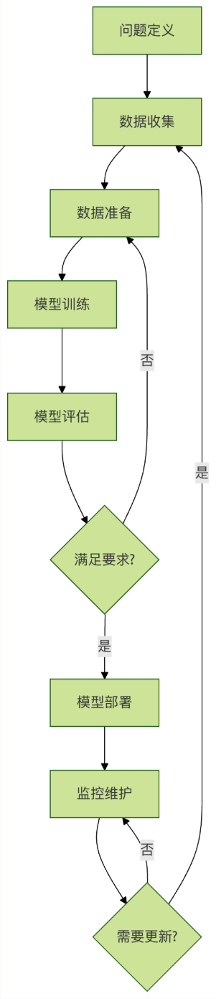
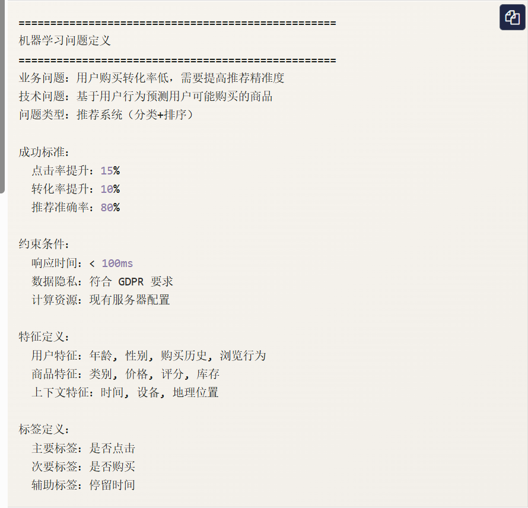

# 机器学习项目生命周期

机器学习项目就像建造一座房子，需要从设计图纸到施工再到验收的完整过程，每个环节都至关重要，缺一不可。

## 机器学习流程的六个核心阶段：

1. 问题定义：明确要解决什么问题
2. 数据收集：获取相关数据
3. 数据准备：清洗和预处理数据
4. 模型训练：选择算法并训练模型
5. 模型评估：评估模型性能
6. 模型部署：将模型投入使用



# 第一阶段:问题定义
## 明确业务问题
**问题定义是机器学习项目最重要的起点**，就像导航前需要明确目的地一样。
**关键问题**
**我们要解决什么问题？**

- 分类问题：判断邮件是否未垃圾文件
- 回归问题：预测房价
- 聚类问题：客户分群
- 异常检测：发现信用卡欺诈

**问什么这个问题重要？**

- 业务价值：提高效率、降低成本、增加收入
- 用户价值：改善体验、提供个性化服务

**成功的标准是什么？**

- 量化指标：准确率达到90%以上
- 业务指标：转化率提升20%

## 问题定义示例



# 第二阶段：数据收集
## 数据来源
**数据是机器学习的燃料**，没有合适的数据再好的算法也无法发挥作用。
**常见数据来源**

1. **内部数据**：公司业务数据、用户行为数据
2. **外部数据**：公开数据集、第三方数据服务
3. **网络爬虫**：网页数据、社交媒体数据
4. **传感器数据**：IoT设备、监控系统

## 数据收集示例：
```python
# 数据收集示例：模拟多种数据源
import pandas as pd
import numpy as np
from datetime import datetime, timedelta

class DataCollector:
    def __init__(self):
        self.collected_data = {}

    def collect_user_data(self,n_users=1000):
        """收集用户数据"""
        np.random.seed(42)

        user_data = {
            'user_id': list(range(1, n_users+1)),
            'age': np.random.randint(18,65,n_users),
            'gender': np.random.choice(['男', '女'], n_users),
            'city': np.random.choice(['北京','上海','广州','深圳'],n_users),
            'registration_date': [
                datetime.now() - timedelta(days=int(np.random.randint(1,365)))
                for _ in range(n_users)
            ]
        }

        df = pd.DataFrame(user_data)
        self.collected_data['users'] = df
        print(f"收集了 {len(df)} 条用户数据")
        return self.collected_data['users']

    def collect_behavior_data(self,n_behaviors=5000):
        """收集用户行为数据"""
        np.random.seed(42)

        user_ids = np.random.choice(range(1,1001), n_behaviors)
        product_ids = np.random.choice(range(1,501), n_behaviors)

        behavior_data = {
            'behavior_id': range(1, n_behaviors + 1),
            'user_id': user_ids,
            'product_id': product_ids,
            'behavior_type': np.random.choice(
                ['浏览', '点击', '加购物车', '购买'], n_behaviors,
                p=[0.4, 0.3, 0.2, 0.1]
            ),
            'timestamp': [
                datetime.now() - timedelta(minutes=int(np.random.randint(1, 10080)))
                for _ in range(n_behaviors)
            ],
            'duration': np.random.exponential(30, n_behaviors)  # 停留时间（秒）
        }

        df = pd.DataFrame(behavior_data)
        self.collected_data['behaviors'] = df
        print(f"收集了 {len(df)} 条行为数据")
        return self.collected_data['behaviors']

    def collect_product_data(self,n_products=500):
        """收集商品数据"""
        np.random.seed(42)

        categories = ['电子产品', '服装', '食品', '家居', '图书']
        product_data = {
            'product_id': range(1, n_products + 1),
            'category': np.random.choice(categories, n_products),
            'price': np.random.uniform(10, 1000, n_products),
            'rating': np.random.uniform(3.0, 5.0, n_products),
            'stock': np.random.randint(0, 1000, n_products)
        }

        df = pd.DataFrame(product_data)
        self.collected_data['products'] = df
        print(f"收集了 {len(df)} 条商品数据")
        return self.collected_data['products']

    def get_data_summary(self):
        """获取数据摘要"""
        print("\n数据收集摘要：")
        for name ,df in self.collected_data.items():
            print(f"\n{name} 数据集：")
            print(f"  形状：{df.shape}")
            print(f"  列名：{list(df.columns)}")
            print(f"  缺失值：{df.isnull().sum().sum()}")
            print(f"  示例数据：")
            print(df.head(2))

# 使用示例
collector = DataCollector()
collector.collect_user_data()
collector.collect_behavior_data()
collector.collect_product_data()
collector.get_data_summary()
```

# 第三阶段：数据准备
**数据准备占机器学习项目 60%-80% 的时间**，就像做菜前的准备工作一样重要。
**数据准备的主要任务**

1. **数据清洗**：处理缺失值、异常值、重复值
2. **特征工程**：创建新特征、选择重要特征
3. **数据转换**：标准化、归一化、编码
4. **数据划分**：训练集、验证集、测试集

## 数据准备示例

```python
# 数据准备示例
import pandas as pd
import numpy as np
from sklearn.preprocessing import StandardScaler, LabelEncoder
from sklearn.model_selection import train_test_split


class DataPreparer:
    def __init__(self, data):
        self.data = data.copy()
        self.processed_data = None

    def clean_data(self):
        """数据清洗"""
        print("开始数据清洗...")

        # 1. 处理缺失值
        print(f"处理前缺失值数量：{self.data.isnull().sum().sum()}")

        # 数值列用均值填充
        numeric_columns = self.data.select_dtypes(include=[np.number]).columns
        for col in numeric_columns:
            if self.data[col].isnull().sum() > 0:
                self.data[col].fillna(self.data[col].mean(), inplace=True)

        # 类别列用众数填充
        categorical_columns = self.data.select_dtypes(include=['object']).columns
        for col in categorical_columns:
            if self.data[col].isnull().sum() > 0:
                mode_val = self.data[col].mode()[0]
                self.data[col].fillna(mode_val, inplace=True)

        print(f"处理后缺失值数量：{self.data.isnull().sum().sum()}")

        # 2. 处理重复值
        duplicates_before = self.data.duplicated().sum()
        self.data.drop_duplicates(inplace=True)
        duplicates_after = self.data.duplicated().sum()
        print(f"删除重复值：{duplicates_before - duplicates_after} 条")

        # 3. 处理异常值（简单方法：使用 IQR）四分位距，又称箱线图
        for col in numeric_columns:
            Q1 = self.data[col].quantile(0.25)  # 下四分位线
            Q3 = self.data[col].quantile(0.75)  # 上四分位线
            IQR = Q3 - Q1
            lower_bound = Q1 - 1.5 * IQR        # 下边界
            upper_bound = Q3 + 1.5 * IQR        # 上边界

            outliers = ((self.data[col] < lower_bound) |
                        (self.data[col] > upper_bound)).sum()  # 异常值
            if outliers > 0:
                # 用边界值替换异常值
                self.data[col] = self.data[col].clip(lower_bound, upper_bound)
                print(f"处理 {col} 列的 {outliers} 个异常值")

        return self.data

    def feature_engineering(self):
        """特征工程"""
        print("\n开始特征工程...")

        # 1. 创建新特征（示例）
        if 'price' in self.data.columns and 'rating' in self.data.columns:
            # 创建性价比特征
            self.data['price_per_rating'] = self.data['price'] / self.data['rating']
            print("创建新特征：price_per_rating")

        # 2. 特征选择（简单示例：移除低方差特征）
        numeric_columns = self.data.select_dtypes(include=[np.number]).columns
        low_variance_features = []

        for col in numeric_columns:
            if self.data[col].var() < 0.01:  # 方差阈值
                low_variance_features.append(col)

        if low_variance_features:
            self.data.drop(columns=low_variance_features, inplace=True)
            print(f"移除低方差特征：{low_variance_features}")

        return self.data

    def transform_data(self):
        """数据转换"""
        print("\n开始数据转换...")

        # 1. 编码类别变量
        categorical_columns = self.data.select_dtypes(include=['object']).columns
        label_encoders = {}

        for col in categorical_columns:
            le = LabelEncoder()
            self.data[col] = le.fit_transform(self.data[col])
            label_encoders[col] = le
            print(f"编码类别变量：{col}")

        # 2. 标准化数值变量
        numeric_columns = self.data.select_dtypes(include=[np.number]).columns
        scaler = StandardScaler()

        if len(numeric_columns) > 0:
            self.data[numeric_columns] = scaler.fit_transform(self.data[numeric_columns])
            print(f"标准化数值变量：{list(numeric_columns)}")

        return self.data, label_encoders, scaler

    def split_data(self, target_column, test_size=0.2, val_size=0.2):
        """数据划分"""
        print(f"\n开始数据划分（测试集比例：{test_size}，验证集比例：{val_size}）...")

        X = self.data.drop(columns=[target_column])
        y = self.data[target_column]

        # 首先分离出测试集
        X_temp, X_test, y_temp, y_test = train_test_split(
            X, y, test_size=test_size, random_state=42
        )

        # 再从剩余数据中分离出验证集
        val_size_adjusted = val_size / (1 - test_size)
        X_train, X_val, y_train, y_val = train_test_split(
            X_temp, y_temp, test_size=val_size_adjusted, random_state=42
        )

        print(f"训练集大小：{X_train.shape[0]}")
        print(f"验证集大小：{X_val.shape[0]}")
        print(f"测试集大小：{X_test.shape[0]}")

        return {
            'X_train': X_train, 'y_train': y_train,
            'X_val': X_val, 'y_val': y_val,
            'X_test': X_test, 'y_test': y_test
        }

    def prepare_pipeline(self, target_column):
        """完整的数据准备流水线"""
        print("=" * 50)
        print("数据准备流水线")
        print("=" * 50)

        # 1. 数据清洗
        self.clean_data()

        # 2. 特征工程
        self.feature_engineering()

        # 3. 数据转换
        processed_data, encoders, scaler = self.transform_data()

        # 4. 数据划分
        splits = self.split_data(target_column)

        self.processed_data = processed_data
        return splits, encoders, scaler


# 创建示例数据并演示数据准备
np.random.seed(42)
sample_data = pd.DataFrame({
    'age': np.random.randint(18, 65, 1000),
    'income': np.random.normal(50000, 15000, 1000),
    'gender': np.random.choice(['男', '女'], 1000),
    'city': np.random.choice(['北京', '上海', '广州'], 1000),
    'target': np.random.choice([0, 1], 1000)
})

# 添加一些缺失值和异常值
sample_data.loc[np.random.choice(1000, 50), 'income'] = np.nan
sample_data.loc[np.random.choice(1000, 20), 'age'] = np.random.randint(100, 150)

preparer = DataPreparer(sample_data)
splits, encoders, scaler = preparer.prepare_pipeline('target')
```

# 第四阶段：模型训练
## 模型选择策略
**选择适合的模型是成功的关键**，就像选择合适的工具来完成工作一样。
**模型选择考虑因素**

1. **问题类型**：分类、回归、聚类等
2. **数据特征**：数据量、特征数量、数据类型
3. **性能要求**：准确率、速度、可解释性
4. **资源约束**：计算资源、时间限制

# 第五阶段：模型评估
## 评估指标选择
**选择合适的评估指标就像选择合适的尺子**，不同的指标适用于不同的场景。
**常见评估指标**
**分类问题：**

- 准确率（Accuracy）：正确预测的比例
- 精确率（Precision）：预测为正的样本中真正为正的比例
- 召回率（Recall）：实际为正的样本中被正确预测为正的比例
- F1分数：精确率和召回率的调和平均

**回归问题：**

- 均方误差（MSE）：预测值与真实值差的平方的平均
- 均方根误差（RMSE）：MSE的平方根
- 平均绝对误差（MAE）：预测值与真实值差的绝对值的平均
- R^2分数：模型解释的方差比例

# 第六阶段：模型部署
## 部署策略
**模型部署是将模型投入实际使用的过程**，就像将研发的产品推向市场一样。
**部署方式**

1. **批量预测**：定期处理大量数据
2. **实际预测**：在线服务，即使响应
3. **嵌入式部署**：将模型集成到现有系统
4. **边缘部署**：在设备端运行模型