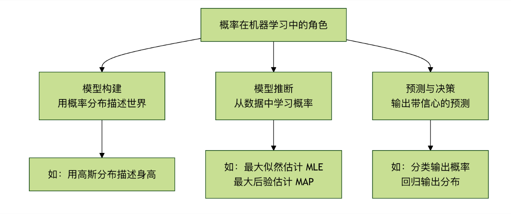

# 概率思维
想象一下，你正在教一个朋友识别猫和狗的照片，你不会说：这张图100%是猫，而可能会说：这张图看起来有90%的可能是猫，因为它有尖耳朵和胡须。这种可能性的表述，正是**概率思维**的核心。
在现实世界中，机器学习模型处理的数据几乎总是充满**不确定性**的：图像可能模糊、语音可能有噪音、用户行为难以预测。概率为我们提供了一套严谨的数学语言，来描述、量化和处理这种不确定性。它不仅是高级模型（如贝叶斯网络、高斯过程）的基础，更是理解模型输出、评估预测信心和做出稳健决策的关键。
简而言之，**概率思维是将猜测转化为可量化的信心的桥梁**，是机器学习从**硬编码规则**迈向**智能推理**的重要一步。

---

## 核心概率概念快速入门
再深入机器学习应用之前，我们需要建立几个基础的概率概念。
### 1.概率是什么？
**概率**是对某个事件发生的可能性的度量，范围在0到1之间。

- $P(A) = 0$：事件A**不可能**发生。
- $P(A) = 1$：事件A**必然**发生。
- $0 < P(A) < 1$：事件A以一定的**可能性**发生。

在机器学习中，一个事件可以是：这张图片是猫、用户明天会点击这个广告、下一个单词是**你好**。
### 2.条件概率： 世界是相互关联的
条件概率P(A|B)表示在事件B**已经发生**的条件下，事件A发生的概率。这是机器学习中至关重要的概念。
**生活化比喻**：

- P(下雨)：今天下雨的一般概率（先验概率）。
- P(下雨 | 乌云密布)：在已经看到“乌云密布”的条件下，今天下雨的概率（后验概率）。显然，后者的概率值会更高。

**公式**：$P(A | B) = P(A 且 B) / P(B),要求P(B) > 0。$
### 3.贝叶斯定理：从结果反推原因
贝叶斯定理是条件概率的一个华丽应用，它教会我们如何用**新证据（数据）来更新我们对一个假设的信念**。
**公式**：$P(假设 | 数据) = [P(数据 | 假设) * P(假设)] / P(数据)$
**让我们拆解这个“魔法公式”**：

- P(假设)：**先验概率**。在看到任何数据之前，我们对假设的初始信念。
  - 例如：在收到邮件前，我们认为任何邮件是垃圾邮件的概率是30%。
- P(数据 | 假设)：**似然度**。如果假设成立，我们观察到当前这批数据的可能性有多大。
  - 例如：如果一封邮件确实是垃圾邮件，那么它里面出现“免费”、“获奖”这些词的概率有多高。
- P(数据)：**证据**。观察到当前数据的总体概率，通常是一个归一化常数。
- P(假设 | 数据)：**后验概率**。在观察到数据之后，我们对假设更新后的新年。**这是我们最终追求的目标！**。
  - 例如：在看到了邮件中包含“免费”、“获奖”这些词后，这封邮件是垃圾邮件的更新概率是95%。

**贝叶斯定理的精髓**：它提供了一个系统性的框架，将我们的**先验知识**（P(假设)）与**观测到的数据**（P(数据 | 假设)）结合起来，得到更准确的**更新后认知**（P(假设 | 数据)）。

---

## 第二部分：概率在机器学习中的三大角色
概率思维渗透在机器学习的各个环节。主要扮演一下三种角色：



### 角色一：模型构建——用概率描述世界
许多机器学习模型本质上是一个**概率模型**。我们假设观测到的数据是由某个潜在的概率分布生成的。
**示例1**：**逻辑回归**它直接输出一个概率值。对于一个二分类问题（猫/狗），逻辑回归模型不会只说“这是猫”，而是输出P(类型=猫 | 图像数据)=0.9，表示模型有90%的信心认为这是猫。
**示例2**：**朴素贝叶斯分类器**直接应用贝叶斯定理进行分类。它假设特征之间相互独立，计算P(垃圾邮件 | 词1，词2，..)，并选择概率更高的类别。

```python
# 一个简化的思想示例：计算后验概率（非完整代码）
# 假设我们已从数据中统计出以下概率（似然和先验）
P_单词_给定_垃圾 = {"免费": 0.8, "会议": 0.1}  # 在垃圾邮件中，"免费"出现的概率
P_单词_给定_正常 = {"免费": 0.1, "会议": 0.9}  # 在正常邮件中，"会议"出现的概率
P_垃圾 = 0.3  # 先验概率：任意邮件是垃圾邮件的概率
P_正常 = 0.7  # 先验概率：任意邮件是正常的概率

# 对于一封包含"免费"和"会议"的邮件，计算它是垃圾邮件的后验概率（简化计算）
# 根据贝叶斯公式（忽略证据分母，因为比较时抵消）
score_垃圾 = P_单词_给定_垃圾["免费"] * P_单词_给定_垃圾["会议"] * P_垃圾
score_正常 = P_单词_给定_正常["免费"] * P_单词_给定_正常["会议"] * P_正常

print(f"属于垃圾邮件的得分: {score_垃圾:.4f}")
print(f"属于正常邮件的得分: {score_正常:.4f}")

if score_垃圾 > score_正常:
    print("预测：这是一封垃圾邮件。")
else:
    print("预测：这是一封正常邮件。")
```

### 角色二：模型推断与学习——寻找最可能的解释
如何从数据中找到那个最有可能生成这些数据的概率模型（即学习模型参数）？这里有两个核心思想：
**1.最大似然估计核心思想**：寻找能使**观测到当前数据**的概率（似然度）最大化的模型参数。**比喻**：侦探破案。侦探会问：“在哪种作案动机和方案下，最有可能产生我们目前看到的所有现场痕迹？”MLE就是在寻找这个“最可能”的假设。**优点**：数据驱动，完全依赖数据。**潜在缺点**：如果数据量少，可能过拟合；忽略先验知识。
**2.最大后验估计核心思想**：在最大似然的基础上，融入我们对参数的**先验知识**（P(假设)），寻找能使后验概率最大化的参数。**比喻**：有经验的侦探破案。它不仅看现场痕迹（数据），该会结合已知的嫌疑人惯用手法（先验）来综合判断。**优点**：能利用领域知识，在小数据集上表现更稳健，防止过拟合。

| 准则 | 全称 | 优化目标 | 核心思想 | 形象比喻 |
|---|---|---|---|---|
| MLE | 最大似然估计 | 最大化P(数据 | 参数) | 数据驱动：在已知观测数据的前提下，找到最有可能声称该数据的模型参数。 | 侦探断案：仅凭案发现场证据锁定嫌疑人。 |
| MAP | 最大后验估计 | 最大化P(参数 | 数据) | 先验 + 数据：结合先验知识和观测数据，计算参数的后验概率并取最大值。 | 法官判案：结合法律条文（先验）和证据（数据）作出判决。 |

### 角色三：预测与决策——输出带信息的答案
一个优秀的模型不仅要给出预测，还有给出**预测的不确定性**。

- **分类任务**：输出每个类别的概率（如：猫：0.85,狗：0.12,兔子：0.03）。这比单独输出“猫”包含了更多信息。我们可以根据概率阈值做决策（如：只有最高概率>0.8）时才会采纳。
- **回归任务**：高级的回归模型（如概率回归、贝叶斯线性回归）可以预测一个**分布**（如高斯分布），而不仅仅是一个点估计值.他会告诉你：“预测价格是100万元，并且有95%的把我认为真实价格在95万到105万之间。”

---

## 第三部分：实践练习——用概率思维解决一个简单问题
**场景**：一个简单的疾病检测。已知：

- 疾病在总人口中的发病率（先验概率）P(病) = 0.001。
- 检测方法的准确率：如果真有病，检测为阳性的概率P(阳 | 病) = 0.99（灵敏度）。如果没病，检测为阴性的概率P(阴 | 健康) = 0.99（特异度）。
- **问题**：如果一个人检测结果是阳性，他真正患病的概率P(病 | 阳)是多少？

**直觉陷阱**：很多人会认为高达99%，让我们用贝叶斯定理来计算。

```python
# 定义已知概率
P_disease = 0.001          # P(病)
P_positive_given_disease = 0.99   # P(阳|病)
P_negative_given_healthy = 0.99   # P(阴|健康)

# 计算派生概率
P_healthy = 1 - P_disease          # P(健康)
P_positive_given_healthy = 1 - P_negative_given_healthy  # P(阳|健康) = 1 - 特异度

# 计算全概率 P(阳)
# P(阳) = P(阳|病)*P(病) + P(阳|健康)*P(健康)
P_positive = (P_positive_given_disease * P_disease) + (P_positive_given_healthy * P_healthy)

# 应用贝叶斯定理计算 P(病|阳)
P_disease_given_positive = (P_positive_given_disease * P_disease) / P_positive

print(f"即使检测为阳性，真正患病的后验概率 P(病|阳) 仅为: {P_disease_given_positive:.2%}")
```

**运行结果与思考**：你会惊讶地发现，P(病 | 阳)只有大约9%!这是应为疾病发病率很低（先验概率低）、导致假阳性的数量远多于真阳性。这个例子深刻地展示了：

1. **先验知识的重要性**：忽略基础发病率会导致严重误判。
2. **贝叶斯推理的力量**：它迫使我们将所有相关信息（基础率、检测准确率）纳入考量。
3. **概率思维的实用性**：它能纠正我们直觉上的系统性偏差。

---

## 总结与进阶方向
**概率思维的核心收获**：

1. **拥抱不稳定性**：世界是不确定的，模型的输出也应是概率化的。
2. **贝叶斯是更新的哲学**：通过`先验 + 数据 -> 后验`的框架，持续用新证据修正认知。
3. **决策需要概率**：一个好的预测应该附带“信息分数”，以支持风险可控的决策。

**如果你想继续深入**：

- **理论层面**：学习**概率图模型**，它用图结构优雅地表示变量间的复杂概率依赖关系。
- **算法层面**：探索**变分推断**和**马尔科夫链蒙特卡洛**方法，他们是求解复杂贝叶斯模型的利器。
- **应用层面**：研究**贝叶斯优化**（用于超参数调优）、**高斯过程**（用于回归和优化）以及**深度生成模型**（如变分自编码器VAE、扩散模型）。