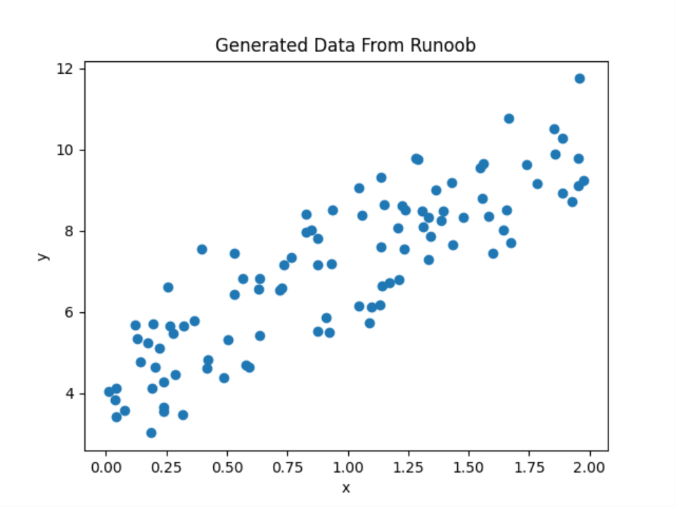
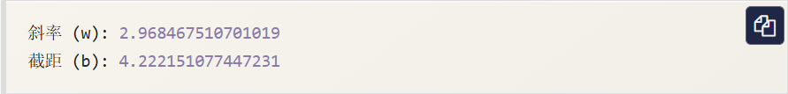
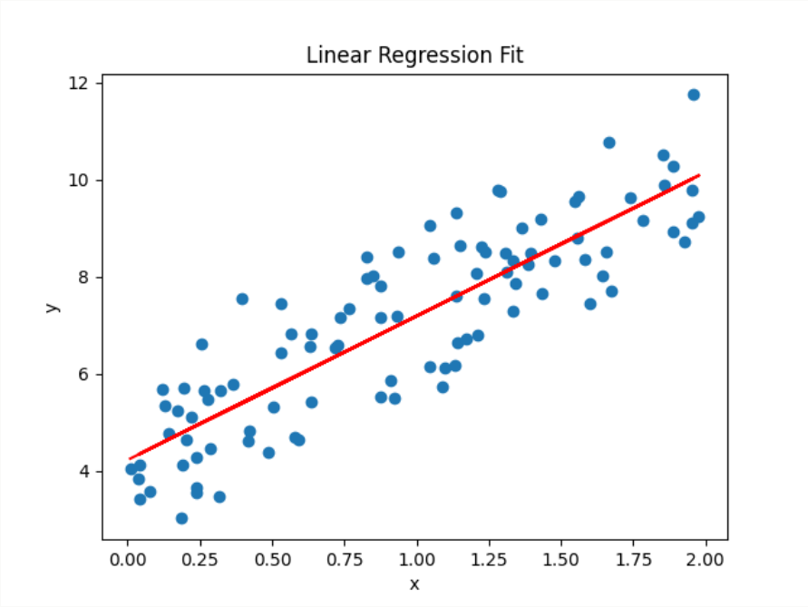
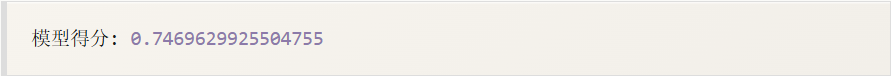
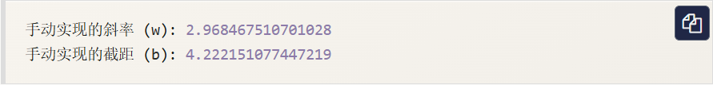
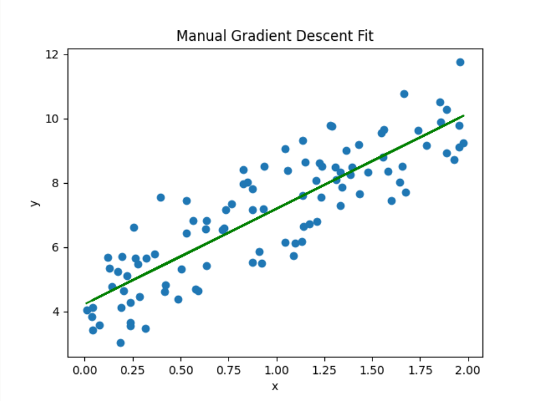

# 线性回归（Linear Regression）
线性回归（Linear Regression）是机器学习中最基础且广泛应用的算法之一。
线性回归（Linear Regression）是一种用于预测连续值的最基本的机器学习算法，它假设目标变量`y`和`x`之间存在线性关系，并试图找到一条最佳拟合直线来描述这种关系。

$$y = w * x + b$$

其中：

- y是预测值
- x是特征变量
- w是权重（斜率）
- b是偏置（截距）

线性回归的目标是找到最佳的w和b，使得预测值y与真实值之间的误差最小。常用的误差函数是均方误差（MSE）：

$$MSE = \frac{1}{n} * \displaystyle \sum{(y_i - y_pred_i)^2}$$

其中：

- $y_i$是实际值。
- $y_pred_i$是预测值。
- $n$是数据点的数量。

我们的目标是通过调整w和b，使得MSE最小化。
# 如何求解线性回归？
## 1、最小二乘法
最小二乘法是一种常用的求解线性回归的方法，它通过求解以下方程来找到最佳的（w）和（b）。
最小二乘法的目标是最小化残差平方和（RSS），其公式为：

$$RSS = \sum^{n}_{i=1}{(y_i - \hat{y}_i)}$$

其中：

- $y_i$是实际值。
- $\hat{y}_i$是预测值，由线性回归模型 $\hat{y}_i = wx_i + b$。

通过最小化RSS，可以得到以下正规方程：

$$
\begin{cases}
    w \displaystyle \sum_{i=1}^{n}{x^{2}_{i}} + b \displaystyle \sum_{i=1}^{n}{x_i} = \displaystyle \sum_{i=1}^{n}{x_{i}y_{i}} \\
    w \displaystyle \sum_{i=1}^{n}{x_{i}} + bn = \displaystyle \sum_{i_1}^{n}{y_i}
\end{cases}
$$

### 矩阵形式
将正规方程写成矩阵形式：

$$
\left[
\begin{matrix}
\displaystyle \sum_{i=1}^n x_i^2 & \displaystyle \sum_{i=1}^n x_i \\
\displaystyle \sum_{i=1}^n x_i & n
\end{matrix}
\right]
\left[
\begin{matrix}
w \\
b
\end{matrix}
\right]
=
\left[
\begin{matrix}
\displaystyle \sum_{i=1}^n x_i y_i \\
\displaystyle \sum_{i=1}^n y_i
\end{matrix}
\right]
$$

### 求解方法
通过求解上述矩阵方程，可以得到最佳的w和b：

$$
\left[
    \begin{matrix}
        w \\
        b
    \end{matrix}
\right]
=
\left[
    \begin{matrix}
        \displaystyle \sum_{i=1}^{n}{x^{2}_{i}} 
        &
        \displaystyle \sum^{n}_{i=1}{x_i}
        \\
        \displaystyle \sum^{n}_{i=1}{x_i}
        &
        n
    \end{matrix}
\right]
^{-1}
\left[
    \begin{matrix}
        \displaystyle \sum^{n}_{i=1}{x_{i}y_{i}}
        \\
        \displaystyle \sum^{n}_{i=1}{y_i}
    \end{matrix}
\right]
$$

## 2、梯度下降法
梯度下降法的目标是最小化损失函数$J(w,b)$。对于线性回归问题，通常使用均方误差（MSE）最为损失函数：

$$J(w,b) = \frac{1}{2m} \sum^m_{i = 1}(y_i - \hat{y}_i)^2$$

其中：

- $m$是样本数量。
- $y_i$是实际值。
- $\hat{y}_i$是预测值，由线性回归模型 $\hat{y}_i = wx_i + b$ 计算得到。

梯度是损失函数对参数的偏导数，表示损失函数在参数空间中的变化方向。对于线性回归，梯度计算如下：

$$
\begin{align}
    \frac{\partial{J}}{\partial{w}} = - \frac{1}{m} \sum_{i=1}^m{x_i(y_i - \hat{y}_i)}
    \\
    \frac{\partial{J}}{\partial{b}} = - \frac{1}{m} \sum_{i=1}^m{(y_i - \hat{y}_i)}
\end{align}
$$

### 参数更新规则
梯度下降法通过以下规则更新参数 $w$ 和 $b$ ：

$$
\begin{align}
    w := w - \alpha \frac{\partial{J}}{\partial{w}}
    \\
    b := b - \alpha \frac{\partial{J}}{\partial{b}}
\end{align}
$$

其中：

- $\alpha$ 是学习率（learning rate），控制每次更新的步长。

### 梯度下降法的步骤

1. **初始化参数**：初始化 $w$ 和 $b$ 的值（通常设为0或随机值）。
2. **计算损失函数**：计算当前参数下的损失函数值 $J(w,b)$ 。
3. **计算梯度**：计算损失函数对 $w$ 和 $b$ 偏导数。
4. **更新参数**：根据梯度更新 $w$ 和 $b$ 。
5. **重复迭代**：重复步骤2到4，直到损失函数收敛或达到最大迭代次数。

# 使用Python实现线性回归
下面我们通过一个简单的例子来演示如何使用Python实现线性回归。
## 1、导入必要的库

```python
import numpy as np
import matplotlib.pyplot as plt
from sklearn.linear_model import LinearRegression
```

## 2、生成模拟数据

```python
import numpy as np
import matplotlib.pyplot as plt
from sklearn.linear_model import LinearRegression

# 生成一些随机数据
np.random.seed(0)
x = 2 * np.random.rand(100,1)
y = 4 + 3 * x + np.random.randn(100,1)

# 可视化数据
plt.scatter(x, y)
plt.xlabel('x')
plt.ylabel('y')
plt.title('Generated Data From Runoob')
plt.show()
```

显示如下所示：



## 3、使用 Scikit-learn 进行线性回归

```python
import numpy as np
import matplotlib.pyplot as plt
from sklearn.linear_model import LinearRegression

# 生成一些随机数据
np.random.seed(0)
x = 2 * np.random.rand(100,1)
y = 4 + 3 * x + np.random.randn(100,1)

# 创建线性回归模型
model = LinearRegression()

# 拟合模型
model.fix(x, y)

# 输出模型的参数
print(f'斜率(w): {model.coef_[0][0]}')
print(f'截距(b): {model.intercept_[0]}')

# 预测
y_pred = model.predict(x)

# 可视化拟合结果
plt.scatter(x, y)
plt.plot(x, y_pred, color='red')
plt.xlabel('x')
plt.ylabel('y')
plt.title('Linear Regression Fit')
plt.show()
```

输出结果：



显示如下所示：



我们可以使用`score()`方法来评估模型性能，返回 $R^2$ 值。

```python
import numpy as np
from sklearn.Linear_model import LinearRegression

# 生成一些随机数据
np.random.seed(0)
x = 2 * np.random.rand(100,1)
y = 4 + 3 * x + np.random.randn(100,1)

# 创建线性回归模型
model = LinearRegression()

# 拟合模型
model.fit(x, y)

# 计算模型得分
score = model.score(x, y)
print('模型得分:', score)
```

输出结果为：



## 4、手动实现梯度下降法

```python
import numpy as np
import matplotlib.pyplot as plt
from sklearn.linear_model import LinearRegression

# 生成一些数据
np.random.seed(0)
x = 2 * np.random.rand(100,1)
y = 4 + 3 * x + np.random.randn(100,1)

# 初始化参数
w = 0
b = 0
learning_rate = 0.1
n_iterations = 1000

# 梯度下降
for i in range(n_iterations):
    y_pred = w * x + b
    dw = -(2/len(x)) * np.sum(x * (y - y_pred))
    db = -(2/len(x)) * np.sum(y - y_pred)
    w = w - learning_rate * dw
    b = b -learning_rate * db

# 输出最终参数
print(f'手动实现的斜率(w):{w}')
print(f'手动实现的截距(b):{b}')

# 可视化手动实现的拟合结果
y_pred_manual = w * x + b
plt.scatter(x, y)
plt.plot(x, y_pred_manual, color='green')
plt.xlabel('x')
plt.ylabel('y')
plt.title('Manual Gradient Descent Fit')
plt.show()
```

输出结果：



显示如下所示：

