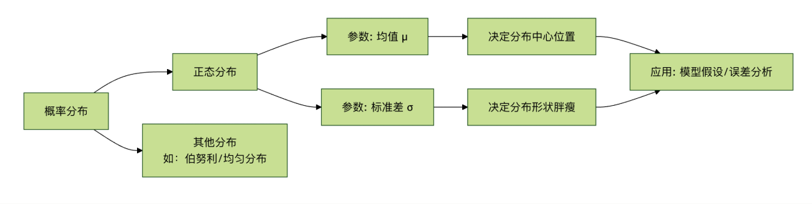

# 统计学基础
在学习各种炫酷的算法之前，我们需要先打好一个至关重要的基础——**统计学**。
我们可以把统计学想象成机器学习的**语言** 和 **工具箱**，没有它，机器学习模型就像没有地图的探险家，无法理解数据、做出预测或评估自己的表现。
本文将为你系统性地介绍机器学习中必备的统计学核心概念，用通俗的语言和生动的例子，帮助你构建坚实的理论基础。

---

## 问什么机器学习需要统计学？
**核心原因**：机器学习本质上是**从数据中学习规律**，并用这个规律对未知情况进行**预测** 或 **决策**。而统计学，正是研究如何收集、分析、解释和呈现数据的科学。

- **数据理解**：统计学帮助我们描述数据的基本特征（比如平均身高、收入分布），这是数据清洗和探索的第一步。
- **规律挖掘**：它提供了从数据中推断出普遍规律（模型）的方法，并告诉我们这个规律有多可靠。
- **预测与评估**：统计学理论支撑着我们如何用模型进行预测，以及如何客观地评估一个模型的好坏（是瞎猜还是真懂？）
- **不确定性量化**：现实世界充满噪声，统计学让我们能够度量预测中的不确定性（例如，“我有95%的把握认为明天会下雨”）。

简单来说，**统计学是机器学习的理论基石，让智能从玄学变为科学**。

---

## 核心概念一：描述性统计
描述性统计就像给数据拍快照和体检报告，用几个关键指标来概括数据集的全貌。这是任何数据分析项目的起点。
### 1.集中趋势：数据围绕那里聚集？
这组指标告诉我们数据的中心或典型值在哪里。

| 指标 | 解释（比喻） | 计算公式（简述） | 特点与用途 |
|---|---|---|---|
| **均值** | 所有数据的算数平均值。好比“平均工资”。 | 总和 / 数据个数 | **最常用**，但对极端值（如亿万富翁）非常敏感，容易“被平均”。 |
| **中位数** | 将数据从小到大排序后，**正中间**的那个值。好比“工资中位数”。 | 排序后取中间位置的值 | **稳健**，不受极端值影响，能更好地反应普通情况。 |
| **众数** | 数据中出现**次数最多**的值。好比店里最畅销的鞋码。 | 出现频率最高的值 | 是用于分类数据，或寻找最普遍的类别。 |

**示例**：一个部门5名员工的月薪（单位：千元）为：[30, 35, 40, 45, 200]（老板也在其中）。

- **均值** = (30+35+40+45+200)/5 = 70。这个值因为老板的200而虚高，不能代表员工收入。
- **中位数** = 排序后的第三个数40.这个值更能代表该部门“典型”员工的收入。
- **众数** = 所有值只出现一次，所以**没有众数**。

## 2.离散程度：数据有多分散？
光知道中心不够，我们还需要直到数据是紧密围绕中心，还散落四处。离散程度衡量数据的波动性或多样性。

| 指标 | 解释（比喻） | 计算公式（简述） | 特点与用途 |
|---|---|---|---|
| **方差** | 每个数据点与均值距离的**平方**的平均值。 | $$\sum(每个值 - 均值)^2 / (n - 1)$$ | 衡量总体离散程度，单位是原单位的平方。 |
| **标准差** | **方差的正平方根**。好比“平均波动幅度”。 | $$\sqrt{方差}$$ | **最常用**，单位与原数据一致，直观反映波动大小。值越大，数据越分散。 |
| **极差** | 最大值与最小值的差。“工资跨度”。 | 最大值 - 最小值 | 计算简单，但只有两个极端值决定，容易受异常值影响。 |

**接上例**：计算员工薪资的标准差（均值用40估算更合理）。

1. 计算方差：$[(30-40)^2 + (35-40)^2 + (40-40)^2 + (45-40)^2 + (200-40)^2] / 4 \approx 5875$
2. 标准差 = $\sqrt{5875} \approx 76.65$。这个巨大的标准差（76.65）远大于均值（40），**强烈提示数据中存在极端异常值（老板的200）**，需要进一步分析。

## 3.数据分布与可视化
数字指标是抽象的，图标能让我们直观“看到”数据。

- **直方图**：展示数据在不同区间（桶）内的频率分布。可以看出数据是单峰还是多峰，是否对称。
- **箱线图**：用一个“箱子”和“触须”展示数据的**最小值、第一四分位数（Q1）、中位数（Q2）、第三四分位数（Q3）、最大值**，是识别**异常值**的利器。

```python
# Python 示例：使用 matplotlib 和 seaborn 绘制箱线图来识别异常值
import matplotlib.pyplot as plt
import seaborn as sns
import numpy as np

# 员工薪资数据，包含一个异常值
salaries = np.array([30, 35, 40, 45, 200])
employee_names = ['Alice', 'Bob', 'Charlie', 'Diana', 'Boss']

plt.figure(figsize=(8, 5))
# 创建箱线图
sns.boxplot(y=salaries)
plt.title('Department Salary Distribution (Boxplot)')
plt.ylabel('Salary (k)')
plt.grid(axis='y', linestyle='--', alpha=0.7)

# 标注出异常值对应的点
for i, (name, salary) in enumerate(zip(employee_names, salaries)):
    if salary > 45 + 1.5 * (45-35): # 简单异常值判断规则
        plt.annotate(f'{name}: {salary}', xy=(0, salary), xytext=(0.2, salary),
                     arrowprops=dict(facecolor='red', shrink=0.05))
plt.show()
```

**代码解释**：

- `sns.boxplot()`绘制箱线图。箱体从Q1到Q3，中间线是中位数。
- 箱线图的“触须”通常延伸到1.5倍四分位距（IQR = Q3 - Q1）以内的最远数据点，之外的点被视为**异常值**并用点单独标出。图中200这个点被清晰地识别为异常值。

---

## 核心概念二：概率与分布
如果说描述性统计是看历史，那么概率就是预测未来。它量化了**某件事情发生地可能性**。
### 1.基本概率

- **概率P(A)**：事件A发生的可能性，范围在0（不可能）到1（必然）之间。
- **条件概率P(A|B)**：在时间B**已经发生**的条件下，事件A发生的概率。这是理解很多机器学习算法（如朴素贝叶斯）的关键。
  - $P(A|B) = P(A 且 B) / P(B)$

### 2.概率分布
描述一个随机变量取各种可能值的概率规律。机器学习中最重要的是：

- **正态分布(高斯分布)**：
  - **形状**：著名的“钟形曲线”，左右对称。
  - **参数**：由**均值($\mu$)**决定中心位置，**标准差($\theta$)**决定曲线的“胖瘦”（分散程度）。
  - **重要性**：自然界和社会科学中大量现象都近似服从正态分布（如身高、测试误差）。中心极限定理指出，多个独立随机变量之和趋向于正态分布，这使其成为统计推断的基石。
  - **68-95-99.7法则**：数据落在均值$\pm{1\sigma}、\pm{2\sigma}、\pm{3\sigma}$范围内的概率分别为68%、95%、99.7%。



---

## 核心概念三：推断性统计
这是统计学的“升级版”，目标是从**样本**数据推断**总体**的性质。机器学习中，我们总在用有限的数据（样本）训练模型，希望它能在无限的真实世界（总体）中表现良好。
### 1.中心极限定理
**核心思想**：无论总体是什么分布，当我们从总体中抽取大量**独立**的随机样本，并计算每个样本的**均值**，这些样本均值的分布会趋近于一个**正态分布**。
**对机器学习的意义**：这为我们利用正态分布的性质来对模型参数（如均值）进行**假设检验**和构建**置信区间**提供了理论依据。即使我们不知道总体的真实分布，也能对基于样本得到的估计值进行可靠性分析。
### 2.假设检验
用于判断一个关于总体的假设（如“新药无效”）是否被样本数据所支持。

- **零假设(H0)**：通常表示“没有效果”、“没有差异”（默认立场）。
- **备择假设(H1)**：我们希望正式的假设（如“新药有效”）。
- **P值**：在零假设成立的前提下，观察当前样本数据（或更极端数据）的概率。
  - **如何判断**：如果P值很小（通常 < 0.05）,意味着在H0下当前情况极难发生，于是我们有足够证据**拒绝H0**，接受H1。
- **显著性水平($\alpha$)**：判断P值是否“足够小”的阈值，常设为0.05。

**机器学习中的应用**：用于特征选择，判断某个特征与目标变量之间是否存在统计上显著的相关性，而非偶然关联。

### 3.相关性与因果性
这是数据分析中最容易混淆，也最重要的概念之一。

- 相关性：衡量两个变量**同时变化**的趋势。常用**相关系数(-1到1)**表示。
  - **1**：完全正相关（同增同减）。
  - **-1**：完全负相关（一增一减）。
  - **0**：无线性相关。
- **因果性**：指一个变量（因）的**变化直接导致**另一个变量（果）的变化。

**关键区别：相关性不等于因果性！**

- **经典谬误**：夏天冰激淋销量和溺水人数高度正相关。但这并不意味着吃冰激淋导致溺水。其**共同原因（混杂变量）是天气炎热**。
- **机器学习的启示**：机器学习模型（尤其是预测模型）善于发现**相关性**，但无法自行确定**因果性**。将模型发现的强相关关系误认为是因果关系，是实践中常见的错误。建立因果模型需要更严谨的实验设计（如随机对照试验）或特殊的因果推断方法。

---

## 实践练习：用Python进行基础统计分析
让我们用Python个著名的pandas、seaborn库，对一个真实数据集进行简单的描述性和探索性统计分析。

```python
import pandas as pd
import seaborn as sns
import matplotlib.pyplot as plt
import numpy as np

# 1. 加载数据集（这里使用 seaborn 自带的'tips'小费数据集）
df = sns.load_dataset('tips')
print("数据集前5行：")
print(df.head())
print(f"\n数据集形状：{df.shape}") # 查看行数和列数
print("\n基本信息：")
print(df.info())
print("\n描述性统计：")
print(df.describe())

# 2. 探索数值型变量：总账单（total_bill）和小费（tip）
print(f"\n总账单的均值：{df['total_bill'].mean():.2f}")
print(f"总账单的中位数：{df['total_bill'].median():.2f}")
print(f"总账单的标准差：{df['total_bill'].std():.2f}")
print(f"小费与总账单的相关系数：{df['tip'].corr(df['total_bill']):.3f}")

# 3. 可视化
fig, axes = plt.subplots(2, 2, figsize=(12, 10))

# 3.1 总账单的直方图与密度估计
sns.histplot(df['total_bill'], kde=True, ax=axes[0, 0])
axes[0, 0].set_title('Distribution of Total Bill')
axes[0, 0].axvline(df['total_bill'].mean(), color='red', linestyle='--', label=f'Mean: {df["total_bill"].mean():.1f}')
axes[0, 0].axvline(df['total_bill'].median(), color='green', linestyle='--', label=f'Median: {df["total_bill"].median():.1f}')
axes[0, 0].legend()

# 3.2 小费与总账单的散点图（看相关性）
sns.scatterplot(data=df, x='total_bill', y='tip', hue='time', ax=axes[0, 1])
axes[0, 1].set_title('Tip vs Total Bill (Colored by Meal Time)')

# 3.3 按性别分组的小费箱线图（比较组间差异）
sns.boxplot(data=df, x='sex', y='tip', ax=axes[1, 0])
axes[1, 0].set_title('Tip Amount by Gender')

# 3.4 吸烟与否的账单均值柱状图
bill_by_smoker = df.groupby('smoker')['total_bill'].mean().reset_index()
sns.barplot(data=bill_by_smoker, x='smoker', y='total_bill', ax=axes[1, 1])
axes[1, 1].set_title('Average Total Bill by Smoking Status')
for index, row in bill_by_smoker.iterrows():
    axes[1, 1].text(index, row['total_bill']+0.5, f"{row['total_bill']:.1f}", ha='center')

plt.tight_layout()
plt.show()
```

**练习任务**：
**运行代码**：在你的Python环境中运行上述代码，观察输出和图表。
**解读结果**：

- 从描述性统计表中，你能说出总账单的大致范围和中位数吗？
- 小费和总账单是正相关还是负相关？从散点图中能看出来吗？
- 从箱线图看，男性和女性给的小费中位数有显著差异吗？

**提出假设**：基于“吸烟与否的账单均值”柱状图，你能提出一个可以用于**假设检验**的零假设吗？（例如：H0：吸烟者和非吸烟者的平均账单没有差异）。