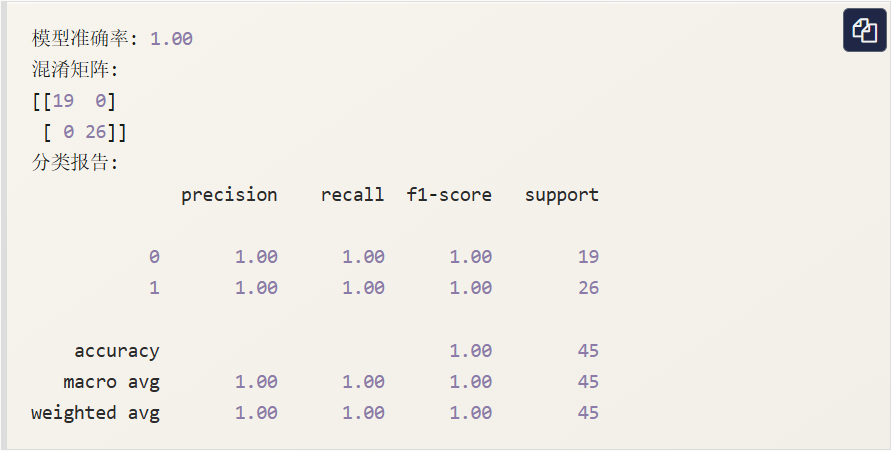
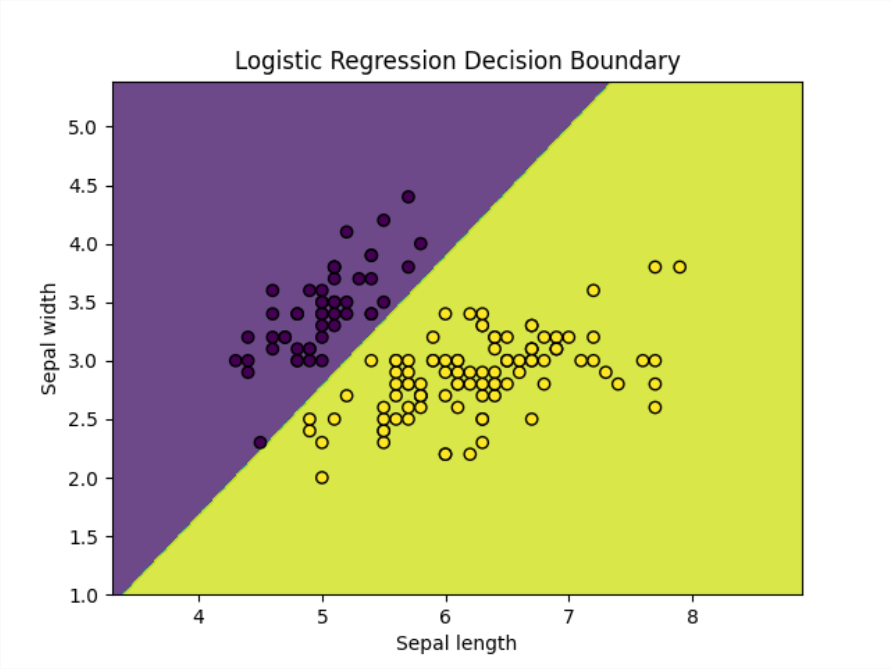

# 逻辑回归（Logistic Regression）
逻辑回归（Logistic Regression）是一种广泛应用于分类问题的统计学习方法，尽管名字中带有“回归”，但它实际上是一种用于二分类或多分类问题的算法。
逻辑回归通过使用逻辑函数（也称 `Sigmoid` 函数）将线性回归的输出映射到 0 到 1 之间，从而预测某个事件的发生的概率。
逻辑回归广泛应用于各种分类问题，例如：

- 垃圾邮件检测（是垃圾邮件/不是垃圾邮件）
- 疾病预测（患病/不患病）
- 客户流失预测（流失/不流失）

## 逻辑回归模型
逻辑回归的目标是预测一个而分类结果 $y \in \{ 0,1 \}$ ，它通过如下的公式建立模型：

$$
    p(y = 1 | X) = \sigma(w^TX + b)
$$

其中：

- $X$ 是输入特征（可以是多个特征组成的向量）。
- $w$ 是权重向量。
- $b$ 是偏置项。
- $\sigma(z) = \displaystyle \frac{1}{1 + e^{-z}}$ 是`Sigmoid`函数。

`Sigmoid`函数将模型的输出值（ $w^TX + b$ ）映射到 0 到 1 之间，因此他可以看作是属于类别1的概率。

## 损失函数
逻辑回归的损失函数是对数损失函数（`Log Loss`），其形式如下：

$$
    J(w, b) = - \displaystyle \frac{1}{m} \displaystyle \sum_{i=1}^m{
        \left[
            y^{(i)}log(h_{\theta}(x^{(i)}))
            +
            (1 - y^{(i)})log(1 - h_{\theta}(x^{(i)}))
        \right]
    }
$$

其中：

- $m$ 是训练样本的数量。
- $h_{\theta}(x) = \sigma(w^TX + b)$ 是逻辑回归的预测概率。

## 梯度下降法求解
和线性回归一样，逻辑回归通常也是用梯度下降法来优化巡视函数，求解参数 $w$ 和 $b$ 。逻辑回归的梯度更新规则如下：

对 $w$ 的梯度：

$$
    \displaystyle \frac{\partial J(w,b)}{\partial w}
    = 
    \displaystyle \frac{1}{m} \sum_{i=1}^m (h_{\theta}(x^{(i)}) - y^{(i)})x^{(i)}
$$

对 $b$ 的梯度：

$$
    \displaystyle \frac{\partial J(w,b)}{\partial b}
    =
    \displaystyle \frac{1}{m} \sum_{i=1}^m (h_{\theta}(x^{(i)}) - y^{(i)})
$$

通过不断更新 $w$ 和 $b$ ，直到损失函数收敛。

---

# 使用 Python 实现逻辑回归
接下来，我们将使用 Python 和 Scikit-learn 库来实现一个简单的逻辑回归模型。
## 1、导入必要的库

```python
import numpy as np
import matplotlib.pyplot as plt
from sklearn.datasets import load_iris
from sklearn.model_selection import train_test_split
from sklearn.linear_model import LogisticRegression
from sklearn.metrics import accuracy_score, confusion_matrix, classification_report
```

## 2、加载数据集
我们将使用 `Scikit-learn` 自带的 `Iris` 数据集。`Iris` 数据集包含 150 个样本，每个样本有 4 个特征，目标是将样本分为 3 类。为了简化问题，我们只使用前两个特征，并将问题转化为二分类问题。

```python
# 加载数据集
iris = load_iris()
X = iris.data[:, :2] # 只是用前两个特征
y = (iris.target != 0) * 1 # 将目标转化为二分类问题

# 划分训练集和测试集
X_train, X_test, y_train, y_test = train_test_split(X, y, test_size=0.3, random_state=42)
```

## 3、训练逻辑回归模型

```python
# 创建逻辑回归模型
model = LogisticRegression()

# 训练模型
model.fit(X_train, y_train)
```

## 4、模型评估

```python
import numpy as np
import matplotlib.pyplot as plt
from sklearn.datasets import load_iris
from sklearn.model_selection import train_test_split
from sklearn.linear_model import LogisticRegression
from sklearn.metrics import accuracy_score, confusion_matrix, classification_report

# 加载数据集
iris = load_iris()
X = iris.data[:, :2]  # 只使用前两个特征
y = (iris.target != 0) * 1  # 将目标转化为二分类问题

# 划分训练集和测试集
X_train, X_test, y_train, y_test = train_test_split(X, y, test_size=0.3, random_state=42)


# 创建逻辑回归模型
model = LogisticRegression()

# 训练模型
model.fit(X_train, y_train)

# 预测测试集
y_pred = model.predict(X_test)

# 计算准确率
accuracy = accuracy_score(y_test, y_pred)
print(f"模型准确率: {accuracy:.2f}")

# 混淆矩阵
conf_matrix = confusion_matrix(y_test, y_pred)
print("混淆矩阵:")
print(conf_matrix)

# 分类报告
class_report = classification_report(y_test, y_pred)
print("分类报告:")
print(class_report)
```

输出结果为：



## 5、可视化决策边界

```python
import numpy as np
import matplotlib.pyplot as plt
from sklearn.datasets import load_iris
from sklearn.model_selection import train_test_split
from sklearn.linear_model import LogisticRegression
from sklearn.metrics import accuracy_score, confusion_matrix, classification_report

# 加载数据集
iris = load_iris()
X = iris.data[:, :2]  # 只使用前两个特征
y = (iris.target != 0) * 1  # 将目标转化为二分类问题

# 划分训练集和测试集
X_train, X_test, y_train, y_test = train_test_split(X, y, test_size=0.3, random_state=42)


# 创建逻辑回归模型
model = LogisticRegression()

# 训练模型
model.fit(X_train, y_train)

# 预测测试集
y_pred = model.predict(X_test)

# 可视化决策边界
x_min, x_max = X[:, 0].min() - 1, X[:, 0].max() + 1
y_min, y_max = X[:, 1].min() - 1, X[:, 1].max() + 1
xx, yy = np.meshgrid(np.arange(x_min, x_max, 0.01),
                     np.arange(y_min, y_max, 0.01))

Z = model.predict(np.c_[xx.ravel(), yy.ravel()])
Z = Z.reshape(xx.shape)

plt.contourf(xx, yy, Z, alpha=0.8)
plt.scatter(X[:, 0], X[:, 1], c=y, edgecolors='k', marker='o')
plt.xlabel('Sepal length')
plt.ylabel('Sepal width')
plt.title('Logistic Regression Decision Boundary')
plt.show()
```

显示如下：



## 总结

- 逻辑回归通过使用 `Sigmoid` 函数将线性回归的输出转换为概率值，用于解决二分类问题。
- 逻辑回归的训练过程通过最小化对数损失函数来优化模型参数。
- 梯度下降法是常用的优化方法，用来更新模型参数 $w$ 和 $b$ 。
- Python 中的 `scikit-learn` 库提供了简单易用的接口来实现逻辑回归，并且能够轻松地进行模型训练、评估和可视化。