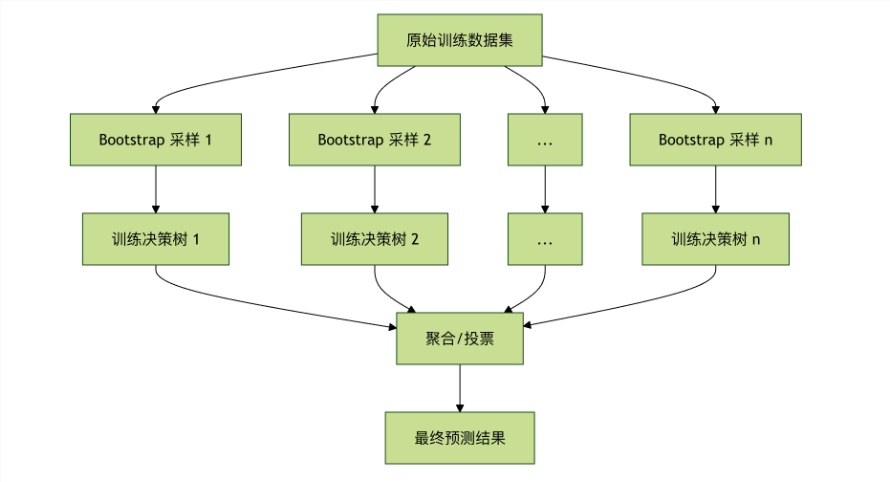
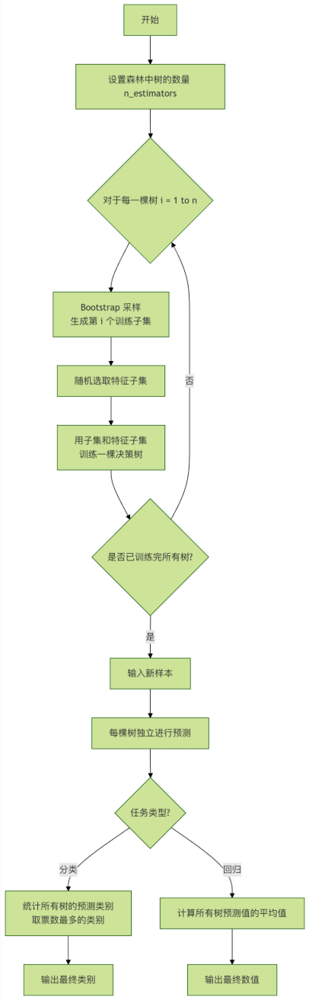
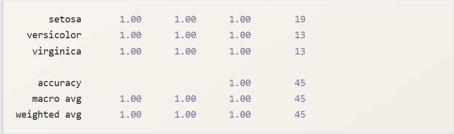
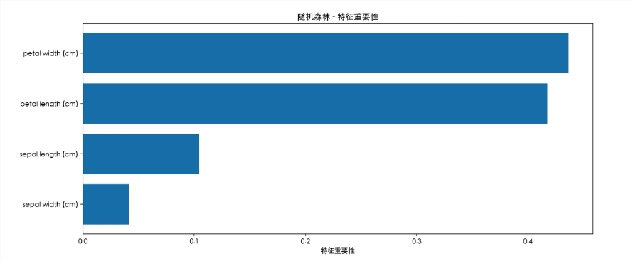

# 随机森林
想象一下，你正在参加一个重要的知识竞赛，面对一个难题，你是更相信一位顶尖专家的判断，还是更相信由100位水平不错的选手投票得出的结果？在大多数情况下，集体的智慧往往能弥补个人的偏见和局限，从而做出更稳定、更准确的决策。
在机器学习的世界里，**随机森林（Random Forest）** 正是这种 **集体智慧** 思想的杰出代表。它通过构建大量的决策树，并让它们共同投票来做出预测，从而成为最强大、最受欢迎的机器学习算法之一。
## 什么是堆积森林？
**随机森林**是一种基于集成学习（Ensemble Learning）的机器学习算法。它的核心思想非常简单：**三个臭皮匠，顶个诸葛亮**。

- **森林**：指的是由多棵 **决策树（Decision Tree）**组成的集合。
- **随机**：指的是在构建每一棵决策树时，算法会引入两种随机性，确保每棵树都与众不同。

最终，对于分类任务，森林通过 **投票(多数决)** 给出结果；对于回归任务，则通过 **取平均值** 给出结果。
## 核心思想：Bagging 与随机性
随机森林的成功建立在两大基石之上：
### Bagging(Boostrap Aggregating)：

- **Boostrap(自助采样)**：从原始训练数据集中**又放回地随机抽取样本，生成多个不同的子训练集。这意味着同一个样本可能在一个子集中出现多次，而另一个样本可能一次都不出现。
- **Aggregating(聚合)**：用每个子训练集独立训练一棵决策树，最后将所有数的结果聚合起来（投票或平均）。



### 特征随机性

- 在构建每棵树的每个节点进行分裂时，算法不会考虑所有的特征，而是**从全部特征中随机选取一个子集**，然后从这个子集中选择最优分裂特征。
- 这进一步增强了树与树之间的差异性，让森林看到问题的不同侧面。

---

## 算法流程与关键参数
### 随机森林的工作步骤
让我们通过一个流程图来清晰地看透它的工作过程：



### 关键超参数详解
在使用`scikit-learn`库时，理解以下几个核心参数至关重要：

| 参数名 | 含义 | 典型值/影响 | 通俗解释 |
|---|---|---|---|
| n_estimators | 森林中决策树的数量。 | 默认100。值越大，模型通常越稳定，性能越好，但计算成本也越高。 | **"委员会的人数"**。人越多，决策通常越可靠，但看会时间也更长。 |
| max_depth | 单棵决策树的最大深度。 | 默认None（不限制）。限制深度可以防止过拟合，使模型更简单。 | **"限制每个人的发言时间"**。防止某个专家（树）钻牛角尖，过度关注训练数据的细节。 |
| max_features | 寻找最佳分裂时考虑的特征数。 | 可以是整数、浮点数或`auto`/`sqrt`。这是引入"特征随机数"的关键参数。 | **"每次讨论只随机看几个方面"**。确保每棵树从不同角度分析问题，增加多样性。 |
| min_samples_split | 节点分裂所需的最小样本数。 | 默认 2。值越大，树生长越保守，越不容易过拟合。 | **"一个小组至少要有几个人才能继续分组讨论"**。避免因为一两个样本就创建一个新规则。 |
| min_samples_leaf | 叶节点所需的最小样本数。 | 默认 1。值越大，模型越平滑。 | **"最终结论至少需要基于几个案例"**。确保每个结论都有一定的数据支撑。 |
| boostrap | 是否使用Boostrap采样。 | 默认 True。如果设为False，则将使用整个数据集训练每棵树，但会失去一部分随机性。 | **"是否允许一个人重复发言"。**开启就是Bagging的精髓。 |

---

# 实战演练-代码示例
让我们用一个经典的鸢尾花（iris）分类数据集来实战一下。
## 示例1：基础分类任务

```python
# 导入必要的库
from sklearn.datasets import load_iris
from sklearn.model_selection import train_test_split
from sklearn.ensemble import RandomForestClassifier
from sklearn.metrics import accuracy_score, classification_report

# 1. 加载数据
iris = load_iris()
X = iris.data  # 特征：花萼长度、宽度，花瓣长度、宽度
y = iris.target # 标签：三种鸢尾花

# 2. 划分训练集和测试集
X_train, X_test, y_train, y_test = train_test_split(X, y, test_size=0.3, random_state=42)

# 3. 创建随机森林分类器
# 这里我们设置 100 棵树，并限制最大深度为 5
rf_clf = RandomForestClassifier(n_estimators=100, max_depth=5, random_state=42)

# 4. 训练模型
rf_clf.fit(X_train, y_train)

# 5. 在测试集上进行预测
y_pred = rf_clf.predict(X_test)

# 6. 评估模型性能
print("测试集准确率：", accuracy_score(y_test, y_pred))
print("\n分类报告：")
print(classification_report(y_test, y_pred, target_names=iris.target_names))
```

**代码解析**：

1. **导入库**：`RandomForestClassifier`是随机森林分类器。
2. **加载数据**：鸢尾花数据集有150个样本，4个特征，3个类别。
3. **数据划分**：将70%的数据用于训练，30%用于测试，验证模型对新数据的泛化能力。
4. **实例化模型**：`random_state=42`确保每次运行结果可复现。
5. **训练模型**：`fit`方法会构建100棵决策树。
6. **预测与评估**：用训练好的森林对测试集预测，并计算准确率等指标。

输出：



## 示例2：查看特征重要性
随机森林还有一个强大功能：评估每个特征对预测的贡献程度。

```python
# 导入必要的库
from sklearn.datasets import load_iris
from sklearn.model_selection import train_test_split
from sklearn.ensemble import RandomForestClassifier
from sklearn.metrics import accuracy_score, classification_report

import pandas as pd
import matplotlib.pyplot as plt

# -------------------------- 设置中文字体 start --------------------------
plt.rcParams['font.sans-serif'] = [
    # Windows 优先
    'SimHei', 'Microsoft YaHei',
    # macOS 优先
    'PingFang SC', 'Heiti TC',
    # Linux 优先
    'WenQuanYi Micro Hei', 'DejaVu Sans'
]
# 修复负号显示为方块的问题
plt.rcParams['axes.unicode_minus'] = False
# -------------------------- 设置中文字体 end --------------------------

# 1. 加载数据
iris = load_iris()
X = iris.data  # 特征：花萼长度、宽度，花瓣长度、宽度
y = iris.target # 标签：三种鸢尾花

# 2. 划分训练集和测试集
X_train, X_test, y_train, y_test = train_test_split(X, y, test_size=0.3, random_state=42)

# 3. 创建随机森林分类器
# 这里我们设置 100 棵树，并限制最大深度为 5
rf_clf = RandomForestClassifier(n_estimators=100, max_depth=5, random_state=42)

# 4. 训练模型
rf_clf.fit(X_train, y_train)

# 5. 在测试集上进行预测
y_pred = rf_clf.predict(X_test)

# 6. 评估模型性能
print("测试集准确率：", accuracy_score(y_test, y_pred))
print("\n分类报告：")


# 获取特征重要性
feature_importances = rf_clf.feature_importances_
features = iris.feature_names

# 创建 DataFrame 便于查看
importance_df = pd.DataFrame({
    '特征': features,
    '重要性': feature_importances
}).sort_values('重要性', ascending=False)

print("特征重要性排序：")
print(importance_df)

# 可视化
plt.figure(figsize=(8, 5))
plt.barh(importance_df['特征'], importance_df['重要性'])
plt.xlabel('特征重要性')
plt.title('随机森林 - 特征重要性')
plt.gca().invert_yaxis() # 让最重要的特征显示在顶部
plt.show()
```



**输出分析**：你可能会发现花瓣长度和花瓣宽度的重要性远高于花萼的尺寸。这非常符合植物学常识，花瓣特征确实是区分不同鸢尾花的关键。**这个功能对于特征筛选和数据理解极具价值**。

---

# 优点、缺点与应用场景
### 优点

1. **高准确率**：集成学习通常能取得当前数据下顶尖的性能。
2. **抗过拟合能力强**：得益于Bagging和随即特征选取，即使不剪枝，也不容易过拟合。
3. **对数据要求友好**：能处理数值型和类别型特征，不需要特征缩放（如归一化）。
4. **提供特征重要性**：内置的特征评估是宝贵的副产物。
5. **并行化容易**：每棵树的训练是独立的，可以轻松并行加速。

### 缺点

1. **模型可解释性差**：成百上千棵树组成的“黑箱”，比单棵决策树难解释的多。
2. **训练和预测速度较慢**：树的数量多时，需要更多的计算资源和时间。
3. **内存占用大**：需要存储整个森林的所有树结构。

## 典型应用场景

- **分类问题**：如垃圾邮件识别、疾病诊断、图像分类。
- **回归问题**：如房价预测、销售额预测。
- **特征选择**：利用其输出的特征重要性进行特征筛选。
- **缺失值处理**：随机森林有较好的处理缺失值的天然能力。
