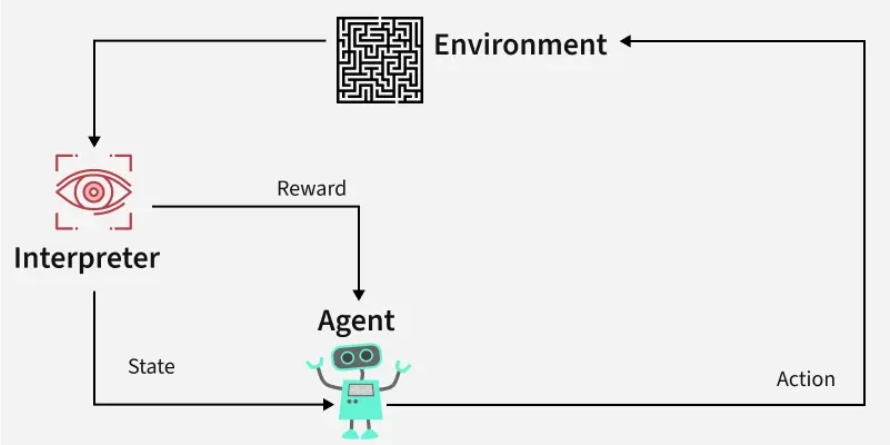
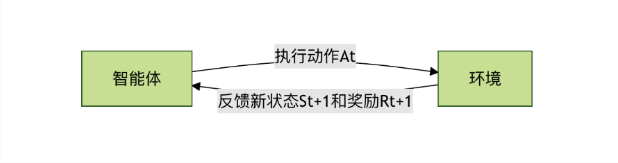
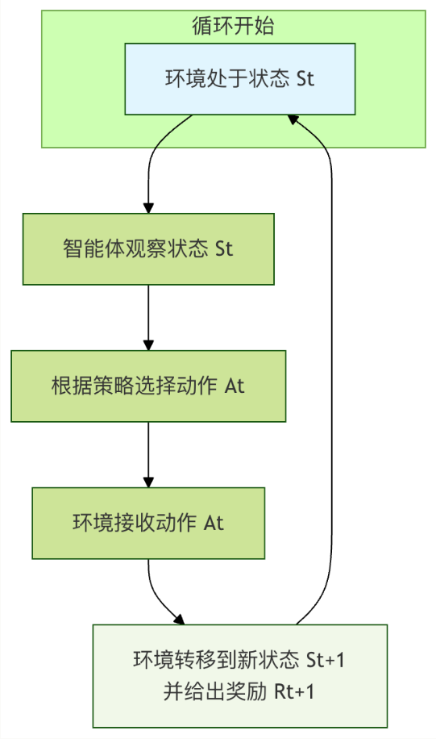
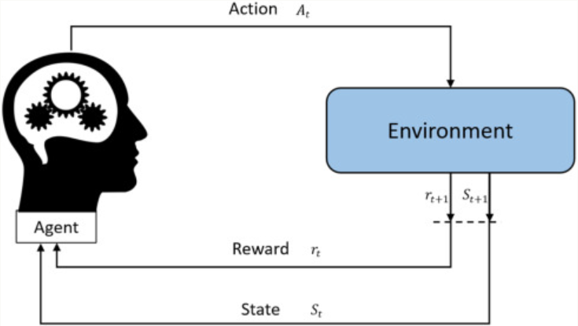
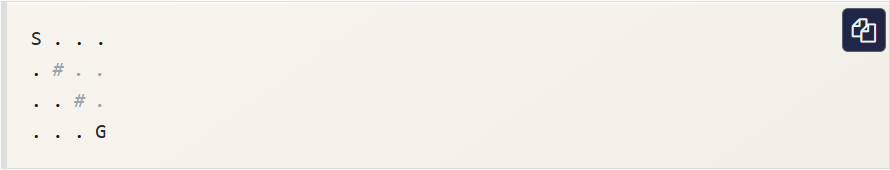
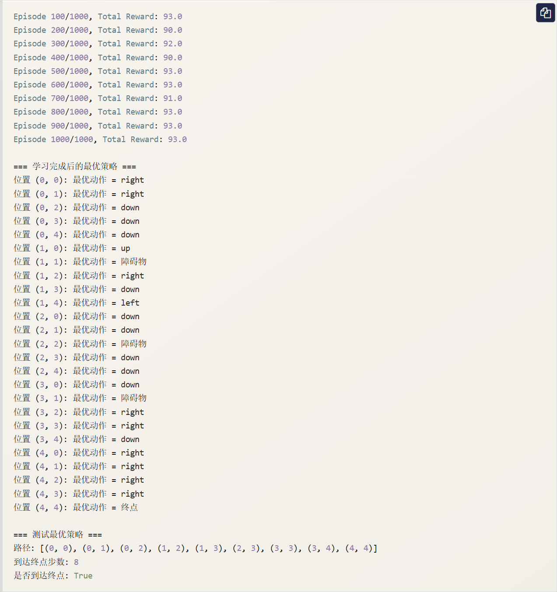

# 强化学习基本框架
想象一下，你正在教一只小狗学习坐下这个指令。你不会直接告诉它坐下这个动作的每一个肌肉该如何运动，而是会这样做：

1. 你发出坐下的口令。
2. 小狗尝试做出某个动作（可能是坐下，也可能是趴下或转圈）。
3. 如果它坐下了，你立刻给它一块零食作为奖励。
4. 如果它做错了，你就不给奖励，或者发出一个轻微的不对的信号。
5. 经过多次尝试，小狗会逐渐明白：提到坐下后做出坐下的动作，就能获得零食。于是它学会了这个指令。

**强化学习** 就是让计算机（或智能体）像这只小狗一样，通过与环境互动、根据获得的奖励或惩罚来学习如何做出一系列决策，以达成某个长期目标。
它与我们熟悉的**监督学习**（有标准答案的“老师”）和**无监督学习**（寻找数据内在结构）有本质区别。强化学习是**从经验中学习**，核心是**试错** 与 **延迟奖励**。

---

# 强化学习的核心要素
为了形式化地描述这个学习过程，我们引入几个核心概念，它们共同构成了强化学习的基本框架。
## 智能体与环境
这是强化学习中最基本的一对互动关系。

- **智能体**：就是学习的主体，是做出决策的实体。在上面的例子中，小狗就是智能体。在计算机中，它可以是一个算法、一个程序或一个机器人。
- **环境**：是智能体所处的外部世界，智能体与之互动。对于小狗来说，环境就是你、零食、地板等一切外部事物。环境会接收智能体的动作，并给出新的状态和奖励。



它们的关系是一个持续的循环：**智能体观察环境 -> 做出动作 -> 环境反馈新的状态和奖励 -> 智能体再次观察 ...**



## 状态、动作与奖励
这是描述每一次互动的三个关键信息。

- **状态**：在某个时刻，环境情况的完整描述。比如，在教小狗的例子中，状态可能包括：小狗是站着的、你手里有零食、你刚说了坐下。状态是智能体做出决策的依据。
- **动作**：智能体在某个状态下可以做出的选择。对于小狗，动作集合可能是{坐下、趴下、站立、转圈...}。
- **奖励**：环境在智能体值型一个动作后，反馈给智能体的一个标量信号。它定义了**什么是好，什么是坏**。奖励是智能体学习的唯一指南针。给小狗零食就是正奖励（+1），说不对可以看作是轻微的负奖励（-0.1）。

## 策略
**策略**是智能体的大脑或行为准则。它定义了在任意给定状态下，智能体应该采取哪个动作。
策略可以是一个简单的查表函数，也可以是一个复杂的深度神经网络。强化学习的终极目标，就是找到一个**最优策略**，使得智能体从环境中获得的**长期累积奖励最大化**。

- **示例**：一个简单的策略可能是：如果状态是听到坐下指令，那么以90%的概率选择坐下动作，以10%的概率选择其他动作。

## 价值函数
奖励告诉智能体**当前**动作的即时好坏，但智能体更需要关心**长期收益**。**价值函数**就是用来衡量这个长期奖励收益的工具。
它回答的问题是：从当前状态开始，一直遵循某个策略走下去，我**预测**能获得的总奖励是多少？

- **状态价值函数V(s)**：衡量在状态 s 下，遵循当前策略的长期价值。
- **动作价值函数Q(s,a)**：衡量在状态 s 下，**执行特定动作 a** 后，在遵循当前策略的长期价值。它比状态价值函数更常用，因为它能直接指导动作选择。

**为什么需要价值函数？**想象一下象棋游戏。吃掉对方一个兵会得到即使的小奖励，但可能导致十步之后被“将死”而获得巨大的负奖励。价值函数通过计算和预估，能帮助智能体避免这种贪图小利而输掉全局的行为。

---

# 核心互动流程：马尔可夫决策过程
强化学习问题通常被建模为 **马尔可夫决策过程**。这个名字听起来复杂，但其实它只是将我们上面提到的要素用数学形式组织起来，描述智能体与环境互动的一个标准框架。
MDP 的核心思想是：**下一个状态和奖励只取决于当前状态和当前采取的动作，与之前的历史无关**（即马尔科夫性）。
一次完整的 MDP 交互周期如下：



1. 在时刻 $t$，环境处于状态 $S_t$。
2. 智能体观察到这个状态。
3. 智能体根据其策略$\pi$，选择一个动作$A_t$
4. 环境接受到这个动作。
5. 环境根据其内在的动态规律，转移到下一个状态$S_{t+1}$，并产生一个标量奖励$R_{t+1}$，反馈给智能体。
6. 时间步前进(t = t + 1)，新的循环开始。



智能体的目标，就是通过不断经历这个循环，学习到一个策略$\pi^*$，使得从任意初始状态开始，获得的**累积奖励的期望值(即回报)最大化**。

---

# 一个简单代码示例：网格世界
让我们用一个经典的网格世界例子来具体化这些概念。假设有一个 4x4 的网格，智能体从起点 $S$ 出发，目标是到达终点 $G$。走到障碍物 $\#$ 会失败，每走一步都有一个小惩罚（鼓励尽快到达终点）。



- **状态**：每个网格的坐标，如(0,0),(0,1),...,(3,3)。共16个状态。
- **动作**：{上、下、左、右}。
- **奖励**：
  - 到达G：+10
  - 碰到 $\#$ 或走出边界：-5
  - 其他普通移动：-0.1（鼓励高效路径）
- **策略**：我们需要学习一个表格，记录在每个状态（格子）下，应该朝哪个方向走。

下面是一个极度简化的 Q-learning（一种经典强化学习算法）的伪代码演示，用于学习这个网格世界的最优路径。

```python
import numpy as np
import random
from typing import Dict, List, Tuple

# ====================== 1. 环境模拟（网格世界） ======================
class GridWorldEnv:
    """简单的网格世界环境，用于演示Q-Learning"""
    def __init__(self, grid_size: Tuple[int, int] = (5, 5), 
                 start_pos: Tuple[int, int] = (0, 0), 
                 goal_pos: Tuple[int, int] = (4, 4),
                 obstacle_pos: List[Tuple[int, int]] = [(1, 1), (2, 2), (3, 1)]):
        self.grid_size = grid_size
        self.start_pos = start_pos
        self.goal_pos = goal_pos
        self.obstacle_pos = obstacle_pos
        self.current_pos = start_pos
        
        # 动作定义：0-上, 1-下, 2-左, 3-右
        self.actions = ['up', 'down', 'left', 'right']
        self.num_actions = len(self.actions)
        
    def reset(self) -> int:
        """重置环境，返回初始状态的索引"""
        self.current_pos = self.start_pos
        return self.pos_to_state(self.current_pos)
    
    def pos_to_state(self, pos: Tuple[int, int]) -> int:
        """将坐标位置转换为状态索引"""
        return pos[0] * self.grid_size[1] + pos[1]
    
    def state_to_pos(self, state: int) -> Tuple[int, int]:
        """将状态索引转换为坐标位置"""
        return (state // self.grid_size[1], state % self.grid_size[1])
    
    def random_action(self) -> int:
        """随机选择一个动作（探索）"""
        return random.randint(0, self.num_actions - 1)
    
    def action_to_direction(self, action: int) -> str:
        """将动作索引转换为方向名称"""
        return self.actions[action]
    
    def step(self, action: int) -> Tuple[int, float, bool]:
        """
        执行动作，返回(next_state, reward, done)
        优化点：修复障碍物奖励无法触发的bug，简化逻辑判断
        """
        x, y = self.current_pos
        
        # 根据动作更新位置
        if action == 0:  # 上
            x = max(0, x - 1)
        elif action == 1:  # 下
            x = min(self.grid_size[0] - 1, x + 1)
        elif action == 2:  # 左
            y = max(0, y - 1)
        elif action == 3:  # 右
            y = min(self.grid_size[1] - 1, y + 1)
        
        # 检查是否碰到障碍物（核心修复：先记录是否碰到障碍物，再处理位置）
        new_pos = (x, y)
        hit_obstacle = False  # 标记是否碰到障碍物
        if new_pos in self.obstacle_pos:
            hit_obstacle = True  # 记录障碍物碰撞状态
            new_pos = self.current_pos  # 碰到障碍物，位置不变
        
        self.current_pos = new_pos
        next_state = self.pos_to_state(new_pos)
        
        # 计算奖励（基于提前记录的hit_obstacle，修复原逻辑矛盾）
        if new_pos == self.goal_pos:
            reward = 100.0  # 到达终点，大奖励
            done = True
        elif hit_obstacle:  # 基于标记判断，而非修改后的new_pos
            reward = -50.0  # 碰到障碍物，惩罚
            done = False
        else:
            reward = -1.0  # 每走一步小惩罚，鼓励尽快到达终点
            done = False
        
        return next_state, reward, done

# ====================== 2. Q-Learning 主程序 ======================
if __name__ == "__main__":
    # 优化点1：固定随机种子，保证实验结果可复现
    random_seed = 42
    random.seed(random_seed)
    np.random.seed(random_seed)
    
    # 初始化环境
    env = GridWorldEnv(
        grid_size=(5, 5),          # 5x5网格
        start_pos=(0, 0),          # 起点
        goal_pos=(4, 4),           # 终点
        obstacle_pos=[(1,1), (2,2), (3,1)]  # 障碍物位置
    )
    
    # 计算状态数量
    num_states = env.grid_size[0] * env.grid_size[1]
    num_actions = env.num_actions
    
    # 初始化Q表（动作价值函数），形状为 [状态数量，动作数量]
    Q_table = np.zeros([num_states, num_actions])
    
    # 定义超参数
    learning_rate = 0.1       # 学习率
    discount_factor = 0.9     # 折扣因子
    epsilon = 0.1             # 探索率
    total_episodes = 1000     # 训练轮数
    
    # 训练过程
    for episode in range(total_episodes):
        state = env.reset()    # 重置环境到起点，获取初始状态 S
        done = False           # 标记本轮是否结束
        total_reward = 0       # 记录本轮总奖励
        
        while not done:
            # 1. ε-贪婪策略选择动作
            if random.uniform(0, 1) < epsilon:
                action = env.random_action()  # 探索：随机选动作
            else:
                # 利用：选Q值最高的动作，处理平局情况
                q_values = Q_table[state]
                max_q = np.max(q_values)
                best_actions = np.where(q_values == max_q)[0]
                action = random.choice(best_actions)  # 平局时随机选一个
            
            # 2. 执行动作，与环境交互
            next_state, reward, done = env.step(action)
            total_reward += reward
            
            # 3. 更新Q表（核心：Q-Learning公式）
            # Q(S, A) = Q(S, A) + α * [ R + γ * max(Q(S', a')) - Q(S, A) ]
            old_value = Q_table[state, action]
            next_max = np.max(Q_table[next_state])  # 下一状态的最大Q值
            
            # 计算目标Q值
            target = reward + discount_factor * next_max
            # 更新Q值
            new_value = old_value + learning_rate * (target - old_value)
            Q_table[state, action] = new_value
            
            # 4. 进入下一个状态
            state = next_state
        
        # 每100轮打印一次训练进度
        if (episode + 1) % 100 == 0:
            print(f"Episode {episode + 1}/{total_episodes}, Total Reward: {total_reward:.1f}")
    
    # ====================== 3. 提取最优策略（优化打印格式，更直观） ======================
    policy: Dict[int, str] = {}
    print("\n=== 学习完成后的最优策略（按网格排版）===")
    
    # 优化点2：按网格形状打印，直观展示整个网格的策略
    grid_rows, grid_cols = env.grid_size
    for row in range(grid_rows):
        row_str = []
        for col in range(grid_cols):
            pos = (row, col)
            state = env.pos_to_state(pos)
            if pos in env.obstacle_pos:
                row_str.append("  障碍物  ")
            elif pos == env.goal_pos:
                row_str.append("   终点   ")
            elif pos == env.start_pos:
                # 同时标记起点和其最优动作
                best_action_idx = np.argmax(Q_table[state])
                best_action = env.action_to_direction(best_action_idx)
                row_str.append(f" 起点({best_action}) ")
            else:
                best_action_idx = np.argmax(Q_table[state])
                best_action = env.action_to_direction(best_action_idx)
                policy[state] = best_action
                row_str.append(f"   {best_action}   ")
        print("|".join(row_str))
    
    # ====================== 4. 测试最优策略 ======================
    print("\n=== 测试最优策略 ===")
    state = env.reset()
    done = False
    steps = 0
    path = [env.state_to_pos(state)]
    
    while not done and steps < 50:  # 最多50步，防止无限循环
        best_action_idx = np.argmax(Q_table[state])
        next_state, reward, done = env.step(best_action_idx)
        current_pos = env.state_to_pos(next_state)
        path.append(current_pos)
        state = next_state
        steps += 1
    
    print(f"路径: {path}")
    print(f"到达终点步数: {steps}")
    print(f"是否到达终点: {env.current_pos == env.goal_pos}")
```

**代码解析**：

- Q_table是核心的动作价值函数，形状为[状态数量，动作数量]（示例中为25x4，对应5x5网格的25个状态、上下左右4个动作）。Q_table[s,a]代表在状态s（网格位置的索引）下执行动作a（0-3对应上下左右）的长期价值，初始值全为0，通过训练逐步更新。
- env.step(action)模拟马尔可夫决策过程（MDP）的核心交互逻辑：输入动作索引后，先更新智能体的网格位置（碰到障碍物则位置不变），在返回三元组（next_state,reward,done）——next_state是新状态的索引，reward是差异化奖励（终点+100、障碍物-50、每步-1），done标记是否到达终点（本轮结束）。
- Q-learning的核心更新公式 $Q(S,A) = Q(S,A) + \alpha * [R + \gamma * max(Q(S^{'},a^{'})) - Q(S,A)]$ 在代码中被拆解实现：先获取当前Q值old_value,在计算下一状态的最大Q值next_max,接着算出目标价值$target = 奖励 + 折扣因子 * 下一状态最大Q值$，最后用学习率 $\alpha$ 混合旧值与目标值，得到更新后的Q值，实现对动作价值的迭代修正。
- epsilon(探索率)通过$\varepsilon$-贪婪策略平衡“利用”与“探索”：以epsilon概率随机选动作(探索未知)，以1-epsilon概率选当前状态下Q值最大的动作（利用已知最优）；代码还优化了Q值平局的情况——若多个动作Q值相同，随机选择其一，避免单一选择导致的策略固化。
- 代码额外实现了状态与网格位置的双向映射（pos_to_state/state_to_pos）、动作与方向名称的转换（action_to_direction），以及训练后的策略提取与测试：遍历所有状态，取每个状态下Q值最大的动作作为最优策略，并验证该策略从起点到终点的路径与步数。

输出：



---

# 总结与实践思考
强化学习的基本框架可以总结为：**智能体通过与环境进行马尔可夫决策过程式的交互，根据获得的奖励信号，不断优化其策略（通常通过学习和更新价值函数来实现），最终目标是最大化长期累积奖励**。

| 概念 | 类比 | 在强化学习中的作用 |
|---|---|---|
| **智能体** | 学习的小狗/下棋的AI | 决策主体，执行学习的算法 |
| **环境** | 训练师/棋盘规则 | 提供状态和奖励反馈的外部系统 |
| **状态** | 小狗的姿势/棋盘局面 | 智能体做决策的当前信息依据 |
| **动作** | 坐下/移动棋子 | | 智能体可以做出的选择 |
| **奖励** | 零食/输赢结果 | 评价动作好坏的即时信号，学习指南针 |
| **策略** | 小狗学会的指令反应 | 从状态到动作的映射规则，学习的目标 |
| **价值函数** | 对局势的长期判断 | 评估状态或动作的长期价值，是策略优化的基础 |
