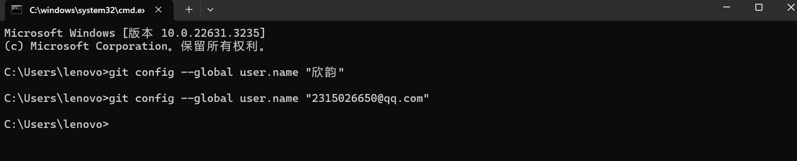
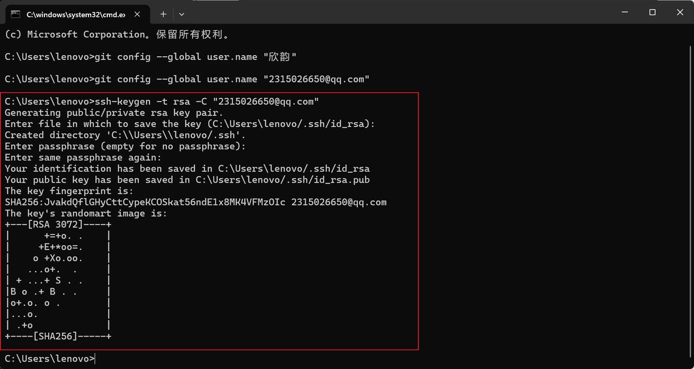
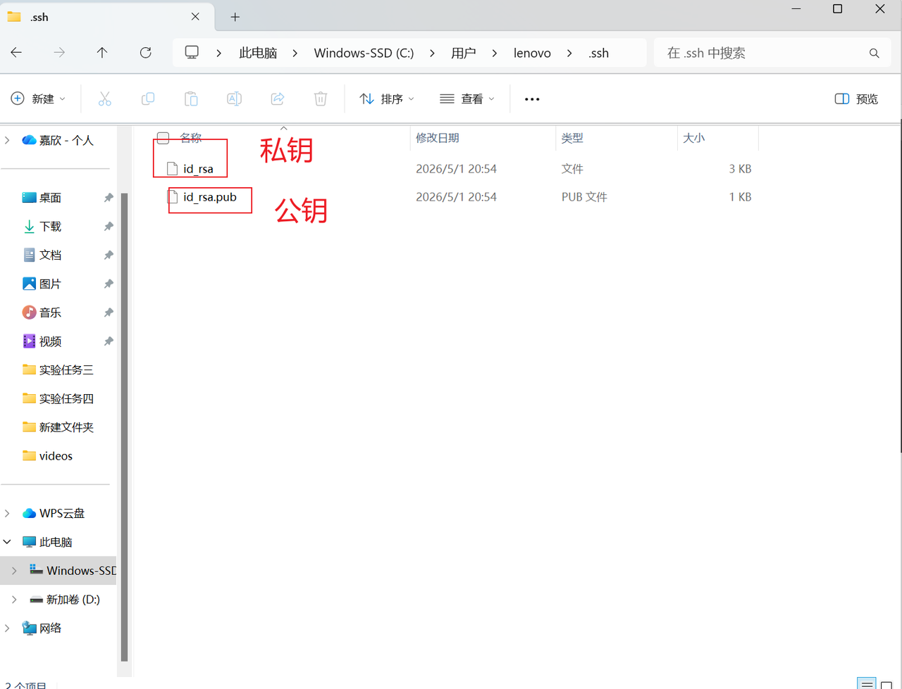
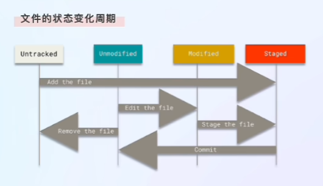

# 1、配置个人信息
该个人信息为项目提交时的（全局）个人信息
```Bash
git config --global user.name "你的名字"
git config --global user.email "你的邮箱"
```

# 2、生成SSH密钥
```Bash
ssh-keygen - rsa -C "你的邮箱"
```

密钥位置（公钥放云端）:

# 3、仓库初始化
将文件夹初始化为仓库
```Bash
git init
```
# 4、克隆远程仓库
```Bash
git clone 仓库地址
例：
git clone git@gitcode.com:hoshimi_kokone/Machine_Learning.git
```
# 5、添加到暂存区
```Bash
git add .  提交全部文件
git add 文件名  提交指定文件
```
# 6、从暂存区提交到本地仓库
```Bash
git commit -m "提交说明"
```
# 7、从本地仓库推送到远程仓库
```Bash
#第一次推送，绑定分支
git push -u origin 分支名
#之后推送
git push
```
# 8、检查当前文件状态
```Bash
git status
```
文件状态:
- Untracked: 未跟踪
- Unmodified: 已经被跟踪但未修改
- Modified: 已经被修改，但未进行任何git操作
- Staged: 已经修改并且准备commit

# 9、查看文件的变化
```Bash
git diff
```
# 10、查看当前所在分支
```Bash
git branch
```
# 11、切换分支
```Bash
#老版本
git checkout 分支名
#新版本
git switch 分支名
git switch -c 分支名 #新建并切换到分支
```
# 12、删除分支
```Bash
#删除分支前必须切换到别的分支
git branch -d 分支名 #删本地
git push origin --delete 分支名 #删远程
```
# 开发流程
```Bash
# 1、从主分支新建功能分支（最标准）
git switch main
git switch -c feature-login

# 2、写代码、提交
git add .
git commit -m "完成登录"

# 3、推送到远程（第一次 -u）
git push -u origin feature-login

# 4、开发完，合并回主分支
git switch main
git merge feature-login

# 5、把合并后的主分支推送到远程
git push

# 6、删除废弃分支
git branch -d feature-login #删本地
git push origin --delete feature-login #删远程