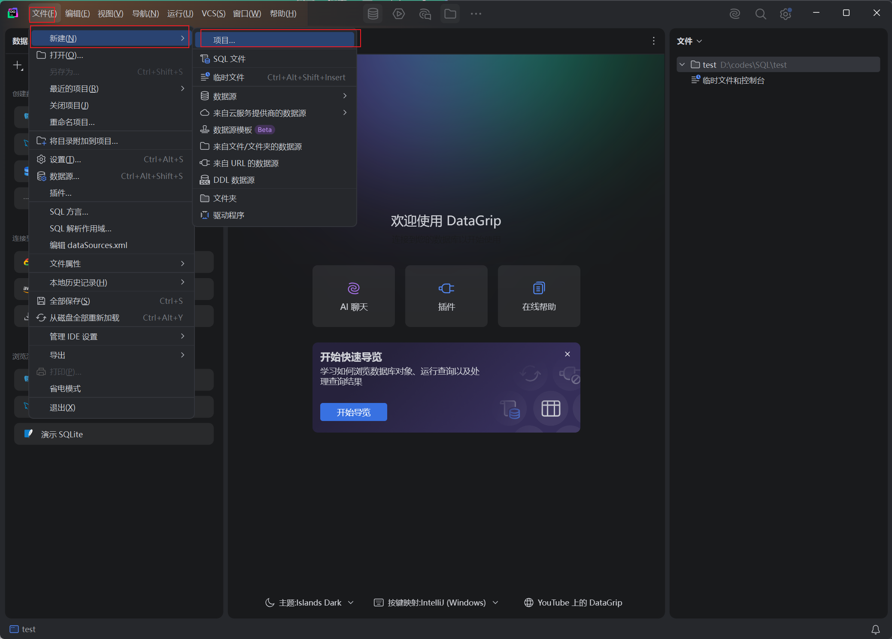
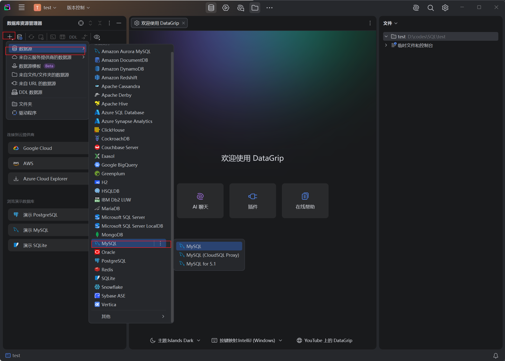
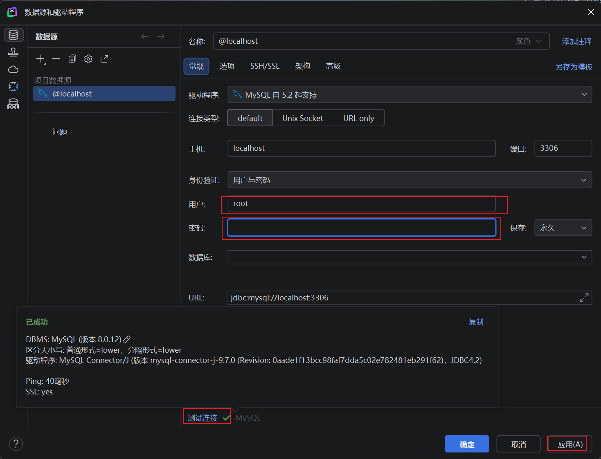
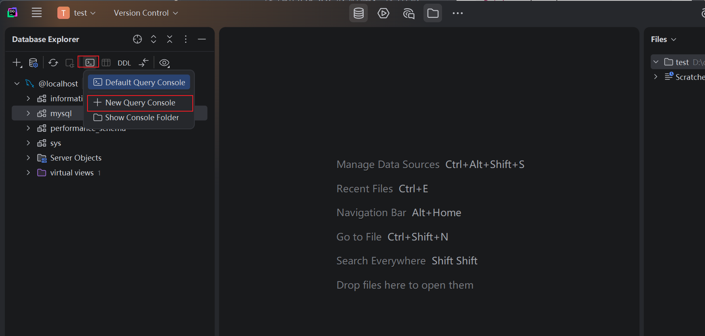
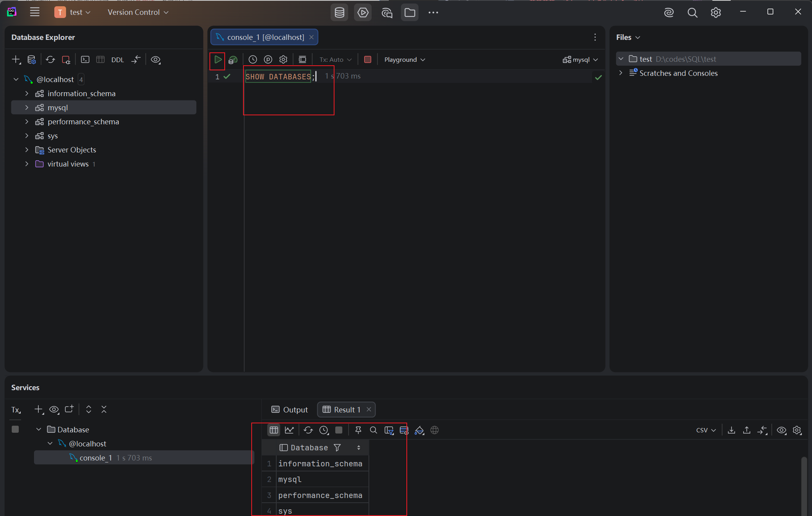
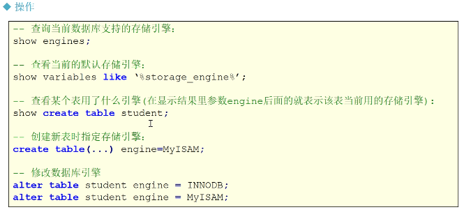

# MySQL

MySQL 是一款**开源关系型数据库管理系统（RDBMS）**，由瑞典 MySQL AB 公司开发，现归属 Oracle。采用 SQL（结构化查询语言）来管理数据，是目前最流行的数据库之一，广泛用于 Web 开发、后端项目、课程 SQL 学习。

## MySQL 安装

### 服务器端

#### 通过 phpstudy 安装 MySQL

##### 1、以管理员身份双击phpstudy，启动安装程序

>注意：千万千万要注意修改安装位置

##### 2、安装完成后，打开，然后点击软件管理


##### 3、安装MySQL8.0.12


##### 4、启动MySQL服务后，点击数据库，然后修改MySQL登录密码（密码至少是六位数）


### 客户端

#### cmd

##### 1、将该路径 `~\phpstudy_pro\Extensions\MySQL8.0.12\bin\`添加到系统环境变量


##### 2、添加后打开cmd，输入指令登录MySQL

- 明文密码：`mysql -u用户名 -p密码`
例如：`mysql -uroot -p123456`

- 密文密码：`mysql -u用户名 -p`
例如：先输入`mysql -uroot -p`，然后输入密码（cmd不可见）

- 指定主机和端口连接（适用于远程连接）：`mysql -h 主机名或IP地址 -P 端口号 -u 用户名 -p`
例如：`mysql -h 127.0.0.1 -P 3306 -u root -p`

> 要连接远程数据库，必须开通远程访问且防火墙能够通过。

#### 第三方软件，如 DataGrip

##### 安装JetBrain的DataGrip开发工具。


##### 创建项目




##### 创建数据源





> 首次连接数据库时需要下载驱动程序，点击测试链接后弹窗下载。

##### 使用查询控制台测试连接成功





> 快捷键：
> 1、Ctrl + Enter 可以快速执行一段代码
> 2、选中一段代码，Ctrl + / 快速注释

## 管理MySQL的命令

- `USE 数据库名`：选择要操作的MySQL数据库，使用该命令后所有MySQL命令都只针对该数据库。

```sql
mysql> use RUNOOB;
Database changed
```

- `SHOW DATABASES`：列出MySQL数据库管理系统的数据库列表。

```sql
mysql> SHOW DATABASES;
+--------------------+
| Database           |
+--------------------+
| information_schema |
| RUNOOB             |
| cdcol              |
| mysql              |
| onethink           |
| performance_schema |
| phpmyadmin         |
| test               |
| wecenter           |
| wordpress          |
+--------------------+
10 rows in set (0.02 sec)
```

- `SHOW TABLES`：显式指定数据库的所有表，使用该命令前需要使用 `use` 命令来选择要操作的数据库。

```sql
mysql> use RUNOOB;
Database changed
mysql> SHOW TABLES;
+------------------+
| Tables_in_runoob |
+------------------+
| employee_tbl     |
| runoob_tbl       |
| tcount_tbl       |
+------------------+
3 rows in set (0.00 sec)
```

- `SHOW COLUMNS FROM 数据表`：显示数据表的属性，属性类型，主键信息，是否为 NULL，默认值等其他信息。

```sql
mysql> SHOW COLUMNS FROM runoob_tbl;
+-----------------+--------------+------+-----+---------+-------+
| Field           | Type         | Null | Key | Default | Extra |
+-----------------+--------------+------+-----+---------+-------+
| runoob_id       | int(11)      | NO   | PRI | NULL    |       |
| runoob_title    | varchar(255) | YES  |     | NULL    |       |
| runoob_author   | varchar(255) | YES  |     | NULL    |       |
| submission_date | date         | YES  |     | NULL    |       |
+-----------------+--------------+------+-----+---------+-------+
4 rows in set (0.01 sec)
```

- `SHOW INDEX FROM 数据表`：显示数据表的详细索引信息，包括PRIMARY KEY（主键）。

```sql
mysql> SHOW INDEX FROM runoob_tbl;
+------------+------------+----------+--------------+-------------+-----------+-------------+----------+--------+------+------------+---------+---------------+
| Table      | Non_unique | Key_name | Seq_in_index | Column_name | Collation | Cardinality | Sub_part | Packed | Null | Index_type | Comment | Index_comment |
+------------+------------+----------+--------------+-------------+-----------+-------------+----------+--------+------+------------+---------+---------------+
| runoob_tbl |          0 | PRIMARY  |            1 | runoob_id   | A         |           2 |     NULL | NULL   |      | BTREE      |         |               |
+------------+------------+----------+--------------+-------------+-----------+-------------+----------+--------+------+------------+---------+---------------+
1 row in set (0.00 sec)
```

- `SHOW TABLE STATUS [FROM db_name] [LIKE 'pattern'] \G`：该命令将输出MySQL数据库管理系统的性能及统计信息。

```SQL
mysql> SHOW TABLE STATUS  FROM RUNOOB;   # 显示数据库 RUNOOB 中所有表的信息
mysql> SHOW TABLE STATUS from RUNOOB LIKE 'runoob%';     # 表名以runoob开头的表的信息
mysql> SHOW TABLE STATUS from RUNOOB LIKE 'runoob%'\G;   # 加上 \G，查询结果按列打印
```

## MySQL基本语法

### 1、展示所有的库

```sql
SHOW databases;
```

### 2、切换库

```sql
USE sys;
```

### 3、展示所有的表

```sql
SHOW tables;
```

### 4、查询表中有什么数据

```sql
USE mysql;
SELECT * FROM user;
```

等价于：

```sql
SELECT * FROM mysql.user;
```

### 5、注释

- `#`：单行注释，MySQL方言
- `-- `：单行注释
- `/* */`：多行注释

## MySQL常见数据类型

- 整数 int(4B) / tinyint(1B) / smallint(2B) / mediumint(3B) / bigint(8B)
- 浮点数 double / float / decimal(m,d) 定点数，m表示总字位数，最大65；d表示小数点后面的位数，最大30
- 字符串 varchar（变长） / char（定长） / text（大文本）
- 时间日期 date

## MySQL引擎

MySQL有多种引擎，能执行 `create table、select`等命令，在数据量不多时，使用任何引擎没有什么区别。
但是，在大数据开发期间，要处理 **海量数据** ，就需要来了解MySQL的多种引擎了。

**MySQL引擎作用**

1. 当你使用 create table 语句时，该引擎用于创建表。
2. 当在你使用 select 语句或进行其他数据操作时，该引擎在内部处理各种命令请求。
3. 在多数时候，数据库引擎都隐藏在MySQL软件内，开发者不需要过多的关注它，但通常SQL内部数据出现问题时，就是引擎导致的。

MySQL具有多种引擎，并且它已打包多个引擎，且都隐藏在MySQL软件中。

在MySQL中，有3类引擎：

1. InnoDB是一个可靠的事务处理引擎，但是它不支持全文搜索：[逻辑单元]
2. MyISAM时一个性能极高的引擎，它支持全文搜索，但不支持[事务]处理
3. Memory在功能等同于MyISAM，但由于数据存储在内存中，速度很快，但占用内存大，因此几乎不适用此引擎

> 实际开发时，通常使用的是InnoDB引擎。

| 对比项 | MyISAM | InnoDB |
|---|---|---|
| 主外键 | 不支持 | 支持 |
| 事务 | 不支持 | 支持 |
| 行表锁 | 表锁，即使操作一条记录也会锁住整个表，不适合高并发的操作 | 行锁，操作时只锁某一行，不对其他行产生影响，特别适合高并发的操作 |
| 缓存 | 只缓存索引，不缓存真实数据 | 不仅缓存索引，还缓存真实数据，对内存要求较高 |
| 表空间 | 小 | 大 |
| 关注点 | 性能 | 事务 |
| 是否默认安装 | 是 | 是 |

**关于引擎的操作**

