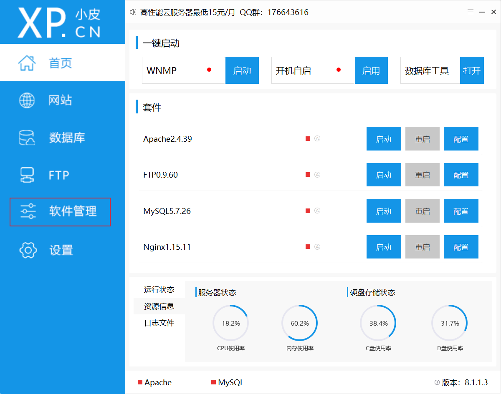
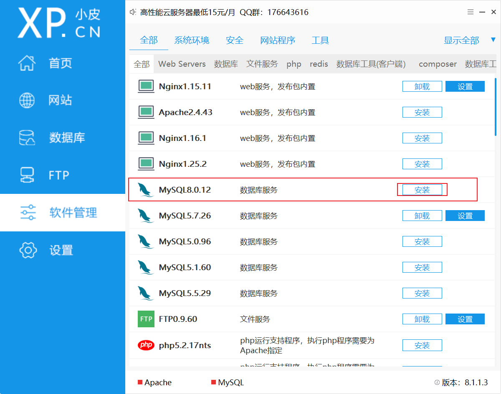
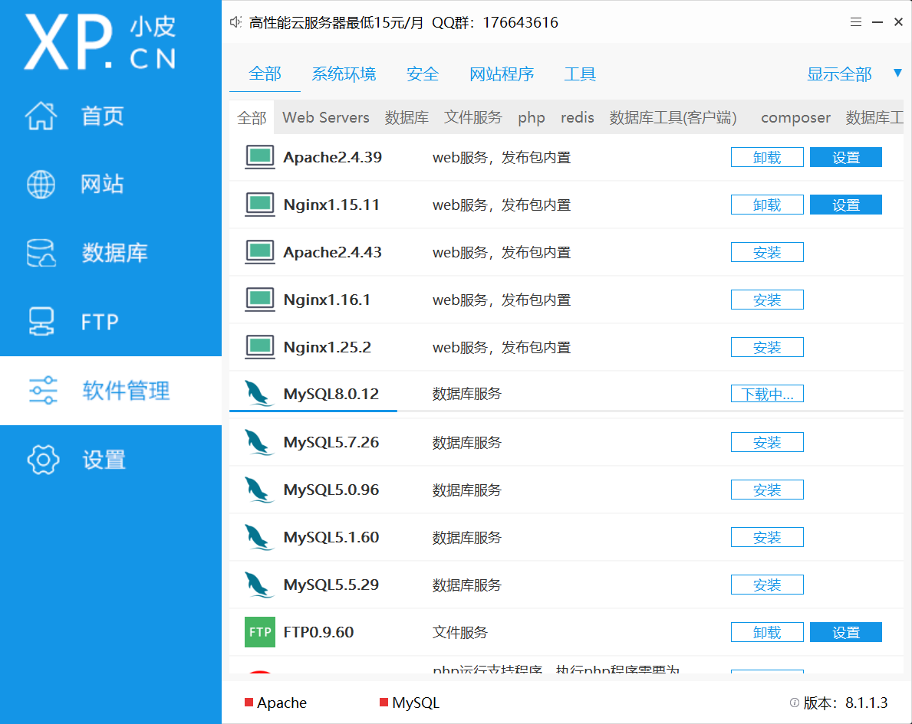
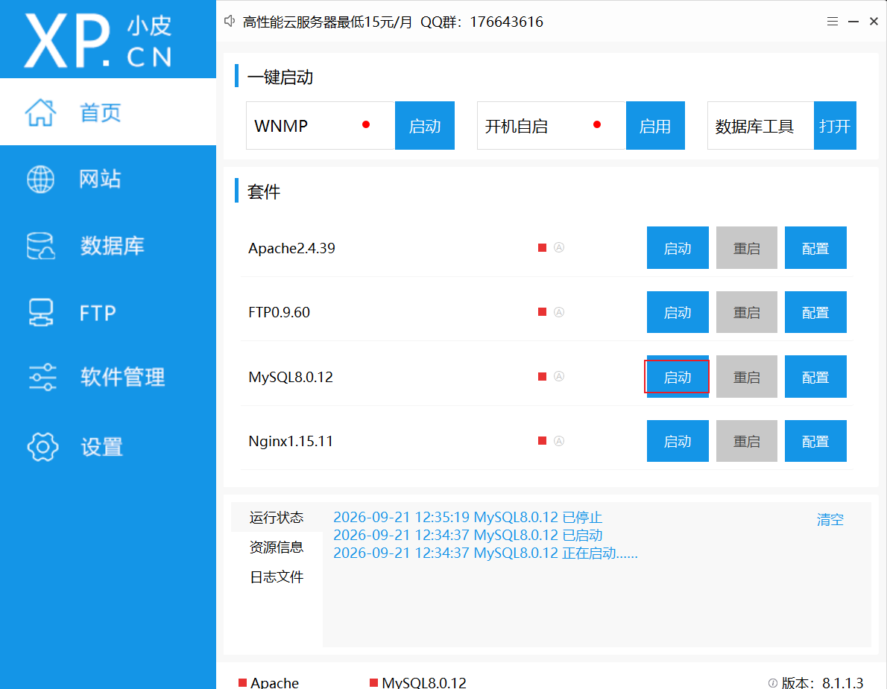
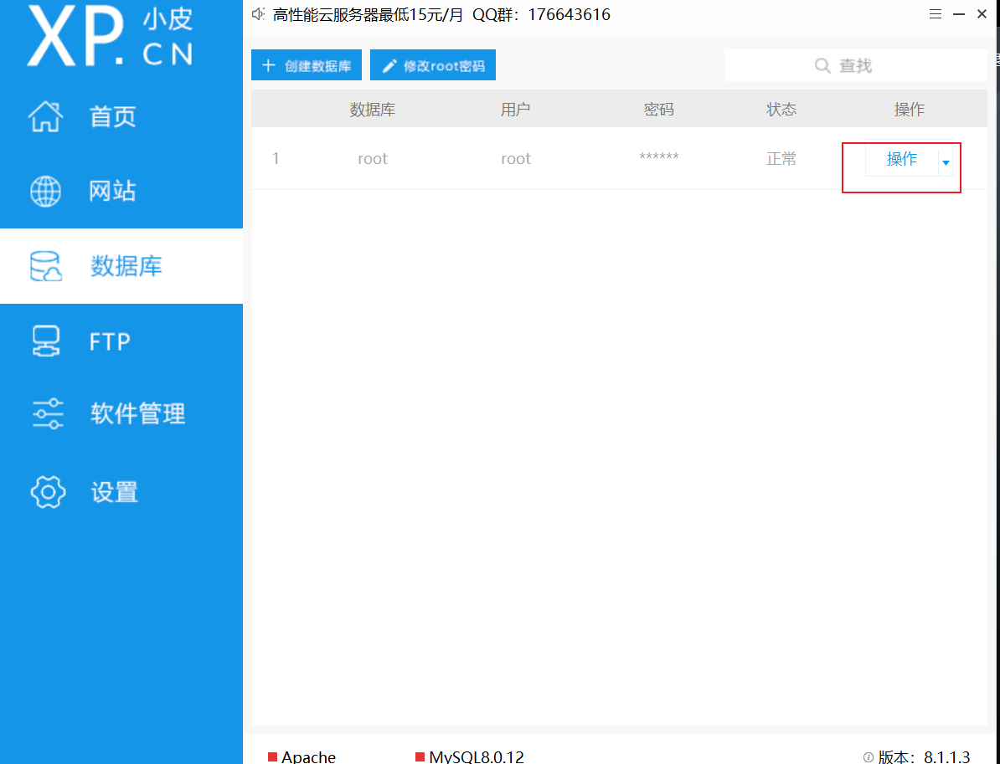

# MySQL

MySQL 是一款**开源关系型数据库管理系统（RDBMS）**，由瑞典 MySQL AB 公司开发，现归属 Oracle。采用 SQL（结构化查询语言）来管理数据，是目前最流行的数据库之一，广泛用于 Web 开发、后端项目、课程 SQL 学习。

## MySQL 安装

### 通过 phpstudy 安装 MySQL

#### 1、以管理员身份双击phpstudy，启动安装程序

>注意：千万千万要注意修改安装位置

#### 2、安装完成后，打开，然后点击软件管理

#### 3、安装MySQL8.0.12

#### 4、启动MySQL服务后，点击数据库，然后修改MySQL登录密码（密码至少是六位数）

