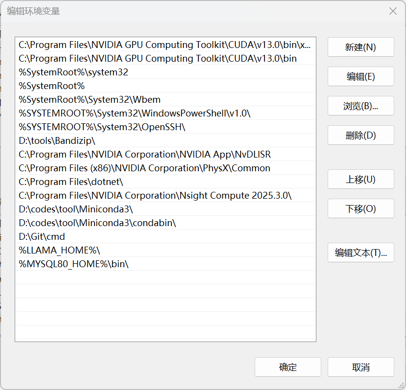
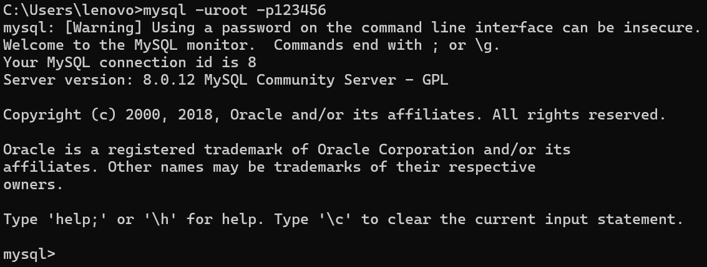
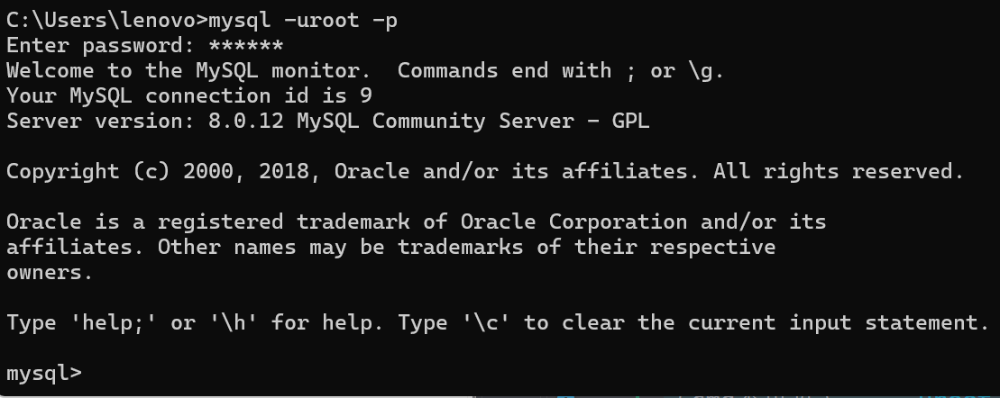

# MySQL

MySQL 是一款**开源关系型数据库管理系统（RDBMS）**，由瑞典 MySQL AB 公司开发，现归属 Oracle。采用 SQL（结构化查询语言）来管理数据，是目前最流行的数据库之一，广泛用于 Web 开发、后端项目、课程 SQL 学习。

## MySQL 安装

### 服务器端

#### 通过 phpstudy 安装 MySQL

##### 1、以管理员身份双击phpstudy，启动安装程序

>注意：千万千万要注意修改安装位置

##### 2、安装完成后，打开，然后点击软件管理


##### 3、安装MySQL8.0.12


##### 4、启动MySQL服务后，点击数据库，然后修改MySQL登录密码（密码至少是六位数）


### 客户端

#### cmd

##### 1、将该路径 `~\phpstudy_pro\Extensions\MySQL8.0.12\bin\`添加到系统环境变量




##### 2、添加后打开cmd，输入指令登录MySQL

- 明文密码：`mysql -u用户名 -p密码`
例如：`mysql -uroot -p123456`

- 密文密码：`mysql -u用户名 -p`
例如：先输入`mysql -uroot -p`，然后输入密码（cmd不可见）

- 指定主机和端口连接（适用于远程连接）：`mysql -h 主机名或IP地址 -P 端口号 -u 用户名 -p`
例如：`mysql -h 127.0.0.1 -P 3306 -u root -p`

#### 第三方软件，如 DataGrip

。。。

## 管理MySQL的命令

- `USE 数据库名`：选择要操作的MySQL数据库，使用该命令后所有MySQL命令都只针对该数据库。

```sql
mysql> use RUNOOB;
Database changed
```

- `SHOW DATABASES`：列出MySQL数据库管理系统的数据库列表。

```sql
mysql> SHOW DATABASES;
+--------------------+
| Database           |
+--------------------+
| information_schema |
| RUNOOB             |
| cdcol              |
| mysql              |
| onethink           |
| performance_schema |
| phpmyadmin         |
| test               |
| wecenter           |
| wordpress          |
+--------------------+
10 rows in set (0.02 sec)
```

- `SHOW TABLES`：显式指定数据库的所有表，使用该命令前需要使用 `use` 命令来选择要操作的数据库。

```sql
mysql> use RUNOOB;
Database changed
mysql> SHOW TABLES;
+------------------+
| Tables_in_runoob |
+------------------+
| employee_tbl     |
| runoob_tbl       |
| tcount_tbl       |
+------------------+
3 rows in set (0.00 sec)
```

- `SHOW COLUMNS FROM 数据表`：显示数据表的属性，属性类型，主键信息，是否为 NULL，默认值等其他信息。

```sql
mysql> SHOW COLUMNS FROM runoob_tbl;
+-----------------+--------------+------+-----+---------+-------+
| Field           | Type         | Null | Key | Default | Extra |
+-----------------+--------------+------+-----+---------+-------+
| runoob_id       | int(11)      | NO   | PRI | NULL    |       |
| runoob_title    | varchar(255) | YES  |     | NULL    |       |
| runoob_author   | varchar(255) | YES  |     | NULL    |       |
| submission_date | date         | YES  |     | NULL    |       |
+-----------------+--------------+------+-----+---------+-------+
4 rows in set (0.01 sec)
```

- `SHOW INDEX FROM 数据表`：显示数据表的详细索引信息，包括PRIMARY KEY（主键）。

```sql
mysql> SHOW INDEX FROM runoob_tbl;
+------------+------------+----------+--------------+-------------+-----------+-------------+----------+--------+------+------------+---------+---------------+
| Table      | Non_unique | Key_name | Seq_in_index | Column_name | Collation | Cardinality | Sub_part | Packed | Null | Index_type | Comment | Index_comment |
+------------+------------+----------+--------------+-------------+-----------+-------------+----------+--------+------+------------+---------+---------------+
| runoob_tbl |          0 | PRIMARY  |            1 | runoob_id   | A         |           2 |     NULL | NULL   |      | BTREE      |         |               |
+------------+------------+----------+--------------+-------------+-----------+-------------+----------+--------+------+------------+---------+---------------+
1 row in set (0.00 sec)
```

- `SHOW TABLES STATUS [FROM db_name] [LIKE 'pattern'] \G`：该命令将输出MySQL数据库管理系统的性能及统计信息。

```SQL
mysql> SHOW TABLE STATUS  FROM RUNOOB;   # 显示数据库 RUNOOB 中所有表的信息
mysql> SHOW TABLE STATUS from RUNOOB LIKE 'runoob%';     # 表名以runoob开头的表的信息
mysql> SHOW TABLE STATUS from RUNOOB LIKE 'runoob%'\G;   # 加上 \G，查询结果按列打印
```

