# MySQL

MySQL 是一款**开源关系型数据库管理系统（RDBMS）**，由瑞典 MySQL AB 公司开发，现归属 Oracle。采用 SQL（结构化查询语言）来管理数据，是目前最流行的数据库之一，广泛用于 Web 开发、后端项目、课程 SQL 学习。

## MySQL 安装

### 服务器端

#### 通过 phpstudy 安装 MySQL

##### 1、以管理员身份双击phpstudy，启动安装程序

>注意：千万千万要注意修改安装位置

##### 2、安装完成后，打开，然后点击软件管理

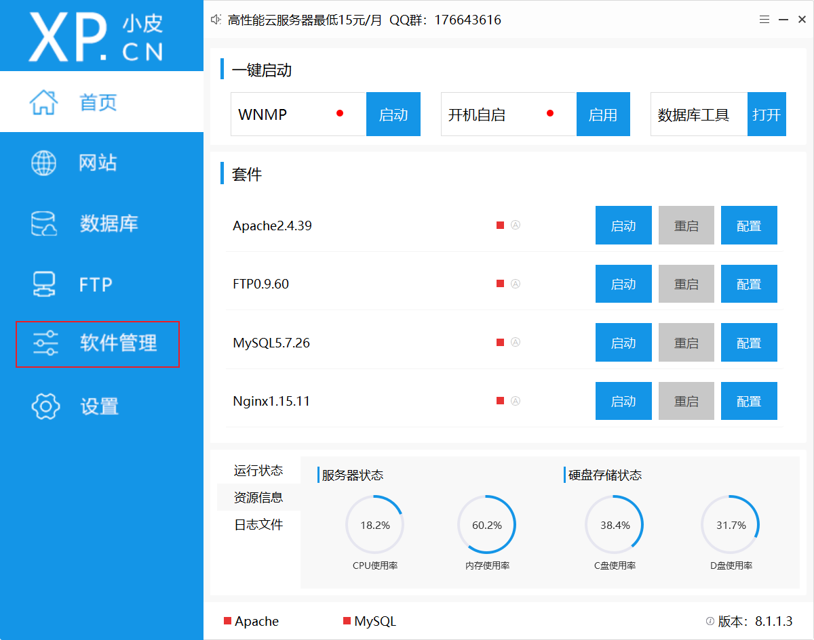

##### 3、安装MySQL8.0.12

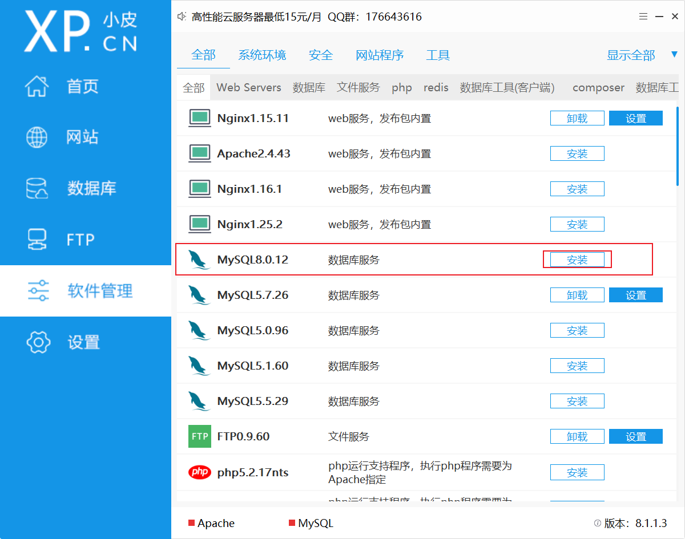

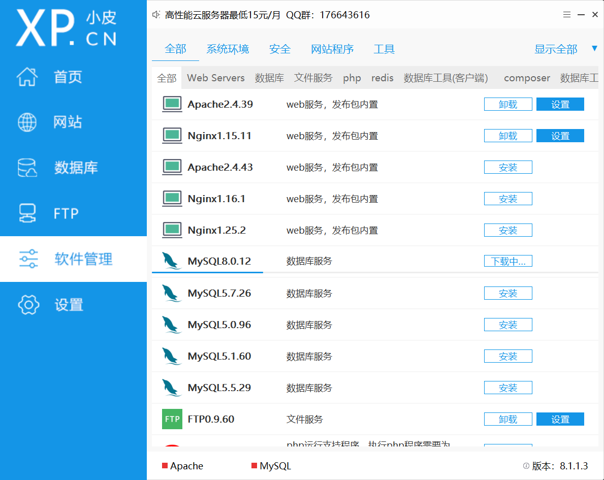

##### 4、启动MySQL服务后，点击数据库，然后修改MySQL登录密码（密码至少是六位数）

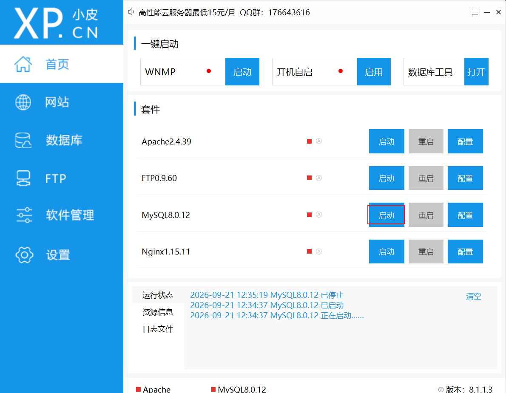

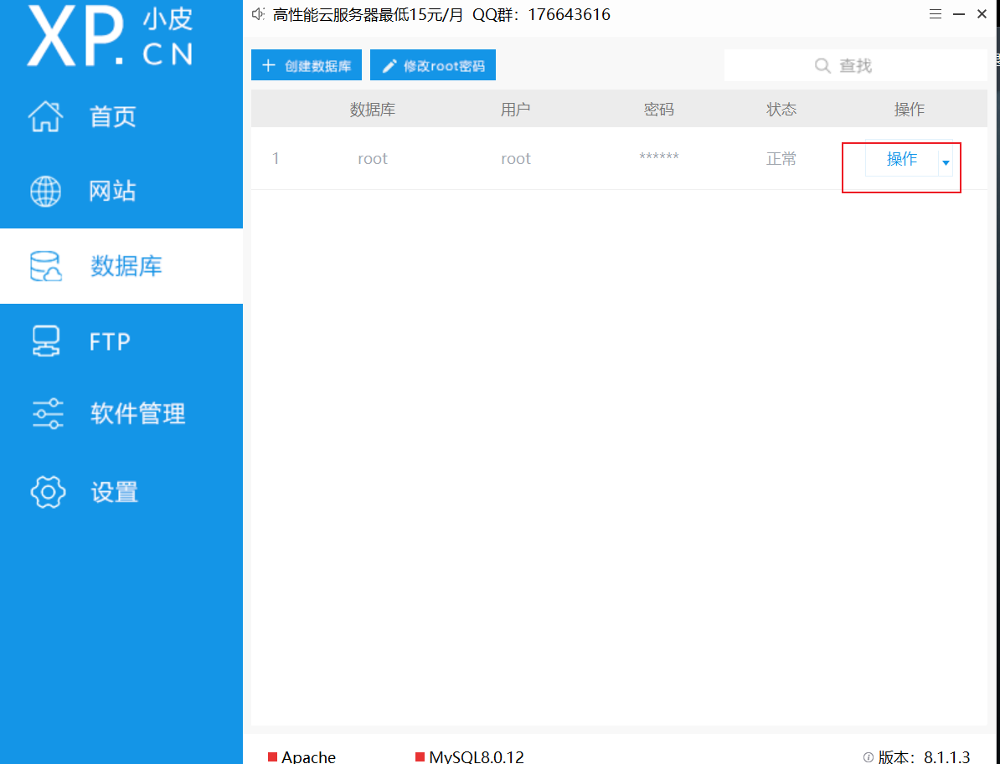

### 客户端

#### cmd

##### 1、将该路径 `~\phpstudy_pro\Extensions\MySQL8.0.12\bin\`添加到系统环境变量


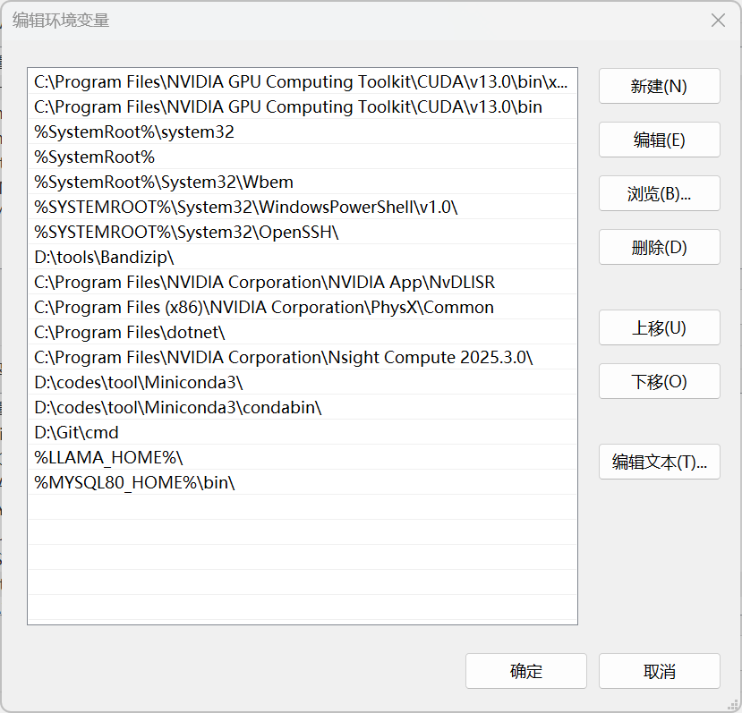

##### 2、添加后打开cmd，输入指令登录MySQL

- 明文密码：`mysql -u用户名 -p密码`
例如：`mysql -uroot -p123456`
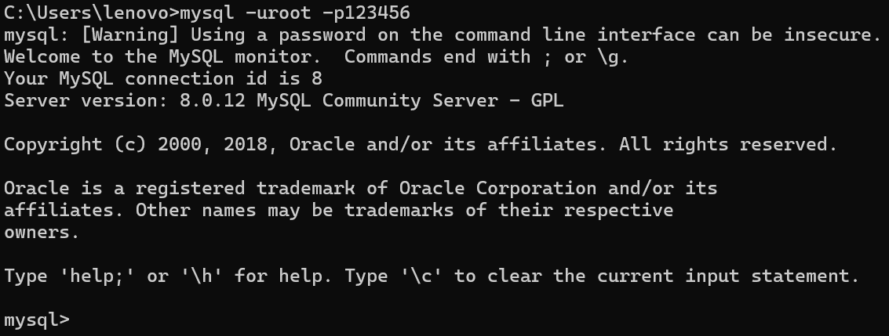
- 密文密码：`mysql -u用户名 -p`
例如：先输入`mysql -uroot -p`，然后输入密码（cmd不可见）
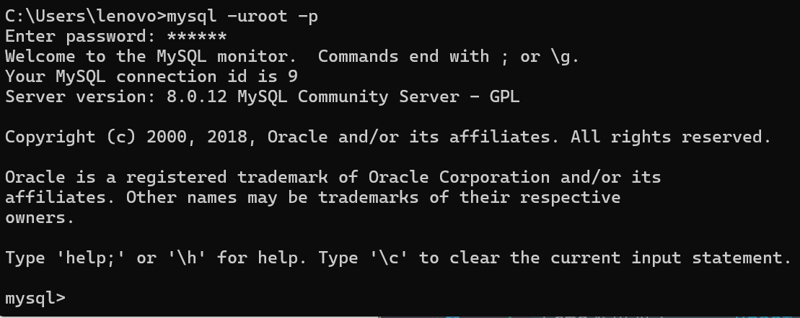
- 指定主机和端口连接（适用于远程连接）：`mysql -h 主机名或IP地址 -P 端口号 -u 用户名 -p`
例如：`mysql -h 127.0.0.1 -P 3306 -u root -p`

> 要连接远程数据库，必须开通远程访问且防火墙能够通过。

#### 第三方软件，如 DataGrip

##### 安装JetBrain的DataGrip开发工具。


##### 创建项目


##### 创建数据源

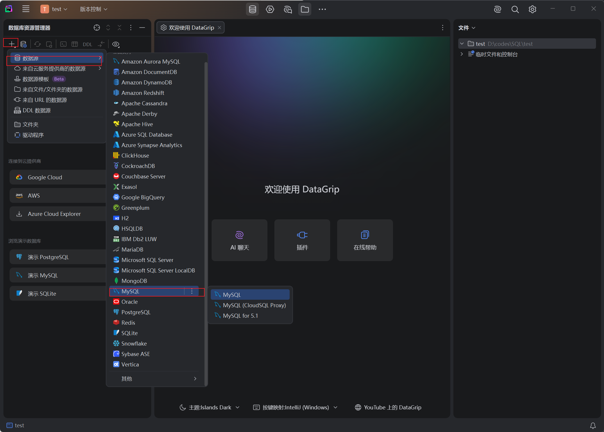

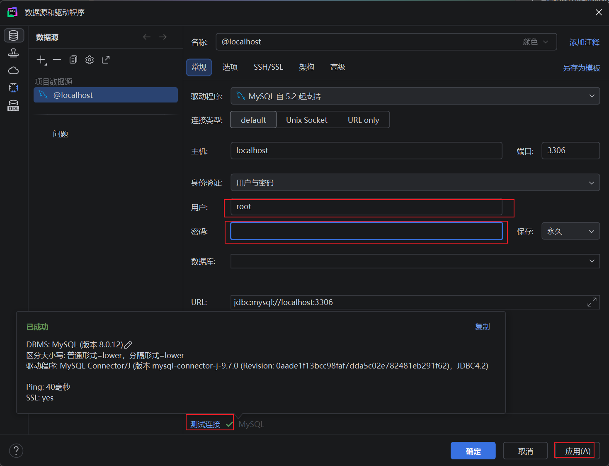

> 首次连接数据库时需要下载驱动程序，点击测试链接后弹窗下载。

##### 使用查询控制台测试连接成功

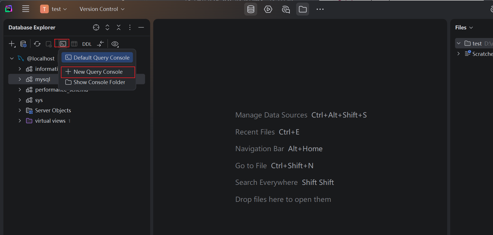

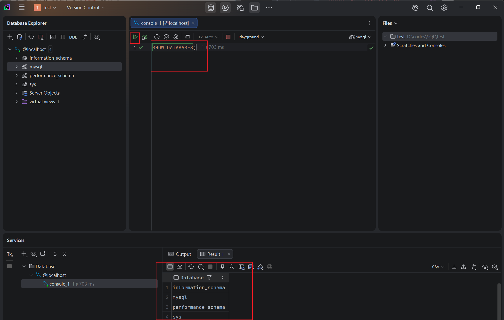

> 快捷键：
> 1、Ctrl + Enter 可以快速执行一段代码
> 2、选中一段代码，Ctrl + / 快速注释

## 管理MySQL的命令

- `USE 数据库名`：选择要操作的MySQL数据库，使用该命令后所有MySQL命令都只针对该数据库。

```sql
mysql> use RUNOOB;
Database changed
```

- `SHOW DATABASES`：列出MySQL数据库管理系统的数据库列表。

```sql
mysql> SHOW DATABASES;
+--------------------+
| Database           |
+--------------------+
| information_schema |
| RUNOOB             |
| cdcol              |
| mysql              |
| onethink           |
| performance_schema |
| phpmyadmin         |
| test               |
| wecenter           |
| wordpress          |
+--------------------+
10 rows in set (0.02 sec)
```

- `SHOW TABLES`：显式指定数据库的所有表，使用该命令前需要使用 `use` 命令来选择要操作的数据库。

```sql
mysql> use RUNOOB;
Database changed
mysql> SHOW TABLES;
+------------------+
| Tables_in_runoob |
+------------------+
| employee_tbl     |
| runoob_tbl       |
| tcount_tbl       |
+------------------+
3 rows in set (0.00 sec)
```

- `SHOW COLUMNS FROM 数据表`：显示数据表的属性，属性类型，主键信息，是否为 NULL，默认值等其他信息。

```sql
mysql> SHOW COLUMNS FROM runoob_tbl;
+-----------------+--------------+------+-----+---------+-------+
| Field           | Type         | Null | Key | Default | Extra |
+-----------------+--------------+------+-----+---------+-------+
| runoob_id       | int(11)      | NO   | PRI | NULL    |       |
| runoob_title    | varchar(255) | YES  |     | NULL    |       |
| runoob_author   | varchar(255) | YES  |     | NULL    |       |
| submission_date | date         | YES  |     | NULL    |       |
+-----------------+--------------+------+-----+---------+-------+
4 rows in set (0.01 sec)
```

- `SHOW INDEX FROM 数据表`：显示数据表的详细索引信息，包括PRIMARY KEY（主键）。

```sql
mysql> SHOW INDEX FROM runoob_tbl;
+------------+------------+----------+--------------+-------------+-----------+-------------+----------+--------+------+------------+---------+---------------+
| Table      | Non_unique | Key_name | Seq_in_index | Column_name | Collation | Cardinality | Sub_part | Packed | Null | Index_type | Comment | Index_comment |
+------------+------------+----------+--------------+-------------+-----------+-------------+----------+--------+------+------------+---------+---------------+
| runoob_tbl |          0 | PRIMARY  |            1 | runoob_id   | A         |           2 |     NULL | NULL   |      | BTREE      |         |               |
+------------+------------+----------+--------------+-------------+-----------+-------------+----------+--------+------+------------+---------+---------------+
1 row in set (0.00 sec)
```

- `SHOW TABLE STATUS [FROM db_name] [LIKE 'pattern'] \G`：该命令将输出MySQL数据库管理系统的性能及统计信息。

```SQL
mysql> SHOW TABLE STATUS  FROM RUNOOB;   # 显示数据库 RUNOOB 中所有表的信息
mysql> SHOW TABLE STATUS from RUNOOB LIKE 'runoob%';     # 表名以runoob开头的表的信息
mysql> SHOW TABLE STATUS from RUNOOB LIKE 'runoob%'\G;   # 加上 \G，查询结果按列打印
```

## MySQL基本语法

### 1、展示所有的库

```sql
SHOW databases;
```

### 2、切换库

```sql
USE sys;
```

### 3、展示所有的表

```sql
SHOW tables;
```

### 4、查询表中有什么数据

```sql
USE mysql;
SELECT * FROM user;
```

等价于：

```sql
SELECT * FROM mysql.user;
```

### 5、注释

- `#`：单行注释，MySQL方言
- `-- `：单行注释
- `/* */`：多行注释

## MySQL常见数据类型

- 整数 int(4B) / tinyint(1B) / smallint(2B) / mediumint(3B) / bigint(8B)
- 浮点数 double / float / decimal(m,d) 定点数，m表示总字位数，最大65；d表示小数点后面的位数，最大30
- 字符串 varchar（变长） / char（定长） / text（大文本）
- 时间日期 date

## MySQL引擎

MySQL有多种引擎，能执行 `create table、select`等命令，在数据量不多时，使用任何引擎没有什么区别。
但是，在大数据开发期间，要处理 **海量数据** ，就需要来了解MySQL的多种引擎了。

**MySQL引擎作用**

1. 当你使用 create table 语句时，该引擎用于创建表。
2. 当在你使用 select 语句或进行其他数据操作时，该引擎在内部处理各种命令请求。
3. 在多数时候，数据库引擎都隐藏在MySQL软件内，开发者不需要过多的关注它，但通常SQL内部数据出现问题时，就是引擎导致的。

MySQL具有多种引擎，并且它已打包多个引擎，且都隐藏在MySQL软件中。

在MySQL中，有3类引擎：

1. InnoDB是一个可靠的事务处理引擎，但是它不支持全文搜索：[逻辑单元]
2. MyISAM时一个性能极高的引擎，它支持全文搜索，但不支持[事务]处理
3. Memory在功能等同于MyISAM，但由于数据存储在内存中，速度很快，但占用内存大，因此几乎不适用此引擎

> 实际开发时，通常使用的是InnoDB引擎。

| 对比项 | MyISAM | InnoDB |
|---|---|---|
| 主外键 | 不支持 | 支持 |
| 事务 | 不支持 | 支持 |
| 行表锁 | 表锁，即使操作一条记录也会锁住整个表，不适合高并发的操作 | 行锁，操作时只锁某一行，不对其他行产生影响，特别适合高并发的操作 |
| 缓存 | 只缓存索引，不缓存真实数据 | 不仅缓存索引，还缓存真实数据，对内存要求较高 |
| 表空间 | 小 | 大 |
| 关注点 | 性能 | 事务 |
| 是否默认安装 | 是 | 是 |

**关于引擎的操作**

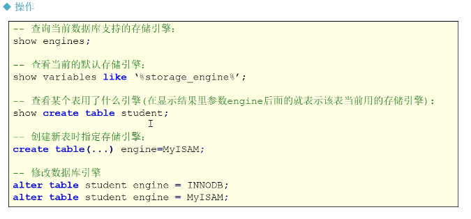

## 将查询结果保存到新表

```sql
create table 新表名 as select 语句;
```

## MySQL 常见的函数

### 常见的数学函数

#### 取整

- `round(x[, d])`： 四舍五入保留小数位
  - x：要保留小数的数字
  - d：**保留多少位小数**，默认 0，可选
- `floor(x)`：向下取整
  - x：向下取整的数字
- `ceil(x)`：向上取整
  - x：向上取整的数字

#### 数学运算

- `mod(x, y)`: x % y, 取模
- `pow(x, y)`：$x^y$, 幂运算

#### 随机数

- `rand([seed])`：随机数，范围 $[0, 1)$
  - seed：随机种子

### 常见的字符串函数

#### 保留小数

- `format(x, d[, loacle])`
  - x：要格式化的数字
  - d：**保留多少位小数**
  - locale：地区，可选，默认en_US,用来控制千位分隔符

#### 大小写转换

- `lower(str)`：全部转小写，只对英文生效，中文、数字、符号不受影响，返回新字符串，不会修改元彪数据，常用于忽略大小写匹配
  - str：字符串
- `upper(str)`：全部转大写，同 `lower(str)`

#### 字符串的反转与重复

- `reverse(str)`：反转字符串
- `repeat(str, count)`：重复
  - str：字符串
  - count：重复次数

#### 拼接字符串

- `concat(str1, str2[, ...])`：拼接字符串
- `concat_ws(ws, str1, str2[, ...])`：带分隔符的拼接字符串
  - ws：分隔符

#### 替换字符串

- `replace(str, old_str, new_str)`：替换字符串
  - str：原始字符串
  - old_str：要被替换的字符串
  - new_str：用来替换的字符串

#### 截取字符串

- `substr(str, pos[, len])`：截取字符串
  - str：源字符串
  - pos：起始位置，**从1开始计数**
  - len：可选，截取多少字符，默认截取到字符串尾
- `substring(str, pos[, len])`：`substr`的别名
- `left(str, len)`：从字符串 **最左侧** 截取字符串
  - str：源字符串
  - len：截取多少字符
- `right(str, len)`：从字符串 **最右侧** 截取字符串
  - str：源字符串
  - len：截取多少字符

#### 获取字符串长度

- `char_length(str)`：返回字符串的 **字符个数** ，**一个汉字、字母都算 1**
  - 字符串
- `length(str)`：返回字符串占用的 **字节数** ，不是字符个数。
  - str：字符串
  - utf8 编码规则：
    - 一个英文字母占一个字节
    - 一个汉字占三个字节
    - 一个数字占一个字节
    - 一个半角符号占一个字节
    - 空串 `''` 返回 0
    - NULL 返回 NULL

### 时间日期函数

#### 获取当前时间的函数

- `now()`：返回当前服务器的日期 + 时间（datetime类型，`YYYY-MM-DD HH:MM:SS`）
- `current_date()`：返回当前日期，不带时分秒，格式 `YYYY-MM-DD`
- `current_time()`：返回当前时间（只有时分秒，没有日期），格式 `HH-MM-SS`

#### 获取部分时间

- `year(date)`：从日期里提取年份，返回 4 位数字
  - date：日期，类型为
    - `DATE`：`YYYY-MM-DD`
    - `DATETIME / TIMESTAMP`：`YYYY-MM-DD HH:MM:SS`
    - 合格日期字符串
- `month(date)`：月份（1 ~ 12）
- `day(date)`：天（1 ~ 31）
- `hour(date)`：小时
- `minute(date)`：分钟
- `second(date)`：秒
- `weekday(date)`：周

#### 计算时间差

- `date_add(date, interval 数值 单位)`：给日期加上一段时间，返回新日期
  - date：基础日期
  - interval：关键字，不能省略，代表时间间隔
  - 数值：正数 = 往后加，负数 = 往前减
  - 单位：
    - year
    - month
    - day
    - hour
    - minute
    - second
- `date_sub(date, interval 数值 单位)`：从指定日期减去一段时间
  - date：基准日期
  - interval：关键字，不能省略
  - 数值：正数 = 往前减，负数 = 往后加
  - 单位：
    - year
    - month
    - day
    - hour
    - minute
    - second
- `datediff(expr1, expr2)`：计算 expr1 - expr2，返回相差的天数，只比较日期部分，忽略时分秒
  - expr1：结束日期
  - expr2：开始日期
- `timestampdiff(单位, 开始时间, 结束时间)`：计算 结束时间 - 开始时间，返回差值
  - 单位:
    - year
    - month
    - day
    - hour
    - minute
    - second

#### 时间 - 字符串转换

- `date_format(date, 格式串)`：把日期 / 时间格式化，返回 **字符串**
  - date：日期字段
  - 格式串：
    - `%Y`：4 位年 `2026`
    - `%y`：2 位年 `26`
    - `%m`：月份，带前导零 `01 ~ 12`
    - `%c`：月份，不带零 `1 ~ 12`
    - `%d`：日期，带前导零 `01 ~ 31`
    - `%e`：日期，不带零 `1 ~ 31`
    - `%H`：24小时制 `00 ~23`
    - `%i`：分钟 `00 ~ 59`
    - `%s`：秒 `00 ~ 59`
- `str_to_date(str, 格式模板)`：把 字符串 转为日期 / 时间类型，是 `date_format()` 的反向函数。
  - str：日期字符串
  - 格式模板：同 `date_format()`

#### 时间 - 整数转换

- `unix_timestamp(date)`：日期时间转换成 **时间戳** （从 1970-01-01 00:00:00 UTC 起算的秒数，整数）
  - date：日期/日期字符串
  - 注意：`unix_timestamp(0)` 在中国为 `1970-01-01 08:00:00` ，因为中国在东八区，比 UTC 多8小时
- `from_unixtime(timestamp[, format])`：时间戳转换成 **时间日期**
  - timestamp：10位数字（秒）
  - format：可选，格式化字符串

### `IF(表达式, 为真的值, 为假的值)` 函数

**MySQL独有** ，不是标准SQL

**单行函数** ，用在 `SELECT / WHERE` 里

```sql
if(条件1, 值1, 值2)
```

条件1为真，返回值1；
条件1为假/NULL，返回值2

### `IFNULL(表达式, 替换值)` 函数

如果表达式为NULL，则返回替换值，否则为表达式的值。

只判断NULL，不会把 0 、 空字符串当成假，和if()不一样

