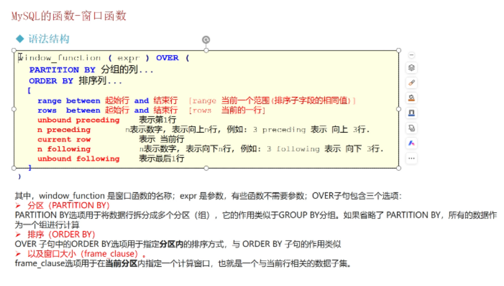
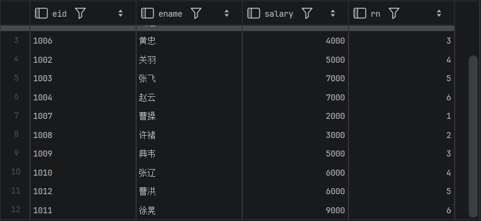
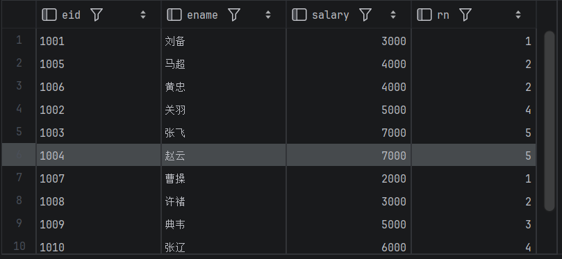
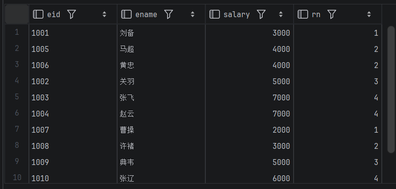
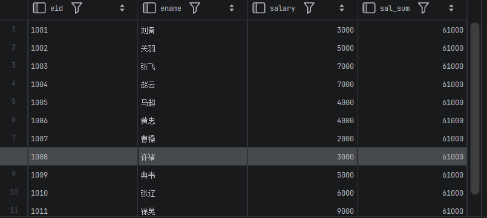
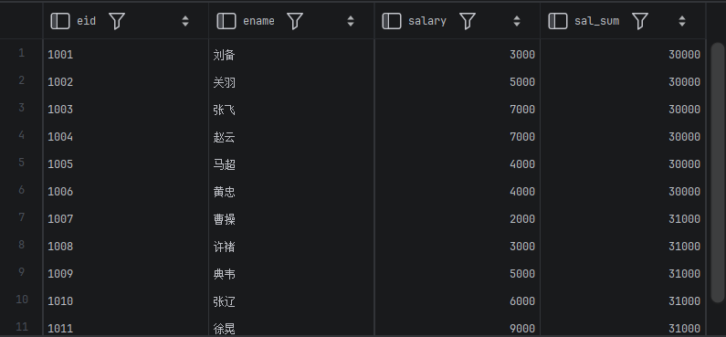
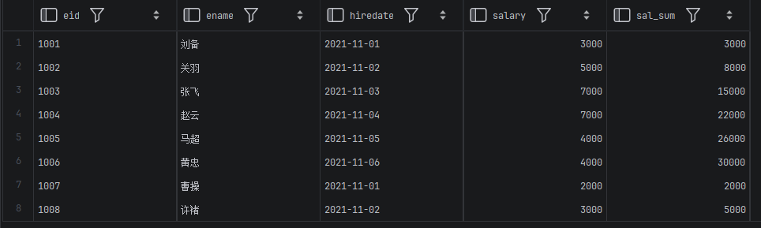
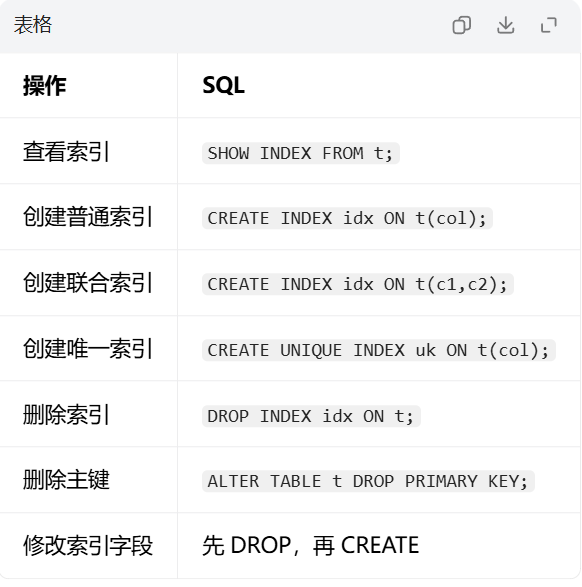
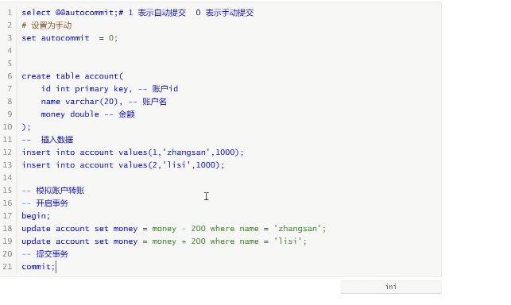

# MySQL

MySQL 是一款**开源关系型数据库管理系统（RDBMS）**，由瑞典 MySQL AB 公司开发，现归属 Oracle。采用 SQL（结构化查询语言）来管理数据，是目前最流行的数据库之一，广泛用于 Web 开发、后端项目、课程 SQL 学习。

## MySQL 安装

### 服务器端

#### 通过 phpstudy 安装 MySQL

##### 1、以管理员身份双击phpstudy，启动安装程序

>注意：千万千万要注意修改安装位置

##### 2、安装完成后，打开，然后点击软件管理


##### 3、安装MySQL8.0.12


##### 4、启动MySQL服务后，点击数据库，然后修改MySQL登录密码（密码至少是六位数）


### 客户端

#### cmd

##### 1、将该路径 `~\phpstudy_pro\Extensions\MySQL8.0.12\bin\`添加到系统环境变量


##### 2、添加后打开cmd，输入指令登录MySQL

- 明文密码：`mysql -u用户名 -p密码`
例如：`mysql -uroot -p123456`

- 密文密码：`mysql -u用户名 -p`
例如：先输入`mysql -uroot -p`，然后输入密码（cmd不可见）

- 指定主机和端口连接（适用于远程连接）：`mysql -h 主机名或IP地址 -P 端口号 -u 用户名 -p`
例如：`mysql -h 127.0.0.1 -P 3306 -u root -p`

> 要连接远程数据库，必须开通远程访问且防火墙能够通过。

#### 第三方软件，如 DataGrip

##### 安装JetBrain的DataGrip开发工具。


##### 创建项目


##### 创建数据源


> 首次连接数据库时需要下载驱动程序，点击测试链接后弹窗下载。

##### 使用查询控制台测试连接成功


> 快捷键：
> 1、Ctrl + Enter 可以快速执行一段代码
> 2、选中一段代码，Ctrl + / 快速注释

## 管理MySQL的命令

- `USE 数据库名`：选择要操作的MySQL数据库，使用该命令后所有MySQL命令都只针对该数据库。

```sql
mysql> use RUNOOB;
Database changed
```

- `SHOW DATABASES`：列出MySQL数据库管理系统的数据库列表。

```sql
mysql> SHOW DATABASES;
+--------------------+
| Database           |
+--------------------+
| information_schema |
| RUNOOB             |
| cdcol              |
| mysql              |
| onethink           |
| performance_schema |
| phpmyadmin         |
| test               |
| wecenter           |
| wordpress          |
+--------------------+
10 rows in set (0.02 sec)
```

- `SHOW TABLES`：显式指定数据库的所有表，使用该命令前需要使用 `use` 命令来选择要操作的数据库。

```sql
mysql> use RUNOOB;
Database changed
mysql> SHOW TABLES;
+------------------+
| Tables_in_runoob |
+------------------+
| employee_tbl     |
| runoob_tbl       |
| tcount_tbl       |
+------------------+
3 rows in set (0.00 sec)
```

- `SHOW COLUMNS FROM 数据表`：显示数据表的属性，属性类型，主键信息，是否为 NULL，默认值等其他信息。

```sql
mysql> SHOW COLUMNS FROM runoob_tbl;
+-----------------+--------------+------+-----+---------+-------+
| Field           | Type         | Null | Key | Default | Extra |
+-----------------+--------------+------+-----+---------+-------+
| runoob_id       | int(11)      | NO   | PRI | NULL    |       |
| runoob_title    | varchar(255) | YES  |     | NULL    |       |
| runoob_author   | varchar(255) | YES  |     | NULL    |       |
| submission_date | date         | YES  |     | NULL    |       |
+-----------------+--------------+------+-----+---------+-------+
4 rows in set (0.01 sec)
```

- `SHOW INDEX FROM 数据表`：显示数据表的详细索引信息，包括PRIMARY KEY（主键）。

```sql
mysql> SHOW INDEX FROM runoob_tbl;
+------------+------------+----------+--------------+-------------+-----------+-------------+----------+--------+------+------------+---------+---------------+
| Table      | Non_unique | Key_name | Seq_in_index | Column_name | Collation | Cardinality | Sub_part | Packed | Null | Index_type | Comment | Index_comment |
+------------+------------+----------+--------------+-------------+-----------+-------------+----------+--------+------+------------+---------+---------------+
| runoob_tbl |          0 | PRIMARY  |            1 | runoob_id   | A         |           2 |     NULL | NULL   |      | BTREE      |         |               |
+------------+------------+----------+--------------+-------------+-----------+-------------+----------+--------+------+------------+---------+---------------+
1 row in set (0.00 sec)
```

- `SHOW TABLE STATUS [FROM db_name] [LIKE 'pattern'] \G`：该命令将输出MySQL数据库管理系统的性能及统计信息。

```SQL
mysql> SHOW TABLE STATUS  FROM RUNOOB;   # 显示数据库 RUNOOB 中所有表的信息
mysql> SHOW TABLE STATUS from RUNOOB LIKE 'runoob%';     # 表名以runoob开头的表的信息
mysql> SHOW TABLE STATUS from RUNOOB LIKE 'runoob%'\G;   # 加上 \G，查询结果按列打印
```

## MySQL基本语法

### 1、展示所有的库

```sql
SHOW databases;
```

### 2、切换库

```sql
USE sys;
```

### 3、展示所有的表

```sql
SHOW tables;
```

### 4、查询表中有什么数据

```sql
USE mysql;
SELECT * FROM user;
```

等价于：

```sql
SELECT * FROM mysql.user;
```

### 5、注释

- `#`：单行注释，MySQL方言
- `-- `：单行注释
- `/* */`：多行注释

## MySQL常见数据类型

- 整数 int(4B) / tinyint(1B) / smallint(2B) / mediumint(3B) / bigint(8B)
- 浮点数 double / float / decimal(m,d) 定点数，m表示总字位数，最大65；d表示小数点后面的位数，最大30
- 字符串 varchar（变长） / char（定长） / text（大文本）
- 时间日期 date

## MySQL引擎

MySQL有多种引擎，能执行 `create table、select`等命令，在数据量不多时，使用任何引擎没有什么区别。
但是，在大数据开发期间，要处理 **海量数据** ，就需要来了解MySQL的多种引擎了。

**MySQL引擎作用**

1. 当你使用 create table 语句时，该引擎用于创建表。
2. 当在你使用 select 语句或进行其他数据操作时，该引擎在内部处理各种命令请求。
3. 在多数时候，数据库引擎都隐藏在MySQL软件内，开发者不需要过多的关注它，但通常SQL内部数据出现问题时，就是引擎导致的。

MySQL具有多种引擎，并且它已打包多个引擎，且都隐藏在MySQL软件中。

在MySQL中，有3类引擎：

1. InnoDB是一个可靠的事务处理引擎，但是它不支持全文搜索：[逻辑单元]
2. MyISAM时一个性能极高的引擎，它支持全文搜索，但不支持[事务]处理
3. Memory在功能等同于MyISAM，但由于数据存储在内存中，速度很快，但占用内存大，因此几乎不适用此引擎

> 实际开发时，通常使用的是InnoDB引擎。

| 对比项 | MyISAM | InnoDB |
|---|---|---|
| 主外键 | 不支持 | 支持 |
| 事务 | 不支持 | 支持 |
| 行表锁 | 表锁，即使操作一条记录也会锁住整个表，不适合高并发的操作 | 行锁，操作时只锁某一行，不对其他行产生影响，特别适合高并发的操作 |
| 缓存 | 只缓存索引，不缓存真实数据 | 不仅缓存索引，还缓存真实数据，对内存要求较高 |
| 表空间 | 小 | 大 |
| 关注点 | 性能 | 事务 |
| 是否默认安装 | 是 | 是 |

**关于引擎的操作**


## 将查询结果保存到新表

```sql
create table 新表名 as select 语句;
```

## MySQL 常见的函数

### 常见的数学函数

#### 取整

- `round(x[, d])`： 四舍五入保留小数位
  - x：要保留小数的数字
  - d：**保留多少位小数**，默认 0，可选
- `floor(x)`：向下取整
  - x：向下取整的数字
- `ceil(x)`：向上取整
  - x：向上取整的数字

#### 数学运算

- `mod(x, y)`: x % y, 取模
- `pow(x, y)`：$x^y$, 幂运算

#### 随机数

- `rand([seed])`：随机数，范围 $[0, 1)$
  - seed：随机种子

### 常见的字符串函数

#### 保留小数

- `format(x, d[, loacle])`
  - x：要格式化的数字
  - d：**保留多少位小数**
  - locale：地区，可选，默认en_US,用来控制千位分隔符

#### 大小写转换

- `lower(str)`：全部转小写，只对英文生效，中文、数字、符号不受影响，返回新字符串，不会修改元彪数据，常用于忽略大小写匹配
  - str：字符串
- `upper(str)`：全部转大写，同 `lower(str)`

#### 字符串的反转与重复

- `reverse(str)`：反转字符串
- `repeat(str, count)`：重复
  - str：字符串
  - count：重复次数

#### 拼接字符串

- `concat(str1, str2[, ...])`：拼接字符串
- `concat_ws(ws, str1, str2[, ...])`：带分隔符的拼接字符串
  - ws：分隔符

#### 替换字符串

- `replace(str, old_str, new_str)`：替换字符串
  - str：原始字符串
  - old_str：要被替换的字符串
  - new_str：用来替换的字符串

#### 截取字符串

- `substr(str, pos[, len])`：截取字符串
  - str：源字符串
  - pos：起始位置，**从1开始计数**
  - len：可选，截取多少字符，默认截取到字符串尾
- `substring(str, pos[, len])`：`substr`的别名
- `left(str, len)`：从字符串 **最左侧** 截取字符串
  - str：源字符串
  - len：截取多少字符
- `right(str, len)`：从字符串 **最右侧** 截取字符串
  - str：源字符串
  - len：截取多少字符

#### 获取字符串长度

- `char_length(str)`：返回字符串的 **字符个数** ，**一个汉字、字母都算 1**
  - 字符串
- `length(str)`：返回字符串占用的 **字节数** ，不是字符个数。
  - str：字符串
  - utf8 编码规则：
    - 一个英文字母占一个字节
    - 一个汉字占三个字节
    - 一个数字占一个字节
    - 一个半角符号占一个字节
    - 空串 `''` 返回 0
    - NULL 返回 NULL

### 时间日期函数

#### 获取当前时间的函数

- `now()`：返回当前服务器的日期 + 时间（datetime类型，`YYYY-MM-DD HH:MM:SS`）
- `current_date()`：返回当前日期，不带时分秒，格式 `YYYY-MM-DD`
- `current_time()`：返回当前时间（只有时分秒，没有日期），格式 `HH-MM-SS`

#### 获取部分时间

- `year(date)`：从日期里提取年份，返回 4 位数字
  - date：日期，类型为
    - `DATE`：`YYYY-MM-DD`
    - `DATETIME / TIMESTAMP`：`YYYY-MM-DD HH:MM:SS`
    - 合格日期字符串
- `month(date)`：月份（1 ~ 12）
- `day(date)`：天（1 ~ 31）
- `hour(date)`：小时
- `minute(date)`：分钟
- `second(date)`：秒
- `weekday(date)`：周

#### 计算时间差

- `date_add(date, interval 数值 单位)`：给日期加上一段时间，返回新日期
  - date：基础日期
  - interval：关键字，不能省略，代表时间间隔
  - 数值：正数 = 往后加，负数 = 往前减
  - 单位：
    - year
    - month
    - day
    - hour
    - minute
    - second
- `date_sub(date, interval 数值 单位)`：从指定日期减去一段时间
  - date：基准日期
  - interval：关键字，不能省略
  - 数值：正数 = 往前减，负数 = 往后加
  - 单位：
    - year
    - month
    - day
    - hour
    - minute
    - second
- `datediff(expr1, expr2)`：计算 expr1 - expr2，返回相差的天数，只比较日期部分，忽略时分秒
  - expr1：结束日期
  - expr2：开始日期
- `timestampdiff(单位, 开始时间, 结束时间)`：计算 结束时间 - 开始时间，返回差值
  - 单位:
    - year
    - month
    - day
    - hour
    - minute
    - second

#### 时间 - 字符串转换

- `date_format(date, 格式串)`：把日期 / 时间格式化，返回 **字符串**
  - date：日期字段
  - 格式串：
    - `%Y`：4 位年 `2026`
    - `%y`：2 位年 `26`
    - `%m`：月份，带前导零 `01 ~ 12`
    - `%c`：月份，不带零 `1 ~ 12`
    - `%d`：日期，带前导零 `01 ~ 31`
    - `%e`：日期，不带零 `1 ~ 31`
    - `%H`：24小时制 `00 ~23`
    - `%i`：分钟 `00 ~ 59`
    - `%s`：秒 `00 ~ 59`
- `str_to_date(str, 格式模板)`：把 字符串 转为日期 / 时间类型，是 `date_format()` 的反向函数。
  - str：日期字符串
  - 格式模板：同 `date_format()`

#### 时间 - 整数转换

- `unix_timestamp(date)`：日期时间转换成 **时间戳** （从 1970-01-01 00:00:00 UTC 起算的秒数，整数）
  - date：日期/日期字符串
  - 注意：`unix_timestamp(0)` 在中国为 `1970-01-01 08:00:00` ，因为中国在东八区，比 UTC 多8小时
- `from_unixtime(timestamp[, format])`：时间戳转换成 **时间日期**
  - timestamp：10位数字（秒）
  - format：可选，格式化字符串

### `IF(表达式, 为真的值, 为假的值)` 函数

**MySQL独有** ，不是标准SQL

**单行函数** ，用在 `SELECT / WHERE` 里

```sql
if(条件1, 值1, 值2)
```

条件1为真，返回值1；
条件1为假/NULL，返回值2

### `IFNULL(表达式, 替换值)` 函数

如果表达式为NULL，则返回替换值，否则为表达式的值。

只判断NULL，不会把 0 、 空字符串当成假，和if()不一样

### 窗口函数

窗口函数(Window Function)，对 **分区内的子集行** 做计算，**不会合并压缩行数**（和 `group by`）最大区别

- `group by`：多行合并成**1行**，输出行数变少
- 窗口函数：原有全部行保留，**新增一列计算结果**
- 窗口：`over()`定义的数据集范围，叫窗口；窗口可以用 `partition by`切分多个分区

语法结构：



```sql
窗口函数 (参数) over (
  [partition by 列1, 列2, ...] -- 分区(分组)，可选
  [order by 列1, 列2, ...] -- 分区内排序，可选
  [frame子句] -- 帧：在有序分区里划定更小的计算范围，可选
) as 别名
```

- `partition by 分区`：把整张表 **切成多个独立分区**，窗口计算 **在每个分区内部单独执行**
  - 省略：整张表作为 **1 个大分区**
  - 支持多列：`partition by dept, city`，只有两个字段全都相同，才属于同一分区
  - > 类比：`group by`，但是 **不合并行**
- `order by`：**分区内排序**，只对当前分区内部的数据排序，不影响最终整个 SQL 结果集的顺序
  - 支持多列：`order by score desc, id asc`，分数相同按id升序
  - **关键** ：**一旦写了 `over` 内的 `order by` ，帧子句会自动启用默认范围**
- `frame帧子句`（**重难点!!**）
  - 帧 = 在有序分区里，在框选 **更小的行集合**，用于聚合类窗口函数(`sum/avg/last_value`)
  - > 只有聚合窗口函数会用到帧，排名函数 `row_number/rank/dense_rank`会忽略帧
  - 关键字：
    - `unbounded perceding`：分区 **第一行**
    - `n preceding`：当前行向上（前面）n行
    - `current row`：当前这一行
    - `n following`：当前行向下（后面）n行
    - `unbounded following`：分区 **最后一行**
  - 两种帧模式
    - 1. `rows between`：**物理行**，按行数计数(推荐，直观)
    ```sql
    -- 当前行 + 上面2行，共3行，滑动窗口
    ROWS BETWEEN 2 PRECEDING AND CURRENT ROW
    ```
    - 2. `range between`：**按 `order by 字段的值`** ，相同值视为同一范围，同一范围的值一起运算
    > **默认帧**（over 里写 order by）字段的值，相同值视为同一范围
    ```sql
    -- 分区第一行～当前行
    RANGE BETWEEN UNBOUNDED PRECEDING AND CURRENT ROW
    ```

#### 窗口函数的分类

##### 序号函数

###### `row_number()`

在每个分区内，根据排序，**给每一行分配唯一、连续的序号**。
**就算值相同（并列），序号也不一样，不会重复，也不会跳号**

排序：1, 2, 3

例：

```sql
select
    eid,
    ename,
    salary,
    row_number() over (partition by dname order by salary) rn
from
    employee;
```



###### `rank()`

遇到并列，**会跳过后面名次**

排序：1, 1, 3

例：

```sql
select
    eid,
    ename,
    salary,
    rank() over (partition by dname order by salary) rn
from
    employee;
```




###### `dense_rank()`

遇到并列，**不跳号，连续排名**

排序：1, 1, 2

例：

```sql
select
    eid,
    ename,
    salary,
    dense_rank() over (partition by dname order by salary) rn
from
    employee;
```



##### 前后函数

###### `lag(expr[, n] [, default])`

返回窗口内当前行的前n行的expr的值，默认为1

```sql
LAG(score, 2, 0) OVER(PARTITION BY user_id ORDER BY dt)
```

###### `lead(expr[, n] [, default])`

返回窗口内当前行的后n行的expr的值，默认为1

```sql
LEAD(score, 2, 0) OVER(PARTITION BY user_id ORDER BY dt)
```

##### 头尾函数

###### `first_value(expr)`

返回窗口第一个expr的值

###### `last_value(expr)`

返回窗口最后一个expr的值

##### 其他函数

###### `nth_value(expr, n)`

返回窗口中第n个expt的值

###### `ntile(n)`

将窗口内有序数据分为 n 个桶，记录等级数，放回当前属于第几组，适合抽样函数

> over 里面必须写 order by
> 分组顺序：像斗地主发牌一样将 **有序** 的记录 **轮流** 分组

#### 开窗聚合函数(max/min/avg/sum/count)

窗口函数默认计算范围：

1. 不分组、不排序，计算全表

```sql
select
    eid,
    ename,
    salary,
    sum(salary) over () sal_sum
from
    employee;
```



2. 分组、不排序，计算分组

```sql
select
    eid,
    ename,
    salary,
    sum(salary) over (partition by dname) sal_sum
from
    employee;
```



3. 分组、排序，计算当前行到该分组的第一行

```sql
select
    eid,
    ename,
    hiredate,
    salary,
    sum(salary) over (partition by dname order by hiredate) sal_sum
from
    employee;
```




## MySQL 的索引

### 索引是什么？

索引是通过某种算法，构建出一个数据模型，用于快速找出在某个列中有以特定值的行，不使用索引，MySQL必须从第一条记录开始读完整个表，直到找出相关的行，表越大，查询数据所花费的事件就越多，如果表中查询的列有一个索引，MySQL能够快速到达一个位置去搜索数据文件，而不必查看所有数据，那么将会节省很大一部分时间。

索引相当于 **书的目录**，帮数据库快速定位行，避免全表扫描（`全表扫描 = 扫完整本书`）。

- 优点：加快查询速度
- 缺点：占用磁盘空间；**写操作(insert/update/delete)变慢** ，因为要维护 B+ 树。

**索引有主流两种方式索引方式：Hash索引 和 B+ 树索引**

### InnoDB两大索引类型：聚簇索引、二级索引（非聚簇）

#### 聚簇索引（主键索引）

- InnoDB **必须有聚簇索引**，把 **整行数据存在 B+ 树叶子节点**
- 叶子节点 = 完整一行数据；索引 key 就是主键
- 规则：
  - 1. 有主键：主键作为聚簇索引
  - 2. 没有主键：找第一个非空索引当聚簇索引
  - 3. 都没有：MySQL自动生成隐藏 rowid 作为聚簇索引

> 聚簇索引的叶子节点存的是完整数据

#### 二级索引（普通索引、联合索引、唯一索引都属于二级索引）

二级索引 B+ 树叶子节点不存完整数据，只存 **索引列的值 + 主键**

- 查询流程：
  - 1. 在二级索引树找到索引值，拿到主键
  - 2. 拿着主键去聚簇索引树查找完整行 -> 这个过程叫回表

> 例子：`INDEX idx_name(name)`
> 查：`select * from t where name = 'xxx'`
> 二级索引找到name，拿到主键 id，再用 id 去主键索引拿全部字段 -> 回表

**覆盖索引(高频考点)**

查询需要的 **所有列都在二级索引里面**，不需要回表，性最好。

```sql
-- 建立联合索引 idx_name_score(name, score)
SELECT name,score FROM t WHERE name='aaa';
-- 只查name和score，索引里直接有，不用回表 → 覆盖索引
```

### 索引分类（按用途）

#### 主键索引 primary key

聚簇索引，唯一、非空，一张表只能 1 个

#### 唯一索引 unique

二级索引，列值不能重复，允许NULL

#### 普通索引 index

最基础，仅加速查询，允许重复、允许 null

#### 联合索引（复合索引）

多个字段一起建索引 `index idx_ab(a, b, c)`

> 最左前缀原则：联合索引 `(a, b, c)` ，支持
> 

#### 全文索引 fulltext

长文本模糊搜索，代替 `like '%xxx%'`

#### 空间索引 spatial

地理坐标，极少用

### 索引失效常见坑(面试必考)

1. 索引列做 **运算、函数、隐式类型转换**

```sql
-- 失效
WHERE YEAR(create_time) = 2026;
WHERE id +1 = 100;
WHERE phone = 123456; -- phone是字符串，写成数字，隐式转换
```

2. `like '%关键词'` 前缀通配 (`like 'abc%'`可以走索引)
3. OR 连接条件，一侧没有索引(`where a=1 or b=2`, b 无索引则整体失效)
4. 违反 **最左前缀** （联合索引跳过左边字段）
5. MySQL 优化器判断：走索引不如全表扫描快（比如查询大部分数据，>20% 左右），主动放弃索引

### 索引设计原则

#### 适合建索引：

- where、join、order by、group by 经常用到的字段
- 区分度高的列（性别这种有只有 0 / 1 的低区分度，不要建索引）

#### 不要建索引：

- 频繁更新的字段（维护 B+ 树代价高）
- 重复值多、区分度极低（性别、状态）

### B+ 树简单对比 B 树

- B+ 树：只有叶子节点存数据；非叶子只存索引 key；叶子节点链表相连，范围查询强（InnoDB 选用）
- B 树：所有节点都存完整数据，范围查询差

### 查看索引是否生效

```sql
explain select * from t where name = 'xxx';
```

返回结果表看 `type` 、`key`字段：

- `key` 不为NULL：使用索引
- `type = ALL`全表扫描（没有索引）


### MySQL 索引相关操作

> 前提：InnoDB，注意：**主键索引不能用普通 ALTER INDEX 修改**，主键要删主键再重建。

#### 1、查看索引

##### 方法一：`show index`（最常用）

```sql
SHOW INDEX FROM 表名;
-- 等价
SHOW KEYS FROM 表名;
```

示例：

```sql
SHOW INDEX FROM t_score;
```

字段说明：

- `key_name`：索引名字
- `Seq_in_index`：联合索引里字段顺序
- `Column_name`：索引列
- `Non_unique`：0 = 唯一索引，1 = 普通索引

##### 方法二：`desc / describe` （简略看）

```sql
desc t_score;
```

Key 列：`PRI`主键，`UNI`唯一，`MUL`普通索引

##### 方法三：`information_schema`（适合脚本查询）

```sql
SELECT * FROM information_schema.STATISTICS 
WHERE TABLE_SCHEMA='你的库名' AND TABLE_NAME='t_score';
```

#### 2、创建索引



##### 1、建表的时候直接创建索引

```sql
CREATE TABLE t_student(
    id INT PRIMARY KEY AUTO_INCREMENT,
    name VARCHAR(50),
    age INT,
    -- 普通索引
    INDEX idx_name (name),
    -- 联合索引
    INDEX idx_name_age (name,age),
    -- 唯一索引
    UNIQUE INDEX uk_phone(phone)
);
```

##### 2、表已经存在，新增索引(alter 或者 create index)

- 普通索引

```sql
-- 写法1 CREATE INDEX（推荐，语义清晰）
CREATE INDEX idx_name ON t_student(name);

-- 写法2 ALTER TABLE ... ADD INDEX
ALTER TABLE t_student ADD INDEX idx_name(name);
```

- 唯一索引

```sql
CREATE UNIQUE INDEX uk_phone ON t_student(phone);
```

- 联合索引

```sql
CREATE INDEX idx_name_age ON t_student(name, age);
```

- 主键索引特殊：

```sql
ALTER TABLE t_student ADD PRIMARY KEY (id);
```

#### 3、删除索引

- 普通索引 / 唯一索引

```sql
-- 写法1 DROP INDEX
DROP INDEX idx_name ON t_student;

-- 写法2 ALTER TABLE DROP INDEX
ALTER TABLE t_student DROP INDEX idx_name;
```

- 删除主键索引

```sql
ALTER TABLE t_student DROP PRIMARY KEY;
```

> 如果主键是自增`AUTO_INCREMENT`，**必须先去掉自增属性，才能删主键**

#### 4、修改索引

MySQL 没有 ALTER INDEX 直接修改索引字段！

> 不能直接改现有索引，**只能：先删旧索引，再新建索引**

```sql
-- 需求：把 idx_name(name) 修改成 idx_name_age(name,age)
DROP INDEX idx_name ON t_student;
CREATE INDEX idx_name_age ON t_student(name,age);
```

> 补充：可以修改索引的可见性（8.0+），这个属于修改索引属性，不是改字段

```sql
-- 索引不可见，优化器不再使用，用于测试，不删除索引
ALTER TABLE t_student ALTER INDEX idx_name INVISIBLE;
-- 恢复可见
ALTER TABLE t_student ALTER INDEX idx_name VISIBLE;
```

**小注意事项**

1. 索引名字**同一张表不能重复**
2. 大表建索引会锁表（MySQL5.6 + 支持 Online DDL，减少锁）
3. 建索引尽量选业务低峰，大量数据时耗时久


## MySQL 的事务

### 事务是什么？

**事务（Transaction）**：一组SQL语句，**要么全部执行成功，要么全部失败回滚**，不可只执行一半

> 经典例子：转账，A 扣 100，B 加 100。不能出现 A 扣钱了，B 没收到。

**一句话速记**

事务是一组 SQL，ACID 四大特性；并发会产生脏读、不可重复读、幻读；MySQL 默认隔离级别 RR 可重复读，靠 MVCC + 锁实现，redo 保证持久，undo 保证回滚。

### 事务四大特性 ACID（面试必备）

#### 1、A 原子性 Atomicity

事务是最小单元，不可拆分。全部成功，或者全部回滚，不会出现做一半。

由 **undo log(回滚日志)** 实现。

#### 2、C 一致性 Consistency

事务执行前后，数据的完整性保持一致。

转帐前总金额 = 转账后总金额，不会凭空多出 / 消失钱。

原子、隔离、持久性共同保证一致性。

#### 3、I 隔离性 Isolation

多个事务并发执行，互相之间隔离，互不干扰。

核心难点，由 **锁 + MVCC** 实现。

#### 4、D 持久性 Durability

事务提交成功后，修改永久写入磁盘，宕机也不会丢失。

由 **redo log(重做日志)** 实现。

### 事务基础语法

```sql
-- 查看MySQL自动提交事务是否开启
-- autocommit=1（默认）：没执行一条 DML（insert / update / delete），自动提交事务，每条语句单独是一个事务
-- autocommit=0：关闭自动提交，所有 DML 修改都需要手动执行 commit 才永久生效；没 commit，其他会话看不到你的修改，可 rollback 回滚 
select @@autocommit;

-- 关闭自动提交，设为手动
-- 注意：set autocommit = 0 是会话级别，只对当前数据库连接生效，新开连接恢复默认 1 。
set autocommit = 0;

-- 开启事务
START TRANSACTION;
-- 或者 BEGIN;
-- 不写start transaction / begin 也可以，因为执行DML就进入事务

-- 这里写多条DML语句（INSERT UPDATE DELETE）
UPDATE account SET money=money-100 WHERE id=1;
UPDATE account SET money=money+100 WHERE id=2;

-- 提交事务，永久生效
COMMIT;

-- 回滚：撤销本次事务所有修改（未提交才有效）
ROLLBACK;
```

> 执行 `commit` 或者 `rollback` 之后，本次事务结束。
> DDL(create/alter/drop) 会自动提交事务，不要放在事务中间。



### 并发事务带来 3 个问题

#### 1、脏读

事务 A 读到事务 B **未提交** 的数据。B 最后回滚，A 读到的就是脏数据。

#### 2、不可重复读

同一个事务 A 内，**两次读取同一行**，中间事务 B 修改并提交，两次结果不一样。（重点：**同一行数据被修改**）

#### 3、幻读

事务 A 查询一批数据，事务 B 插入 / 删除新行并提交，A 再次查询发现多 / 少了行。（重点：**行数变了，新增 / 消失记录**）

### 4 种隔离级别（从低到高）

| **隔离级别** | **脏读** | **不可重复读** | **幻读** |
|---|---|---|---|
| READ UNCOMMITTED (读未提交) | 存在 | 存在 | 存在 |
| READ COMMITTED (读已提交) | 解决 | 存在 | 存在 |
| REPEATABLE READ (可重复读 RR，MySQL **默认级**) | 解决 | 解决 | 大部分解决，存在间隙锁幻读场景 |
| SERIALIZABLE (串行化) | 解决 | 解决 | 解决 |

> MySQL InnoDB 默认 RR(可重复读)，依靠 **MVCC + 间隙锁** 很大程度解决幻读。
> 隔离级别越高，并发性能越差。

### 两个核心日志（redo log / undo log）

- **redo log（重做日志）** ：**保证持久性 D**
写数据先写 redo log，在刷磁盘。宕机重启，根据redo log 恢复已提交事务。

- **undo log（回滚日志）** ：**保证原子性 A，MVCC 依赖**
保存数据修改前的快照，rollback 时用 undo log 恢复旧数据；同时实现多版本读

### MVCC 多版本并发控制（RR、RC 底层实现）

不加锁实现读，提升并发

- 每行数据有多个版本，通过 undo log 保存历史版本
- 读操作：读快照版本（快照读，不加锁）
- 更新操作：锁当前最新行（当前读，加锁）

### 快照读 vs 当前读

- 快照读：普通 `select` ，读历史快照，不加锁，MVCC实现
- 当前读：`select ...for update / update / delete / insert` ，读取最新数据，加行锁