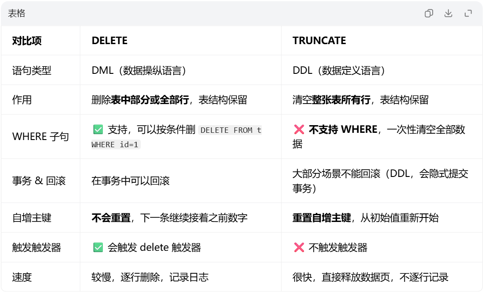

# 数据库基础

## 数据库概述

数据库( **`Database`** )是按照 **数据结构** 来组织、存储和管理数据的仓库，是一个 **长期存储** 在计算机内的、有组织的、可共享的、统一管理的数据集合。

## 数据库类型

### RDBMS 关系型数据库

数据存放在 **二维表** ，表和表之间可以关联，用SQL查询，存储在硬盘中

- **MySQL** / **MariaDB** ：最常用，课程、网站、后端开发，适合业务系统，MySQL数据库的单表数量级为千万级
- **PostgreSQL(PG)** ：功能强大，开源
- **Oracle** ：大型企业商用，金融大厂，Oracle数量级为十亿级
- **SQL Server** ：微软，Windows生态
- **SQLite** ：**文件型数据库** ，单个文件，轻量，本地小程序、移动端用（不需要单独开服务）

### NoSQL 非关系型数据库

前期一定存储在内存中，要求快，后期可能存储在硬盘中

#### 1、键值数据库 Key-Value

键值对存储，类似大字典

- **Redis** ：最典型，缓存，读写超快，常用于高速业务
- **Memcached** 

#### 2、文档数据库 Document

一条记录是 **JSON** / **BSON** 文档，字段可以不统一

- **MongoDB** ：最常用，JSON 文档，字段灵活
- **CouchDB** 

#### 3、列存储数据库（列式数据库）

适合海量数据分析、大数据

- **HBase**：高效存储大量数据
- **Cassandra**

#### 4、图数据库 Graph

存实体和关系（节点、边），社交、推荐、知识图谱

- **Neo4j** ：人与人的关系、网络拓扑

## 数据库常见单位

1. 数据库管理系统（DBMS）
2. 数据库（DB）
3. 表（Table）
4. 数据（Data）：一行是一条数据

## SQL语言

SQL语言是结构化查询语言(Structured Query Language)，是关系型数据库通用标准语言，对关系型数据库进行增（C）、查（R）、改（U）、删（D）。

### SQL语言4大类

#### 1、DDL (Data Definition Language) 数据定义语言

`CREATE` 创建,`ALTER` 修改,`DROP` 删除库 / 表

#### 2、DML (Data Manipulation Language) 数据操作语言

`INSERT` 新增,`UPDATE` 修改,`DELETE` 删除

#### 3、DQL (Data Query Language) 数据查询语言

`SELECT` 查询数据

#### 4、DCL (Data COntrol Language) 数据控制语言

`GRANT` 授权,`REVOKE` 回收权限，超级管理员使用

#### 另外还有 TCL (Transaction Control Language)事务控制

`commit` 提交,`ROLLBACK` 回滚

> 一般只是用DDL、DML、DQL。


### DDL 数据定义语言

#### DDL 操作库

##### 1、创建库

语法格式：`CREATE DATABASE [IF NOT EXISTS] 数据库名 [CHARACTER SET 编码];`

1. 创建一个数据库，且使用默认编码

```sql
CREATE DATABASE 库名;
```
2. 创建一个数据库，charset 设置为utf8;

常用的编码规则共有三套：gbk,utf8,ASCII

```sql
CREATE DATABASE 库名 character set utf8;
```

3. 加入判断是否存在，创建数据库

```sql
CREATE DATABASE IF NOT EXISTS 库名; # todo 加入判断程序更健壮
```

##### 2、查看库

1. 查看库

```sql
SHOW DATABASES;
```

2. 查看建库语句

```sql
SHOW CREATE DATABASE 库名;
```

##### 3、删除库

```sql
DROP DATABASE IF EXISTS 库名;
```

##### 4、切换库

```sql
USE 库名;
```

##### 5、查询正在使用的库

```sql
SELECT DATABASE();
```

#### DDL 操作表

##### 1、创建表

```sql
CREATE TABLE [IF NOT EXISTS] 表名(
    字段名1 数据类型(长度) [约束],
    字段名2 数据类型(长度) [约束],
    ...
);
```

例：
```sql
CREATE TABLE IF NOT EXISTS student(
    StuID varchar(20),
    name varchar(20),
    age int,
    PRIMARY KEY (StuID)
);
```

##### 2、查看表

```sql
# 查看有那些表
SHOW TABLES;

# 查看建表语句
SHOW CREATE TABLE 表名;

# 查看表结构
desc 表名;
```

##### 3、删除表

```sql
DROP TABLE [IF EXISTS] 表名;
```

##### 4、修改表

- 添加一列

```sql
ALTER TABLE 表名 ADD 字段名 类型(长度) [first|after 其他字段名]; # first：放在第一列，after 其他字段名：放在其他字段名之后
```

- 修改列类型

```sql
ALTER TABLE 表名 MODIFY 字段名 新数据类型 [约束];
```

- 修改列名

```sql
ALTER TABLE 表名 CHANGE 旧列名 新列名 数据类型 [约束];
```

- 删除一列

```sql
ALTER TABLE 表名 DROP COLUMN 列名;
```

- 修改表名

```sql
ALTER TABLE 旧表名 RENAME TO 新表名;
```

```sql
# MySQL特有
RENAME TABLE 旧表名 TO 新表名;
```

### DML 数据操作语言

#### 插入数据 insert

```sql
INSERT INTO 表名[(字段名1,字段名2,...)] VALUES(值1,值2,...)[,(值1,值2,...),...];
```

例：

```sql
insert into user(userID, userName, age) VALUES (1,1,1),(2,2,2);
```

> 当插入字符串类型时，必须用单引号；
> 双引号表示标识符（表名/字段名）

#### 修改数据 update

```sql
UPDATE 表名 SET 字段名1=值,字段名2=值 WHERE 条件;
```

#### 删除数据 delete

```sql
DELETE FROM 表名 WHERE 条件;
```

==面试题：delete和truncate清空表中数据的区别?==

1、delete是DML，truncate是DDL
2、delete不会重置自增计数器，可以回滚，触发触发器；truncate会重置自增计数器，不能回滚，不触发触发器




### DQL 查询数据

语法：

```sql
SELECT [DISTINCT] 字段列表
FROM 表名
[WHERE 条件]
[GROUP BY 分组字段]
[HAVING 分组后筛选条件]
[ORDER BY 排序字段 [ASC|DESC]]
[LIMIT 偏移量,条数];
```

> 面试必背，顺序不能乱改，执行顺序：`FROM -> WHERE -> GROUP BY -> 聚合计算 -> HAVING -> SELECT -> ORDER BY (-> LIMIT，MySQL中关键词)`  

**各部分说明**

- `SELECT`:写要查询的列
  - `*`:代表所有字段，`SELECT * FROM student`
  - 指定字段: `SELECT id,name FROM student`
  - `DISTINCT`:去重
- `FROM`:从哪张表查，必填
- `WHERE`: **分组之前** 过滤行，不能用聚合函数( `sum、count等` )
- `GROUP BY`:分组，配合聚合函数 `COUNT、SUM、MAX、MIN、AVG`
- `HAVING`: **分组之后** 过滤，可以用聚合函数
  - 区别：`WHERE` 过滤原始数据，`HAVING`过滤分组结果
- `ORDER BY`:排序
  - `ASC`:升序（默认）
  - `DESC`:降序
- `LIMIT`:限制结果行数（MySQL独有）
  - `LIMIT m,n`:m 偏移量（从0开始），n去几条

**常用聚合函数**

- `COUNT()`：统计非null值的数量
- `SUM()`：求和
- `AVG()`：平均值
- `MAX()`：最大值
- `MIN()`：最小值

#### 完整的 `SELECT` 查询语句

```sql
SELECT
    dept_id,
    COUNT(*) AS emp_count,
    AVG(salary) AS avg_sal
FROM emp
WHERE hire_date >= '2020-01-01'
GROUP BY dept_id
HAVING AVG(salary) > 5000
ORDER BY avg_sal DESC
LIMIT 0, 2;
```

**解释：**
1. `FROM emp`: 选定员工表
2. `WHERE hire_date >= '2020-01-01'`: **分组前过滤** ，筛掉 2020 年前入职的原始行
3. `GROUP BY dept_id`: 按部门编号分组
4. `HAVING AVG(salary) > 5000`: **分组后过滤** ， 只留下平均工资 > 5000 的部门组
5. `SELECT`: 计算并取出分组字段 + 聚合函数，设置别名
6. `ORDER BY avg_sal DESC`: 平均工资从高到低排序
7. `LIMIT 0,2`: 分页，跳过 0 条，取 2 条（第一页，每页2条）

#### 简单查询

##### 查询所有数据

```sql
SELECT [DISTINCT] * FROM 表名;
```

##### 查询部分数据

```sql
SELECT [DISTINCT] 字段名1, 字段名2 FROM 表名;
```

#### 条件查询

```sql
SELECT [DISTINCT] 字段名 FROM 表名 WHERE 条件;
```

##### 比较谓词

- `>`
- `>=`
- `<`
- `<=`
- `<>`(推荐) 或 `!=`

##### 逻辑关键词

- `AND`
- `OR`
- `NOT`

##### 空值判断谓词

- `IS NULL`
- `IS NOT NULL`

##### 范围谓词

- `IN`:判断值是否在集合内

例：查询tb中price为200和600的记录。

```sql
select * from tb where price in (200,600);
```

- `BETWEEN ... AND ...`:判断值是否落在闭区间

```sql
select * from tb where price between 200 and 1000;
```

##### 模糊匹配谓词

- `LIKE`:模糊匹配谓词

###### 常与LIKE搭配的通配符

| 通配符 | 含义 | 示例 |
|---|---|---|
| `%` | 匹配 **0个或多个任意字符** （可以是空） | `张%`：张开头 <br/> `%强`：强结尾 <br/> `%华%`：包含华 |
| `_` | 匹配 **1个任意字符** ，必须占1位，不能空 | `张_`：姓张，名字一共 2 个字，如张三、张四 <br/> `_明`：第二个字是明 |

#### 排序查询

```sql
SELECT [DISTINCT] 字段名 FROM 表名 ORDER BY 字段名 [ASC|DESC]; -- 默认ASC
```

例：

```sql
SELECT * FROM myTB ORDER BY dept, price DESC; -- 先按部门升序排列，部门相同按价格降序排列
```

#### 分组查询

```sql
SELECT [DISTINCT] 字段名 FROM 表名 GROUP BY 分组;
```

#### 分页查询

```sql
SELECT 字段名 FROM 表名 LIMIT 偏移量, 每页条数; 
-- 偏移量：跳过多少条数，从0开始计数!
-- 偏移量 = （当前页码 - 1）* 每页条数
```

#### 子查询

一条 `SELECT` 语句里面，嵌套另外一条 `SELECT` ，里面嵌套的那一条就叫子查询（内查询），外面叫主查询

> 子查询必须放在 `()` 里面

##### 子查询分类

按返回结果子查询可以被分为三类

1. 标量子查询（返回单个值：1 行 1 列）

返回 1 个数字/字符串，能直接用在 `=`、`>`、`<`、`>=`、`<=`后面

```sql
SELECT * FROM product
  WHERE price = (SELECT MAX(price) FROM product);
```

内层 `SELECT MAX(price) FROM product` 只返回一个数字，标量子查询

2. 列子查询（返回一列多行）

返回一整列，多个值，不能用 `=`，要用 `IN / ANY / ALL`

```sql
-- 查询 和c001分类同分类的所有商品
SELECT * FROM product
  WHERE category IN (SELECT category FROM product WHERE category = 'c001');
```

- `IN`: 匹配子查询结果 **里面任意一个**
- `ANY`: 和子查询任意一个满足条件就成立
- `ALL`: 和子查询 **全部** 都满足条件才成立

> `字段 = ANY(...)` 等价于 `字段 IN (...)`

3. 表子查询（返回多行多列，像一张临时表）
放在 `FROM` 后面，**必须给这张临时表起别名**

```sql
-- 统计每个分类最高价格，再筛选大于100的
SELECT * FROM (
    SELECT category,MAX(price) max_p FROM product GROUP BY category
) AS t
WHERE t.max_p > 100;
```

> 重点：FROM 后面的子查询，别名不能省略

##### 子查询出现的位置

- `WHERE` 后面（最常用）：过滤条件
- `FROM` 后面：当作临时表（派生表）
- `SELECT` 后面：标量子查询，给每一行附加一个值

## SQL约束

SQL约束是用于指定字段数据的规则。可以 **保证** 数据更加精确、可靠。
通俗的讲，SQL约束就是数据在类型的基础上增加了额外要求。

### 常见的SQL约束

| 约束名称 | 关键字 | 含义 |
|---|---|---|
| 主键 | `PRIMARY KEY` | MySQL建议所有表的主键字段都叫id，类型为int |
| 非空 | `NOT NULL` | 此字段不允许填写空值 |
| 唯一 | `UNIQUE` | 此字段的值不允许重复 |
| 默认值 | `DEFAULT` | 当不填写字段对应的值时，会使用默认值；如果填写时，则以填写为准 |
| 外键 | `FOREIGN KEY` | 涉及到多张表时才会使用  <br/> 对表与表关系字段进行约束，当为表与表关系字段填写值时，会到关联的表中查阅此值是否存在 <br/> 如果存在，则填写成功；如果不存在，则填写失败 |
| 自动增长 | `AUTO_INCREMENT` | 自动增长列的数据必须是 **整形** <br/> 自动增长列必须是 **主键** 或者 **外键** |

> 注意：
> 1、SQL约束不是必须的，而是为了让SQL更加规范而存在
> 2、在学习SQL过程中，为了便于初学者更好的理解SQL约束，会单独讲解SQL约束
> 3、在实际应用中，可以对字段同时设定多个SQL约束，且都是在创建数据表时进行设定

#### 添加主键约束

在创建表时添加 **列级主键** 约束语法：

```sql
CREATE TABLE 表名(
  字段名 数据类型 PRIMARY KEY [其他约束],
  字段名 数据类型 [约束]
)ENGINE = 引擎名 DEFAULT CHARSET utf8;
```

或者使用 **表级主键** 写法
**推荐写法**

```sql
CREATE TABLE 表名(
  字段名 数据类型 [约束],
  字段名 数据类型 [约束],
  PRIMARY KEY (字段名[,字段名])
)ENGINE = 引擎名 DEFAULT CHARSET utf8;
```

> 1、给PRIMARY KEY 主键约束的字段设定值时，不允许出现重复值：**唯一性**
> 2、主键约束列不能包含null值：**非空**
> 3、每个表都应该有一个主键约束，且每个表只能由一个主键（主键可以是 **单主键** ，也可以是 **联合主键** ）

除了可以在数据表添加主键约束外，还可以单独添加主键约束，语法：

```
# 创建表后，使用 ALTER TABLE 关键字添加主键
ALTER TABLE 表名 ADD PRIMARY KEY(字段名);
```

#### 删除主键约束

给有主键约束的数据表删除主键约束，语法：

```sql
# 使用 ALTER TABLE 关键字删除主键
ALTER TABLE 表名 DROP PRIMARY KEY;
```

> 当删除主键约束后，字段依旧有非空约束，不能为空。

#### 添加非空约束

```sql
CREATE TABLE 表名 (
  字段名 类型 NOT NULL [约束]
);
```

#### 添加唯一约束

```sql
CREATE TABLE 表名 (
  字段名 类型 UNIQUE [约束]
);
```

#### 添加默认约束

```sql
CREATE TABLE 表名 (
  字段名 类型 DEFAULT 默认值 [约束]
);
```

#### 添加外键约束

```sql
CREATE TABLE 表名 (
  字段名 类型,
  外键名 类型
  FOREIGN KEY (外键名) REFERENCES 关联表名(关联表主键)
  [ON DELETE CASCADE] -- 主表记录删除，从表对应记录一起删掉
  [ON UPDATE SET NULL] -- 主表主键更新，从表外键置为NULL
  [ON DELETE RESTRICT] -- 有子记录就禁止删除主表，报错，默认
  -- RESTRICT 可以换成 NO ACTION
);
```

例：

```sql
-- 主表：部门
CREATE TABLE dept(
    dept_id INT PRIMARY KEY AUTO_INCREMENT,
    dept_name VARCHAR(20)
);

-- 从表：员工，dept_id是外键，关联dept表的dept_id
CREATE TABLE emp(
    emp_id INT PRIMARY KEY AUTO_INCREMENT,
    emp_name VARCHAR(20),
    dept_id INT,
    FOREIGN KEY (dept_id) REFERENCES dept(dept_id)
);
```

#### 添加自增约束

```sql
CREATE TABLE 表名 (
  字段名 类型 PRIMARY KEY AUTO_INCREMENT [约束]
);
```

