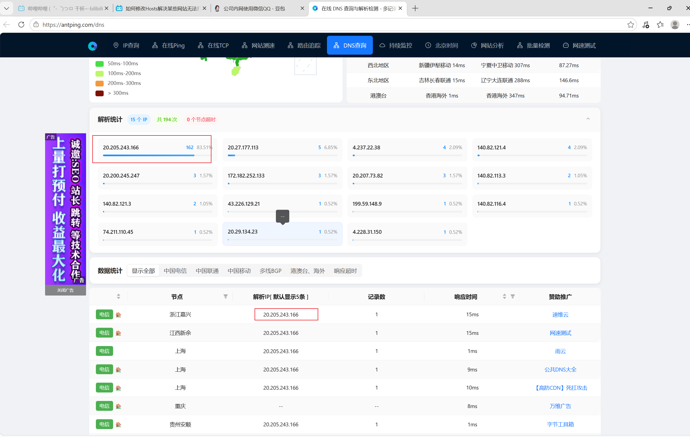
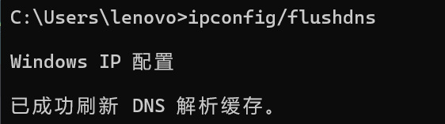

# 修改host文件使用github
1、windows电脑打开 `C:\Windows\System32\drivers\etc` 路径找到hosts文件

2、通过dns查询工具查找 `github.com` 的dns服务器ip

3、在hosts文件末尾添加 `github.com` 的ip和域名，并保存

4、打开cmd，输入 `ipconfig/flushdns` 刷新本地dns即可完成

