# llama.cpp
## llama.cpp是什么？
轻量化本地大模型推理框架，靠 `GGUF` 量化，让普通电脑 CPU 也能跑开源大模型。

## llama.cpp下载
1. 打开 https://github.com/ggml-org/llama.cpp/releases 进入llama.cpp的GitHub主页，根据系统种类、显卡种类、显卡版本选择下载对应的llama.cpp压缩包。
我的笔记本是windows系统，使用的英伟达显卡，cuda最高支持13.3，所以我选择下载 **Windows x64(CUDA 13)** 和 **CUDA 13.3 DLLs** 。
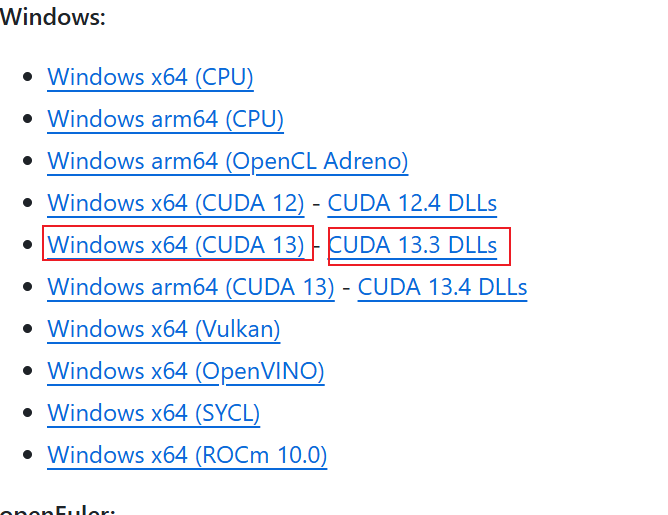

2. 将下载好的两个压缩包解压后放在同一文件夹下，然后设置系统环境变量。
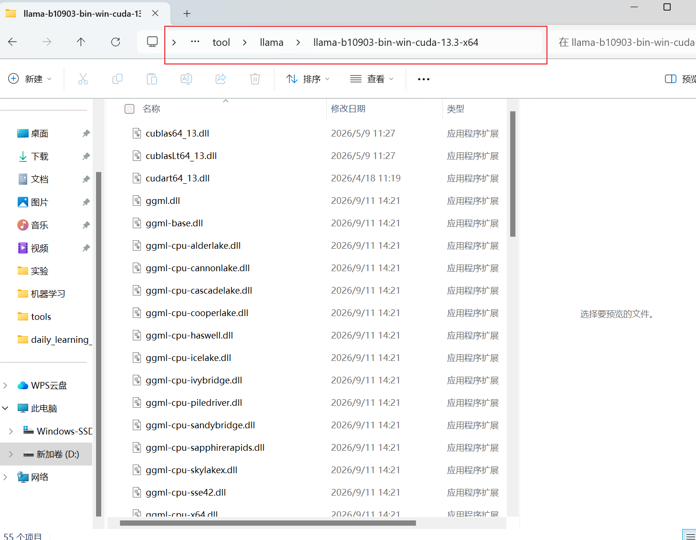

3. 新建系统变量，变量名设置为 **LLAMA_HOME** ,变量值设置为存放llama.cpp文件的文件夹路径
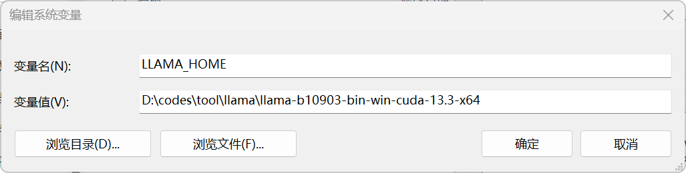

4. 双击打开 `path` 系统变量，然后点击新建，创建新的路径 `%LLAMA_HOME%\` 
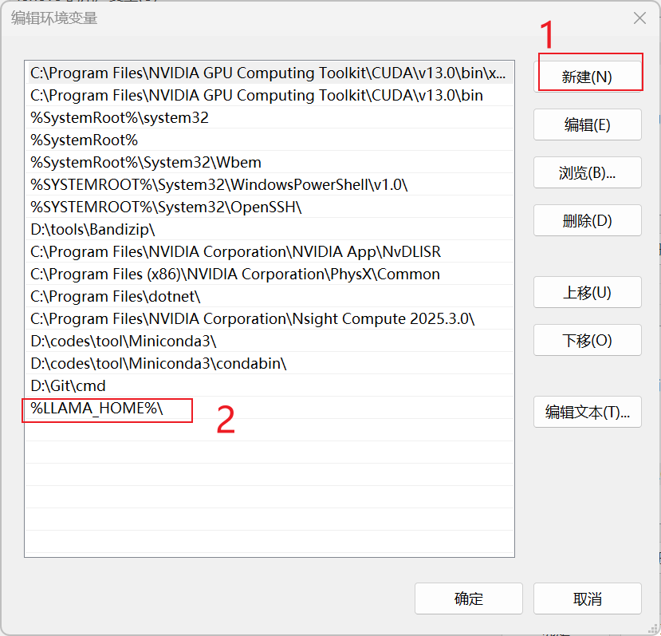

5. 点击确定，进行保存

6. 打开 **cmd** 命令控制台，输入 `llama-cli --version` ，返回版本号，即安装成功。
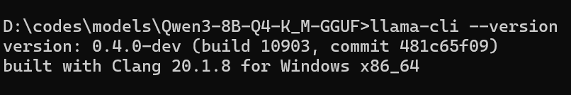

## 大模型下载（以下载魔搭社区的大模型为例）
1. 打开 https://www.modelscope.cn/models ，进入魔搭社区的模型库，在 **任务** 中选择 **文本生成** ，在 **框架** 中选择 **GGUF** 。
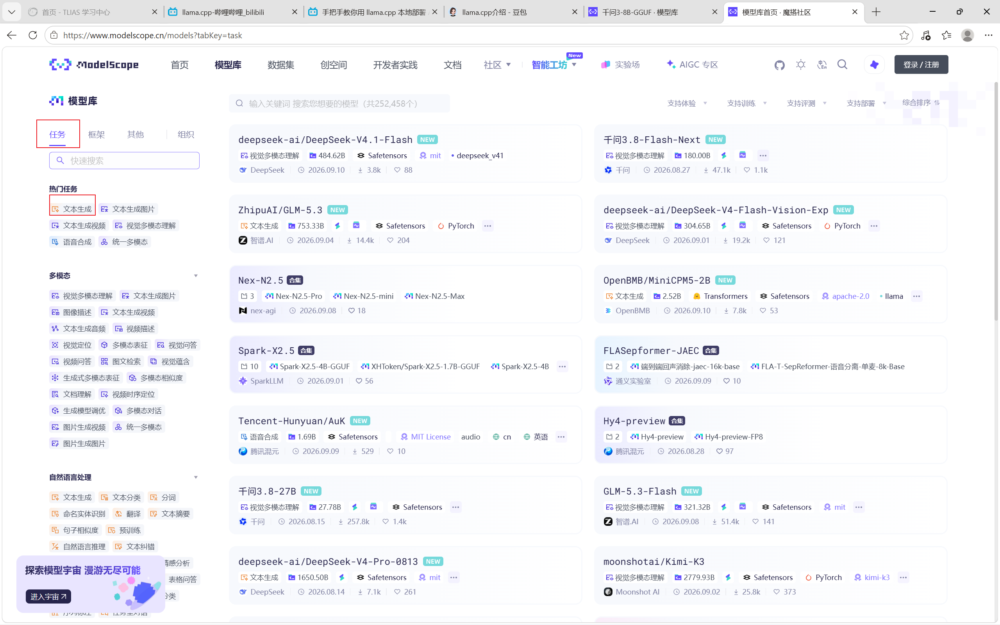
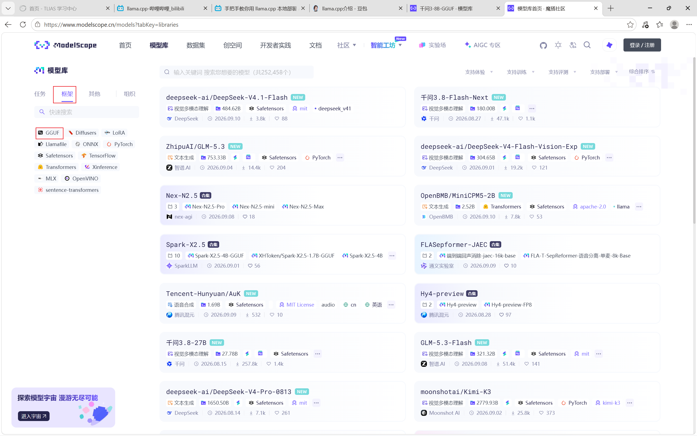

2. 选择一个模型，进入到模型页面
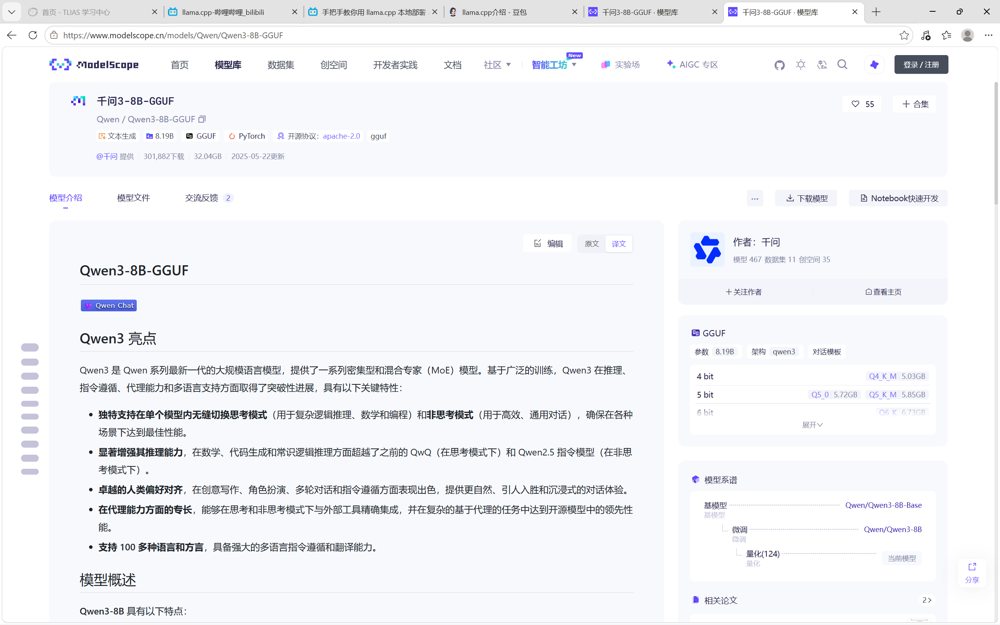

3. 点击模型文件，可以查看该模型的不同量化版本
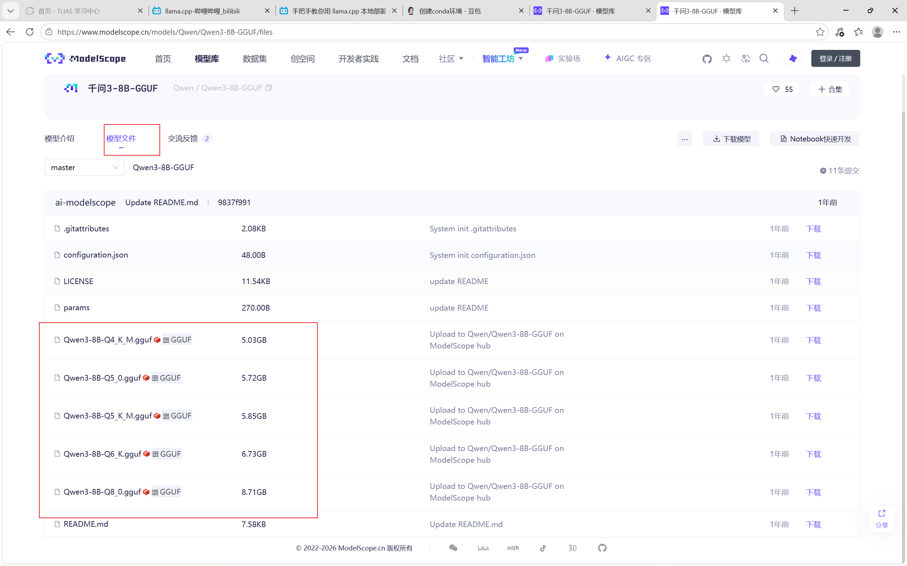

4. 选择其中一个版本，点击右侧下载，即可下载大模型
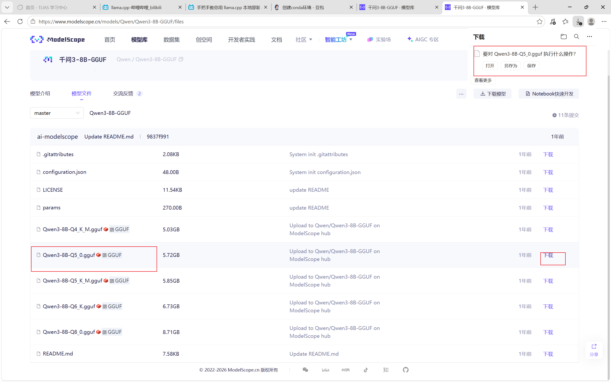

## 加载大模型
1. 在大模型所在文件夹中，启动 `cmd` 命令控制台，输入 `llama-server -m ./Qwen3-8B-Q4_K_M.gguf -c 16384 --port 8080 -ngl 999 --host 127.0.0.1`
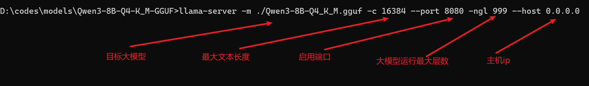
当你看到这个信息时，大模型已经部署成功
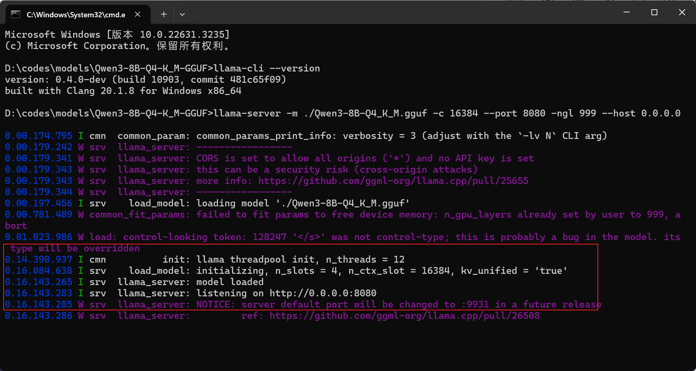
Ctrl+鼠标左键进入这个链接，即可进入大模型对话页面
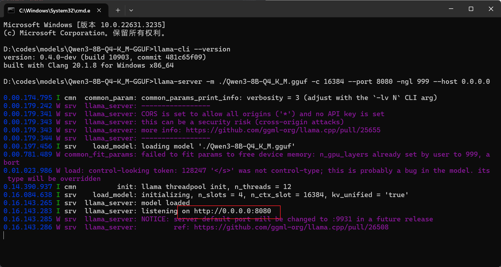